# The Cosmic Wheel Sisterhood — Visual Design Research

## Overview

**The Cosmic Wheel Sisterhood** (Deconstructeam / Devolver Digital, 2023) is the single strongest existing game reference for Tend's offering system. The premise: Fortuna, a witch exiled to a floating hut in the cosmic void for 200 years, summons a forbidden entity (Abramar) to forge a new tarot deck — one card at a time, by hand. Each card she creates becomes part of a deck she uses to perform readings for visiting witches; those readings drive branching narrative consequences across the Sisterhood.

The reason this matters for Tend: the **card-creation interface is the closest existing model anywhere in games or apps for a user-built offering / sigil / deity-veve mechanic.** Players don't pick cards from a fixed pool; they *combine* a celestial sphere (suit), a centerpiece icon, decorative motifs, and a thematic frame to forge a unique artifact that is *theirs*. The result feels personal, ritualistic, and irreversible — exactly the emotional register Tend wants for "offerings to a patron deity." It also demonstrates the harder design problem behind that mechanic: a constrained combinatorial system where every output looks intentional and lore-coherent, never like a sticker book.

Beyond the core mechanic, Cosmic Wheel is a masterclass in manga-influenced witch character design, cosmic-void backgrounds, muted purple/gold palettes, and dialogue UI that reads as both diegetic and beautiful. It is the rare occult game that takes paganism, divination, and feminine spirituality seriously without irony or horror gloss — which is also Tend's positioning.

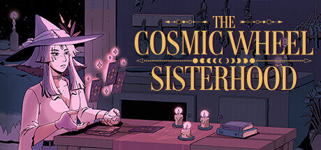
*Steam header — Fortuna and the floating hut against the cosmic void. The title treatment uses an ornate serif with celestial flourishes; the keyart establishes the deep-purple-and-gold palette that runs through the entire game.*

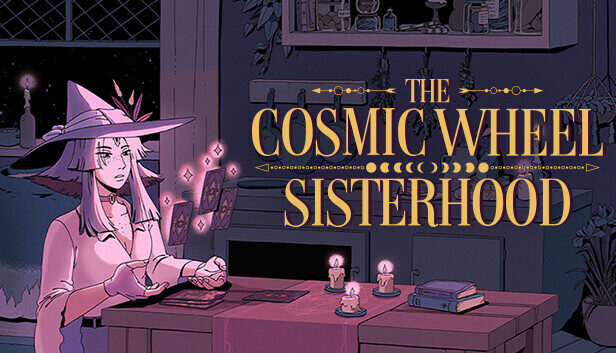
*Capsule keyart — Fortuna foregrounded with deck in hand. Note how the composition centers the witch as practitioner, not victim or villain.*

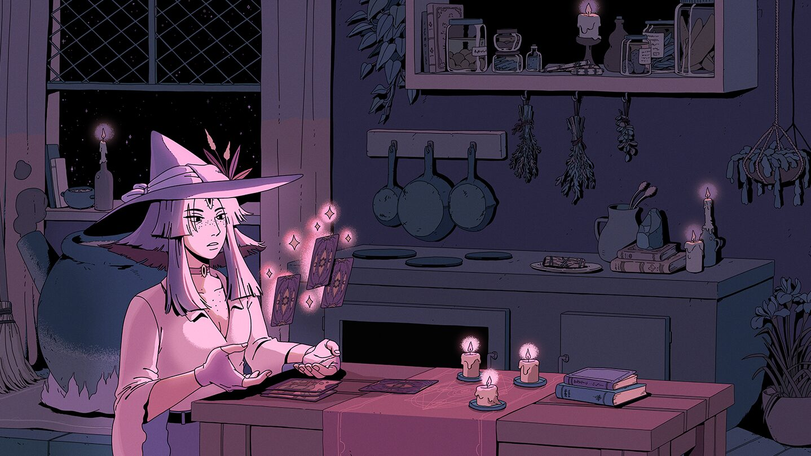
*Marketing background art — the floating hut suspended in a nebula. This is the spatial metaphor of the entire game: an isolated ritual space adrift in a vast indifferent cosmos.*

## Main visual identity & key art

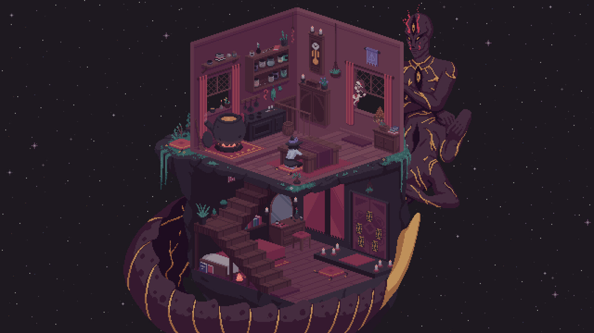
*Establishing scene inside the hut. Manga-influenced pixel art with high-fidelity character portraits layered over painterly backgrounds. The light source is warm (candle / hearth) against cool void exteriors — a contrast Tend could use to distinguish "ritual interior" UI from "cosmic / deity" surfaces.*

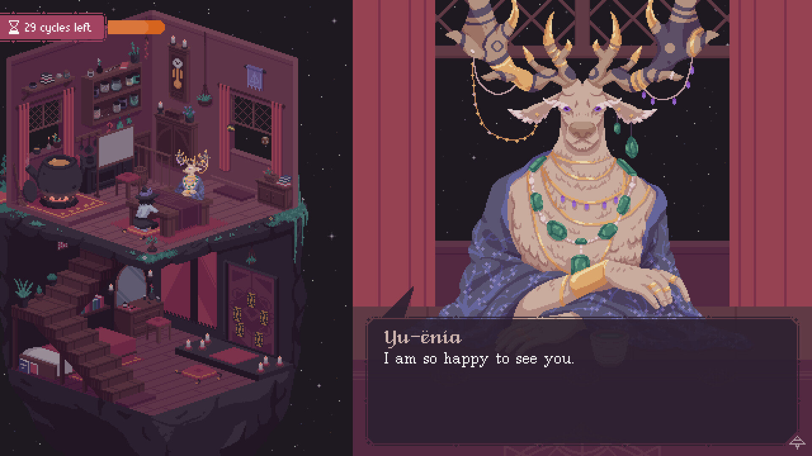
*Two-character dialogue composition. Note the asymmetric framing, the soft vignette around portraits, and the ornate card-shaped dialogue plate at the bottom.*

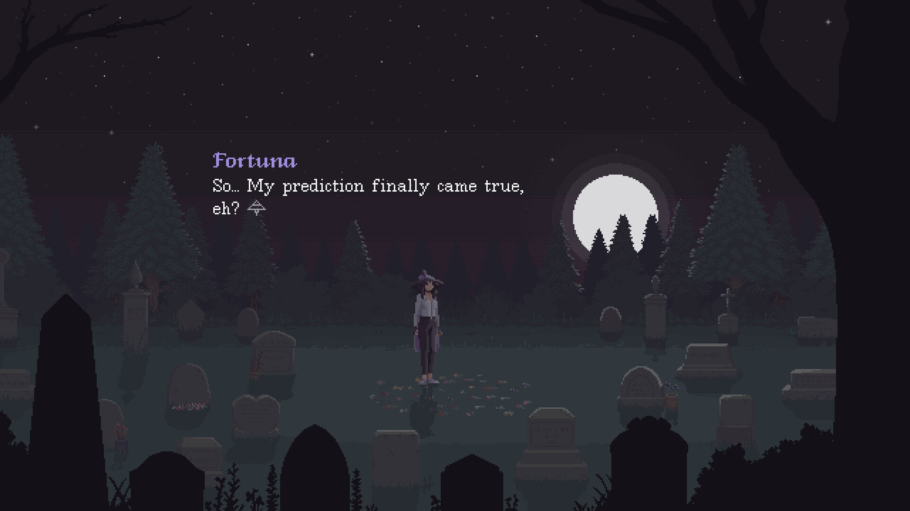
*Wider hut interior — bookshelves, hanging dried herbs, stained glass. Every prop is a piece of witch-iconography rendered in pixel art but arranged with painterly composition.*

## The tarot card creation interface — the central mechanic

This is the section that matters most for Tend. Cosmic Wheel's card forge is a multi-step constructor: choose a celestial sphere (suit / element), a centerpiece motif, decorative ornaments, and a frame. The UI presents a literal in-world altar where Fortuna physically assembles the card — diegetic, not menu-like.

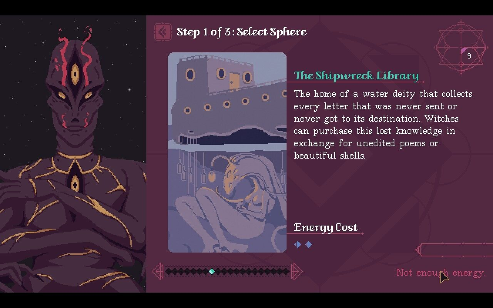
*Sphere selection — picking the celestial domain (suit) for the new card. Spheres are spatially arranged around a central orb like planets, not listed as a dropdown. Direct parallel for Tend: choosing a patron deity / domain at the start of an offering.*

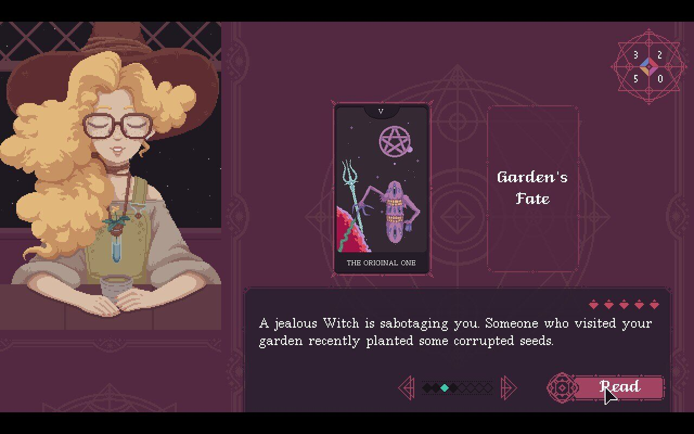
*Mid-construction view. The card-in-progress sits at the center; component palettes ring it. Critically, the player sees the artifact *being assembled* in real time — every choice is immediately visible on the final object.*

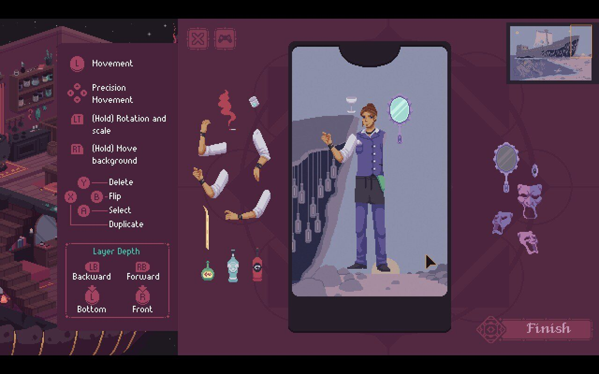
*Component picker for centerpiece motifs. Icons are arranged in a radial / grid hybrid; each one has lore weight (it will mean something in readings). Tend equivalent: choosing the visual "core" of an offering — a flame, a vessel, a sigil.*

*Developer-shared view of the constructor at an earlier ornament-selection step. The frame around the canvas explicitly evokes a workbench / altar surface — UI as diegetic ritual furniture.*

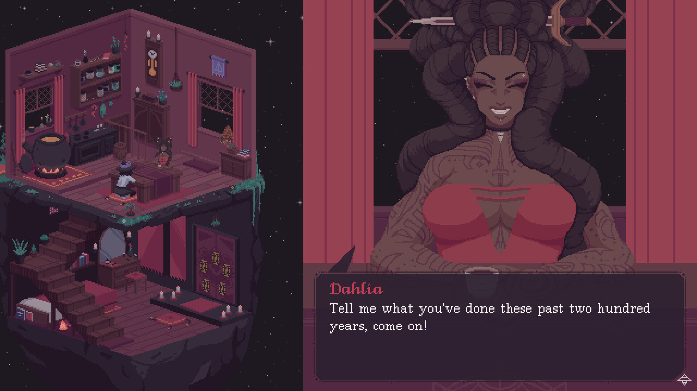
*Another stage of construction. Notice the secondary ornaments hovering as ghosted previews before placement — the player can hesitate, reconsider, and the system makes that hesitation feel sacred rather than UX friction.*

*Late-stage card forge with a near-complete card. The chrome around the work surface is minimal — almost the entire screen is dedicated to the artifact-in-progress.*

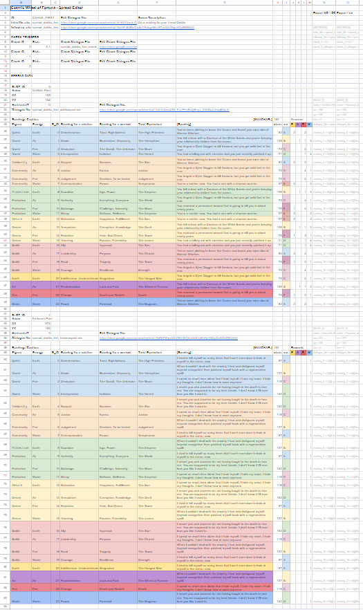
*UI-stripped close-up of a finished card composition. This is what the player walks away with: a singular object that is theirs, not a generic asset.*

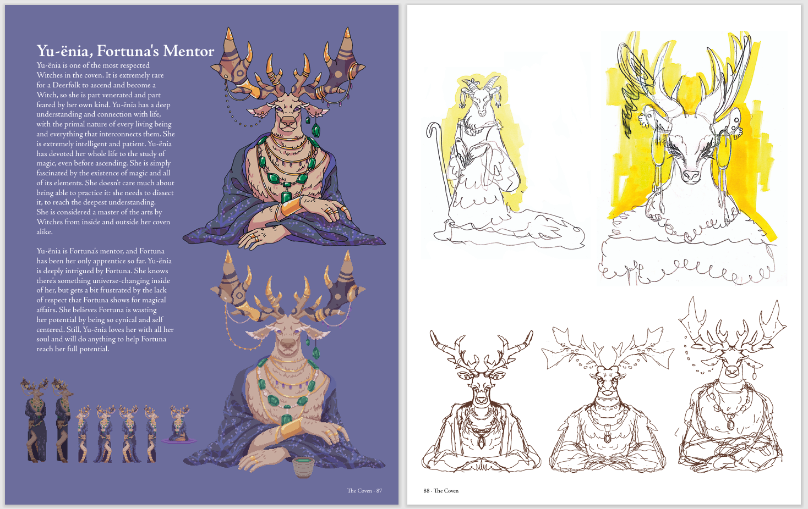
*Full forge view in higher fidelity. The entire flow — sphere, centerpiece, ornaments, frame — is on one screen with the card centered. No multi-page wizard; ritual happens in one continuous tableau.*

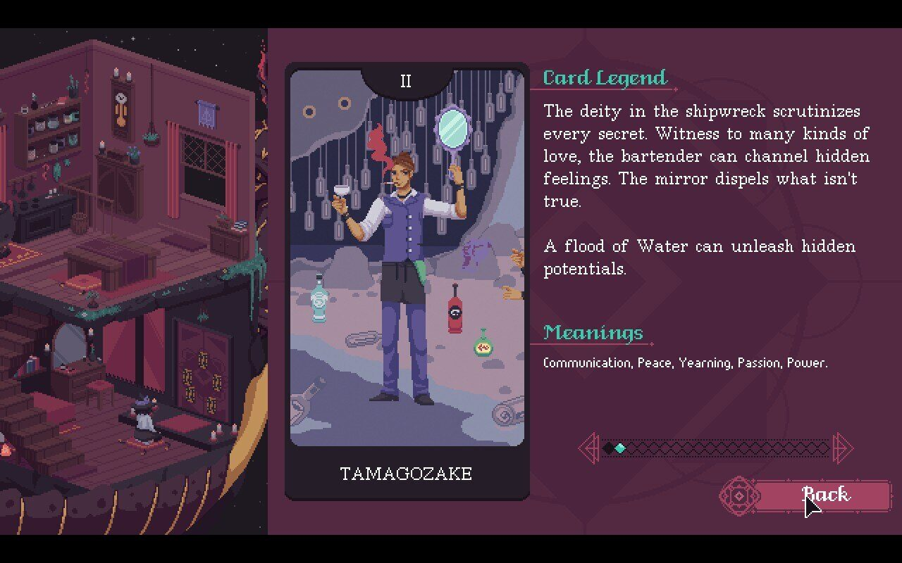
*A completed card. The finished artifact is rendered with halo glow, suggesting consecration. Tend should consider an analogous "completion moment" when an offering is finalized — a small ceremonial flourish before it enters the deck/altar.*

## Custom card examples — the combinatorial design space

The variety of cards players produce demonstrates that constrained component-systems can yield outputs that feel hand-designed rather than mix-and-match. Even with a fixed component vocabulary, the cards read as singular artifacts because (a) the components are *symbolically* rich, (b) layout is automatically composed for visual coherence, and (c) the palette is locked to a small set of harmonious inks.

*Compositional range from a single component library. Frames, centerpieces, and ornaments combine but always within a fixed art-direction. This is the "constrained generativity" pattern Tend needs: many possible outputs, all clearly from the same hand.*

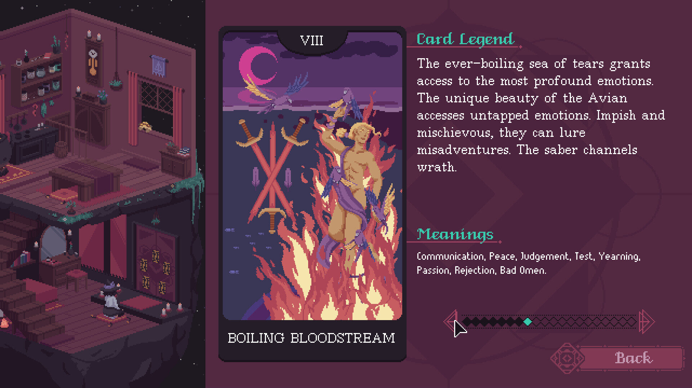
*A spread of created cards displayed during a reading. Each card is visibly different, but the deck reads as cohesive — same palette, same line weight, same frame logic.*

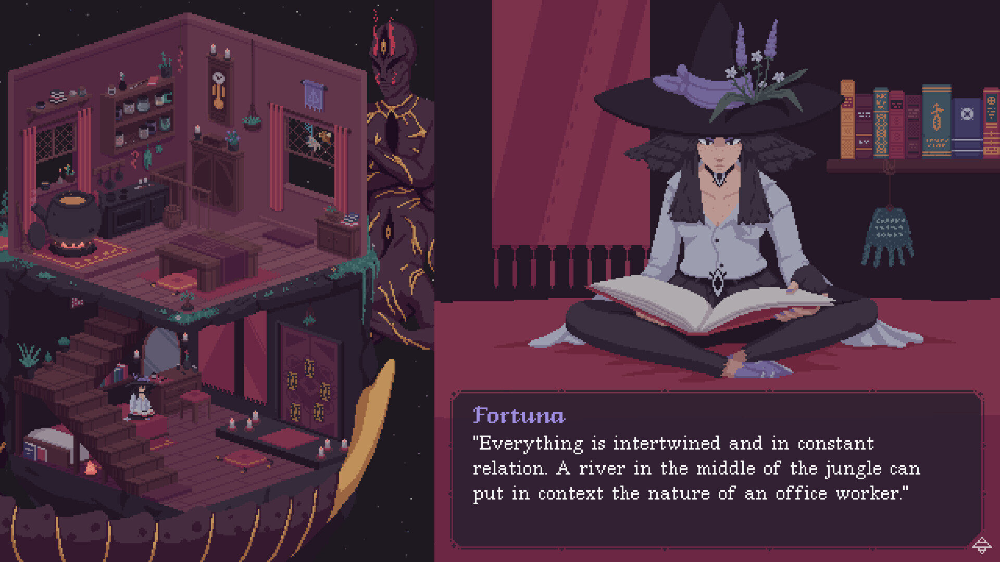
*Another reading layout — three-card spread. The cards have weight: they sit on the table with subtle shadow, suggesting physical objects.*

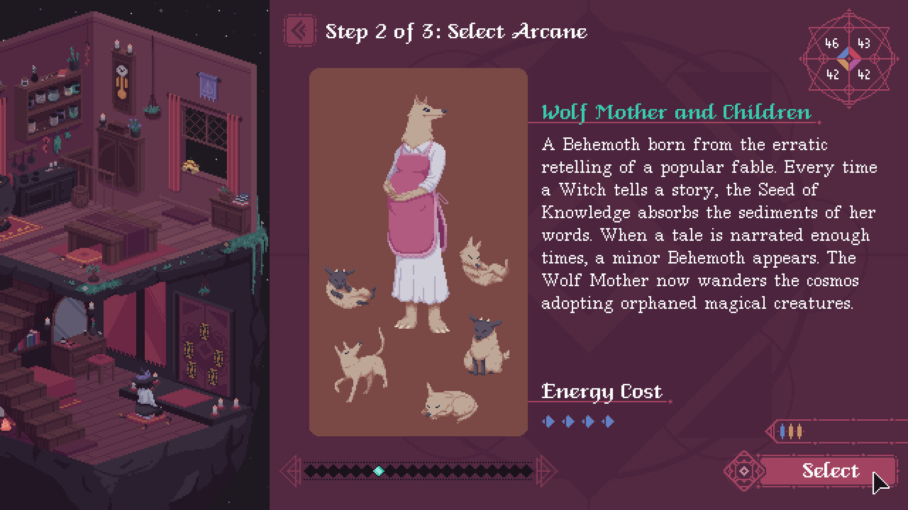
*Multiple completed cards arranged on the work surface. Note the variety of centerpieces (figures, vessels, celestial bodies, animals) — the symbolic vocabulary is broad enough to support narrative interpretation in any reading.*

## Witch character portraits — Fortuna and visiting witches

Cosmic Wheel's character design is manga-influenced pixel art: large expressive eyes, dramatic hair, witchy fashion (cloaks, jewelry, bold makeup, occasionally horns or magical mutations), and a diverse cast in body type, age, race, and gender presentation. This is a deliberate counter to both "cute pastel witch" and "dark gothic witch" tropes — the witches here are *adults with histories.*

*Close-up dialogue portrait. The portrait fills nearly half the frame — characters are treated as the primary visual subject, not floating heads beside text.*

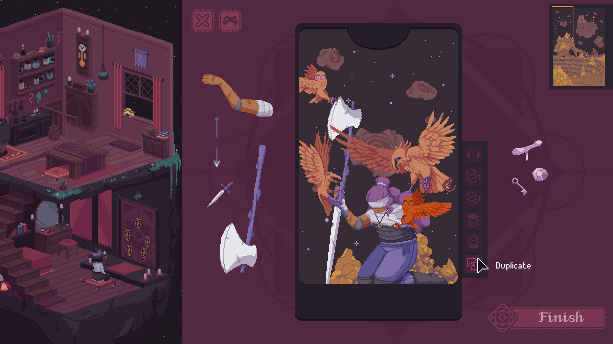
*Visiting witch in conversation. Costume design uses asymmetric drapery, layered jewelry, and bold color blocking — a vocabulary Tend could borrow for deity portraits.*

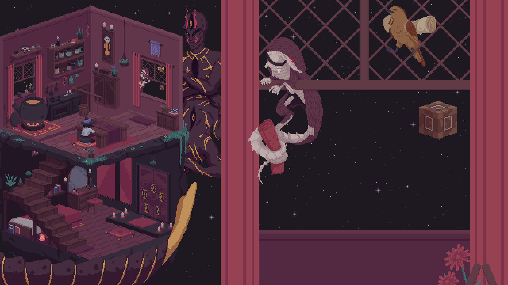
*Another visitor with distinct silhouette and palette. The cast is visually legible at a glance — important if Tend uses multiple patron deities, each must read instantly.*

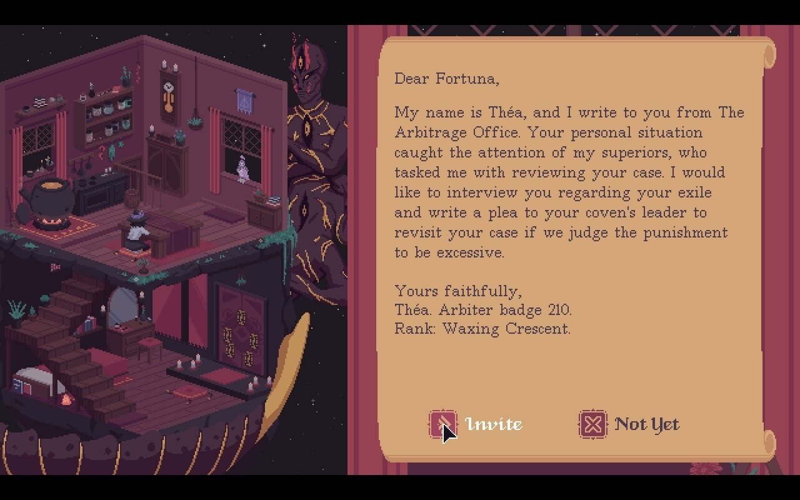
*Letter scene — a witch corresponds with Fortuna across the void. The letter is rendered as an in-world prop with handwritten typography. Tend equivalent: a "message from your deity" surface as a tangible object, not a notification.*

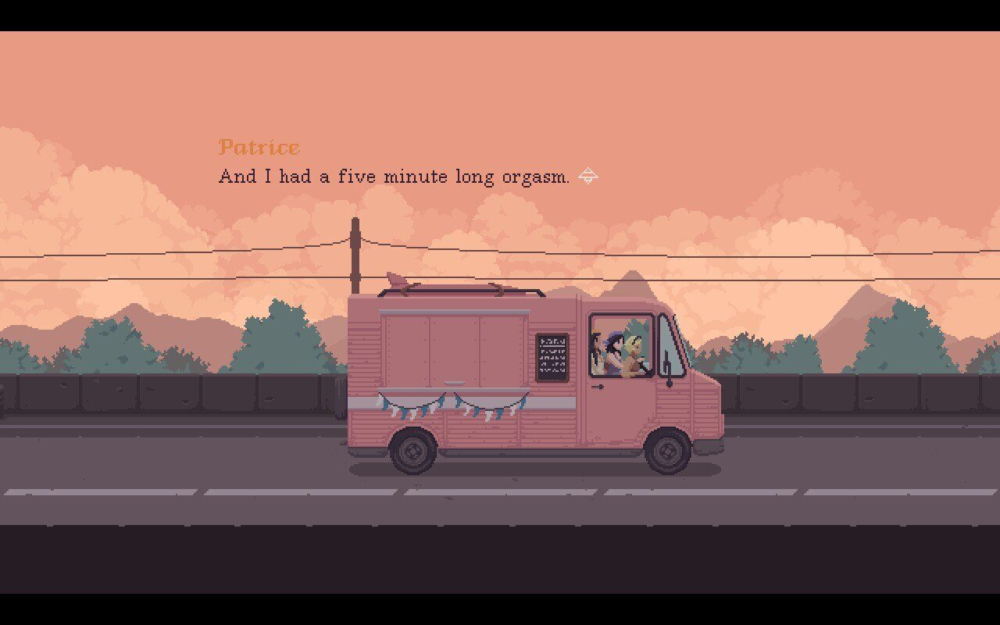
*A scene with multiple witches gathered (Behenian Sisterhood meeting). Group composition shows the breadth of character design — body sizes, hairstyles, ages, magical features all vary.*

## Dialogue UI

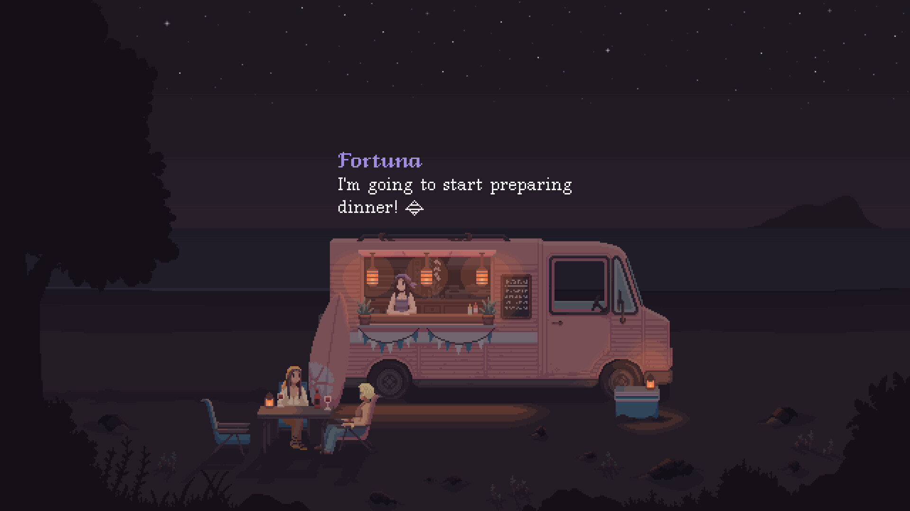
*Dialogue box detail. The plate is shaped like an ornate frame with corner flourishes — diegetic ornament instead of a neutral rectangle. Speaker name sits in a small cartouche. Tend should consider this for "deity speaks" moments.*

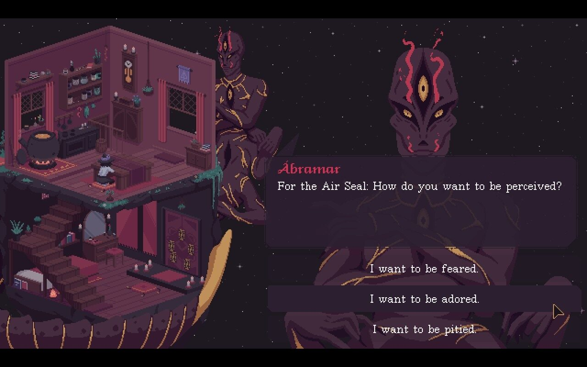
*Choice presentation. Options are framed as ornate inscribed plates with the character portrait still visible. Choices feel weighty because they're presented as engraved options, not bare buttons.*

## Divination reading flow & branching consequences

The reading flow is where created cards do work: Fortuna draws from her hand-forged deck, lays cards in a spread, and interprets them for the visiting witch. Interpretations are not pre-scripted to card identity alone — they depend on which cards the player has built. This is the branching consequence layer.

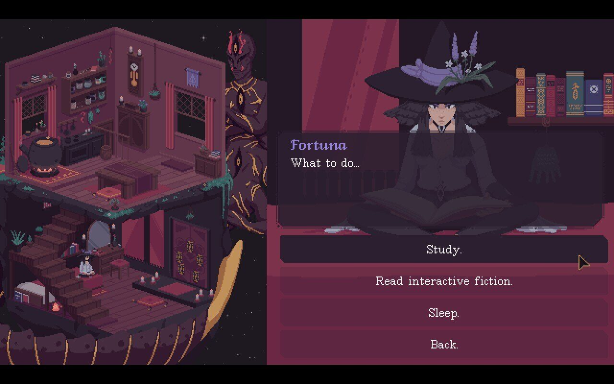
*The main activity menu / day structure — a small set of in-hut actions per day. Tend has an analogous problem: structuring a daily ritual loop with a finite set of meaningful choices.*

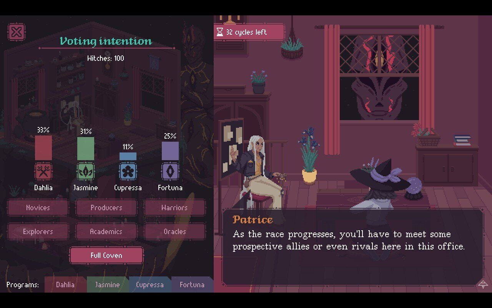
*The Sisterhood voting chart showing factional alignment shifting based on Fortuna's readings. Readings have political consequences. For Tend: an offering's effects could similarly accrue visibly over time, not just as XP.*

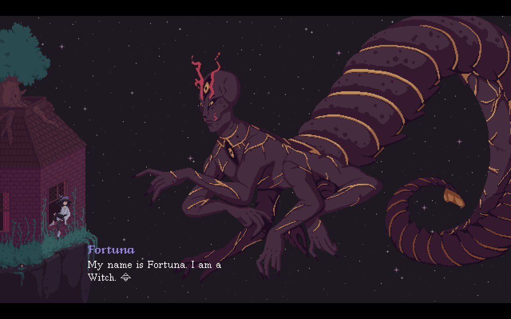
*One of multiple endings — outcome reflects the cumulative weight of readings given. The fact that different players see different endings reinforces that the deck-they-built mattered.*

## Color palette

Cosmic Wheel's palette is tightly controlled across all surfaces:

- **Deep purples** (#2A1B3D, #4A2C5F, indigo-violet) as base "void" and night
- **Muted golds and ochres** (#C9A961, #A88746) for accents, frames, candlelight, and "consecrated" highlights
- **Deep forest / olive greens** for organic / herbal elements
- **Dusty rose and burgundy** for flesh, fabric, and warm interior lighting
- **Cosmic gradients** (purple to magenta to teal) for sky / void backdrops
- **Cream / parchment** (#E8D9B5) for readable text surfaces — never pure white

Saturation is deliberately knocked down. Even the brightest accents feel slightly faded, as if seen through candlelight or pigment that has aged. Tend should resist the temptation to push saturation up for "engagement" — the muted-but-rich treatment is core to the perceived sincerity.

## Typography

Two systems:

1. **Display / titles / card names:** ornate humanist serif with celestial flourishes — feels engraved, slightly art-nouveau. Used sparingly.
2. **Body / dialogue:** a soft, slightly rounded sans or low-contrast humanist serif optimized for readability against parchment surfaces.

Card labels themselves are often hand-lettered styling rather than set type, reinforcing that the cards are artifacts, not products.

## Manga-influenced pixel art

The art style is high-resolution pixel art that owes more to '90s shoujo manga and Studio Ghibli than to retro-game pastiche. Faces are detailed and expressive; hair has movement; eyes carry emotion. This is an underexplored aesthetic register for habit apps, which default either to flat vector (Headspace) or polished 3D (Fabulous). A manga-influenced pixel or pixel-adjacent illustration system would let Tend's deity portraits carry real personality and emotional range.

## Witch fashion

Costume design across the visiting witches is a small encyclopedia of witch-fashion options Tend can mine: layered robes with asymmetric drapery, statement jewelry (large pendants, ear cuffs, multi-band rings), bold makeup (graphic eye shadow, dark lips), occasional magical body modifications (horns, glowing marks, unusual eye colors, plant-growth), accessories tied to practice (pouches, daggers, scrying tools, herbs in hair). The vocabulary feels lived-in and varied — these are working witches, not costume-party witches.

## Design language & takeaways for Tend

- **User-built ritual objects are the core mechanic, not a side feature.** Cosmic Wheel proves that letting a user *construct* their own occult artifact — rather than choosing from a menu of pre-built ones — is the single most powerful loop in this space. Tend's offerings should be assembled, not selected.
- **Constrained generativity is the design problem to solve.** A small, symbolically rich component vocabulary (suit + centerpiece + ornaments + frame) yields huge perceived variety while maintaining art-direction coherence. Don't go for unlimited custom; go for constrained-but-meaningful.
- **The construction surface should be diegetic.** Cosmic Wheel's card forge looks like an altar / workbench, not a settings screen. Tend's offering-builder should look like a ritual surface, with components as physical-feeling props.
- **Show the artifact assembling in real time.** Every component choice in Cosmic Wheel updates the card immediately. The player watches their offering take shape. This is non-negotiable for the emotional register.
- **Consecrate the completion moment.** When a card is finished, there's a halo / glow / pause. Tend should mark the moment an offering is finalized with a small ceremonial flourish — it converts a UI action into a ritual act.
- **Use created artifacts in later flows.** Cards Fortuna built are the cards she draws in readings — they have consequences. Tend's offerings should reappear: in deity dialogue, in streak displays, in "consult your altar" moments.
- **Consult-the-cards / consult-the-deities as decision-support framing.** Cosmic Wheel reframes "make a choice" as "draw a card" — divination becomes a UX paradigm. Tend can frame habit-decisions as deity consultations: "ask your patron," not "set a goal."
- **Branching consequences make the practice feel real.** Readings shift Sisterhood politics. Offerings in Tend should accumulate into something visible — relationship with deity, altar state, narrative shifts — not just streak numbers.
- **Manga-influenced pixel/illustration is an underused register.** It's neither cute-pastel nor dark-gothic — it lets deities be adults with histories. This is a strong differentiator from Finch, Fabulous, and Headspace.
- **Muted-rich palette over high-saturation.** Deep purples, faded golds, parchment cream. Resist app-store-friendly saturation — the sincerity of the aesthetic depends on restraint.
- **Diegetic UI ornament over neutral chrome.** Dialogue plates, choice cards, and frames should feel engraved or inscribed, not generic. Every UI surface is an opportunity for occult ornament.
- **Treat deity / character portraits as the primary visual subject.** Cosmic Wheel gives portraits half the frame. Tend's deity moments should commit similarly — a full-presence portrait when the patron speaks, not an avatar icon.
