# Cult of the Lamb — Visual Design Research

## Overview

**Cult of the Lamb** (Massive Monster / Devolver Digital, 2022) is the single closest existing **visual and mechanical** reference for Tend. Tend treats daily habits as offerings to patron deities; CotL treats daily sermons, rituals, doctrines, and follower care as the literal loop of cult management. The mapping is almost one-to-one:

| Cult of the Lamb | Tend |
| --- | --- |
| Daily sermon (broadcast from altar) | Daily ritual / morning offering |
| Followers (named, portraited, with traits) | The user's habit roster (or "faithful") |
| Doctrines (pick one branch of dogma to unlock) | Deity attributes / chosen values |
| Rituals (special-occasion ceremonies costing devotion + bones) | Special-occasion habits / festivals |
| Devotion (currency generated by faith) | Streaks / faith currency |
| Four bishop bosses (Heket, Leshy, Kallamar, Shamura) | Deity roster / pantheon |
| Tarot cards drawn each crusade run | Daily draw / oracle card |
| Crusade environments (4 biome regions) | Themed seasons / paths |
| Pixel-vector hybrid, cutesy-gothic | Witchy-but-warm app aesthetic |

CotL succeeds because it pairs **adorable rounded character art** with **liturgical horror typography, blood-red ritual circles, and skull-laden architecture** — exactly the juxtaposition Tend wants. The big takeaway is that cute mascots can carry occult iconography without becoming edgelord; the design language is "candlelit storybook," not "metal album cover."

---

## Key Art & Sermon Altar

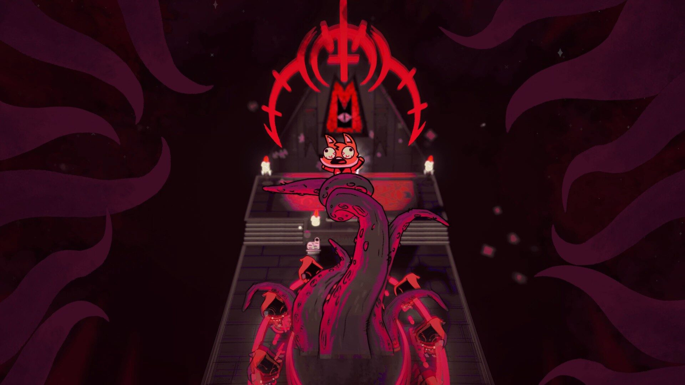

The hero shot of the game: the player-lamb stands on an elevated stone altar, lit from below in arterial red, beneath the Crown of the One Who Waits — a circular thorned sigil that doubles as the game's wordmark. The pure black background and deep magenta/oxblood gradient is the franchise signature. Note how the altar is **architecturally centered and symmetrical**, drawing the eye to the single figure delivering the sermon. For Tend this is the template for an "offering screen": symmetrical, central, candlelit, with a deity-sigil halo above.

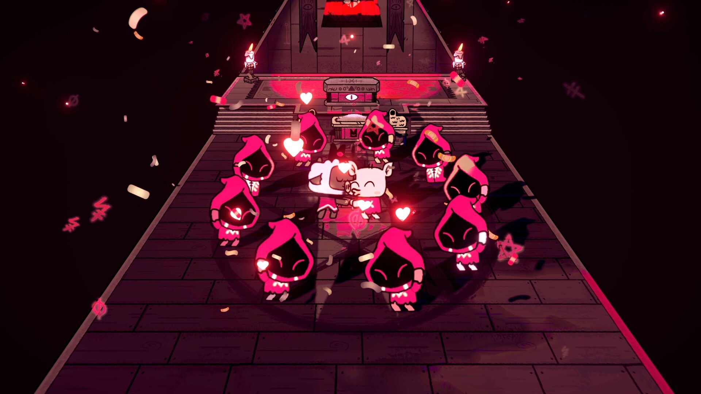

The wedding ritual: confetti, sigils etched on the floor, every follower reduced to a silhouette with a single glowing heart icon. The design lesson is **ritual participants become abstract iconography** — Tend can render "active streak members" or "blessed habits" the same way: as silhouettes with one bright sigil each.

---

## Cult Management UI (Village Overview)

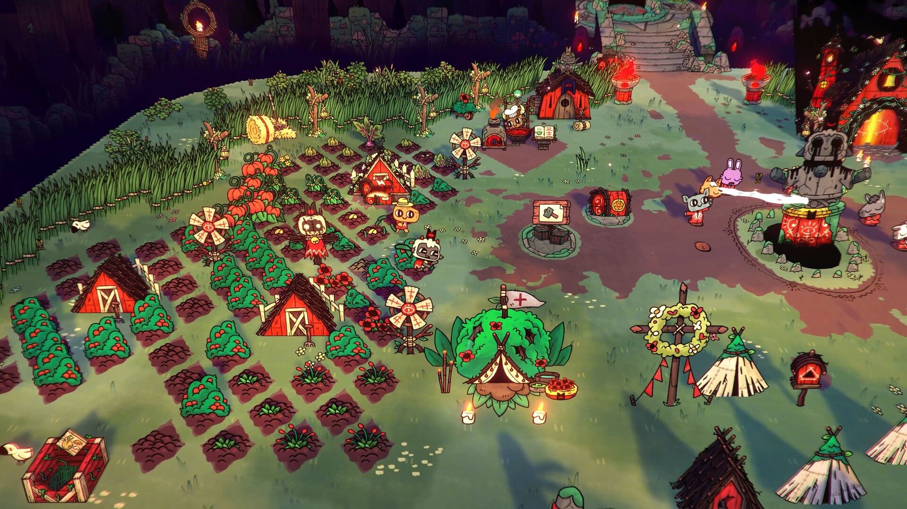

The cult management view: a top-down village where every system is a **discrete physical object** — farm plots, follower huts (each with a flag/sigil), a fire pit, a shrine, a refinery, a worship statue. Each building emits a tiny status sigil. This translates beautifully to Tend's habit dashboard: every habit/ritual becomes a hut or station with a custom flag, and the "village" is the user's overall practice.

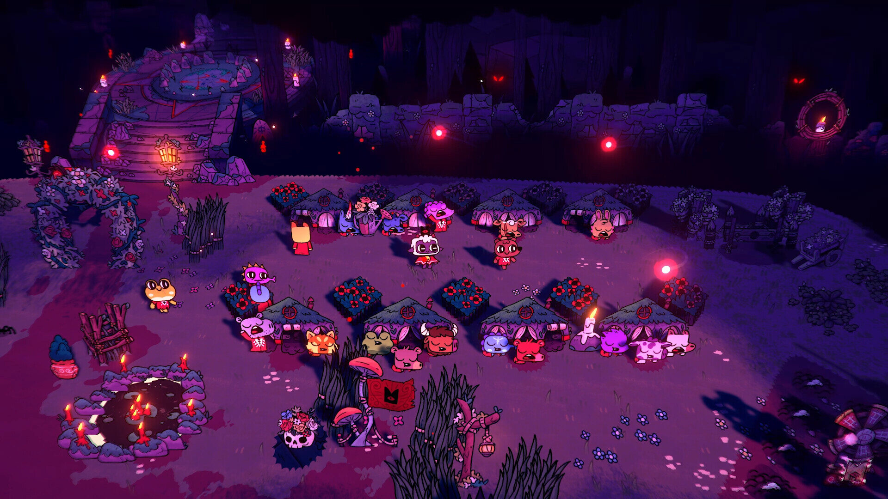

Night version of the village: same diegetic UI, lit by candles and the pink-red glow of the central pentagram pit. The dual day/night rendering of the same space is worth borrowing — Tend's home view could shift palette by time of day (warm dawn rose → cool night indigo) while preserving layout.

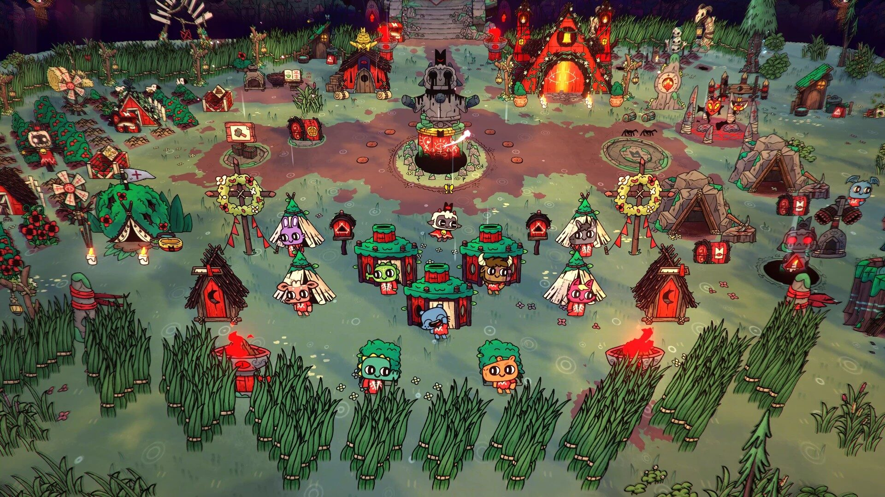

Wider isometric showing how readable the village stays at zoom: distinct silhouettes, hand-painted edges on every tile, no UI chrome — the world *is* the dashboard. The takeaway for Tend: avoid floating cards over an empty background; let the deity's "domain" itself be the layout.

---

## Sermon UI (the daily-engagement model)

In CotL, **once per in-game day** the player triggers a sermon: followers gather in a wedge formation, hearts/sigils float up, and the player aims a beam of faith that converts attention into Devotion. Mechanically it is a 10-second tap loop. Emotionally it is the day's anchor moment.

**Why this matters for Tend:** the sermon is the perfect model for a once-a-day "check in with the deity" ritual. Properties to copy:

- **Spatial fixedness** — the altar is always in the same place, so the player knows where to go.
- **Visible attendance** — followers physically gather, so engagement is rendered, not just numbered.
- **Short, satisfying loop** — beam-of-light feedback per tap, total duration under a minute.
- **One-per-day rhythm** — scarcity makes it feel sacred, not chore-like.

Tend's morning ritual can use this exact spatial pattern: deity at the apex, habits/offerings arrayed in a wedge below, each "attending" habit emitting a heart sigil when the user marks it done.

---

## Doctrine Selection (values / attributes)

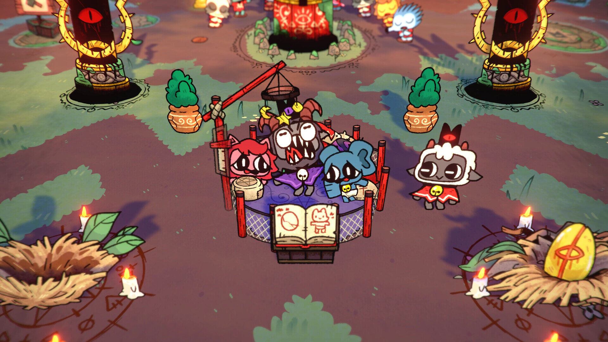

The doctrine lectern: the lamb and senior cultists gather around an illuminated open book, with tarot-like card faces visible inside. The visual frame is **a sacred text being read together** — community ritual around shared values. Doctrines in CotL are branching choices (Afterlife, Work & Worship, Possessions, Law & Order, Sustenance), each forcing a one-of-two pick that defines the cult's character.

**Translation to Tend:** the deity-selection / values-onboarding screen should literally render as an open grimoire with paired card-style choices. Pick "Abundance" over "Restraint." Pick "Solitary practice" over "Communal." Each pick is irreversible-feeling, ceremonial, and committed-to with a quill-on-vellum animation.

---

## Ritual UI (special-occasion habits)

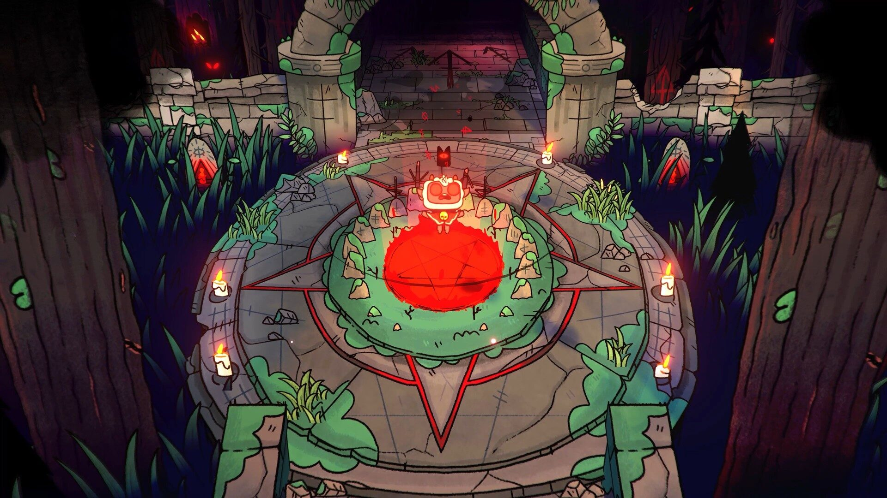

A standalone ritual chamber: a circular stone platform inscribed with a glowing red pentagram, white candles spaced around the perimeter, vines softening the stonework. Rituals in CotL cost Devotion + Bones and grant temporary buffs (faith bonus, follower loyalty, immortality, etc.). Each is a **bounded special-occasion action** distinct from the daily sermon — exactly Tend's distinction between recurring daily offerings and one-off festivals/rituals.

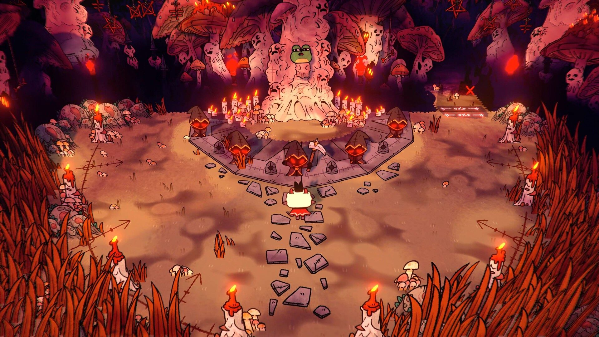

Group ritual: followers form a perfect circle, the centerpiece glows, and a single lit candle marks each participant. The composition is symmetrical, the lighting is theatrical, and the action is bounded by the platform edges — a contained "stage" for ceremony. Tend's festival/milestone screens should adopt this **circular containment + radial symmetry** language.

---

## Follower Portraits (the user's faithful)

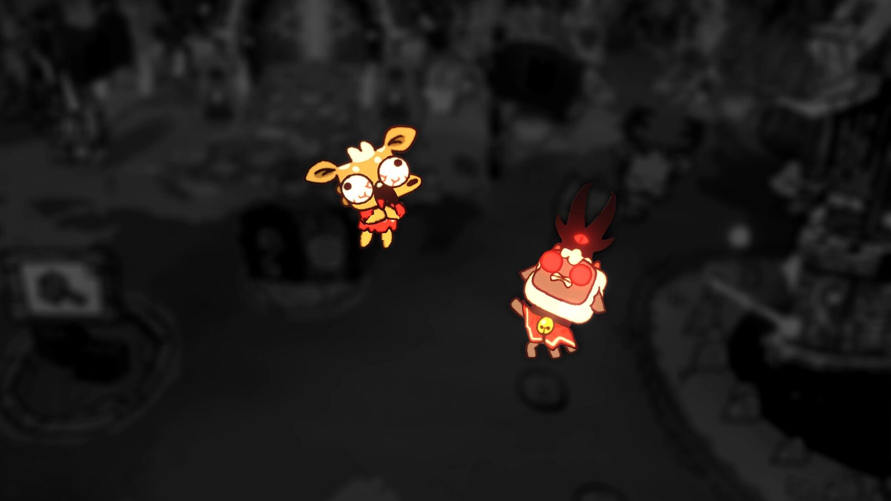

The character design vocabulary: **huge eyes, tiny rounded bodies, single defining accessory** (antlers, sunglasses, robes). Every follower is recognizably individual but built from the same skeleton — perfect template for Tend habit-avatars or deity-companion characters. The black vignette + spotlight focus makes the portraits feel like cult inductee ID cards.

Followers in context: each one is **a different species** (cat, frog, mouse, deer, sheep) wearing variations of the same red hooded cloak. The uniform-with-variation principle is critical: Tend's habit-creatures should share a visual chassis (same silhouette/proportion) but vary in species/color/accessory so the user can build a recognizable personal pantheon.

---

## Shrine / Altar

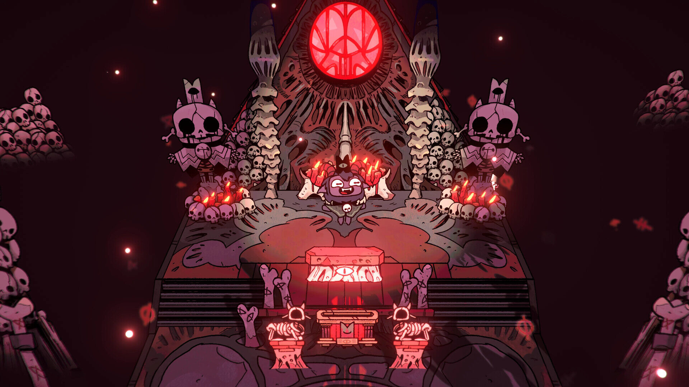

The throne-room shrine: bone-stacked tiers, an enormous red ocular stained-glass window, ribbed-vertebrae columns. This is the maximum-darkness end of the visual palette and shows how far CotL pushes the gothic register while keeping characters round and friendly. Note the **rim-lit silhouette** of the lamb — the deity-figure is darker than the background it stands against, lit from behind by the cult's collective faith.

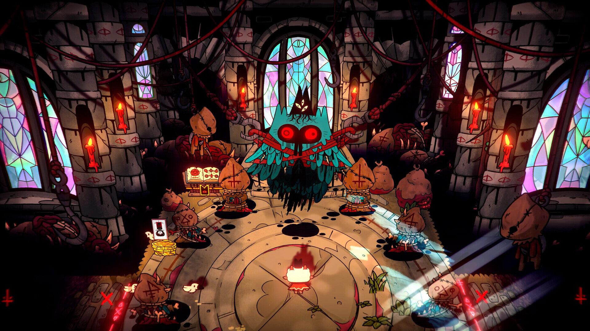

Cathedral interior: ornate stained-glass windows in deep emerald and rose, hanging viscera as decor, candelabra ringing a circular ritual floor. The **stained-glass motif** is one of CotL's strongest art tools — it turns deities into iconography in the most literal medieval sense. Tend should consider stained-glass treatments for deity profile screens.

---

## Devotion Currency

Devotion (♥-sigil) is generated by sermons and follower happiness, and spent on unlocking doctrines and rituals. It is **visualized as glowing pink-red hearts** floating from followers during sermons (see sermon image above). The currency icon is a soft heart with a vertical slit pupil — at-a-glance readable, emotional, and unmistakably the game's. Tend's equivalent (faith/streak/blessing currency) should similarly be a **single anthropomorphic sigil** — not a generic coin or gem — that ties emotionally to the practice rather than to commerce.

---

## Tarot Cards (in-game)

CotL features two card systems: doctrines (above) and tarot cards drawn at the start of each crusade run, granting random run-buffs (e.g. "The Hermit" → +health, "The Lovers" → follower link). Each tarot is rendered as a **hand-painted portrait card** with a single character/symbol on a vellum-textured background, gold-foil edge, and a named title beneath. The aesthetic is closer to Rider-Waite than to slot-machine power-up cards.

For Tend's daily oracle/draw mechanic, this is the gold standard: handpainted, asymmetric, illustrated *characters* rather than abstract symbols, and one card = one named effect. Don't make them collectible loot — make them readable parables.

---

## Combat (crusade gameplay)

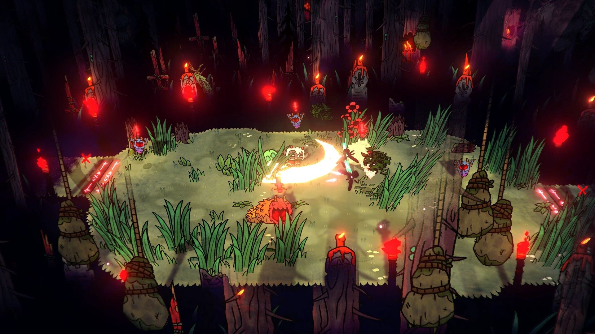

Crusade combat: real-time roguelike with weapon arcs traced as glowing crescents. The arena is bounded by candles and bone-totems on dark grass, and enemies are silhouetted with red eye-glows. Combat is fast but **the lighting carries the mood** — every fight feels like it's happening in a haunted clearing at midnight.

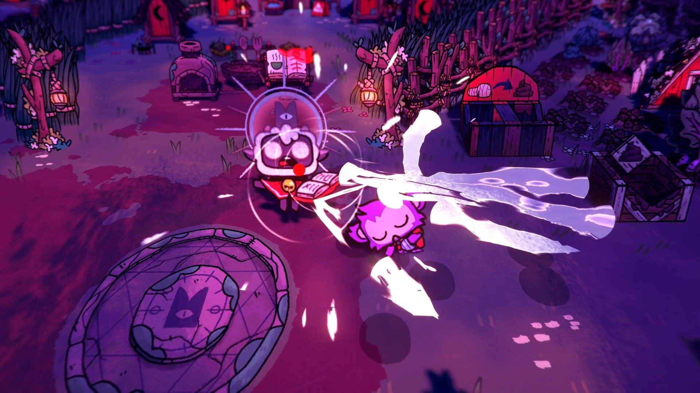

A different biome's combat: the same lamb, recolored arena (pink/violet), different enemy palette. The crusade system uses **palette and enemy silhouette to communicate region** rather than redrawing the whole HUD. Tend could similarly retheme "challenges" or "seasons" by palette swap while keeping core interactions identical.

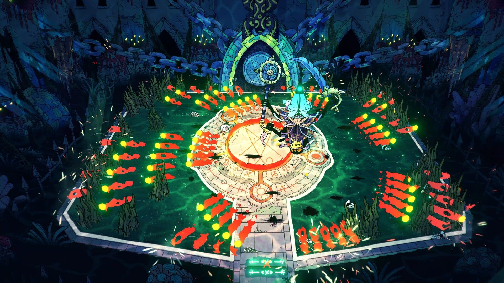

Late-game bullet-hell encounter: the arena floor itself becomes a **glowing UI element**, indicating safe lanes with green and danger zones with red. This is a good model for any "intensified ritual" or special-event screen in Tend — let the floor/background telegraph the difficulty.

---

## Crusade Environments (the four biomes)

CotL's four regions each have a distinct palette and ecology, anchored to one bishop:

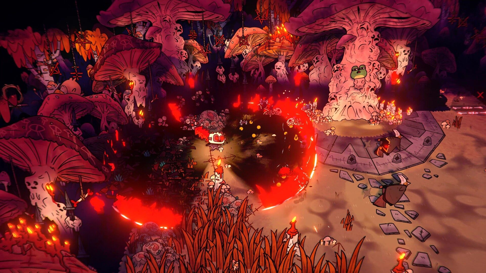
*Darkwood — Leshy's domain. Magenta, oxblood, mushroom-cap silhouettes.*

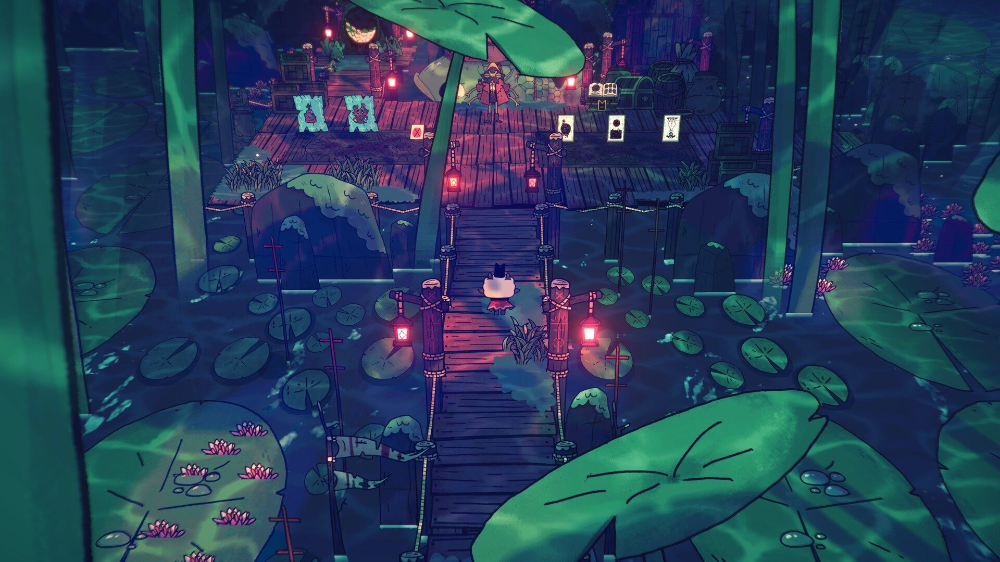
*Anura — Heket's domain. Teal-cyan night, red lanterns, lily-pad geometry.*

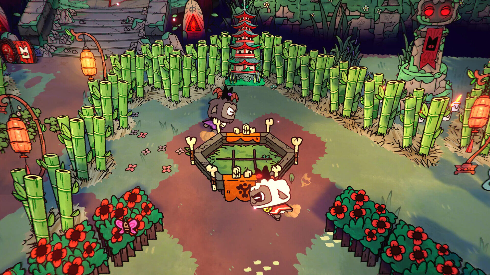
*Bamboo grove arena — green-tile + red-lantern accents. Crusade combat space.*

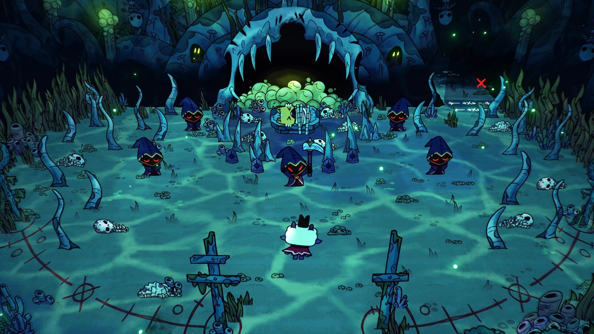
*Anchordeep — Kallamar's domain. Aquamarine cave with bioluminescent fish-jaw architecture.*

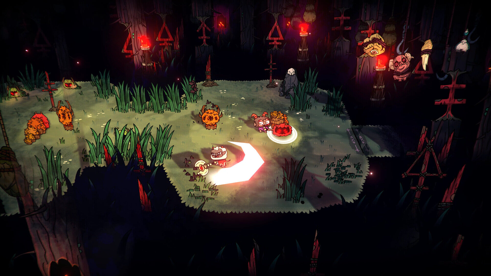
*Mid-crusade clearing in the Darkwood — note how the same biome has variable lighting "rooms."*

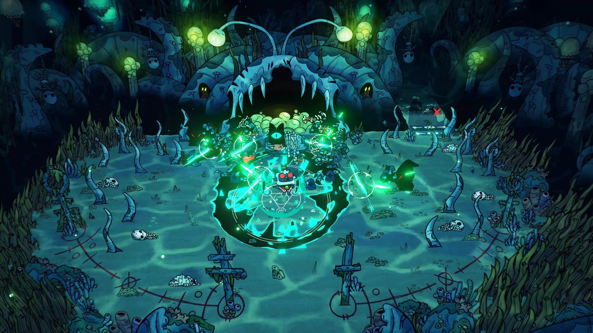
*Anchordeep ritual interior — cyan-on-cyan ritual circle.*

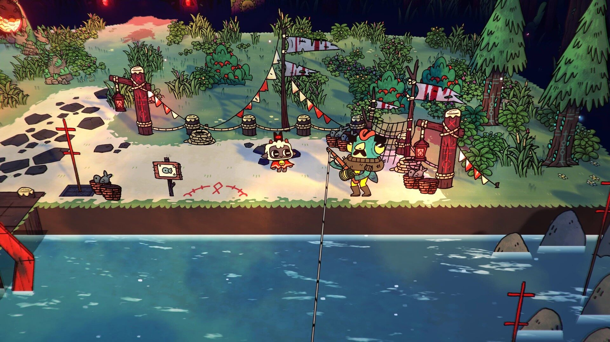
*Anura coast — daytime fishing/resource node, showing the lighter daytime end of the palette range.*

**Pattern:** each biome is ~3-4 hues + accents (red lanterns, red banners, red eyes — red is the constant). For Tend, "seasons" or "deity paths" should pick a single dominant hue + the universal red/rose accent that ties them all back to the brand.

---

## Boss Bishop Portraits (the deity roster)

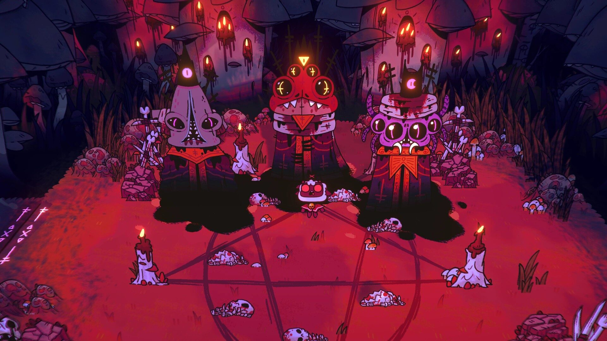

The four bishops of the Old Faith are CotL's pantheon and the closest existing **deity-portrait reference** for Tend. From left to right in the image: **Shamura** (spider/madness, six eyes, indigo crown), **Heket** (frog/famine, three red eyes, triangle mouth), **Kallamar** (octopus/pestilence, single magenta eye, purple). The fourth, **Leshy** (worm/chaos), appeared in the boss-pyramid hero art (see ss-06). Each:

- Is built from **one extreme exaggerated feature** (eyes, mouth, tentacles, antlers).
- Wears **ceremonial robes in their domain palette** (red, pink, purple, indigo).
- Has a **distinctive head silhouette** readable at icon size.
- Sits centered, symmetrical, against a domain-colored backdrop.

For Tend, this is the deity-card template: one bold feature + domain palette + centered symmetry. Avoid full body shots; the **face/mask is the brand**.

The bishop "throne shot" — a useful template for a deity-detail screen: the deity sits at the apex of a tiered architectural pyramid, lit from behind by a single oculus window, with their personal symbol repeated as architecture (skulls here; for a moon deity, it would be crescents; for a sun deity, rays).

---

## Mobile (Cult of the Lamb Pocket)

Not in the downloaded asset set, and not critical: CotL Pocket (the iOS/Android companion app launched 2024) reskins the same village-management loop for portrait orientation. The relevant learning is that **the diegetic village UI scales down to phone format with no separate HUD** — the same hand-painted huts, the same sigil-flags, the same village-as-dashboard pattern. Tend should plan for the same: build the witchy-cottage / shrine-yard layout as the dashboard, not as decoration over a dashboard.

---

## Color Palette

CotL's master palette:

- **Background ink:** near-black `#0F0410` to deep maroon `#2A0712`.
- **Brand red / Devotion:** crimson `#D81E2A` → rose `#E94F6F`.
- **Bishop accent hues:** magenta-pink (Leshy `#C73E78`), teal-cyan (Kallamar `#3FBDA8`), violet-indigo (Shamura `#5B3D8F`), poison-green (Heket `#7CB342`).
- **Candle / firelight:** warm cream-yellow `#F7D26B` used sparingly as the only "warm light" against cool darks.
- **Bone / parchment neutrals:** off-white `#EDE2C8`, used for skulls, robes, books.

The palette discipline: **dark base + saturated jewel hue + one warm light**. Tend's witchy palette can follow the same recipe (indigo base + rose accent + candle-cream highlight) for instantly-recognizable mood.

---

## Pixel-Art / Vector Style

CotL is *not* pixel art — it is a **hand-painted vector hybrid** with deliberate jaggies. Characters use clean rounded vector silhouettes with a single dark outline; environments use painterly textures with visible brush marks. The result reads as "storybook illustration" rather than "indie pixel game."

Key style traits:

- **Heavy black outlines** on characters (1.5–3px equivalent), no outline on environment.
- **Flat fills + minimal shading** on characters; environments have painted lighting.
- **Crinkled, hand-drawn edges** on terrain tiles — every grass patch wobbles slightly.
- **Diegetic UI** — books, scrolls, candles, flags carry information; very little floating chrome.

For Tend, this means: vector character icons with strong outlines, but **painted/textured backgrounds** — the contrast is what makes the cute-meets-gothic register work. Pure flat vector everywhere would feel sterile; pure painted everywhere would feel heavy.

---

## Design Language & Takeaways for Tend

1. **Cutesy-gothic juxtaposition is the entire product.** Big-eyed rounded characters + skull-laden architecture + blood-red ritual circles. Either alone fails; the contrast is the brand. Tend should never sand off either edge.
2. **Daily sermon = daily ritual.** The once-per-day, ~1-minute, spatially-fixed engagement loop is exactly Tend's morning offering. Copy the mechanic structure: gathering animation → individual sigils light up → single satisfying tap finishes it.
3. **Followers, not numbers.** CotL renders cult population as named individuals with portraits. Tend's habits should be named characters/companions with faces, not list rows. "Sunrise meditation" is a yellow rabbit with a sleepy half-closed eye; "evening journal" is a blue owl with a quill.
4. **Doctrines as values/attributes.** Onboarding picks should be paired binary choices in an illuminated grimoire — irreversible-feeling, ceremonial, and committed-to with quill animation. Avoid pickers; use scrolls.
5. **Diegetic village dashboard.** Don't put cards on a background — make the background *be* the dashboard. The user's shrine-yard / witch-cottage is the home view. Habits are huts; rituals are stations; deity is the central altar.
6. **Four-bishop pantheon as the deity-roster template.** One exaggerated feature + domain hue + centered symmetry + crown sigil. Build Tend's deities the same way: a moon deity is one closed eye + indigo + crescent halo; a hearth deity is one warm smile + amber + flame halo.
7. **Devotion as anthropomorphic currency.** A heart with a slit pupil — emotional, not commercial. Tend's faith/streak currency should be a sigil with personality, not a coin or gem.
8. **Ritual UI = circular containment + radial symmetry.** Special-occasion screens (festivals, milestones, blessings) should be bounded circular stages with candle perimeters, not full-bleed.
9. **Stained-glass for deity detail screens.** Among the most powerful single tools in CotL's kit. Tend's deity-profile views should consider stained-glass framing.
10. **Tarot as named parables, not loot.** Hand-painted, asymmetric, character-portrait cards with single named effects. Build a small, curated deck (22-ish like a Major Arcana), not an endless gacha.
11. **Palette recipe: dark base + jewel accent + one warm light.** Indigo/aubergine base, rose-red accent, candle-cream highlight. Per "season" or deity, swap the jewel accent (rose → teal → violet → poison-green) but keep the base and the candle.
12. **Diurnal palette shift, same layout.** CotL renders the same village by day and by night with different hues. Tend's home view should shift palette by time of day while preserving layout — reinforces the practice's daily rhythm.
13. **Heavy character outlines, painted environments.** Vector clarity for the things you tap; painterly texture for the world they live in. The contrast is the warmth.
14. **Red is the constant.** Across all four bishop biomes, candle/lantern/banner red is the unifying accent. Tend should pick a single brand-red (or brand-rose) that appears in every season as the consistent thread.
15. **Confetti and sigils on success.** CotL's ritual completions throw sigils, hearts, and gold confetti. Tend's streak completions should similarly **explode in glyphs** — not generic stars, but witchy-specific runes, leaves, crescents, eyes.
