# Daylio — Visual UX Research

Daylio (by Habitics / Relaxio) is the category-defining "micro-diary" mood tracker — Apple App of the Day, Google Editors' Choice, 21M+ users, ~4.8 stars on both stores. Its core proposition is that you can keep a complete daily journal **without typing a single word**: log a 5-point mood face, tap a few activity icons, done in 5 seconds. Everything else — calendar heatmaps, line/bar/donut charts, "Year in Pixels," activity-vs-mood correlations, goals, achievements, streaks, gentle paywall nudges — is built on top of that one quick-entry primitive. This report captures Daylio's UI across onboarding, capture, retrospective views, statistics, customization, and monetization. Screenshots are sourced from the iOS App Store, Google Play, Adapty's paywall library, App Fuel's onboarding catalog, Templateshake's screenshot archive, moodtrackers.org and androidpolice.com reviews, and a long-time-user blog post.

---

## App Store hero shots (iOS, December 2025)

The current iOS App Store listing leads with award badges and a sample calendar grid in their signature green palette, then walks through capture → activities → entries → calendar → mood chart → year-in-pixels → PIN lock → writing prompts → advanced stats → goals.

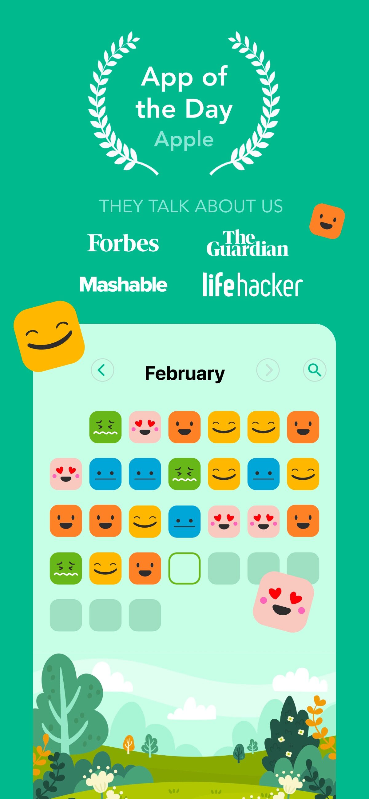
*ios_01 — "App of the Day" hero. Note the rounded-square mood emojis (the calendar "tile" treatment) as opposed to the round emojis used inside the entry flow.*

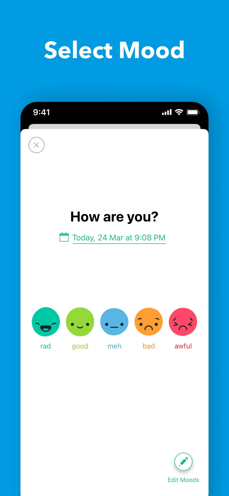
*ios_02 — The famous 5-face circular mood picker. Mood names are lowercased. A small calendar pill lets you backdate before committing.*

*ios_03 — Activity selection grid. Categories collapse/expand with +/chevron. Selected = filled green pill; unselected = outlined gray. Each category has its own `+` to add a custom activity.*

*ios_04 — The Entries feed, Daylio's home view. Each entry: round mood emoji + mood name in matching color + timestamp + activity chips + optional note + optional photo strip. Note free-mixing of native emoji and Daylio's vector icons in the prose.*

*ios_05 — Stats home. Two-chart scrollable surface. Y-axis uses the actual mood emoji icons, not numbers — preserving the "no-numbers" feel even in analytics.*

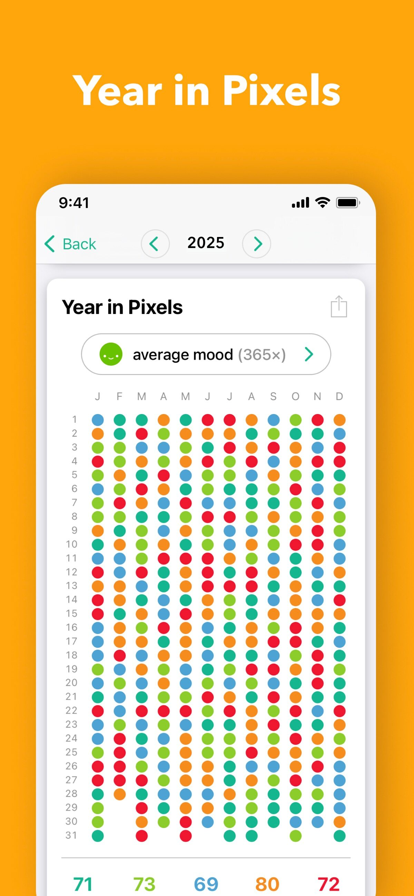
*ios_06 — Year in Pixels. Daylio's signature retrospective view: an entire year rendered as a mood mosaic. Empty days are missing dots. Bottom row shows per-month mood "score" sums.*

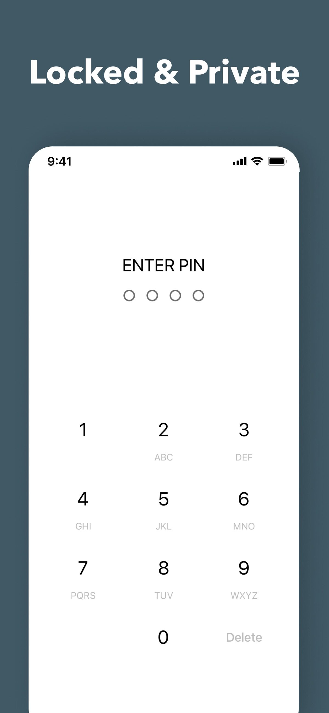
*ios_07 — PIN lock screen. Daylio leans into privacy as a feature, advertised on-marquee. (Premium also offers biometric on Android.)*

*ios_08 — Newer journaling layer on top of the icon entry: structured templates (Gratitude, To-Do List, Morning Reflection, Night Brain Dump, Worries, etc.), rich text formatting, and a chevron-up emoji-prompt strip.*

*ios_09 — The killer premium feature: activity-vs-mood causal lookup with a labeled "Confidence: High" indicator and adjacent-day spillover analysis. This is the kind of insight users screenshot and post.*

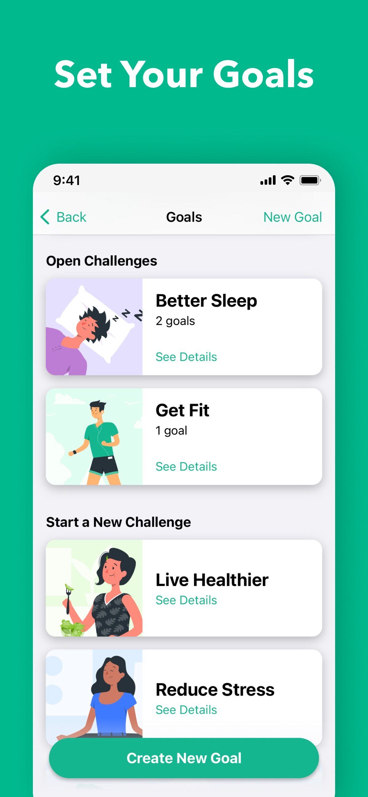
*ios_10 — Goals/Challenges are framed as pre-packaged "challenges" with friendly cartoon characters, plus a custom path. Note the consistent illustration style used across goal templates.*

---

## Onboarding

Daylio's onboarding is deliberately short (~5-7 screens) and customization-first: pick your mood emoji set, pick your color theme, pick the activities you want to track, set a reminder, then go straight into your first entry.

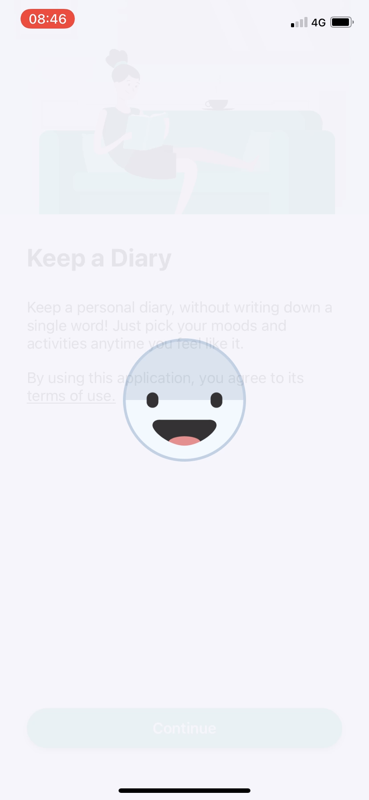
*ob_01 — First-launch splash. Daylio uses a single mascot face (the calm, slightly-smiling neutral) as its brand identity.*

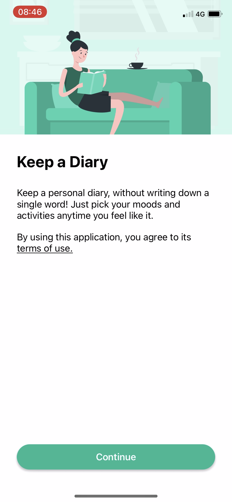
*ob_02 — First substantive screen. Note the explicit "without writing down a single word" pitch — the entire product positioning in one sentence.*

*ob_03 — Mood + theme customization happens BEFORE any entry. Hyper-customization is the first interaction.*

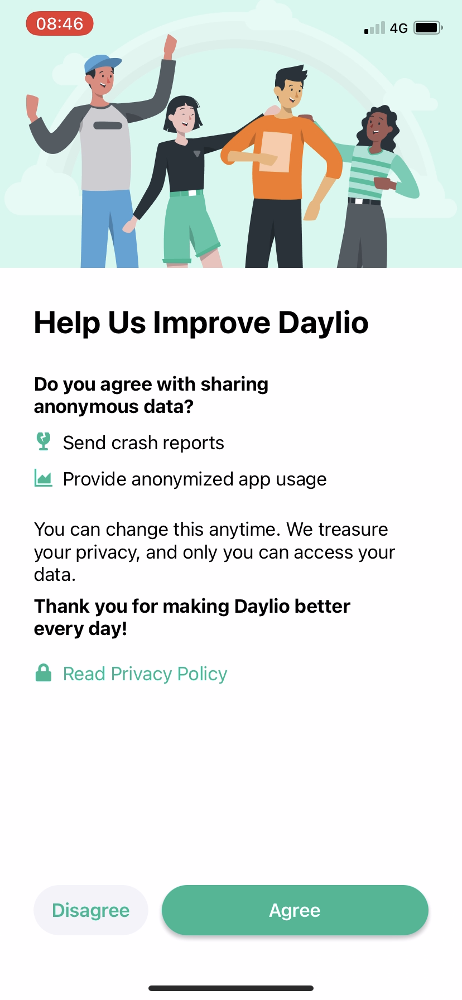
*ob_04 — Privacy/telemetry consent gets its own screen with copy "We treasure your privacy, and only you can access your data."*

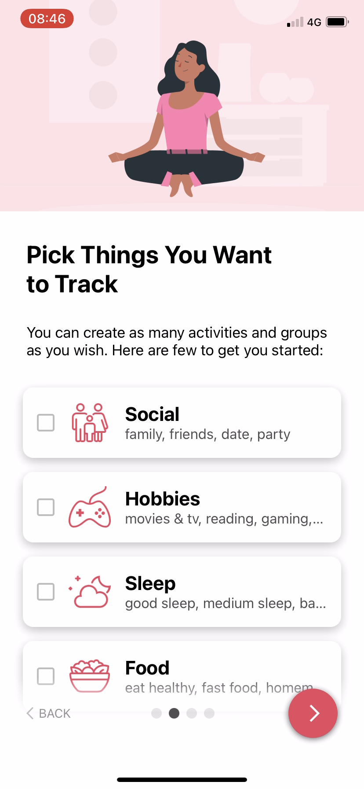
*ob_05 — Activity bundle picker. Pre-grouped into categories, each with a chip-style category description showing examples. The "lots of small choices" approach.*

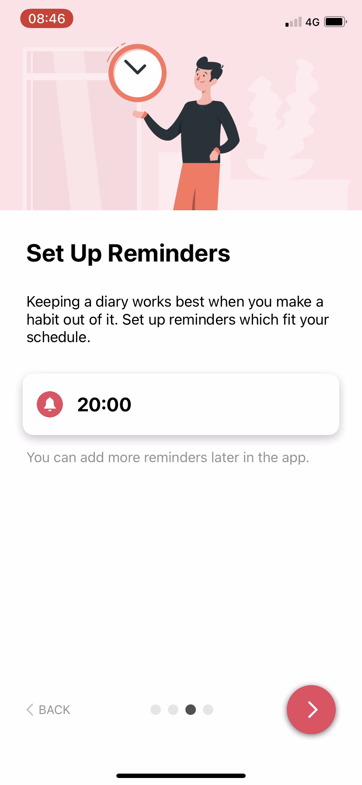
*ob_06 — Single-reminder setup screen. Defaults to 8pm. Reminders are treated as essential, not opt-in.*

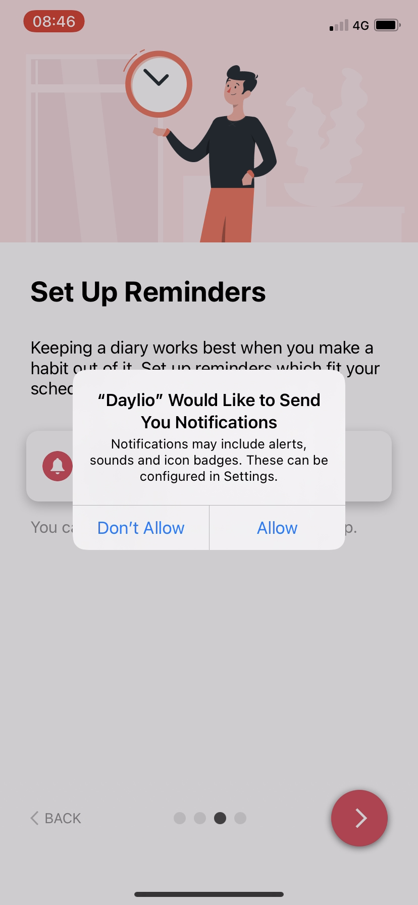
*ob_07 — System notification prompt is shown AFTER context. Daylio earns the permission first by showing how reminders will be used.*

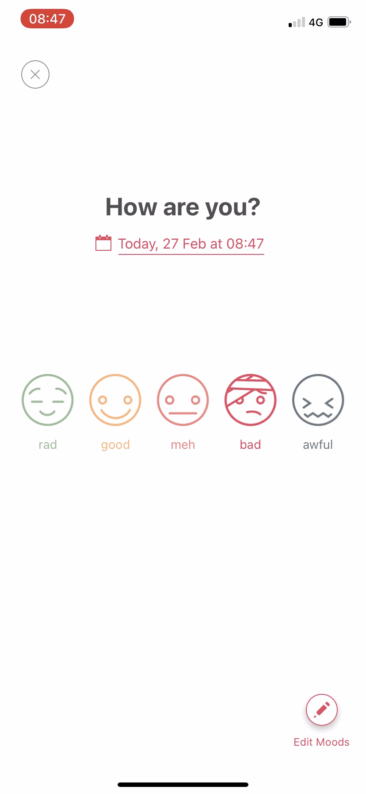
*ob_08 — Immediately after onboarding the user lands on their first capture, themed in their chosen palette. The unselected state is outlined, the selected state fills with mood color.*

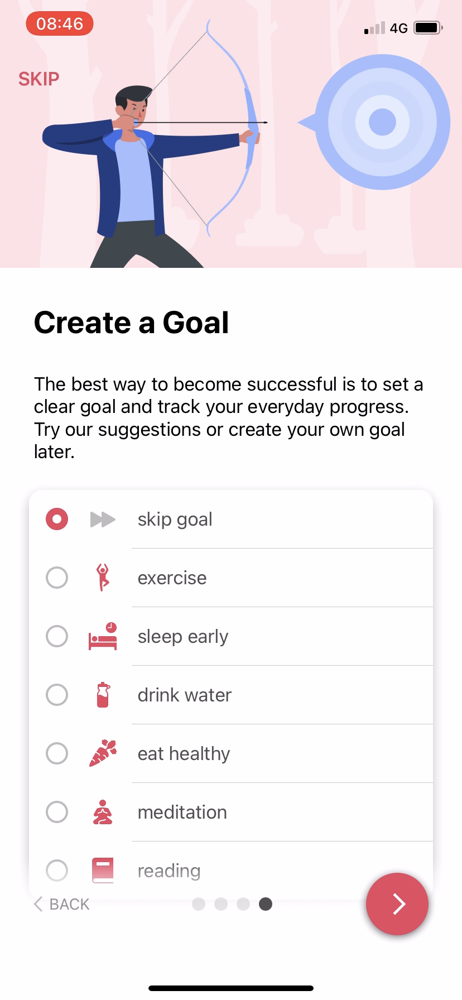
*ob_09 — Goal setup is offered with a curated suggestion list AND a "skip goal" option as the first row — friction-minimal.*

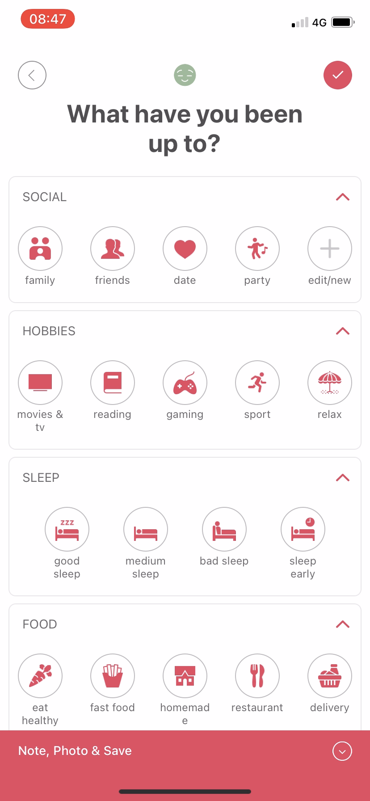
*ob_10 — First entry's activity grid pre-organized with collapsible category headers (▲ chevrons). A persistent "Note, Photo & Save" action bar at the bottom drops anchor on the primary action.*

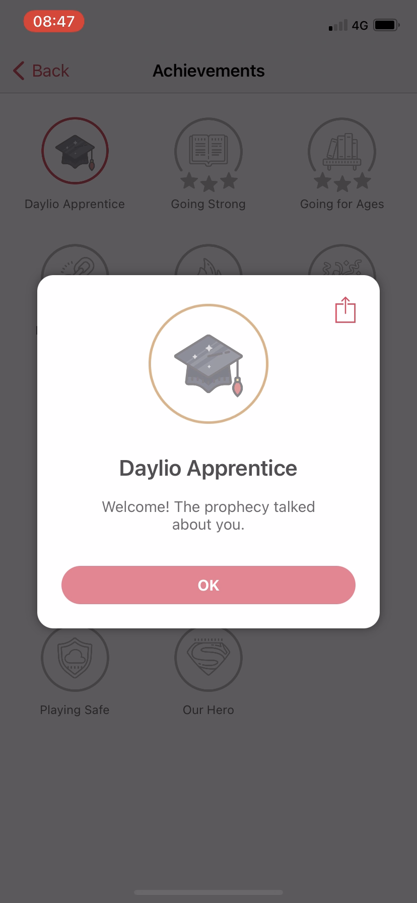
*ob_11 — First-entry payoff: an instant "Daylio Apprentice" achievement modal celebrates the user. Hook completed inside the first 60 seconds.*

*ob_12 — The locked-badges grid that's visible immediately after the first entry. Strong "collect them all" gamification with explicit star levels (1-3 stars per badge).*

*ob_13 — Paywall surfaced very early in the funnel (after first entry / first achievement). Annual is anchored as default with crossed-out monthly equivalence; monthly looks deliberately unappealing.*

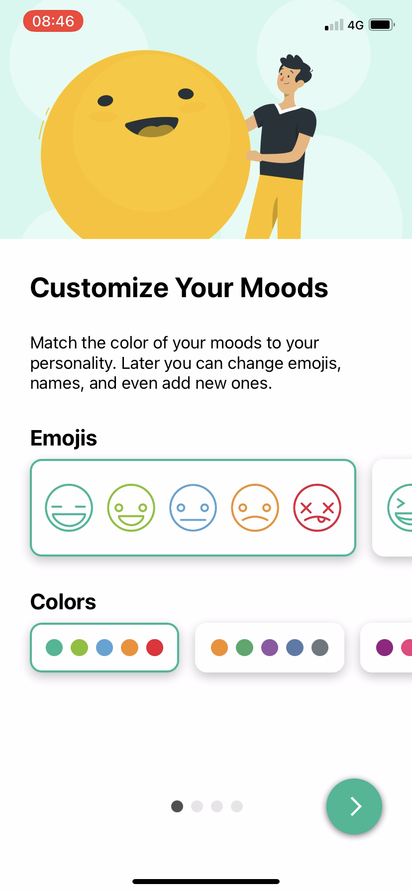
*ob_14 — Alternate state of the mood/colors picker showing the color carousel mid-swipe (orange-green-purple-blue-pink swatch row).*

---

## Quick mood entry & activity selection

The two-tap entry loop is Daylio's signature flow. Five emojis on screen 1, an activity grid on screen 2, optional note/photo, save.

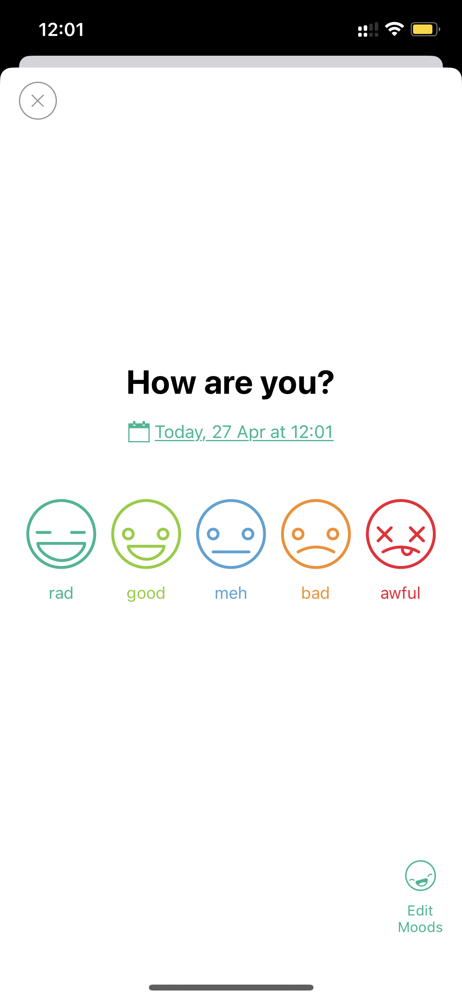
*Light-mode mood picker (outlined, theme-colored).*

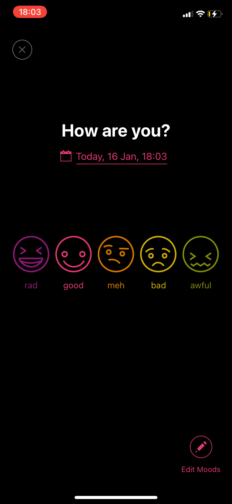
*Dark-mode mood picker with a neon pink/yellow/orange/red theme — same layout, themed colors. Daylio supports themes as a first-class concept (not just dark mode).*

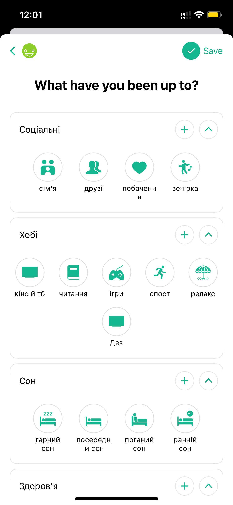
*Activity grid in Ukrainian locale. Each category has its own collapse/expand chevron and a `+` to add a custom activity inline. Each activity is icon + lowercase label.*

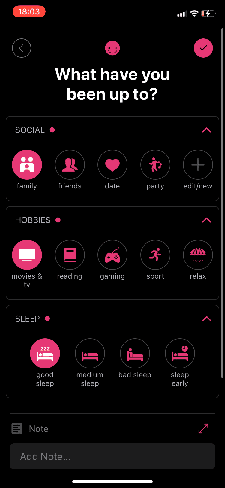
*ts_content3 — Selected-state visual: in dark/themed mode the selected activity fills with the theme color while unselected stays outlined. The category dot indicator (small pink dot next to "SOCIAL") signals that an activity was selected in that group.*

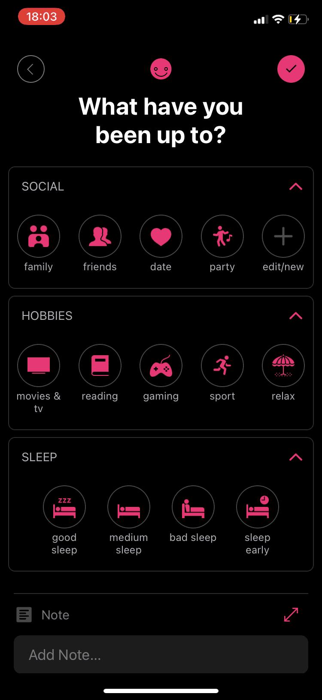
*Unselected/empty state of the same activity grid — useful for seeing the visual baseline.*

*blog_moodactivities — Real long-term user customization: extra mood emojis (Anxious/Lazy/ねむい/Surprised) added beyond the default five, and the activity grid stretched to ~25+ items across many custom categories including "Chores" with iron, package, clean-ref. Demonstrates the deep extensibility.*

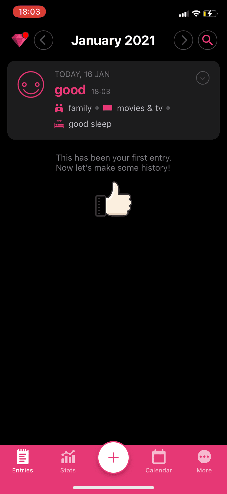
*ts_content4 — Empty-state-after-first-entry copywriting: warm congratulatory message rather than an empty feed.*

---

## Entries feed (the home view)

*mt_02 — Light entries feed. Notable: (1) a rotating quote/banner pinned to the top, (2) "2 Days Missing" explicit gap label between entries — Daylio names the absence rather than hiding it, (3) multiple entries per day are stacked vertically inline with a connector dot.*

*play_landscape_05 — English entries feed showing photo attachments inline (3-up grid). "Luna" is the user's pet, added as a custom activity. Demonstrates the "personal life database" feel.*

*Tablet feed showing the "Today's Goals 1/1" completion banner pinned at the top of the feed, and the grouped-entries-per-day visual treatment with a vertical connector line between same-day entries.*

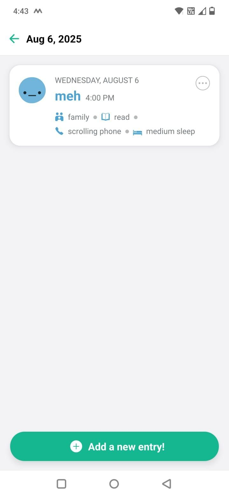
*ap_06 — Single-day drill-down from the calendar. When you tap a day on the calendar, this is where you land — a focused "day view" with explicit "Add a new entry!" CTA, supporting the multi-entries-per-day model.*

*ap_01 — Voice-note attached to a mood entry. The waveform UI is fully embedded inline in the entries feed. Bottom shows an unobtrusive "Let's go Premium! Unlimited Goals" upsell strip — premium prompts ride along the bottom of the main views.*

---

## Calendar view (mood-colored)

*mt_16 — Calendar view. Every day is either a mood-circle or a `+`. The filter pill at top lets you re-color the calendar to show ONLY a specific mood or activity — a powerful retrospective filter.*

*ap_05 — Same calendar in Android. Highlighting of "today" with a teal-outlined `+` makes the next action obvious. The compact mood emojis are sized so you can scan a month in one glance.*

*ts_calendar — Dark-mode pink theme calendar showing the depth of customization. Color counters at the bottom show how many days hit each mood color this month.*

---

## Statistics (charts & correlations)

Daylio's stats tab is the data-product layer. Free users get Mood Chart, Mood Count donut, Days-in-a-Row, basic Activity Count, and one premium-locked card per scroll. Premium unlocks Average Daily Mood, Mood Stability, Influence on Mood, monthly/yearly bars, and Often Together.

*mt_03 — Top of the Stats screen: streaks first. The "Days in a Row" row of bubbles makes today's contribution feel like part of an active sequence — gentle daily nudge.*

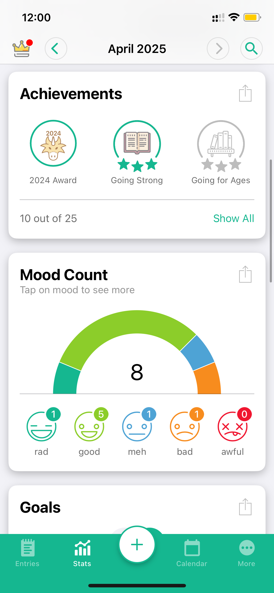
*mt_04 — Achievements visible inline in stats (not buried in settings). Mood Count donut sized so it dominates above the fold.*

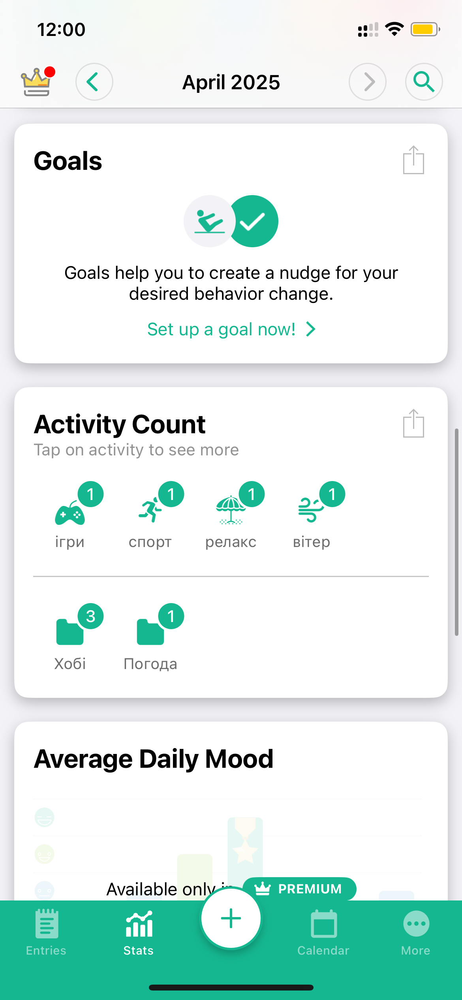
*mt_05 — Empty Goals state is also a hook. The Activity Count bubbles use the same icon language as the entry grid — visual continuity throughout.*

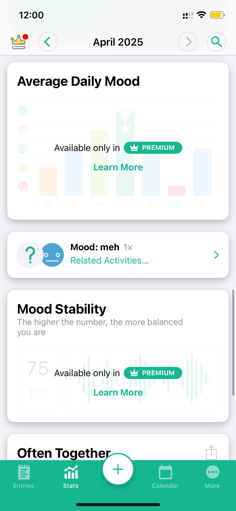
*mt_06 — Premium cards are rendered as faded previews inline, not hidden — the user sees what they're missing. Each premium card has its own "Available only in Premium / Learn More" inline upsell.*

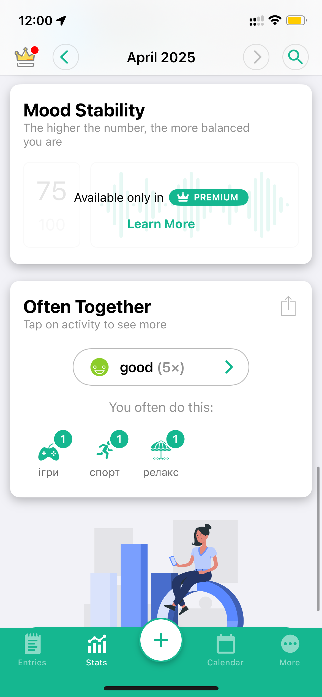
*mt_07 — "Often Together" surfaces co-occurring activities for a selected mood. A simple but powerful insight pattern.*

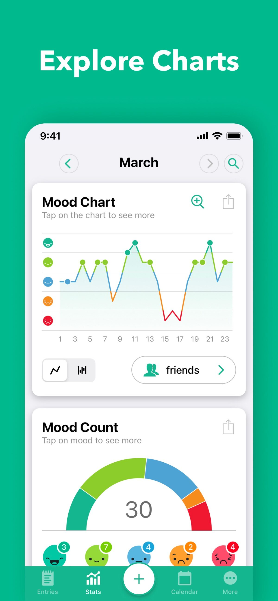
*Mood Chart + Mood Count duo — Daylio's two "hello, here's your data" charts. The "Tap on the chart to see more" affordance hints at a richer drilldown.*

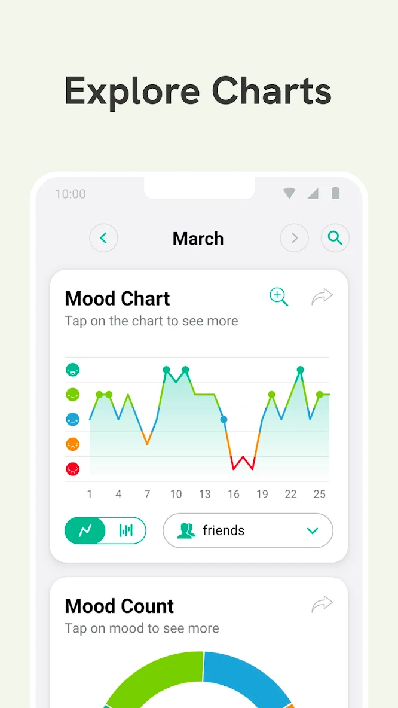
*play_landscape_16 — Mood Chart with the activity-filter pill, illustrating how the same chart re-renders for a single tracked activity (here: "friends" days only).*

*ios_09 — The premium "Influence on Mood" panel: causal-feel comparison with confidence indicator (3-bar signal-strength icon, labeled "Confidence: High") and adjacent-day spillover. This is the chart users screenshot.*

*mt_08 — Yearly view zooms the same Mood Chart out to 12 months. Note the per-month total under each bar in the locked Monthly Activity Count.*

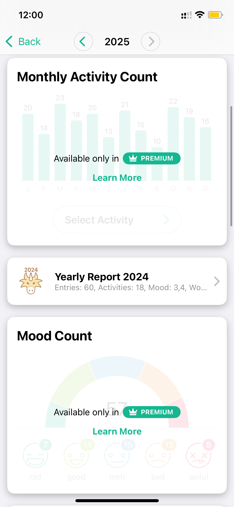
*mt_09 — "Yearly Report" card surfaces an annual recap (similar to Spotify Wrapped) entry point.*

*blog_yearly_stats — A power-user's 2019 stats showing 12 custom moods, by-weekday averages, and "Often Together" cross-tabulated with 9 co-occurring activities including "phone call", "cleaning", "shopping", "dieting". This is what "fully customized" Daylio looks like at the data layer.*

---

## Year in Pixels (signature retrospective)

*ios_06 — Year in Pixels. The single most-shared Daylio chart on social media. 365 dots, no labels needed, immediately legible. Empty days = no dot.*

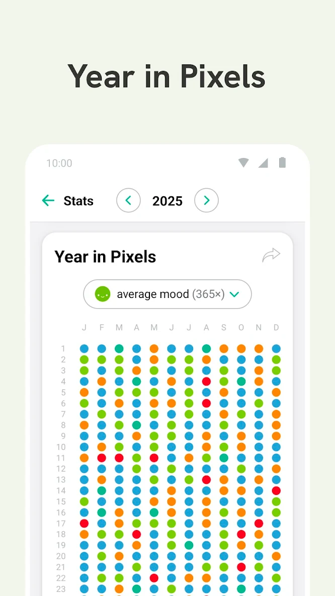
*play_landscape_06 — Android phone version of Year in Pixels. The dot-grid is identical across platforms (this is brand IP).*

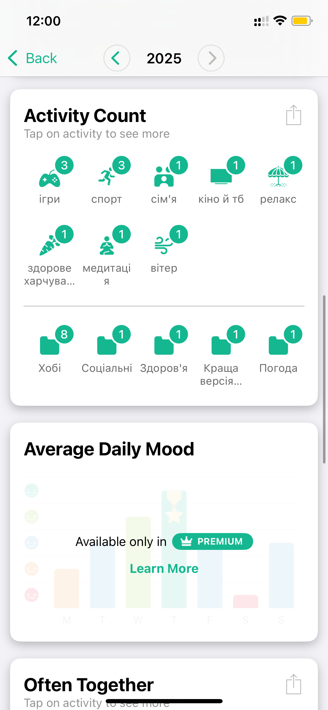
*mt_10 — Around Year in Pixels live other yearly retrospectives — the Yearly Report is its own annual story.*

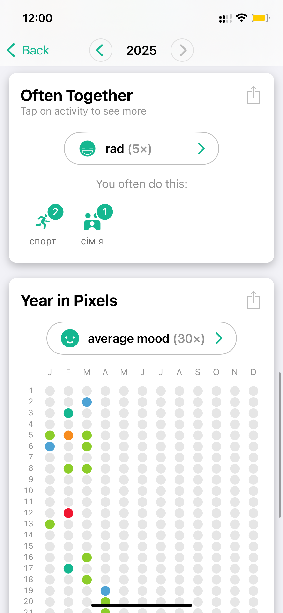
*mt_11 — More locked-yearly panels, illustrating Daylio's preview-as-paywall pattern.*

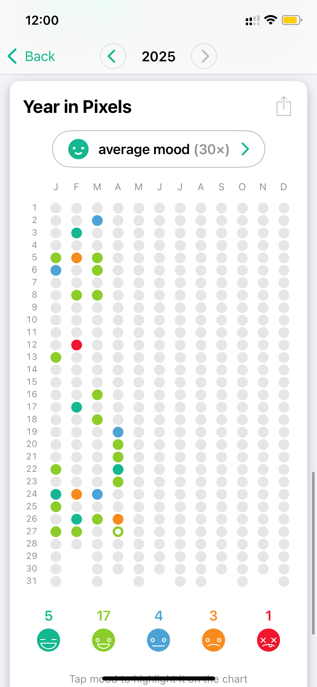
*mt_12 — Bottom of the yearly view. The whole yearly stack has free + premium interleaved.*

---

## Goals & Habits

*ios_10 — Goals are framed as "Challenges" with curated suggestion templates. The cartoon-illustration approach is also used in onboarding and is internally consistent across the surface.*

*play_landscape_14 — Compact phone layout of the same Challenges UI. Each challenge gets a 1:1 illustration matched to its tone (yoga, runner, sleeper).*

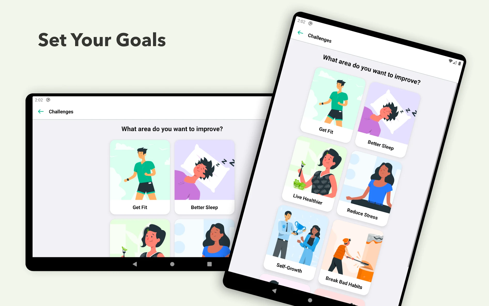
*play_landscape_08 — Tablet promo of Challenges. 7 prebuilt categories visible: Get Fit, Better Sleep, Live Healthier, Reduce Stress, Self-Growth, Break Bad Habits.*

*ap_09 — Goals lets the user create a goal directly from their existing activities. The activity icons are reused as goal "subjects" — no separate goal taxonomy.*

*ap_10 — Habit suggestions are pre-built atomic habits (BJ Fogg / atomic habits style). Each habit gets its own icon and a 2-up card grid.*

---

## Achievements & gamification

*blog_achievements — 15 unlocked achievements with star levels visible. Each badge is illustrated in a consistent rounded-cartoon style (mortarboard for "Apprentice", flame for streak, party popper for "What a Year", trophy ribbon for "Dedicated").*

*blog_secret_achievements — Daylio has a separate "Secret Achievements" tier with surprise unlocks. Discovering them creates an extra discovery loop on top of the visible badges.*

---

## Customization (moods, activities, icons)

*ob_04 — Even at first launch, mood emoji + color palette are first-class customization choices.*

*blog_moodactivities (re-shown for customization context) — Demonstrates what "unlimited moods" actually looks like in practice: bilingual mood names, custom activities like "memorable pictures" and "clean ref" (refrigerator).*

*mt_17 — The "More" tab. Notably "Edit Moods" and "Edit Activities" live at the bottom, with Reminders explicitly showing the current default time. Each menu item has its own colored square icon (consistent visual language).*

*ap_07 — Same "More" tab on Android. Cross-platform parity is high.*

---

## Privacy / PIN lock

*PIN screen on iOS. Privacy is sold as a feature: "Locked & Private."*

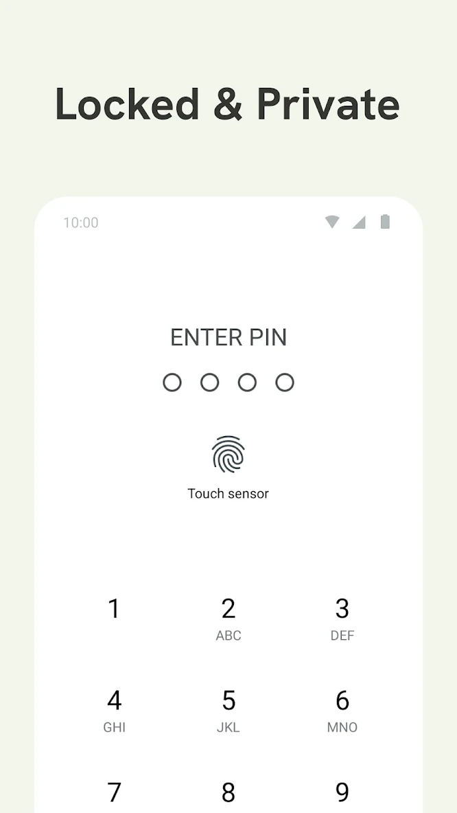
*play_landscape_01 — Android version adds biometric (Touch sensor / fingerprint). Same 4-dot PIN above.*

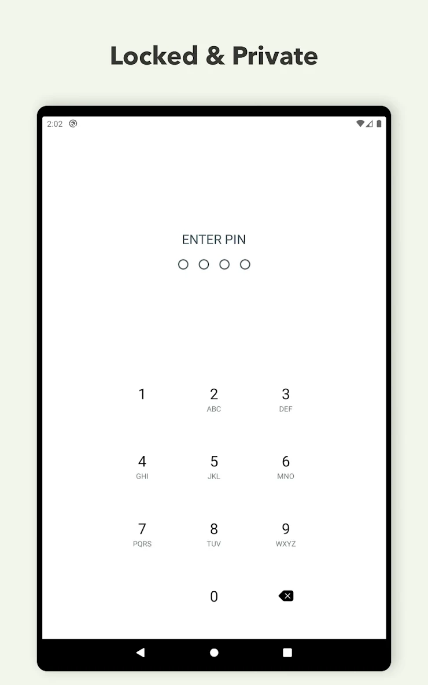
*play_landscape_13 — Tablet PIN.*

---

## Multiple entries per day & free-text notes

*ap_06 (re-shown) — Daylio explicitly supports multiple entries per day and surfaces the "Add a new entry" CTA prominently on the day-detail view.*

*ios_08 (re-shown) — On top of the icon entry, Daylio offers structured "Templates" (Gratitude / To-Do / Morning Reflection / Night Brain Dump / Worries / Instant Cheer-Up / Daily Routine). Each template seeds the note with a numbered scaffold.*

---

## Reminders

*ob_07 (re-shown) — Reminders are configured during onboarding and shown as a primary feature.*

*ob_08 (re-shown) — Permission is asked in context, AFTER the user has seen the reminder card — much higher consent rate than asking cold at launch.*

---

## Themes & dark mode

*Dark theme variant. Daylio's themes are not just dark/light — each theme is a full color palette + accent that applies to charts, calendar dots, navigation, etc.*

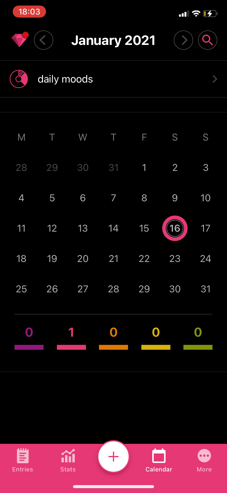
*The same theme propagated to the calendar — accent color, navigation, mood dots all re-color together.*

*Dark theme on the activity grid.*

---

## Premium paywall

![iOS-style Premium paywall sheet: "Start Free Trial — You are getting these awesome Premium Features", woman-with-confetti illustration, checkmark list (Unlimited Moods, 2000+ Icons, Infinite Reminders, Automatic Backups). "GET 4 MONTHS FOR FREE" red ribbon. Annual $23.99 ($1.99/mo, was $2.99) selected with red border, Monthly $2.99 in a flat secondary card. "Recurring billing. Cancel anytime." Terms of Use • Restore Purchases. Big green "Start Free Trial — Try 7 days, then $23.99 per year" CTA. SKIP link](images/daylio/adapty_paywall.webp)
*adapty_paywall — The full Daylio paywall (sourced from Adapty's paywall library). 4 feature checkmarks (Moods/Icons/Reminders/Backups) covers the entire premium pitch. Annual is the default selection with monthly anchored as the "bad deal".*

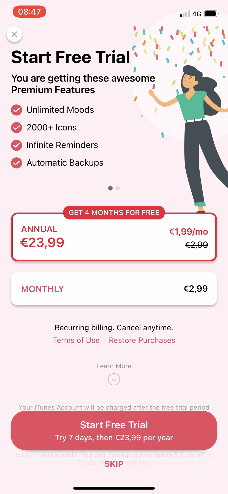
*ob_10 — Locale-aware paywall with EU pricing.*

---

## Inline premium nudges

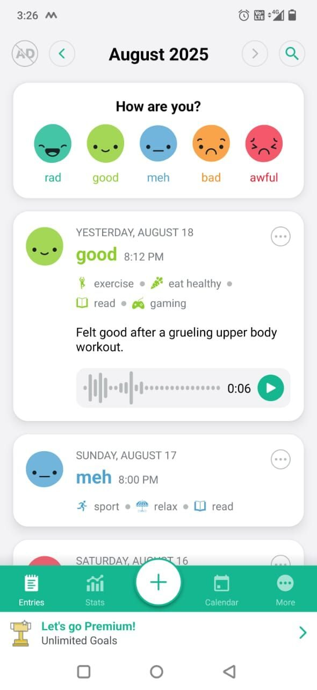
*ap_01 (re-shown) — Daylio uses a rotating slim upsell strip directly above the bottom nav: trophy + "Unlimited Goals" today, diamond + "Striking Color Themes" tomorrow, medal + "Automatic Backups" the next day. Always-present, low-friction.*

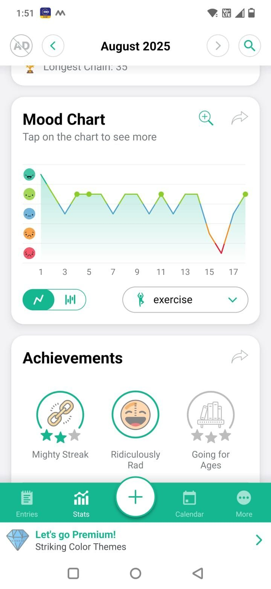
*ap_03 — Different upsell strip variant.*

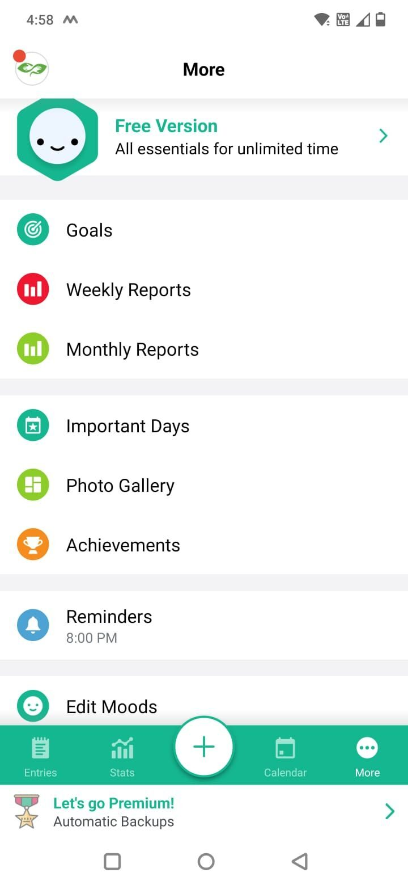
*ap_07 (re-shown) — Yet another upsell strip variant.*

---

## Cross-platform / tablet

*Tablet Entries feed.*

*Tablet Goals — the 2×3 grid of challenges scales to a 3×2 grid in landscape.*

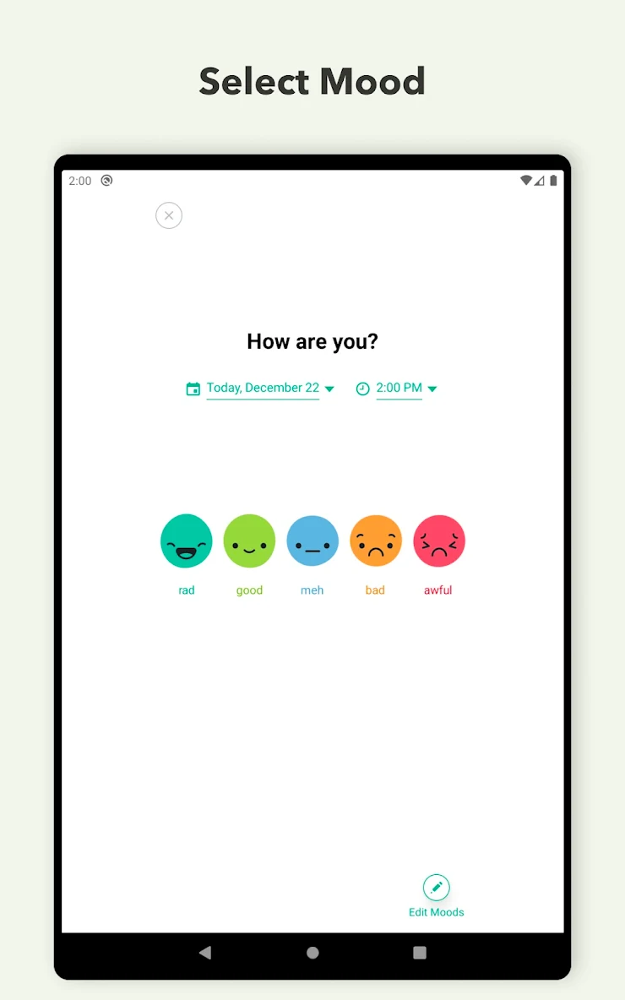
*Tablet mood picker.*

*Tablet activity grid showing a "Goals 1/1 — Exercise — 1-Day Streak" inline cell sandwiched between activities and the note field — goals integrated with capture.*

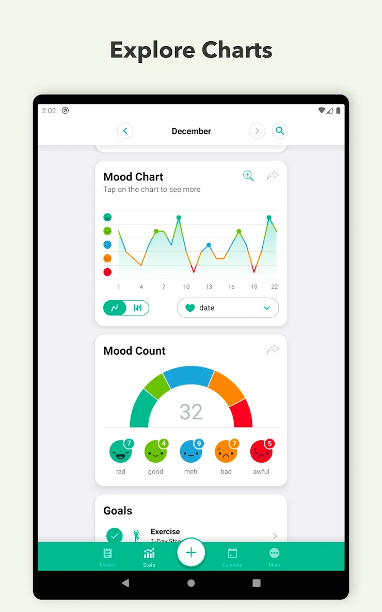
*Tablet Stats.*

---

## App Store creative gallery (older marketing screenshots)

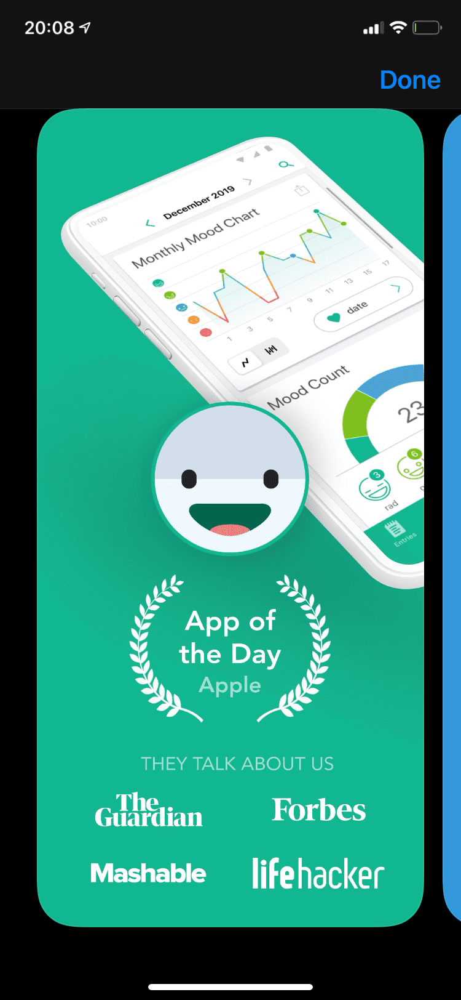
*ts_01 — Older App Store hero. The Daylio iconography (round mascot + line chart) has been visually consistent for years.*

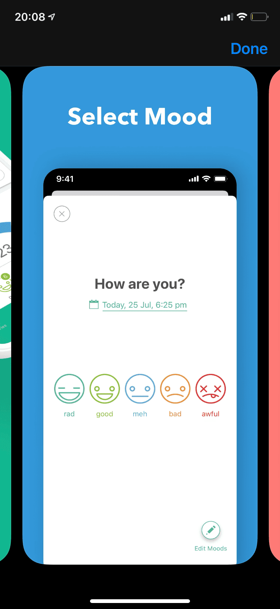
*ts_02 — Older statistics composition.*

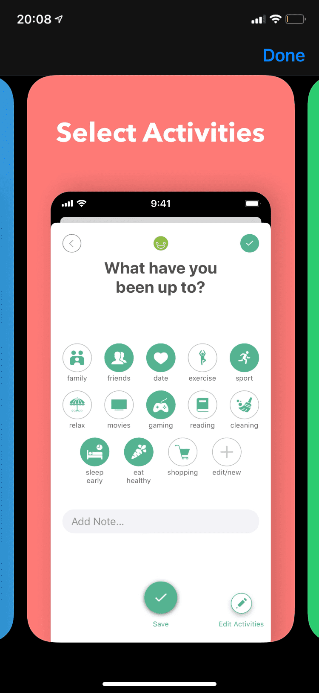
*ts_03 — Older yearly view.*

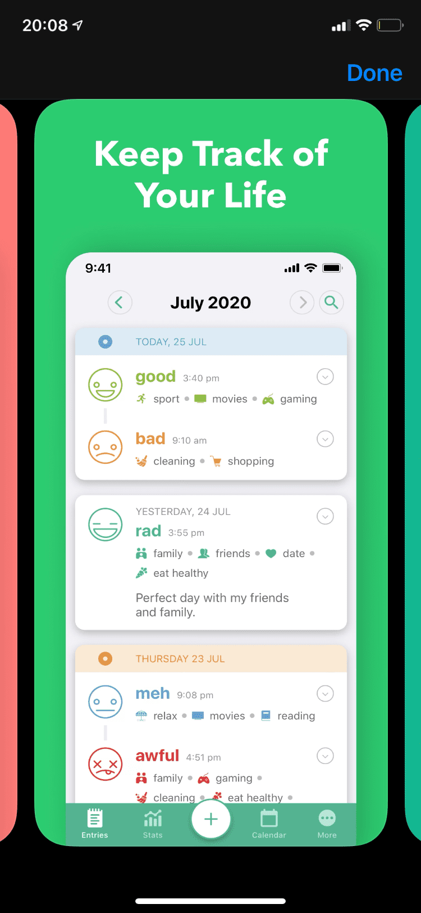
*ts_04 — Older entries teaser.*

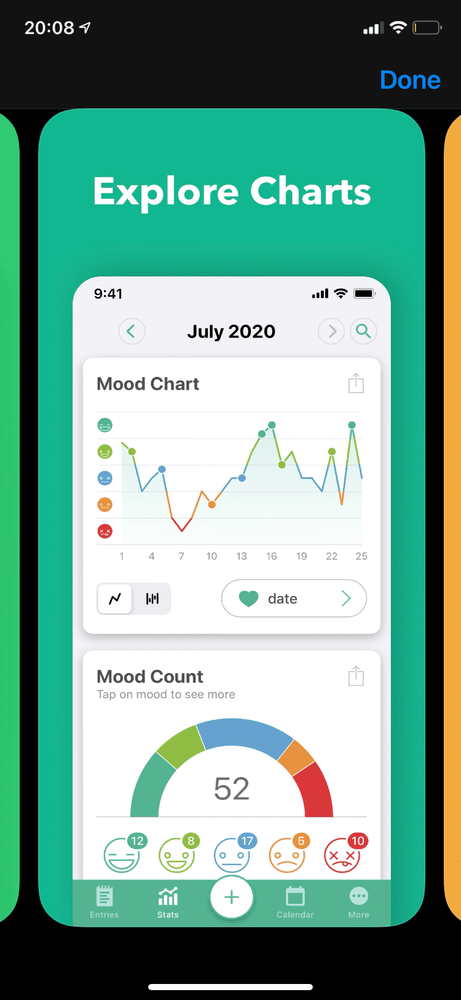
*ts_05 — Older activities teaser.*

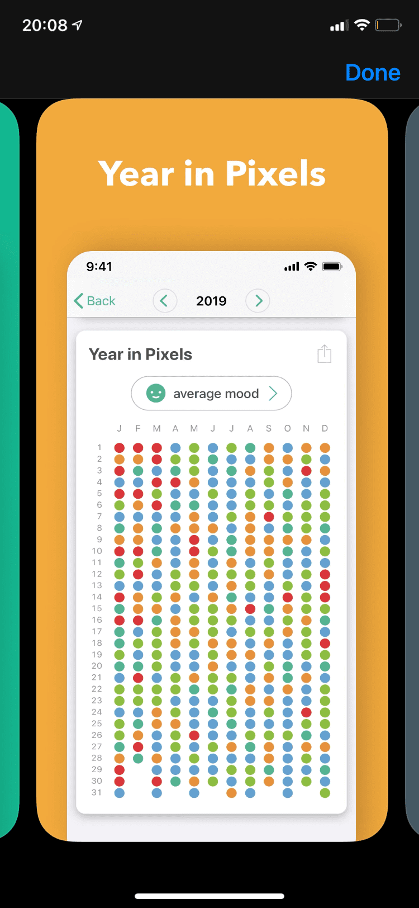
*ts_06 — Older mood-picker teaser.*


*ts_07 — Older calendar teaser.*


*ts_08 — Older PIN/Private teaser.*


*ts_09 — Older themes teaser.*


*ts_10 — Older goals teaser.*

---

## Loading / launch state


*mt_01 — Cold-start splash. Just the mascot, no Daylio wordmark or version chrome. Minimal launch impression.*

---

## Android Play Store hero shots

*play_landscape_02 — Google Play hero showing the templates/writing-prompts feature surrounded by the calendar tile grid + PIN screen. Floats both Templateland and the Mood Calendar around the lock screen as compositional anchors.*

*play_landscape_04 — Android phone PIN.*


*play_landscape_03 — Phone Stats.*

*play_landscape_07 — Phone activities.*

*play_landscape_10 — Phone entries.*


*play_landscape_12 — Phone stats variant.*


*play_landscape_17 — Phone mood picker.*

*play_landscape_19 — Tablet mood picker (alt aspect).*


*play_landscape_20 — Tablet mood picker.*

---

## Design language & takeaways

- **Icons replace text everywhere except the journal note.** Mood = 1 of 5 faces. Activity = an icon + a 1-word lowercase label. Note = optional. Stats Y-axis = mood emoji, not numbers. This is the single biggest reason daily compliance stays high: writing is offered, not required.
- **5 moods, not more, not fewer.** The default scale is locked at 5 (rad/good/meh/bad/awful) with the option to add custom emojis. The discrete scale removes calibration anxiety ("is today a 6 or a 7?") and makes the data trivially aggregatable into charts.
- **The brand mascot IS the product.** Daylio's calming-face mascot (the splash, the "free version" card, the apprentice achievement, the empty states) doubles as the neutral "meh" mood emoji. The product's avatar literally is one of its data points — a remarkable bit of identity compression.
- **Two-tap capture, but with depth.** Quick entry is genuinely 2 taps. But every screen offers a graceful upgrade: notes → templates → photos → audio. Power users get a full journaling app on top of the same fast loop.
- **Hyper-customization, but with strong defaults.** Day-one user gets sensible Social/Hobbies/Sleep/Food categories and a green theme; year-three user has 12 custom moods including Japanese kanji, 25+ custom activities, and a pink-on-black theme. Daylio doesn't force a journey — it scales with the user.
- **Statistics-forward retention.** Every other screen surfaces a chart or a streak. "Days in a Row," Mood Chart, Mood Count, Year in Pixels, Often Together, Influence on Mood, Yearly Report. Users open Daylio not just to log but to see the data they've already logged — a self-reinforcing dopamine loop.
- **Inline preview paywall, not a wall.** Premium-only charts render as faded ghosts INSIDE the free Stats tab with a "Learn More" link. The user always knows what they're missing and can preview the layout. Combined with always-on rotating "Let's go Premium!" strips above the nav, this is a high-conversion pattern without being abusive.
- **Year in Pixels is the social/marketing moat.** A single screen — 365 colored dots — has become a meme on Reddit/TikTok/Instagram. Daylio has effectively brand-owned an entire visualization pattern. Any competitor designing a mood-history screen has to consciously avoid it or knock it off.
- **Gamification without leaderboards.** Achievements + Secret Achievements + streak counters + per-month mood "scores" + per-activity trends. All private, all single-player. No social features, no sharing-by-default, no comparison anxiety — but plenty of internal "collect them all" loops.
- **Privacy is a feature, not a footer link.** PIN lock has its own onboarding screen, its own App Store screenshot, its own marketing language ("Locked & Private"). For a category where stigma is real, this is a UX win and a positioning win.
- **Friendly cartoon illustration as a tone-setter.** Goals/Challenges use full-figure cartoon characters (yoga, runner, sleeper, archer, red-flag woman) that humanize what could be a clinical mental-health tool. Same illustration set reused in onboarding and habit suggestions for consistency.
