# Duolingo — Visual Design Research

## Overview

Duolingo (com.duolingo) is the **canonical reference for habit-loop gamification** — and therefore the most directly relevant competitor for Tend. The app teaches 40+ languages (plus music, math and chess) to ~100M MAU using a stack of interlocking mechanics: daily streaks, weekly leagues, XP, an energy/hearts meter, a gem economy, achievement badges, a mascot-driven push-notification voice that has become a meme of its own, and a winding "lesson path" home screen that visualizes progress as a literal journey.

Almost every retention mechanic Tend is considering — daily ritual, streak protection, currency-driven mercy, social pressure, mascot-as-companion — has a Duolingo prior art. The job of this report is to give Tend the canonical implementations to remix, not copy. The witchy/pagan re-skin is the differentiator; the architecture is mostly already mapped.

Sources used heavily: `blog.duolingo.com` (Duolingo's own design case studies), `duolingo.deconstructoroffun.com` (deep mechanic teardowns with annotated screenshots), Bored Panda / Daily Dot meme corpora, paywallscreens.com (historical paywall snapshots), Wikipedia/Commons, and a handful of UX writeups.

All images referenced below are saved locally at `research/competitive-apps/images/duolingo/`.

---

## Onboarding

Duolingo's onboarding is widely cited as "fast time to value" — under 4 minutes to first lesson. It front-loads commitment with three lightweight choices: language, motivation/goal, and placement.

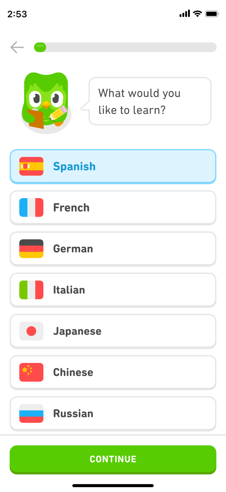
*Step 1: language picker. Duo greets the user and the entire screen is the choice — no nav, no settings, no copy bloat.*

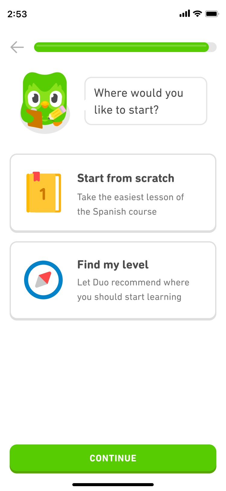
*Step 2: placement gate. Two big buttons, both feel like a win — beginners get to skip the test, returnees feel respected.*

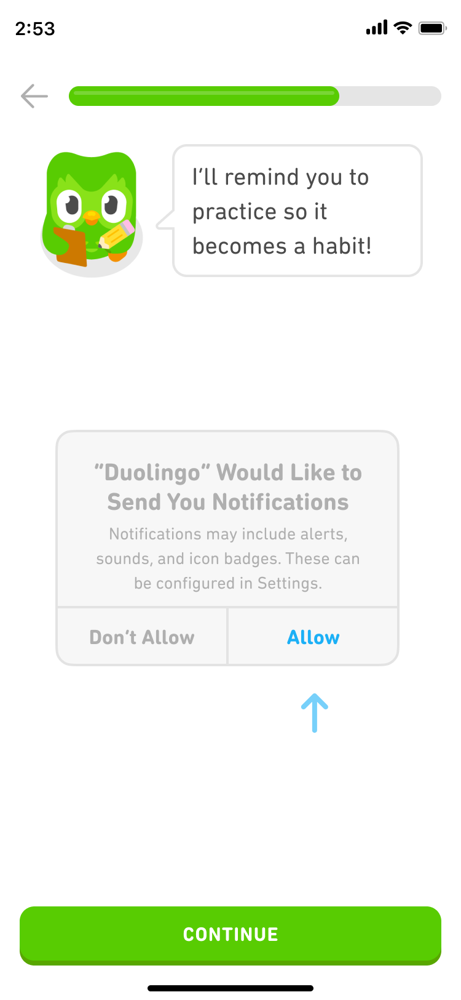
*Step 3: notification permission, but framed by Duo personally asking. Notice that the permission ask is delayed until after value is established, not on cold launch.*

*Onboarding terminates by committing the user to a streak goal and showing "Day 1" — they are now in the system before they've even thought about whether to be.*

**Takeaway for Tend:** mirror this three-step structure — patron choice, intention/goal, placement-of-self ("am I new to ritual practice?"). End onboarding with a literal "Day 1" of offerings already on the altar.

---

## Home / Lesson Path

The "winding green path" is Duolingo's most iconic UI. It replaced a tree layout in 2022 because the tree allowed users to wander (skip lessons, get lost). The path is **deliberately linear** to remove choice paralysis.

*Marketing visual for the path redesign — note the path is the hero, not the content.*

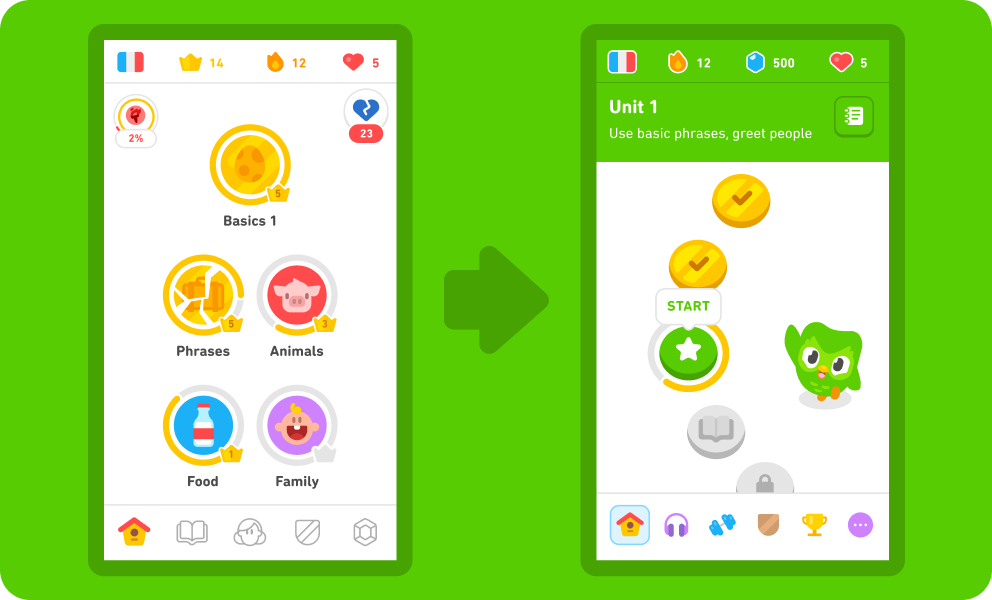
*Blog post comparison. Old tree (left) showed many parallel branches and lessons appeared "complete-once" — users plateaued. New path (right) bakes in spaced repetition by mandating the order.*

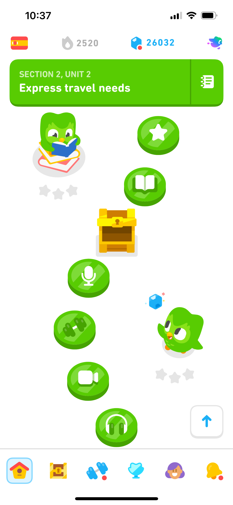
*Real iOS screenshot. Each unit is bracketed by a colored header card, lessons are pebble-like nodes, and characters (Lily, Junior, etc.) appear inline as scenery — the path feels like a side-scrolling level map.*

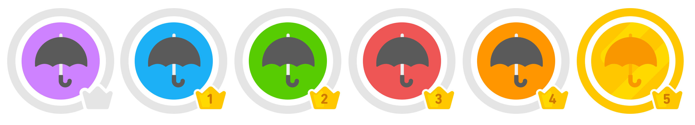
*Skill levels (Bronze → Silver → Gold rings around the node) layered onto the path — visible mastery state per node.*

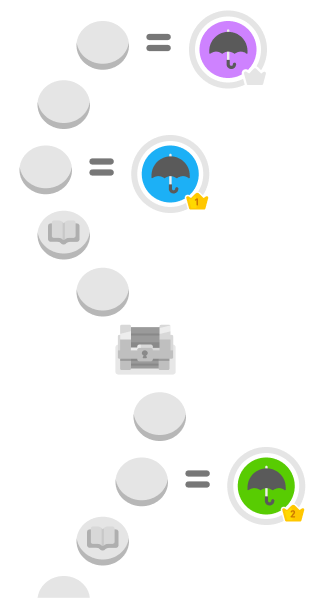
*Demonstrates that skill levels of varying difficulty are interleaved across the path — never a long block of easy or hard.*

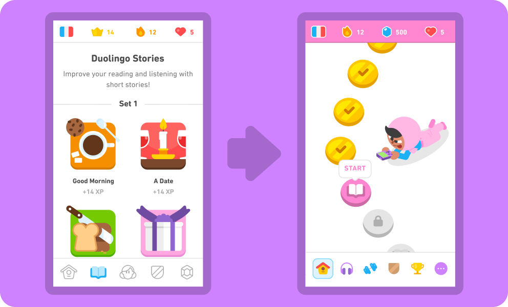
*Stories (interactive fiction) used to be a separate tab; the redesign folded them into the path as variant nodes. Every node feels like the same kind of "do this thing today."*

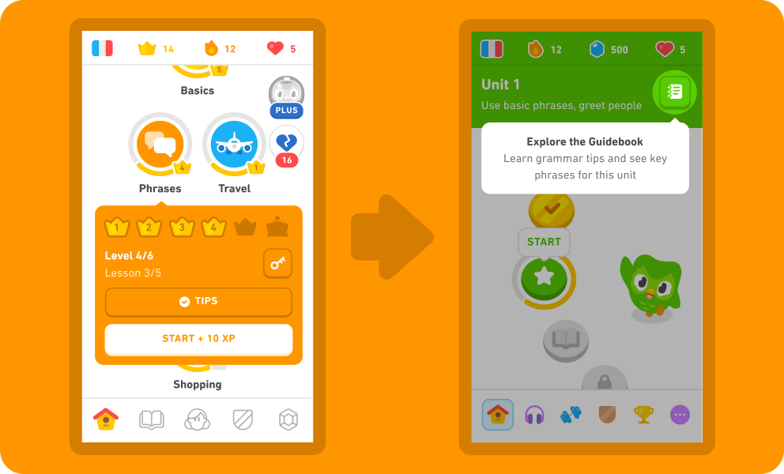
*Per-unit guidebook tucked into the upper-right of each section header — accessible but not in the way.*

**Takeaway for Tend:** the path is a **forced ordering** dressed as a journey. For Tend, the equivalent is a daily altar / shrine view where the current ritual is the only obvious action — past offerings recede backward, future offerings are dim. Don't give a "menu of habits to pick from." Show the one.

---

## Lesson Interface — Exercise Types

Duolingo varies exercise format constantly (translation, listening, speaking, matching, character bingo) so a 5-minute lesson never feels repetitive.

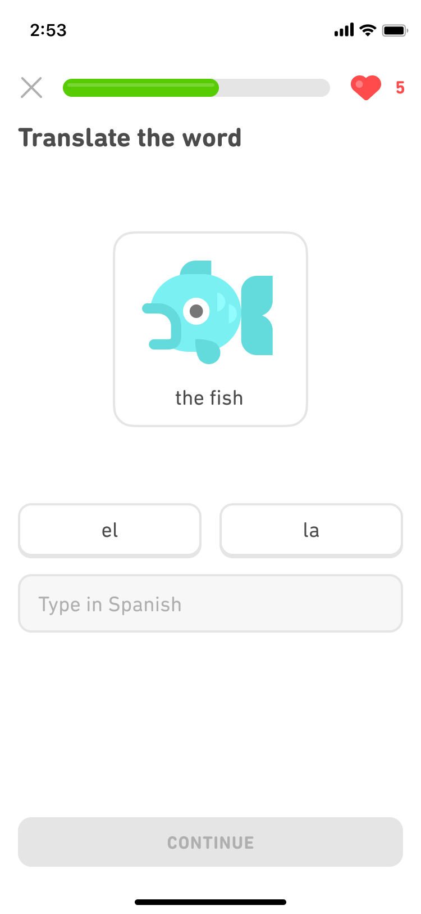
*Image + word-bank translation. The image carries the semantic load; tapping word tiles avoids typing.*

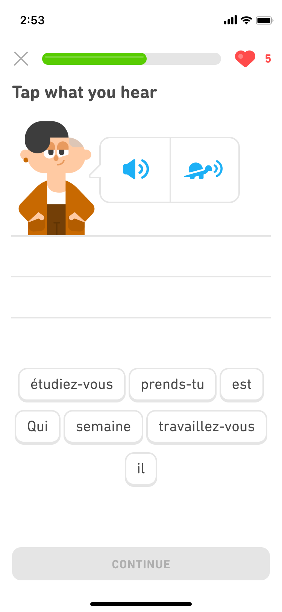
*Listening exercise. Big play button is the primary action; tiles below.*

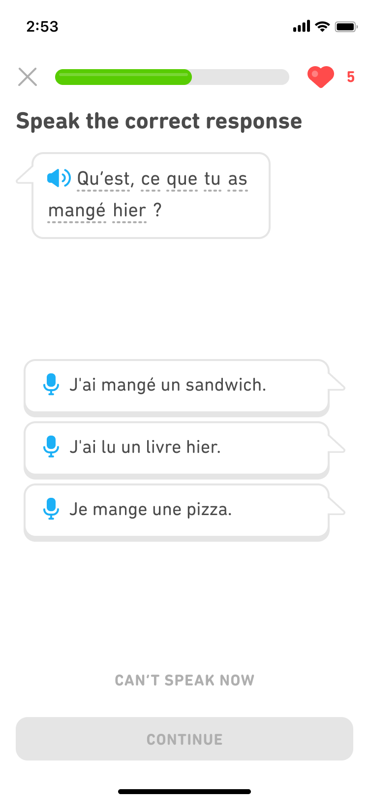
*Speaking exercise. Character avatar speaks a line; user picks the reply. The character art is doing emotional work — every screen has a face on it.*

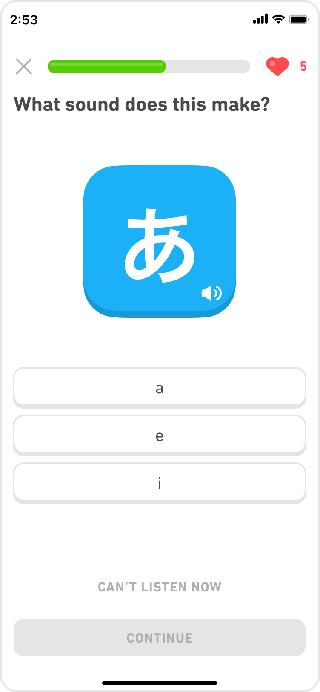
*Character-recognition exercise for scripts (Japanese kana). Tile-based, no text input.*

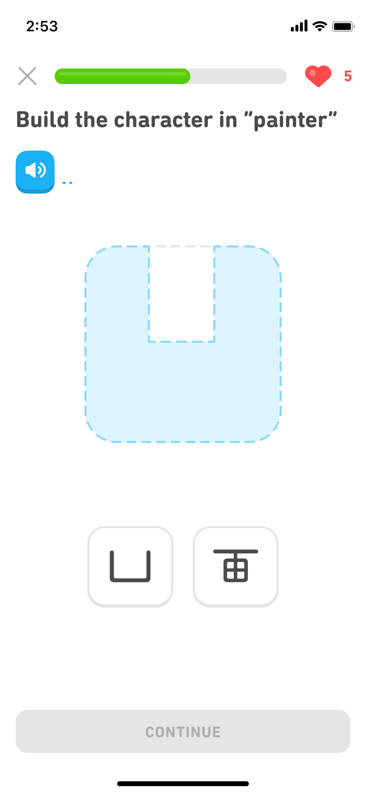
*Hangeul block-building. Drag-and-drop avoids language-specific keyboards.*

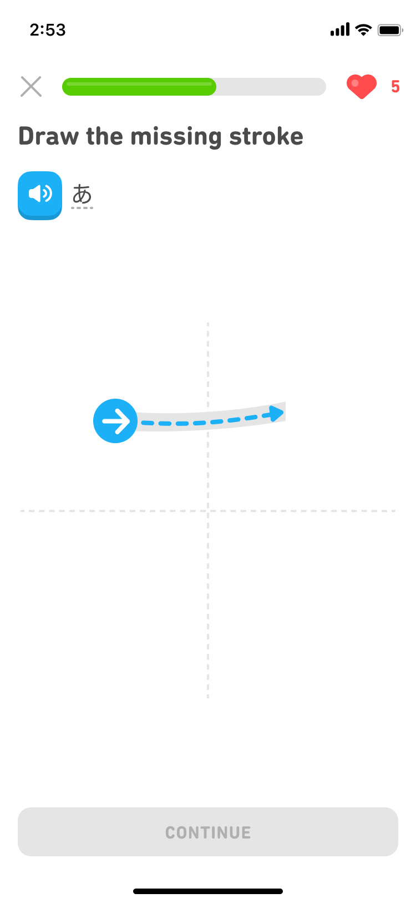
*Stroke-order tracing — gestural input.*

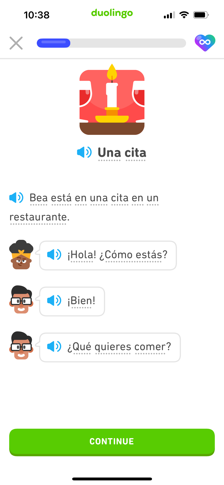
*Stories: interactive comic. Same word-bank UI, but wrapped in narrative panels.*

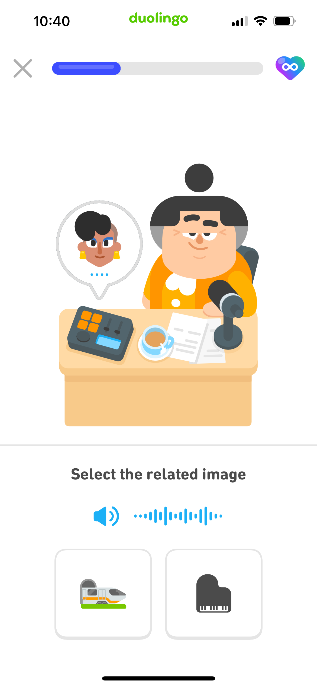
*DuoRadio: podcast-style listening segment. Notice that the bottom of the screen still uses the same tile-pick UI — Duolingo has one universal answer affordance.*

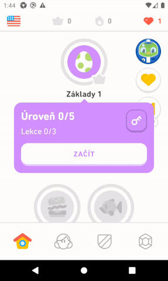
*Real lesson-open animation from Duolingo's internal Bird's Eye QA tool. Sounds + tile slide-in establish a sensory consistency every lesson.*

**Takeaway for Tend:** vary the **format** of "offering" so that the same daily intent (light a candle, recite a name, set an intention) doesn't ossify. Different exercise types map to different practices: tap-to-arrange (altar setup), pick-from-pool (intention-naming), trace-with-finger (sigil drawing), listen-and-respond (oracle question).

---

## Streak UI

The streak is the single most important Duolingo mechanic — it is what makes the app "load-bearing" in users' lives. Three visual states matter: the **counter**, the **calendar**, and the **milestone celebration**.

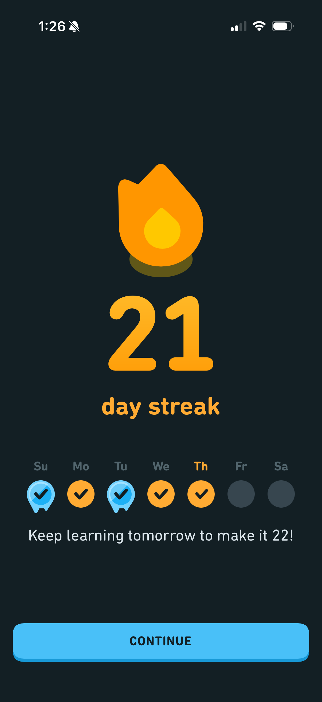
*Classic streak screen. The flame is huge and central. Below: a horizontal calendar bar where each day is a small flame icon; skipped days show a blue "freeze" icon. Users can scroll back through their entire history.*

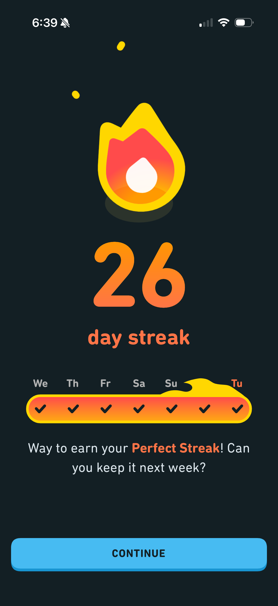
*Perfect Streak (no missed days, no freezes used): the flame gets a yellow halo and the calendar bar becomes continuous solid gold — a different visual class entirely, signaling elite status.*

*Daily ambient animation: the flame breathes, particles drift up. The streak screen itself rewards visiting.*

*The +1 moment. Streak count crashes into place, confetti, "amazing!" copy.*

### Milestone celebrations

Hitting 7, 30, 100, 365, etc. triggers a full-screen, animated, share-optimized celebration. Duolingo's design team published a long case study on iterating this.

*Custom-animated full-screen reveal at a milestone day. The number is the hero; everything else clears away.*

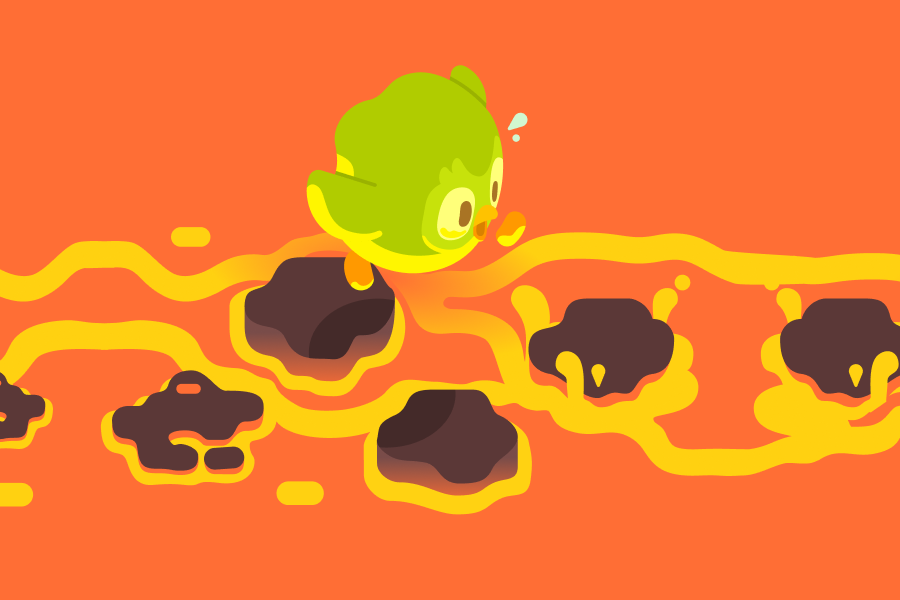
*Blog post cover: Duo skipping rocks across lava — the visual metaphor of "your streak is alive, the void is below."*

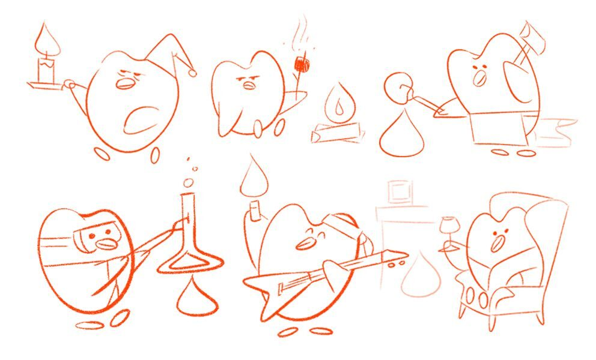
*Early concept exploration — Duo with candles, s'mores, beakers. Many ways to render "fire as accomplishment."*

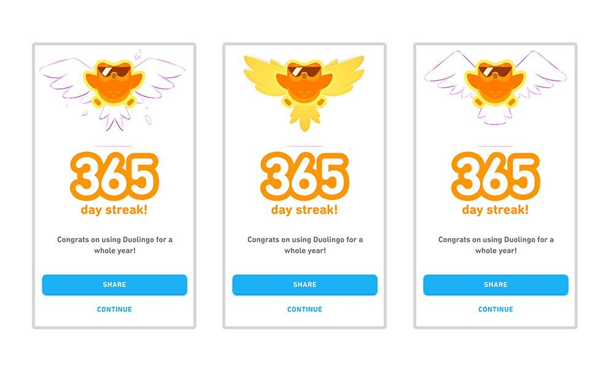
*Phoenix variations — Duolingo settled on phoenix imagery because it scaled emotionally with the milestone number.*

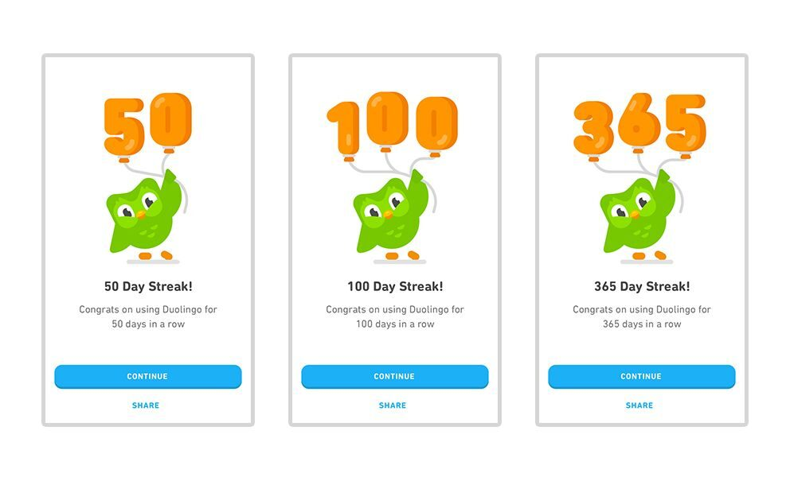
*The previous design used Duo holding numbered balloons. It was cute but didn't grow with the number. Replaced by phoenix.*

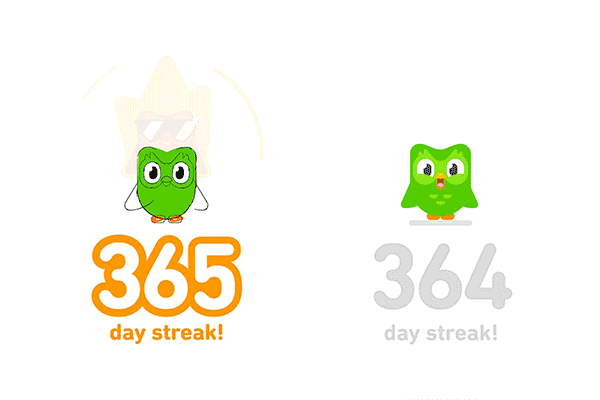
*Final animation. Duo flares up into a phoenix; the number burns into place.*

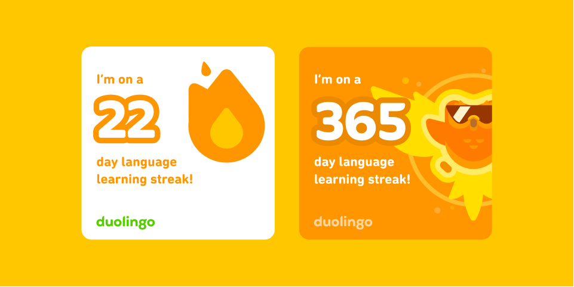
*Specifically composed for Twitter (16:9) and Instagram (1:1) crops. Result per Duolingo: "5–10x increase in organic sharing."*

### Calendar view

*(Same screenshot, focusing on the calendar bar) — each day is a tile, freezes show as blue snowflakes, missed days are gray.*

**Takeaway for Tend:** the streak counter needs a per-day calendar history (offerings made / skipped / saved-by-mercy), and milestones need a full-screen, share-card-optimized moment. For Tend's aesthetic, the phoenix metaphor maps directly to **patron favor / divine flame** — the longer the streak, the more elaborate the iconography (flickering candle → bonfire → blessed flame → eternal hearth).

---

## Streak Freeze & Mercy Mechanics

Streak Freeze is the most cited "mercy mechanic" in mobile retention design. It's a consumable that auto-protects you if you miss a day, costs 200 gems, and earlier capped at 2 (Streak Society members get +3).

The product insight: if users *never* lose their streak, the streak feels invincible. If they *always* lose it on a bad day, they quit. Freeze gives them the agency to feel they earned their continuity.

The matched feature is **Streak Repair** — a paid offer that appears after you've lost a streak, restoring it for gems or money. (Multiple Tend-relevant concepts: forgiveness vs. resurrection are different.)

**Takeaway for Tend:** this is the cleanest map to a witchy aesthetic in the whole report. A "Streak Freeze" reskins effortlessly to **Patron's Forgiveness / Devotion Token / Offering of Smoke**. Auto-consumed in the background, capped low to preserve scarcity, and *earnable* (not just buyable) at major milestones. The Repair flow becomes a **rite of return / pilgrimage** — a longer ritual a user can perform to bring back a lost streak, with cost in tokens or in extra offerings over multiple days.

---

## Friend Streaks

Launched in 2024, Friend Streaks let two users co-streak. Both must complete their daily lesson; if one misses, both lose the streak (unless protected). Duolingo reported users with at least one friend streak are 22% more likely to complete their daily lesson.

*Marketing visual. The handshake + shared flame is the visual primitive.*

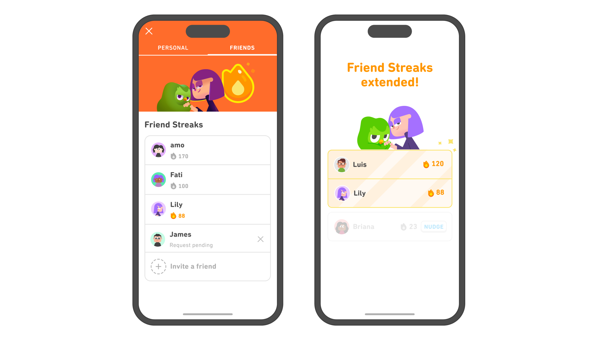
*The drawer UI: active shared streaks list with friend avatar + count, pending invites, "invite a friend" CTA. Two phones shown side-by-side to convey "two people, one streak."*

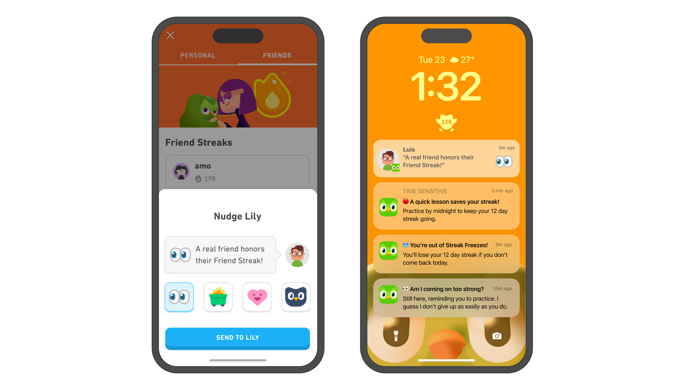
*Nudge feature: you can poke a friend who hasn't lessoned today. The notification copy is in-app-customizable.*

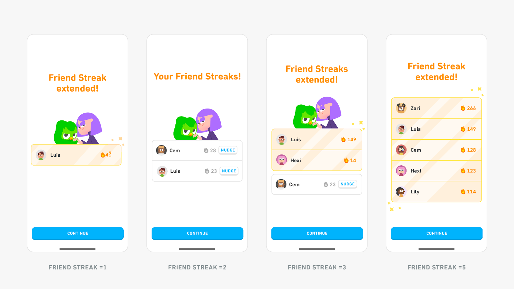
*Different visual states for 1, 2, 3, 4, and 5 simultaneous friend streaks — Duolingo caps at 5 partners.*

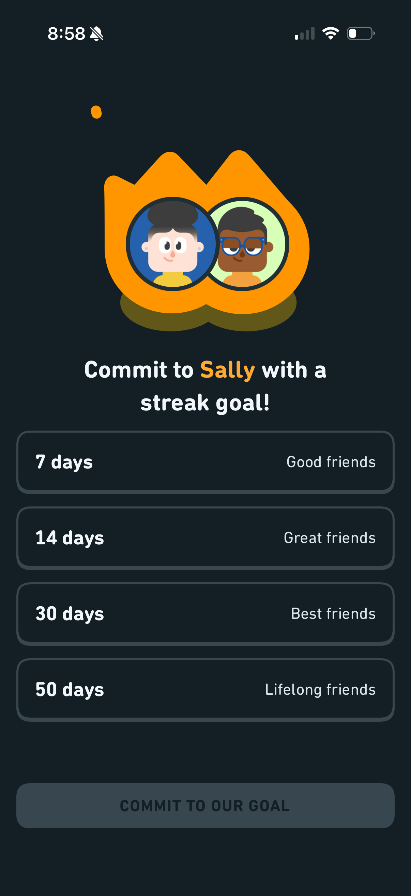
*The "are you sure?" moment that locks in a friend streak.*

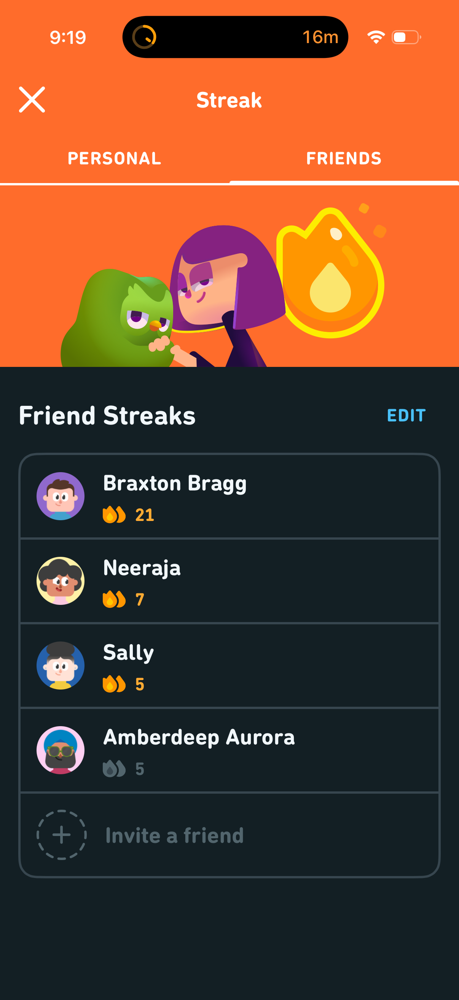
*Profile-style view of all your friend streaks at once. Each is its own little streak card with the partner's avatar and the count.*

*Adjacent feature: Friends Quest, where you and a partner co-earn XP toward a shared chest.*

*Brand illustration for friends features. Note: the characters are doing the emotional labor of "social pressure" so the UI doesn't have to be visibly aggressive.*

**Takeaway for Tend:** **coven streaks** are an obvious extension. Two or more practitioners tend a shared altar; if one fails the day, the shared flame dims unless the other compensates. Critically: shared streaks are *opt-in social pressure*, which Tend's witchy framing can mythologize ("bonded devotion," "sympathetic candles") in a way that secular Duolingo cannot.

---

## Leagues — Competition Without Friends

Leagues are Duolingo's masterstroke for users without social graphs. Each user is dropped into a leaderboard of ~30 random users. Top 7 promote, bottom 5 demote, middle 18 hold. 10 tiers: Bronze, Silver, Gold, Sapphire, Ruby, Emerald, Amethyst, Pearl, Obsidian, Diamond. The Diamond Tournament runs monthly for top finishers.

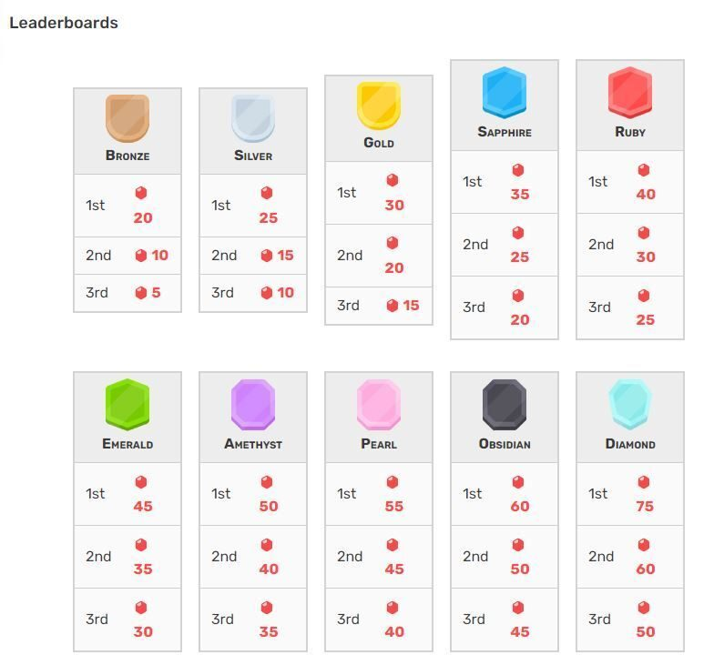
*The full ladder, lowest to highest: each league is a different gemstone with consistent geometric framing. Color progression goes warm-to-cool-to-precious.*

*Marketing visual: each league has its own iconography that becomes a status object users want to "wear."*

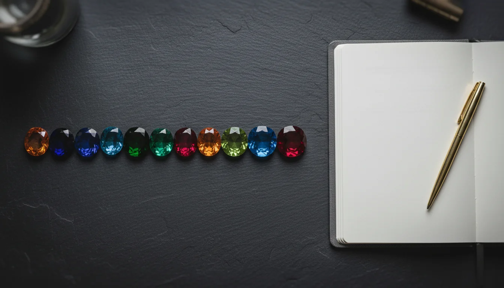
*Third-party render of all 10 tiers laid out together for clarity.*

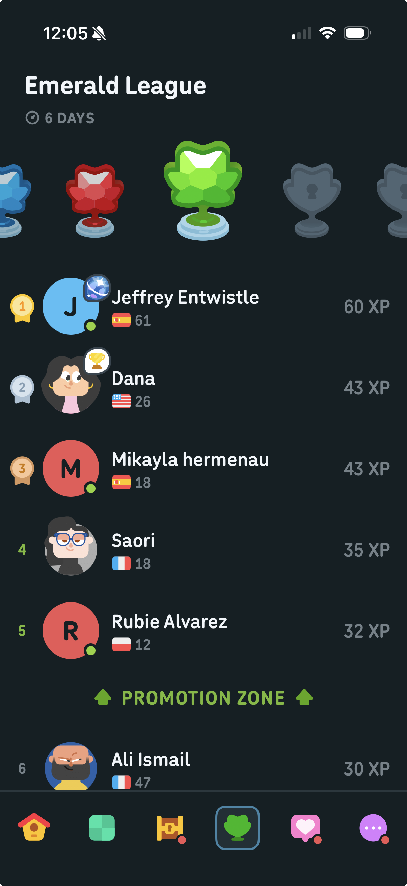
*Real iOS screenshot of a live league: ranked list of users by XP, with a clear dividing line between promotion zone (top 7), hold zone, and demotion zone (bottom 5).*

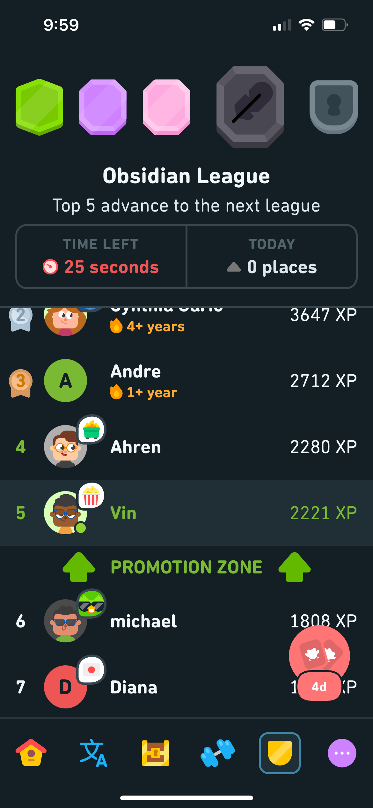
*Mid-week leaderboard: countdown to Sunday end-of-week is shown prominently. Time pressure is part of the feature.*

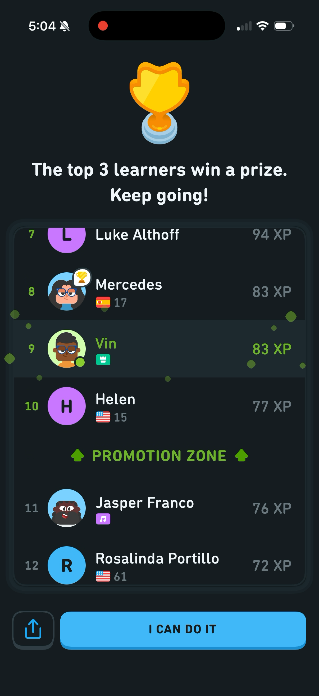
*Top-3 finishers get extra rewards (gems, chests). The banner makes that visible during the week to motivate the push.*

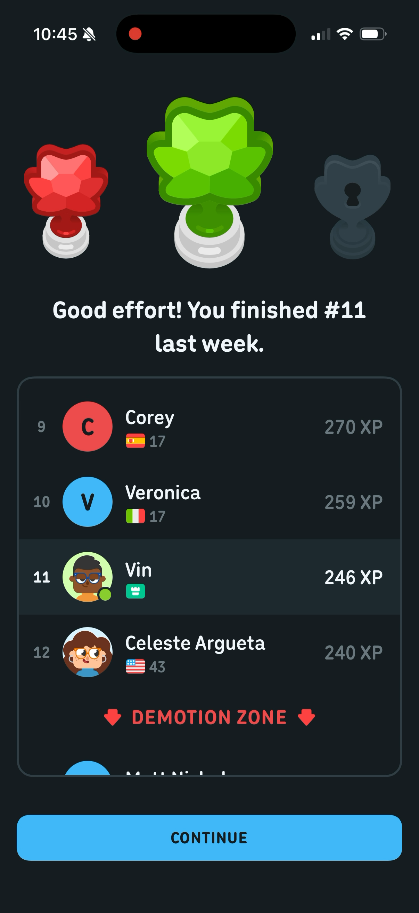
*Demotion result. The visual treatment is restrained — not shaming — but the message is clear.*

*Sunday-night reveal: animated trophy → new league badge appearing.*

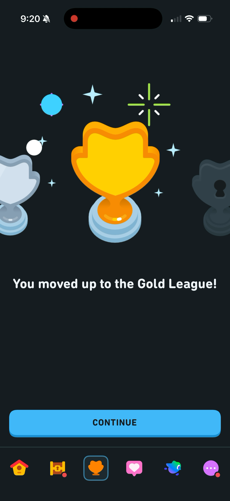
*Promotion screen with previous-tier and next-tier badges side by side.*

*Full-screen confetti version of the promotion celebration. Same emotional pattern as streak milestones — interrupt, celebrate, share.*

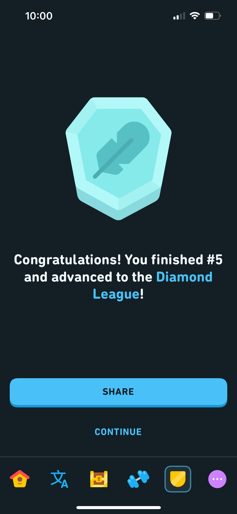
*Reaching Diamond is rare and gets a custom share-card design.*

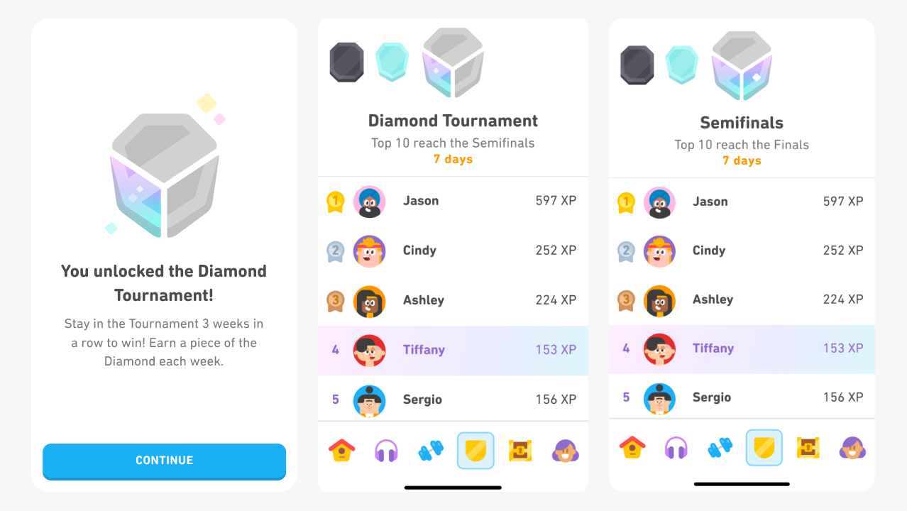
*The Diamond Tournament: monthly bracket for top Diamond finishers. Three screens shown — staged progression.*

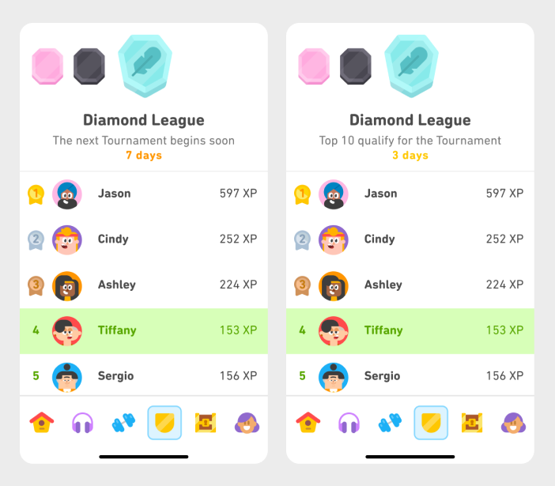
*Two states of the tournament card: upcoming (countdown + "get ready") vs. active (you're in, show the bracket).*

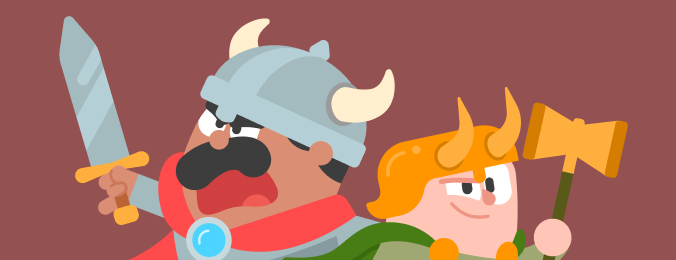
*Internal diagram from Duolingo blog: how 30-person cohorts are seeded, balanced by recent XP and timezone.*

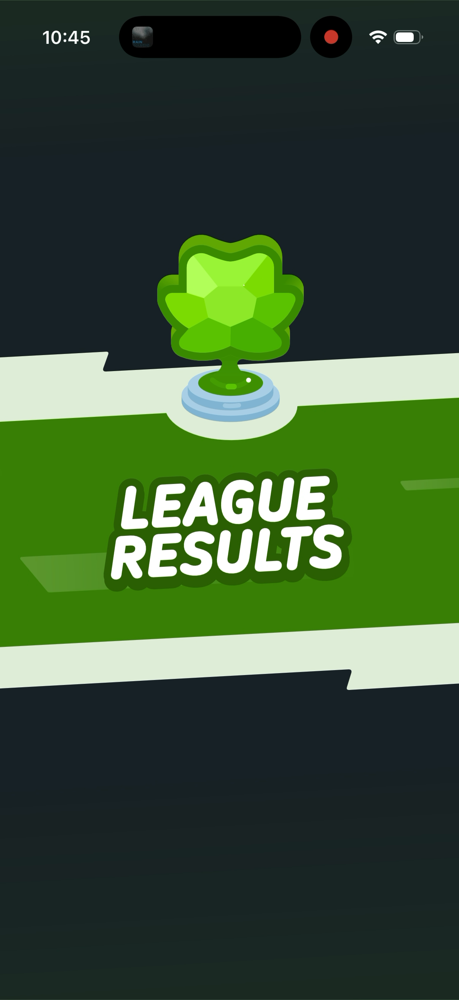
*The Monday morning reveal sequence's opening frame — trophy banner before the leaderboard animates in.*

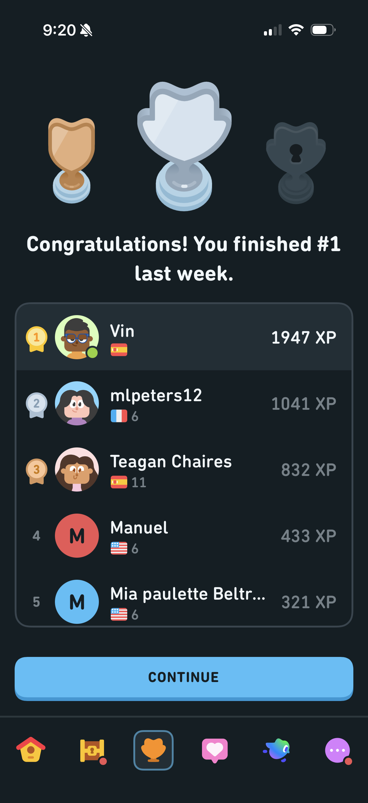
*First place results card. Personal stat (XP earned that week) is foregrounded over the ranking.*

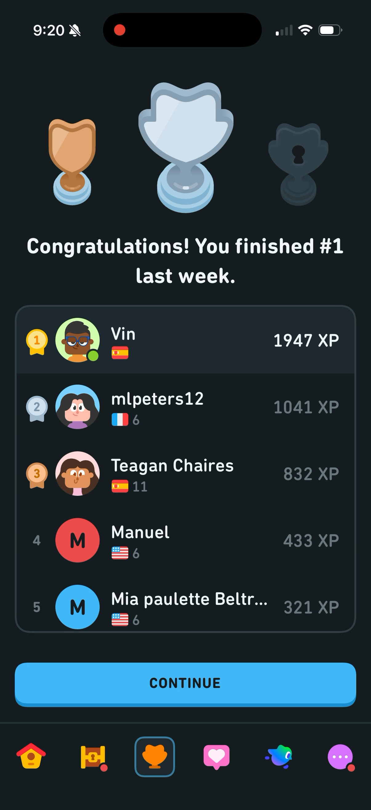
*Detailed final standings. Medal icons for top 3.*

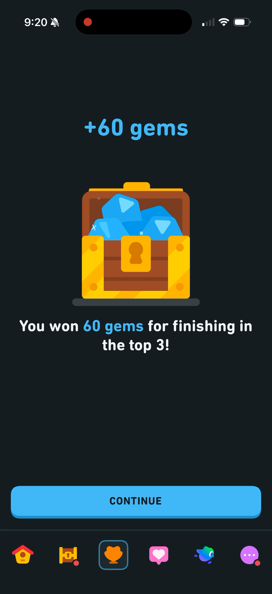
*Top-3 finishers get a treasure chest of gems. Loot-box visual language.*

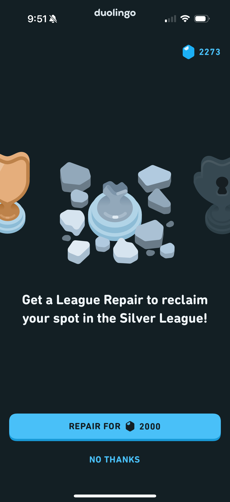
*A "buy your way out of demotion" offer that appears on Sunday night. Pure monetization moment, framed as mercy.*

*Wikipedia-hosted example of an actual leaderboard view from an older version.*

**Takeaway for Tend:** leagues are how Duolingo makes solo users feel watched. For Tend, a **Pantheon** or **Coven Circle** of ~30 anonymous patrons-in-common (everyone who chose Brigid this week, for example) competing for "favor" maps perfectly. Bronze→Diamond becomes **Acolyte → High Priestess** or a thematic tier ladder. The Diamond Tournament is the **Sabbat** — a monthly elite event.

---

## Energy / Hearts System (2025 transition)

Hearts (lose 1 per wrong answer, run out, gated by waiting/paying) ran for ~8 years and were universally hated by beginners. In July 2025 Duolingo replaced hearts with Energy: start with 25 units/day, decrement on actions, recharge by getting answers right and earning bonuses.

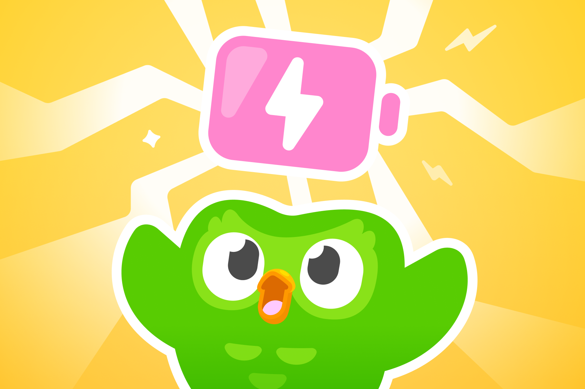
*Marketing visual for the energy switch. The pink battery is the new icon.*

Per the Duolingo blog rationale: hearts punished mistakes; energy rewards practice. Beginners were 2x more likely to run out of hearts mid-lesson. The new system: small wins (perfect lessons, adding a friend, opening reward chests) grant bonus energy. The Super/Max subscription tier still grants unlimited energy.

**Takeaway for Tend:** Tend should **skip the hearts trap entirely**. Heart-style punishment for ritual mistakes is anti-thetical to a devotional practice anyway. If Tend needs an exhaustible resource, model it as something positive — **focus**, **lunar phase**, **devotional capacity** — that depletes through *action* (not error) and replenishes through *consistency*. Don't punish the lapsed; gate the over-eager.

---

## Gems & Currency Economy

Duolingo's free currency is **gems** (blue diamonds), earned through lessons, chests, league finishes, daily quests. Spent on: Streak Freeze (200), Legendary Challenges (100), Timer Boost (450), bonus XP, double-or-nothing wagers, and lesson skips. Gems are also purchasable with real money — the secondary, more elastic monetization beneath subscriptions.

The previous currency was **lingots** (red crystals), converted to gems in 2017 at a 1:1 ratio. The Duolingo gem icon is omnipresent — top-of-screen counter next to the streak counter — and tapping it opens the **Shop**.

The Shop has three classes of items: **streak protectors**, **time/difficulty modifiers**, and **chest contents**. The shop UI is a grid of large iconic cards, each with gem-cost in the corner.

**Takeaway for Tend:** a single soft currency (e.g., **embers**, **moonlight**, **devotion**) is sufficient. Earned by completing daily offerings, spent on mercy mechanics (Streak Freeze analog), cosmetic altar items, or seasonal/themed rituals. Don't introduce a second currency until there's a real economic reason — Duolingo's lingots→gems migration was painful and many fans still resent it.

---

## XP and Combo Animations

XP is the per-action score (10 XP per lesson, 14 with Super, more with combos and Happy Hour boosts). XP is what feeds league standings. The user sees XP after every lesson on a giant celebration screen with confetti.

The streak-increment animation (`streak-post-lesson.gif` above) is also the XP-earned animation — one celebration moment, multiple state changes packed in. This is a deliberate consolidation pattern: don't show user one screen for XP, one for streak, one for league progress — fold all three updates into one animated reveal at end-of-lesson.

**Takeaway for Tend:** consolidate all daily-completion celebrations into **one ritual close screen** — offerings logged, streak ticked, patron favor gained, embers earned, all in a single sequenced animation.

---

## Achievements Grid

Achievements are organized into **Awards** (badges with multiple tiers — Wildfire, Scholar, Sharpshooter, Champion, etc.) and **Personal Records** (longest streak, highest XP day, best league finish). Earned badges are gold-toned; unearned show progress toward the requirement.

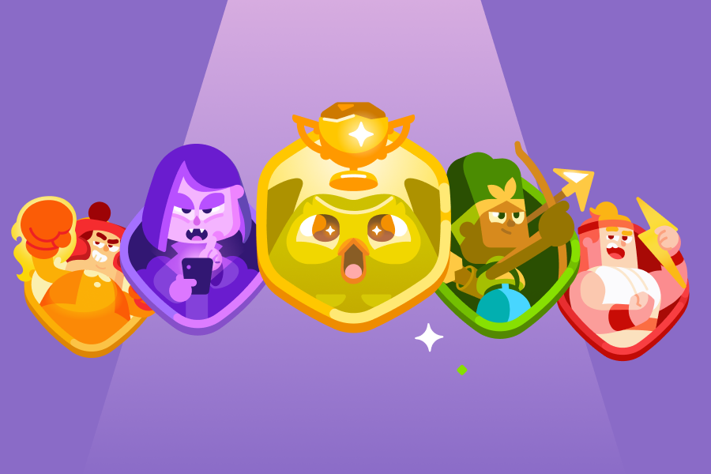
*The new badge designs integrate characters: Duo with a crown for Regal, Bea with bow & arrow for Sharpshooter, etc. Each badge is now its own little portrait.*

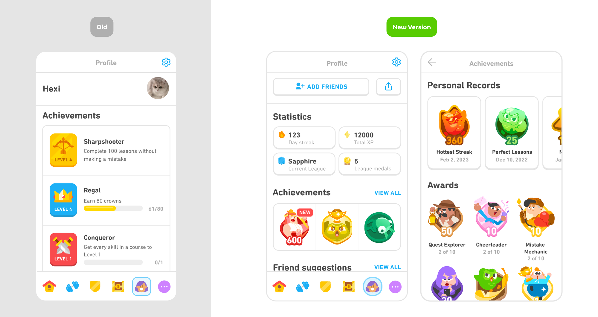
*Comparison: old badges were generic icons; new badges have story.*


*Personal-best tiles. Each is a small dashboard widget on the profile.*

**Takeaway for Tend:** achievements/awards in Tend should be **character-illustrated** (each patron deity gets their own series of awards rendered with that deity's iconography), not generic badge shapes. This locks the achievement system into the brand world rather than feeling bolted on.

---

## Duo / Character Cast

Duo is one mascot in a cast — Lily (purple goth teen), Junior (kid), Bea (Black athletic woman), Zari (hijabi friendly), Eddy (jock), Oscar (bookish), Lucy, Vikram, Falstaff. Each appears throughout the app — in exercises, on streak screens, in stories, in notifications — providing variety without breaking the brand.


*Branded illustration of the full cast.*

*Visual primitive: stylistic consistency (same head/body proportions, same outline weight) across very different demographics.*


*Designer explainer GIF: Duo (owl) and human characters built from the same shape vocabulary so they always feel like one world.*


*Early concept art.*


*Range of styles considered before settling on the current chunky flat style.*


*Lesson exercise: a character cheers when the user gets the answer right. Each character cheers differently.*

*Mid-lesson "you're doing great" cutaway. Two seconds of motion; users report they actively wait for it.*

*Stories-style animation where two characters interact — the language being learned is the *content* of the scene, not just a stat.*


*Clean vector of Duo.*

*Duo's notification avatar — used in push notifications from "Duo" specifically.*

*Lily's notification avatar — different characters now send different notifications, so the user sees a small avatar variety in their notification tray.*

**Takeaway for Tend:** each patron deity in Tend is a **named character with portrait, voice, and animated state** — not just a label. Brigid says different things from Hecate. The user picking a patron is picking a personality, not just a theme.

---

## Notification Copy — Duo's Voice (The Brand's Secret Weapon)

This is the section that gets disproportionate attention online. Duolingo's push notifications are written in a single, instantly recognizable voice: **mildly threatening, deeply guilt-inducing, weirdly affectionate, often self-aware**. Users have been turning these into memes since 2018; Duolingo's social team officially leaned in around 2020.

### Categories of notification copy (per Duolingo's own segmentation):

- **Continuity hooks**: "You're SO close to a 75 day streak"; Lily: "It would be a bummer to lose that 36 day streak"
- **Competition hooks**: "You're out of the top 5 😢"; "Last chance to get promoted!"
- **Completion hooks**: "You're falling behind! Do a Greek lesson today to get back on track for your monthly badge"
- **Reward hooks**: "Duo's got a prize for you" (bronze tier achievement available)
- **Save notifications**: "Last chance! Your 36 day streak ends in 10 minutes"
- **Guilt apex**: "Hi, this is Duo. These reminders don't seem to be working. We're going to stop sending them for now"
- **Affectionate weirdness**: "Hi! I miss you."; "Hi, it's Duo. 👋🏼 Reminding you to practice Greek. Got 3 minutes now?"
- **Self-aware meta**: "Duo says you're ignoring him 😔 We'll stop these reminders, but please come back soon!"

### Meme corpus — Duo as folk character

These show how users have re-interpreted Duo's voice, which Duolingo then re-incorporated into their official voice (a closed loop with their audience).


*Daily Dot's framing of "Duolingo logo on a phone" — the cultural artifact rather than the app.*

*Parody account format: declarative threat as one-liner.*

*User screenshots the actual notification alongside a fabricated threat from a different app. The format implies the two are continuous.*


*Duolingo's own response to the meme — meta-leaning-in.*


*Escalation meme.*


*Pop culture template + Duo.*


*Sad/concerned Duo in flames.*

*Screenshot of in-app sass during a translation exercise — Duolingo's voice extends into the lesson UI, not just notifications.*


*Vulnerability + threat in the same sentence.*


*Flirtation as a notification register.*


*Lesson content itself becomes the meme — the absurdity of translation prompts.*


*Self-referential, narcissistic Duo.*


*Body-horror register applied to language learning.*


*The mascot crosses into the real world.*

*Survival-horror framing.*

*Existential dread visual template.*


*One of the longer-format meme posts.*

*Sincere counterpoint — also part of the brand's range.*


*Single high-resolution version of an "aggressive Duo" meme.*


*Bored Panda compilation entry.*


*Owl materializing in a doorway.*


*Notification + retaliation joke.*


*"Coming soon" with Duo silhouette.*


*Begging-for-life template.*


*Spanish time confrontation.*


*"Why is the owl in my house" panel.*


*"I'M coming for you."*

*"Oops, that's not correct. I die."*


*Sleep paralysis / Duo at bedside.*


*Tweet screenshot — escalation.*


*Notification + family member kidnapped.*


*Duo in a tactical vest.*

*"This is your last warning."*


*Tweet — Duo as a stalker.*


*Notification format meta-joke.*

*Long meme post — multiple Duo states.*


*The "I will find you" template.*


*Twitter exchange screenshot.*


*"You haven't logged in for 1 day."*


*Compilation meme — Duo's many faces.*


*Multi-panel meme.*


*Phone screenshot with absurdist caption.*


*Late-night notification timing joke.*


*Duo at the window.*

*Voicemail-style threat format.*


*Final Bored Panda entry.*

*The image that anchors the "evil Duolingo owl" entry on KnowYourMeme.*


*SEO header for the most-searched question about Duo.*

**Takeaway for Tend:** the notification voice is half of Duolingo's brand and it cost them nothing to develop — it emerged from leaning into a tone users already projected onto the mascot. For Tend, this is **the single most important strategic asset to deliberately design**.

Tend's patron deities should each have a distinct push notification register:
- **Brigid** (hearth/forge) — warm, maternal, mildly disappointed: "Your candle's gone out, dear. Just a few sparks tonight?"
- **Hecate** (crossroads/night) — cryptic, knowing, slightly ominous: "The crossroads remember you, even if you don't return."
- **Loki** (trickster) — sarcastic, daring: "Skipped your offering, did you? Bold. I respect it."
- **Aphrodite** — flirty, pouting: "You promised me roses three days ago."

Each patron's voice gives the user a *companion personality* the way Duo does, but with explicit theological color. The "guilt-trip" format Duolingo invented translates almost 1:1 — "the patron is *disappointed*, not angry" is identical to "Duo is *sad*, not angry." The witchy frame actually justifies the emotional intimacy better than secular Duolingo can.

---

## Paywall — Super Duolingo & Duolingo Max

Super Duolingo (~$83.99/yr) and Duolingo Max (~$167.99/yr, includes AI conversation features) are the subscription tiers. The paywall has iterated steadily — paywallscreens.com archives several snapshots.

*Earliest version: classic comparison-table layout.*


*Long-scroll style: features stacked vertically with checkmarks, Duo at top, multi-tier selection (Family / Yearly / Monthly) at bottom.*

*Mid-2025 iteration. Two-tier focus.*

*Sept 2025 version.*

*December 2025 — likely the Max-promotion era.*

*Current (March 2026) version.*

Patterns visible across the iterations:
- Hero illustration of Duo at the top (always)
- Feature checklist with checkmark icons
- Price tiers stacked vertically, default selected = annual (cheaper per-month)
- "Try free for 14 days" CTA
- Cancel-anytime line beneath

**Takeaway for Tend:** keep paywall structure identical to platform conventions (hero, features, pricing tiers, free trial) — but replace the marketing illustration with the chosen *patron deity* greeting the user. The pitch is "deepen your devotion" not "unlock more lessons."

---

## Profile / Stats / Heatmap

The Profile tab shows: avatar, name, join date, languages studied, friends, achievements grid, personal records, and a longest-streak counter.


*Real iOS screenshot — name, join date, languages studied, scrollable list of settings sections beneath.*


*Practice and sound preferences.*


*Notification timing settings — but note that the user is choosing *when* to be reminded, not *whether*. The opt-out for reminders is buried; the opt-in for additional reminder times is foregrounded.*

**Takeaway for Tend:** the Profile should be the **devotional record** — a place where users see their lifetime offerings to each patron, their longest devotional streak, their tier in the Pantheon, and the awards their patron has bestowed. Make the profile feel like an altar / book of shadows, not a settings screen.

---

## Seasonal Events / Limited Content

Duolingo runs an **Owloween** campaign (Halloween user-generated costume content with #Owloween), Friends Quest events with themed chests, seasonal app-icon changes, and time-boxed XP Happy Hour events ("Earn an additional 5 XP on every lesson until 8:00pm").

The pattern: short windows of altered economy or themed visuals, often tied to a sharing hashtag or a partner brand. Duolingo doesn't run full reskins of the app — they layer themed elements on top of the stable base.

**Takeaway for Tend:** **lunar cycle**, **wheel-of-the-year sabbats** (Imbolc, Beltane, Lughnasadh, Samhain, Yule, Ostara, Litha, Mabon), and **moon phases** are *built-in seasonal events* the app can lean on without inventing a marketing calendar from scratch. Each sabbat is a 24–72hr themed economy boost (double embers, exclusive offerings, themed altar decorations).

---

## Design language & takeaways for Tend

1. **Layered motivation is non-negotiable.** Streak + League + Friend Streak + Achievements + XP + Gems = at least 6 independent reasons to open the app on any given day. Pick any one of those reasons to fail and the others carry the user. Tend should plan for **at least four motivational layers** — streak, patron favor (XP analog), coven streaks, and pantheon ranking — and assume any single one will not be enough for any individual user.

2. **Loss aversion is the engine.** The streak doesn't motivate by promising future reward; it motivates by threatening past investment. Visualize the user's cumulative practice (calendar bar, day-by-day history, total offerings made) so that breaking it has weight. The number should feel hard-won and the loss should feel personal.

3. **Mercy mechanics buy trust.** Streak Freeze is the most replicated mechanic in retention design because it converts a punishing system into a forgiving one without weakening the punishment. For Tend: **Patron's Forgiveness** as a consumable, capped low, earnable through devotion, occasionally giftable from coven members. Auto-consume in the background so the user wakes up to "Brigid covered for you last night" rather than "you broke your streak."

4. **League-style competition without friends.** Anonymous cohort leaderboards are Duolingo's killer engagement feature for socially-disconnected users. Tend's **Pantheon Circle** (~30 anonymous devotees of the same patron) competing weekly for favor maps perfectly. Top 7 ascend, bottom 5 demote, 10-tier ladder, monthly Sabbat tournament. **This is the single highest-leverage import for Tend.**

5. **The mascot is half the brand.** Duo became a meme because his voice was consistent, slightly off-kilter, and emotionally invested in the user's failure. Tend has the rare opportunity to do this *better* — every patron deity is a richer character archetype than a generic owl. Write the notification copy *first*, before the rest of the feature set, and treat each patron's voice as a deliverable.

6. **Mascot-as-companion in-lesson, not just in push.** Duo and the character cast appear during exercises, not just in notifications. The user is never alone on a lesson screen — there's always a face reacting to them. For Tend: the patron should appear visually in the offering flow, react to completion, show micro-emotions on success/failure.

7. **Currency economy: one soft currency, multiple sinks.** Don't introduce dual currencies (lingots/gems was a costly mistake). One currency — *embers* or *moonlight* — earned daily, spent on Forgiveness, cosmetic altar items, themed seasonal content, and lesson skips. Real-money purchase is the elastic top, but most users never touch it.

8. **One consolidated celebration screen per day.** End-of-ritual = streak ticked + favor gained + embers earned + leaderboard position updated, all in one animated sequence. Don't dribble feedback across multiple modals.

9. **Push notification voice is content, not metadata.** Build the patron voice into the same place product copy lives. Each patron gets their own register (warm-maternal, cryptic-ominous, sarcastic-trickster, flirty-pouting, stern-warrior). The goal is users screenshotting Hecate's notifications to share with their group chats. **This is the most leveraged single decision Tend can make**, and Duolingo proved it costs nothing.

10. **Mercy + voice = pagan/witchy fit.** The witchy framing **resolves the cognitive dissonance** Duolingo has been managing for years. "Duo is sad" feels emotionally manipulative because Duo is a corporate owl; "Brigid is disappointed in your devotion" is *appropriate to the genre*. Tend gets to play the same emotional notes Duolingo plays, but with a frame where they feel right rather than weird.

11. **Seasonal calendar is free content.** Lunar phases, sabbats, and astrological events give Tend a perpetual themed-event pipeline without inventing a marketing calendar. Lean on them for double-favor weekends, limited-time offerings, exclusive altar decorations.

12. **Profile = Book of Shadows.** The profile screen should not feel like settings. It should feel like an artifact — a living record of every offering made, every patron honored, every season passed through. Make the Profile tab a place users want to visit, not a place they go to log out.

---

## Sources

- Duolingo blog design hub — `https://blog.duolingo.com/hub/design/`
- Duolingo blog streak milestone case study — `https://blog.duolingo.com/streak-milestone-design-animation/`
- Duolingo blog home screen redesign — `https://blog.duolingo.com/new-duolingo-home-screen-design/`
- Duolingo blog Friend Streak launch — `https://blog.duolingo.com/friend-streak/`
- Duolingo blog Friend Streak product lessons — `https://blog.duolingo.com/product-lessons-friend-streak/`
- Duolingo blog Energy system — `https://blog.duolingo.com/duolingo-energy/`
- Duolingo blog Leaderboards & Leagues — `https://blog.duolingo.com/duolingo-leagues-leaderboards/`
- Duolingo blog Building Character — `https://blog.duolingo.com/building-character/`
- Duolingo blog Achievement Badges redesign — `https://blog.duolingo.com/achievement-badges/`
- Duolingo blog Widget Feature — `https://blog.duolingo.com/widget-feature/`
- Duolingo blog Core Tabs Redesign — `https://blog.duolingo.com/core-tabs-redesign/`
- Duolingo blog Bird's Eye QA tool — `https://blog.duolingo.com/birds-eye-a-powerful-tool-for-exploring-app-screenshots/`
- Duolingo blog Duolingo 101 — `https://blog.duolingo.com/duolingo-101-how-to-learn-a-language-on-duolingo/`
- Deconstructor of Fun (mechanic teardowns) — `https://duolingo.deconstructoroffun.com/`
- Bored Panda meme corpus — `https://www.boredpanda.com/funny-duolingo-bird-memes/`
- Daily Dot meme corpus (25 examples) — `https://www.dailydot.com/memes/best-duolingo-jokes-memes-interactions/`
- Daily Dot meme primer — `https://www.dailydot.com/memes/duolingo-owl-memes/`
- KnowYourMeme Evil Duolingo Owl entry — `https://knowyourmeme.com/memes/evil-duolingo-owl`
- Paywallscreens.com Duolingo archive — `https://www.paywallscreens.com/apps/duolingo-mobile-paywall-4820`
- Wikipedia Duolingo article — `https://en.wikipedia.org/wiki/Duolingo`
- Wikimedia Commons Duolingo category — `https://commons.wikimedia.org/wiki/Category:Duolingo`
- Duolingo Fandom Wiki (Leagues, Achievements, Streak) — `https://duolingo.fandom.com/`
- Push.duolingo.com notification gallery — `https://push.duolingo.com/`
- Duoplanet streak/energy/gems guides — `https://duoplanet.com/`
- DuolingoGuides — `https://duolingoguides.com/`
- Spliiit Duolingo Divisions 2026 — `https://www.spliiit.com/en/blog/divisions-duolingo-explication`
- HowToLearnALanguage league overview — `https://www.howtolearnalanguage.info/language-learning-apps/duolingo/leagues`
- StartupSpells Duolingo viral strategy — `https://startupspells.com/p/duolingo-screenshot-tracking-viral-strategy`
