# EpicWin — Visual Design Research

## Overview

EpicWin (RexBox, 2010-onward) reframes the mundane to-do list as a **fantasy RPG progression loop**: each completed task is an "attack" landed by your avatar, awarding XP, gold, and loot drops, raising five RPG stat lines, and advancing your character across a hand-illustrated quest map. The visual identity is unmistakably hand-drawn — chunky inked outlines, watercolor washes, parchment textures, and a hand-lettered display face that signals "indie tabletop RPG" rather than "productivity SaaS." For Tend, EpicWin is the closest spiritual predecessor: it proves that wrapping routine behavior in a **ritualized, illustrated, character-driven cosmology** (here: dungeon-crawler tropes; for Tend: pagan/occult devotion) produces emotional stickiness no checkbox app can match. The five-skill taxonomy (Strength/Stamina/Intellect/Social/Spirit) and the single moment of theatrical reward (the attack animation) are the two mechanics most worth translating into deity-offering language.

## Onboarding & avatar selection

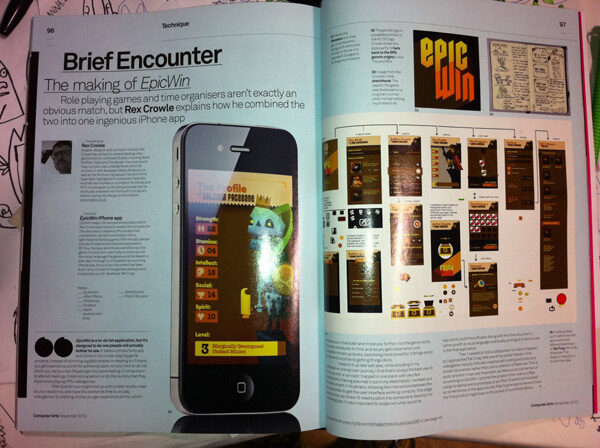
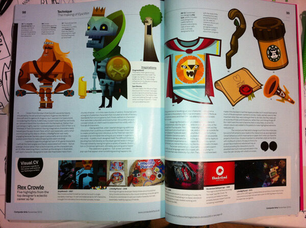
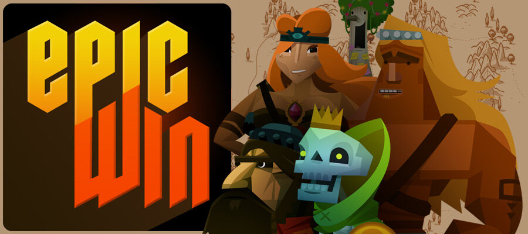
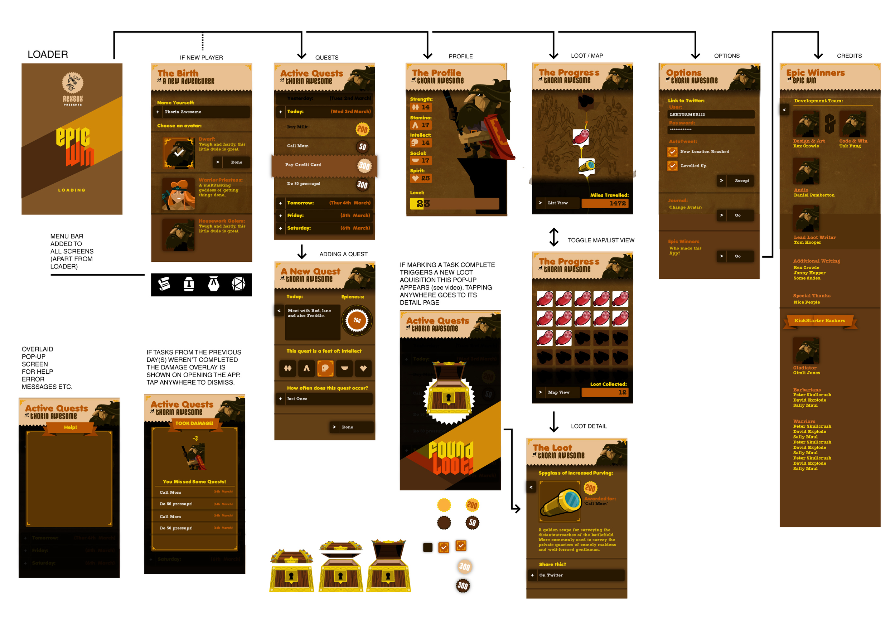

Onboarding leads with **identity, not utility**: pick a portrait before you ever see a task field. Avatars are full-body inked illustrations on warm parchment, each with distinct silhouette and personality (heroic warrior, grumpy dwarf, comedic skeleton). The wireframe confirms the character panel was load-bearing from the earliest sketches — the avatar is the persistent emotional anchor.

## Home / task list with XP

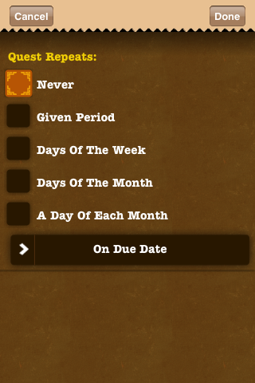
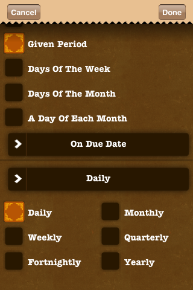
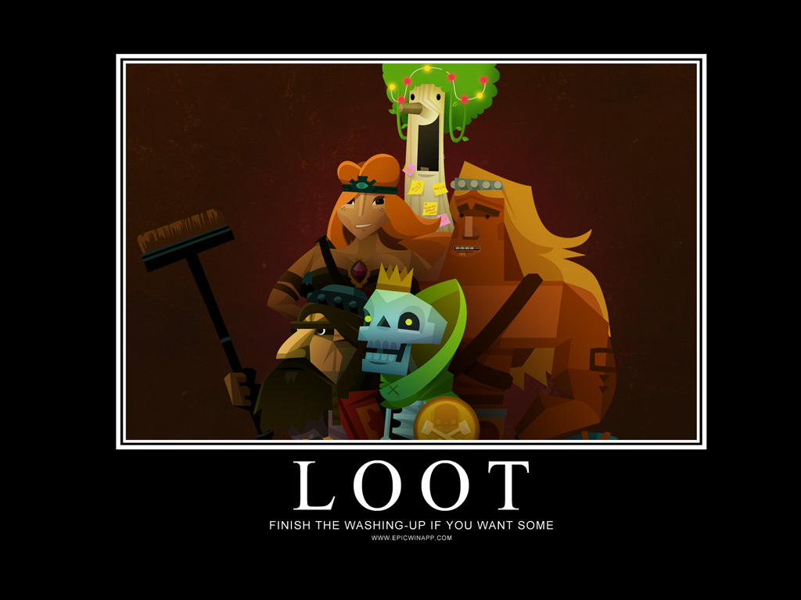
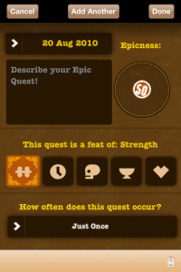

The home screen is a **character sheet, not a list**: avatar portrait dominates the upper third, XP bar reads as a hero's health meter, and tasks are rendered as quest-log entries on aged paper with skill-category icons. Typography is hand-lettered, never system font. Tend equivalent: deity portrait at top, devotion bar beneath, daily offerings as illuminated-manuscript rows.

## Task creation — point assignment & 5-skill tagging

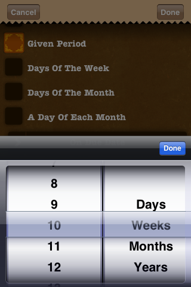
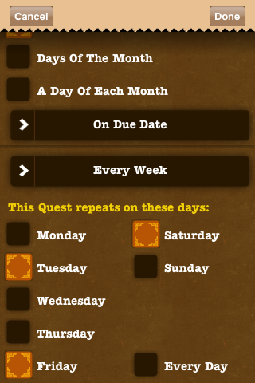
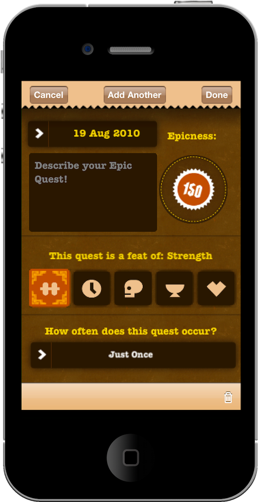

Creating a task is itself a small RPG ritual: the user **assigns difficulty points** (1–10ish) and **tags up to five skill categories** the task will train. This converts "buy milk" into "+3 Stamina, +1 Social." For Tend, the same dual-axis maps cleanly: offering magnitude (candle / incense / full ritual) × deity attribute affinity.

## Task-attack animation (the signature moment)

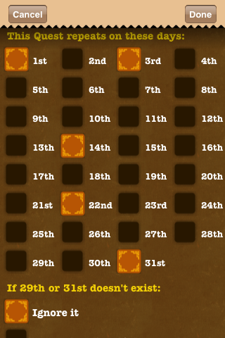
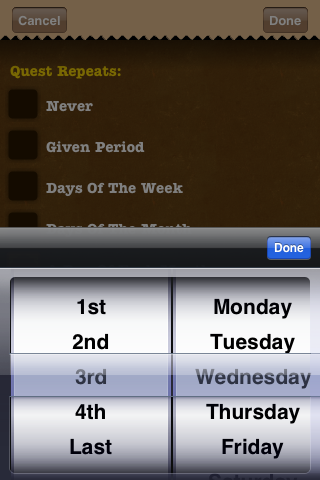
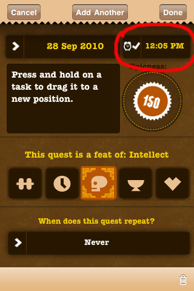
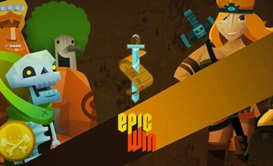

This is the **single most copied EpicWin mechanic** in the genre. Checking off a task triggers a hand-animated attack: avatar lunges, hit-spark flashes, damage number arcs, XP counter ticks, and a loot card flips up. The reward is theatrical, ~2 seconds, and feels *earned* because the illustration is bespoke. Tend should invest in one equivalent ceremony — e.g., offering placed on altar, smoke curl, deity sigil briefly glows, blessing card flips.

## Character profile — 5 skill stat bars

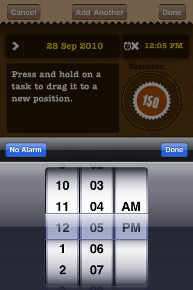
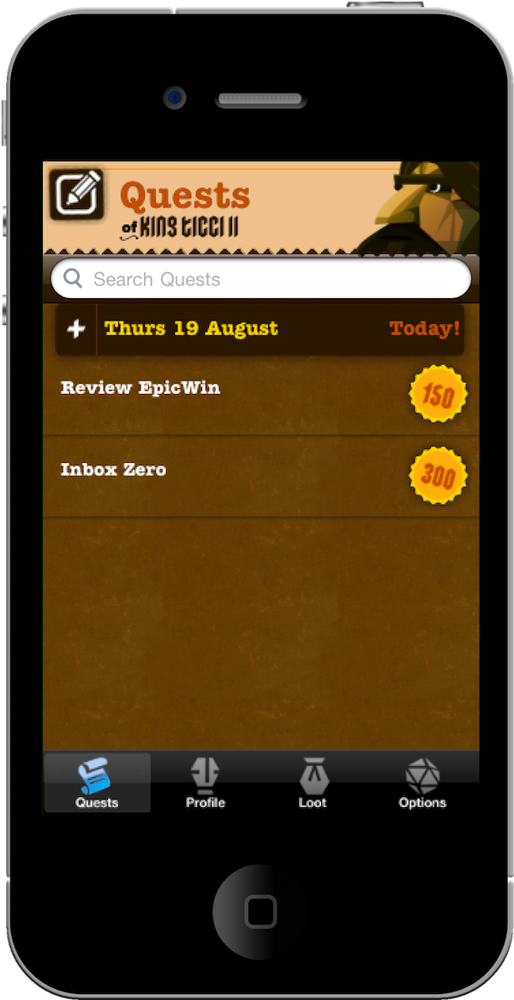
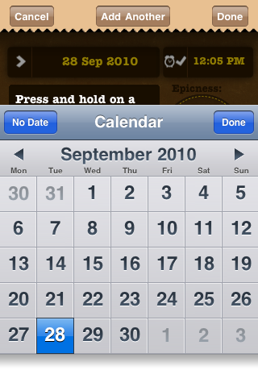

The profile is pure D&D character sheet: five labeled bars (Strength, Stamina, Intellect, Social, Spirit) rendered as inked meters on parchment, with numeric levels and gold/XP totals. **Direct Tend mapping**: replace the five RPG stats with deity-aligned virtues (e.g., Hekate/Liminality, Brigid/Hearth, Cernunnos/Wild, Aphrodite/Connection, Hermes/Mind) — each habit feeds one or more patron's favor meter.

## Loot drops, gold & rewards

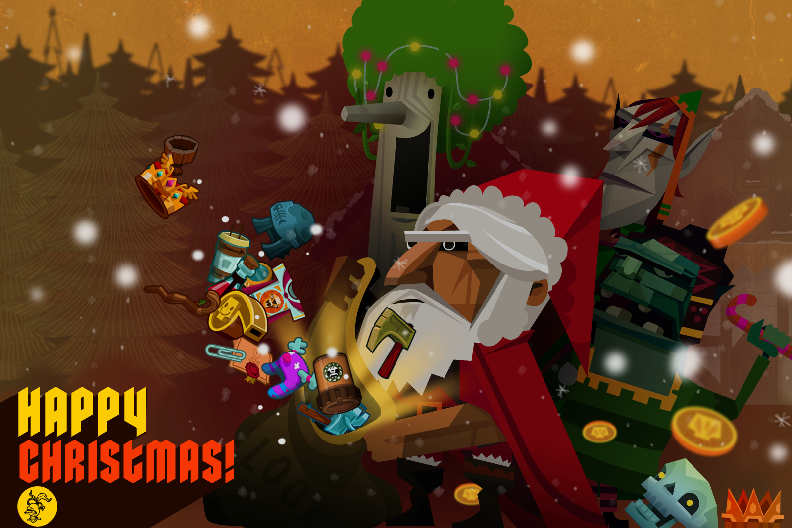

Loot is **collectible, illustrated, and flavor-texted** — each drop is a tiny lore moment, not a generic icon. Seasonal drops (Xmas) keep the collection living. For Tend: seasonal sabbat offerings, tarot pulls, or charm-bag contents as the equivalent collectible layer.

## Quest map / progression

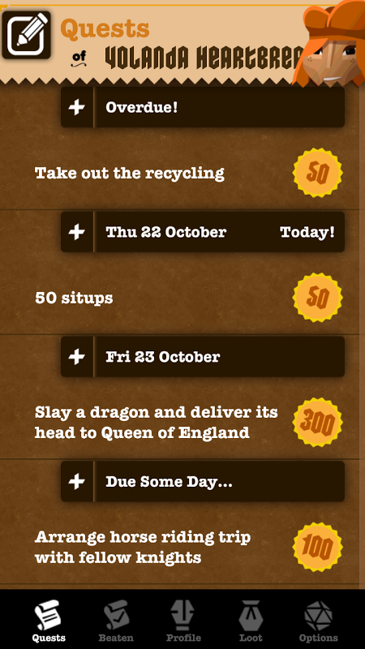
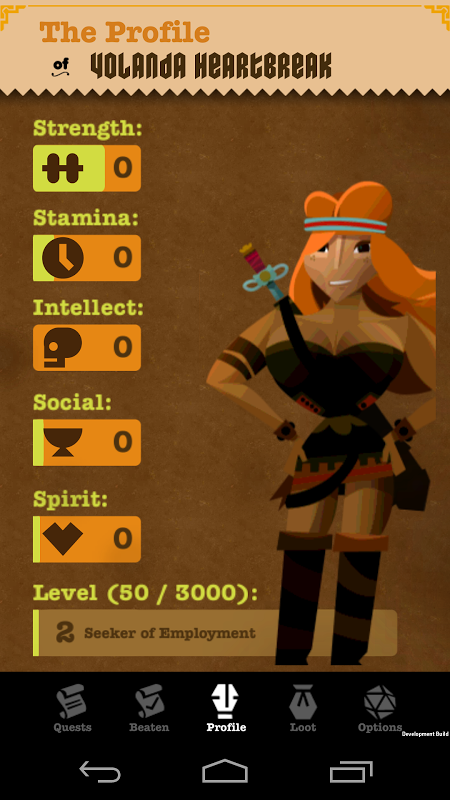
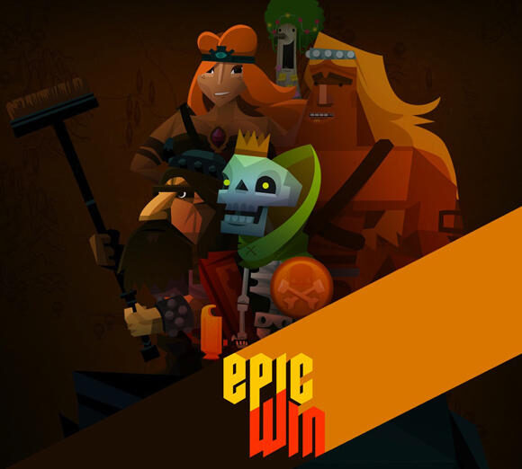

A painted overworld map gives **spatial metaphor to time**: progression feels like a journey, not a streak counter. Tend analog: a wheel-of-the-year map, or a path through an enchanted forest where each season unlocks a new grove/shrine.

## Avatar customization & later updates

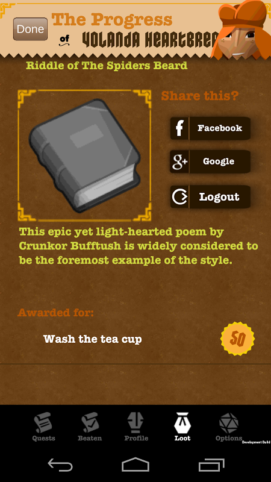

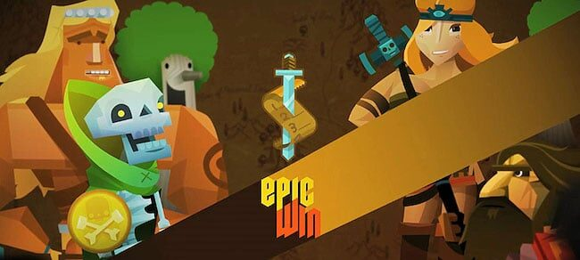

Customization is **earned, not purchased per-item** — EpicWin famously shipped as a one-time paid app with no IAP grind, which preserved the tabletop-RPG feel. Tend should consider: altar customization (cloth, candles, statues) unlocked via consistency, not microtransactions.

## Hand-drawn fantasy art samples & typography

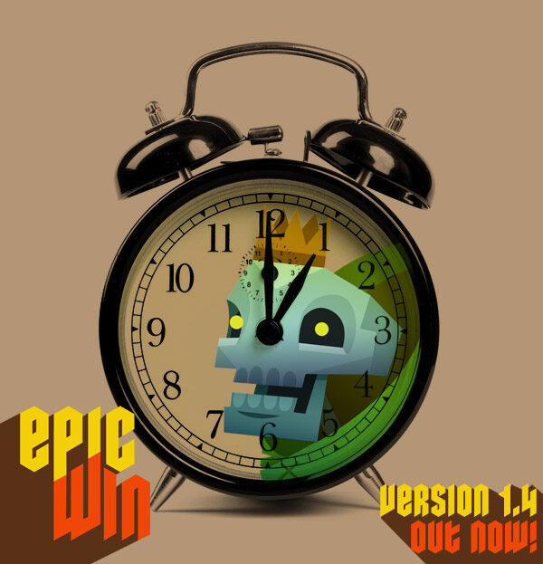
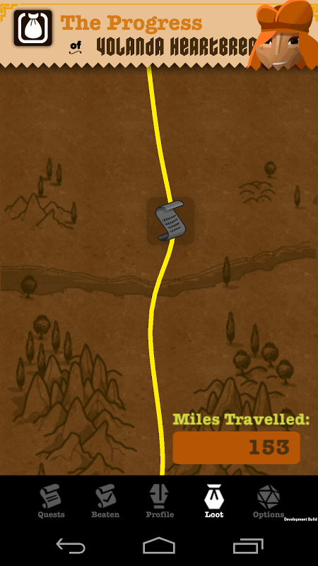
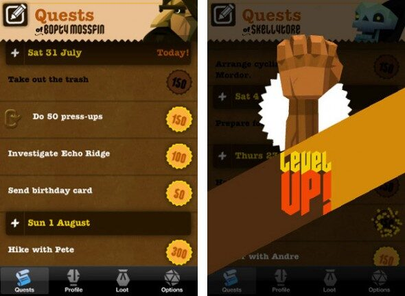

Typography is a **hand-lettered display face** for headers paired with a clean humanist serif for body — never system UI fonts. Linework is heavy black ink, fills are loose watercolor with visible paper grain. Palette: parchment cream, oxblood red, forest green, ink black, gold accents. Tend can borrow the *technique* (hand-inked, washed, paper-textured) while swapping the *iconography* to occult/pagan (sigils, moons, herbs, antlers, candles) and the palette to dusk-purples, blood-red, bone-white, candle-gold.

## Design language & takeaways for Tend

- **Identity before utility.** EpicWin makes you pick an avatar before a task; Tend should make deity/patron selection the first onboarding beat, so every subsequent screen has emotional anchoring.
- **Five-skill taxonomy maps to patron attributes.** Replace Strength/Stamina/Intellect/Social/Spirit with five deity-aligned virtues; each habit feeds one or more patron's favor meter, giving multi-deity practitioners a coherent stat sheet.
- **Invest in one theatrical reward moment.** The task-attack animation is EpicWin's emotional core; Tend's equivalent (offering-placed, smoke-curl, sigil-glow, blessing-card) is worth bespoke illustration and ~2s of choreography.
- **Hand-drawn, paper-textured art is the moat.** Heavy inked linework + watercolor wash + visible grain reads as "made by humans who care" — Tend should commission illustration in this register (dusk palette, occult iconography) rather than vector flats.
- **Collectible loot as lore.** Each drop carries flavor text and illustration; Tend's analog is seasonal sabbat charms, tarot pulls, or altar items — a living collection that rewards long-term devotion.
- **One-time-purchase ethos preserves the spell.** EpicWin's no-IAP stance kept the tabletop feel intact; Tend should resist gacha/energy mechanics — devotion apps lose credibility the moment they monetize the ritual itself.
