# Fabulous — Visual Design Research

Fabulous (co.thefabulous.app, ~37M users) is the canonical example of a habit-tracker that decided early to dress itself up as a *storybook*. Born in Duke University's Center for Advanced Hindsight in 2013 as a Behavioral Economics Lab experiment, it has spent a decade refining a single thesis: if you frame routine-building as a hero's journey — with chapters, letters from a coach, multi-week "Journeys," lush full-bleed illustrations, and a play-button that "launches" your morning like a rocket — people will follow through where a checklist would lose them. Every micro-interaction is wrapped in mood (gradient sunsets, painterly forests, alchemical potion flasks, parallax mountains) and every flow is framed as narrative ("In which Taylor learns how to manufacture a great night's sleep…"). For **Tend** — which is trying to make daily habits feel like *offerings to a patron deity* — Fabulous is the single most relevant case study in the category. They have already solved the question: *how do you make a daily checkbox feel sacred?* Their answer is illustration density, ritual-coded copy, and a multi-step onboarding that treats your future self as a character you are writing a letter to.

This report covers ~60 screens sourced from the live app, the marketing site (thefabulous.co), AppFuel's complete iOS onboarding capture, ScreensDesign's flow recording, Google Design's case study, Pratt Institute's design critique, Adapty's paywall archive, and the Fabulous blog.

---

## Splash, identity & the "Fabulous World" cosmology

The launch identity is a tiny minimalist mark (a hooded white figure standing under a watercolor sun-moon) — but the *moment* you land in the app proper, you are dropped into a purple-dark "Fabulous World" pyramid illustration that frames the entire app as a *cosmology* you're being inducted into. This is exactly the kind of mythic register Tend is reaching for.

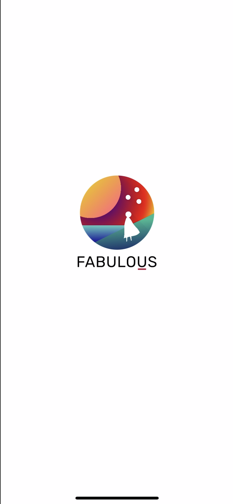

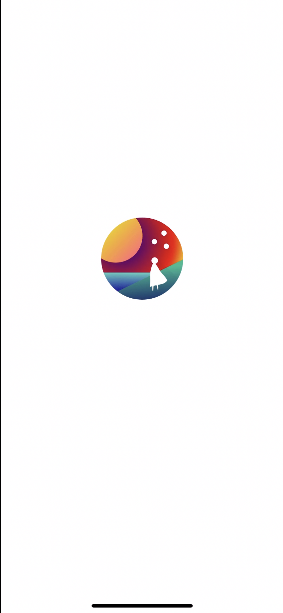

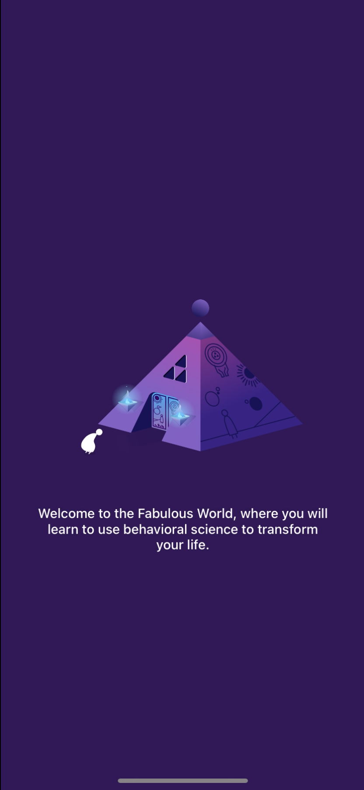

---

## Onboarding — the famous multi-step illustrated quiz

Fabulous's onboarding is famously long (40+ screens), but every screen is its own visual moment. The pattern alternates: solid-color full-bleed background → big white question typography → 3-4 large rounded option cards → bottom-pinned "Continue." The backgrounds rotate through a small palette (Klein blue, deep merlot, dark purple, dawn-pink gradient) that telegraphs emotional category — blue=identity, merlot=struggles, purple=aspiration. The choice cards are textured with abstract line drawings (curves, parabolas, half-circles) that read as constellation diagrams.

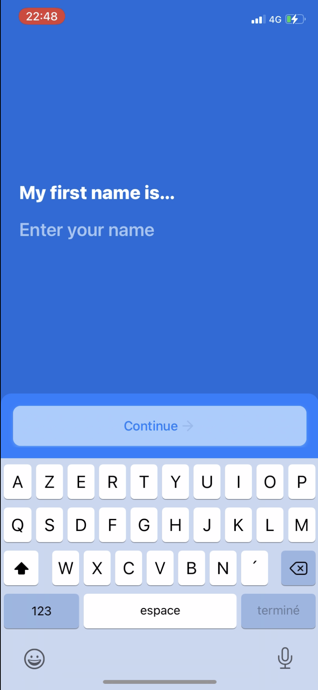

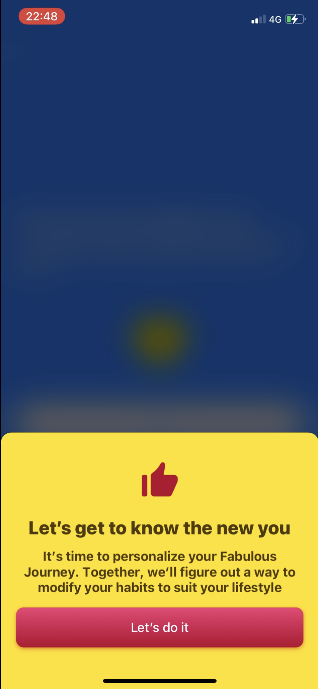

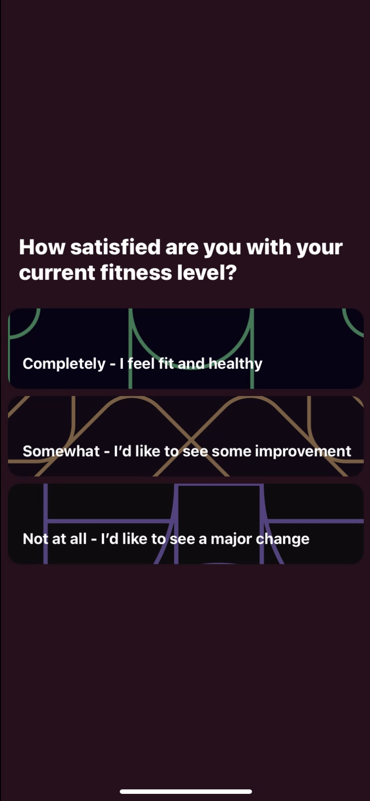

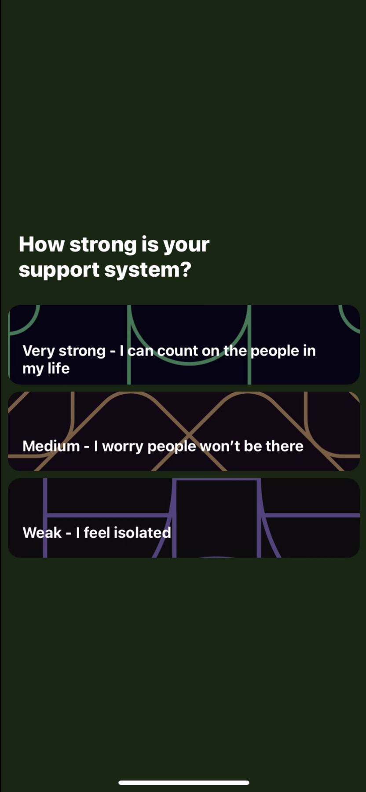

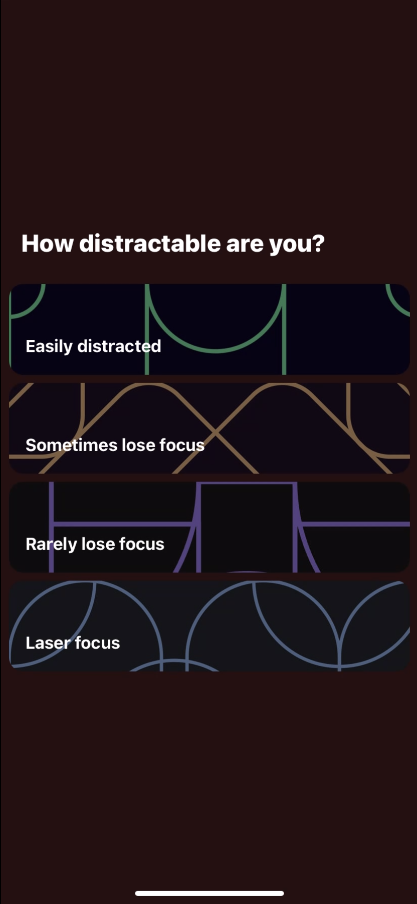

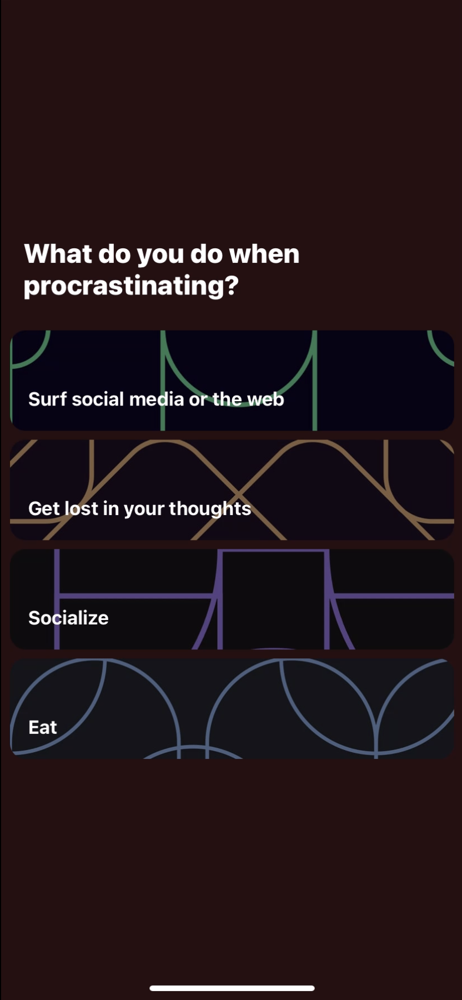

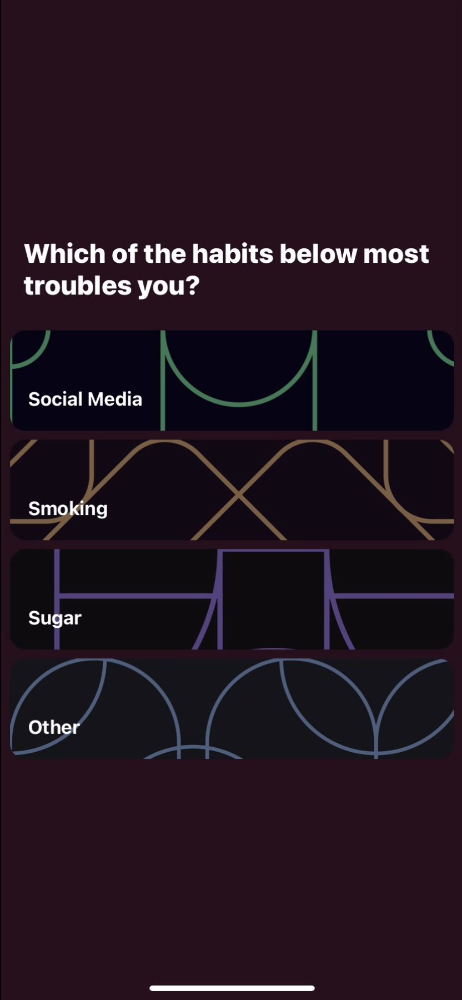

![Interest grid finale: "Last step! Tell us what you're interested in / Pick as many as you like." Six full-color illustrated cards arranged 2x3 — Get Productive (man in a hot-air balloon over a desert city), Self-discipline (figure flying over a sunset mountain), Fitness (runner on dark trail), Get Motivated (figure on a crescent moon framed in a circle), Meditation (figure seated in a flower throne), Decluttering (man tossing files into the air over wheat). This is Fabulous at peak illustration density — every option is its own miniature poster.](images/fabulous/appfuel-23.png)

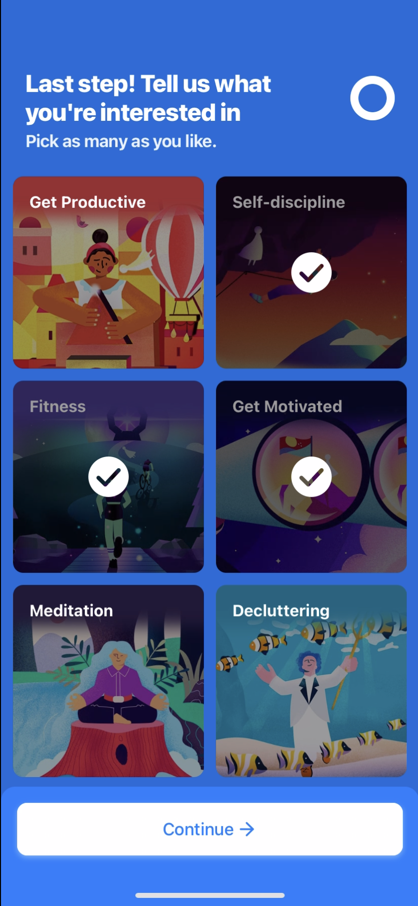

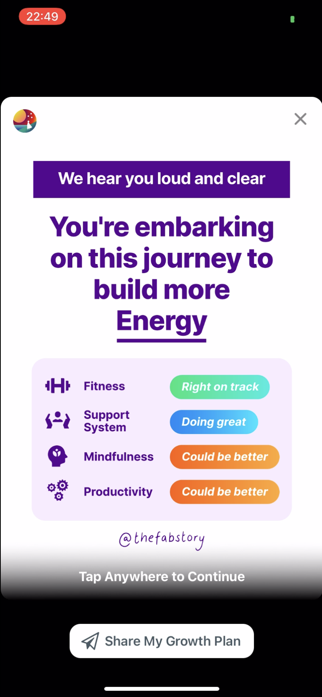

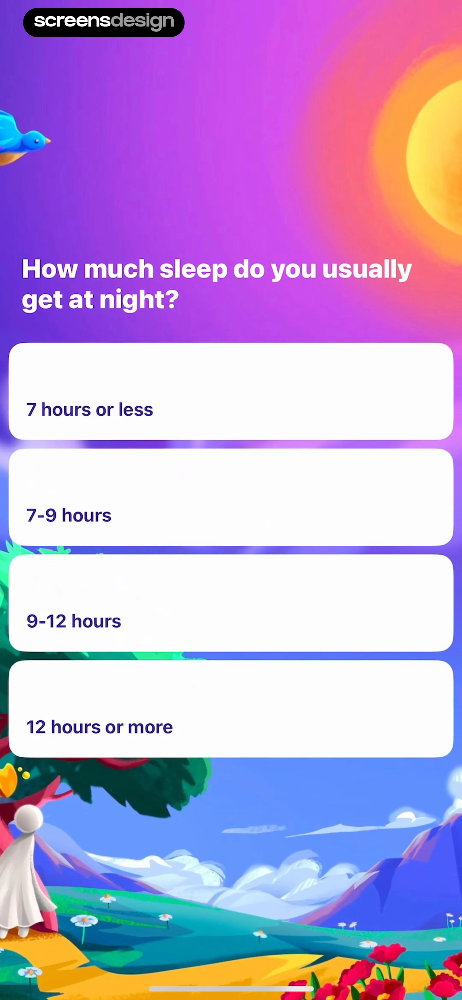

---

## The "Contract" — the signed commitment device

The signature commitment moment: just before the paywall, the user is shown a hand-written-style "Contract" personally addressed to them ("Julia's Contract"). It sits in a witchy still-life of alchemical glass flasks, parchment, and a glowing potion — the most overtly occult illustration in the entire app, and the closest aesthetic match Tend will find anywhere in the market. Hold to commit.

![Julia's Contract: deep indigo background, a still-life arrangement of two large potion flasks (one with a starfield inside, one with glowing dust), an open scroll/letter at the bottom, and a glowing amber spherical pendant suspended overhead. Body text: "I, Julia, will make the most of tomorrow. I will always remember that I will not live forever. Every fear and irritation that threatens to distract me will become fuel for building my best life one day at a time." Hint: "tap and hold to commit. Precommitting to a goal (via contract like this) has been shown to inspire action and reduce procrastination." This is the single most important screen for Tend to study.](images/fabulous/screensdesign-03-commitment.webp)

---

## Home / daily routine view

The home screen has gone through multiple eras. The 2017–18 version was illustrated geometric mountains and a giant rocket-shaped FAB that "launched" the ritual. The current (2024+) version is more restrained — a soft white background with rich hero illustrations on the ritual cards.

![Marketing render of the current Morning Routine card: a tilted iPhone showing a full-bleed dawn illustration — orange-pink sky, silhouetted mountains, a flock of birds, a yellow flower in the foreground, and the small white cloaked protagonist standing on a hill. Below the hero: "3 habits / Today · Wed, 6 May" and an embossed purple CTA "Launch Fabulous Moment" followed by 7 habits (Manage my tasks 30 min, Buy groceries 30 min, Clean my room 30 min, Go shopping with my bestie 30 min, Finish the book 30 min, Study Spanish 30 min, Make my bed 30 min) each with a tiny illustrated icon (parachute, palette, hand, moon-and-pillow).](images/fabulous/thefabulous-Fabulous_Feature_3.webp)

---

## Morning Ritual builder

The Morning Ritual screen sits between "list of habits" and "play-button launcher." It shows the user the *plan* and lets them hit Launch to start an audio-guided countdown through each habit.

![Morning Ritual config (current era): white background with a small illustrated header card — a yellow sun with paper-cut clouds and a tiny pink lantern, geometric green hills, a magenta cube and grey pyramid sitting on the lawn. Above the card: "Morning Ritual / Alarm 08:00 / Duration 1 min" with clock-and-timer icons. Below: "1 habit / Today · Sat, 15 Sep" with a + add button. A wide coral "Launch" CTA pinned mid-screen. Then a single "Drink Water 1 min" row with an empty completion circle. The Launch button is the entire UX hook — one tap and the audio-coached ritual starts.](images/fabulous/pratt-IMG-1261.png)

![Morning Ritual + active habit timer side-by-side: left screen shows the legacy ritual builder (Alarm/Duration header, "Launch" coral CTA, Drink Water as the single habit). Right screen shows the active state — full-bleed underwater painting of a red-haired woman in a white dress floating in turquoise water with bubbles, "Drink Water" headline, "Use a glass or a bottle you love" subtitle, an up-arrow expand affordance, a green check pill below, a countdown "0m 55s" with pause, and three controls — Skip / coral check (complete) / Snooze.](images/fabulous/pratt-333.jpg)

---

## Evening Ritual / Trying to uncheck

Evening Ritual mirrors Morning but with a darker, sunset-toned illustration set. The "Trying to uncheck?" interstitial is one of the most behaviorally interesting modals in the category.

![Side-by-side: left screen is the Home with the "Great determination!" celebration card — a paper-cut illustration of a bed, lamp, and water bottle, copy "Wejun, There is one thing you can do to make sure you will drink water. Put a cup of water by your bed. Do you want a reminder tonight at 21:00?" with coral "Yes, Please Remind Me" / "No" — this is the just-in-time intervention. Right screen is "Evening Ritual" with a sunset-amber sky, a small "Trying to uncheck?" modal explaining: "It turns out that we don't want you unchecking completed habits! This isn't a glitch, we've designed it like this on purpose. We really want to make the act of completing a habit a sacred thing." The word *sacred* appears literally in the product copy — Tend's exact framing already validated by the market.](images/fabulous/pratt-444-1.jpg)

---

## "Make Me Fabulous" — instant routine picker

Outside the morning/evening routines, the "Make Me Fabulous" tile picker lets you launch an ad-hoc routine — Focused Work, Meditate, Yoga, Stretch, Power Nap, Breathe, Get Inspired, Sit and Think — each as a giant colored tile with hand-rendered illustrations.

---

## Deep Work / focus session

Deep Work is one of the most aggressive uses of texture in the app — full-bleed warm-orange backgrounds with concentric line-art waveforms acting as a card texture, mimicking the look of woodcut or contour-map art.

![Deep Work picker: full-bleed orange background with a dark grey/blue hanging lamp at top throwing a yellow cone of light down the screen. Header "Deep Work" in white. Three duration cards on textured backgrounds — "25-Min Just Get Started / For the Tasks That Are Difficult To Start" on a blue waveform pattern (26 mins), "Meaningful and Deep Work / 45-Min of Intense Focus" on a grey waveform (48 mins), "Blistering Focus / 2 Hours of Intense Focus" on a yellow waveform (122 mins). A green card partially visible (247 mins). The orange-yellow-green palette evokes a lit room at night.](images/fabulous/thefabulous-6-min.webp)

---

## Journeys — the multi-week story-arc framing

Journeys are Fabulous's signature pedagogical structure: you don't pick "habits," you enroll in a Journey ("An Unexpected Journey," "A Fabulous Night," "The Path to Productivity") that drips one new habit at a time over 1-3 weeks. Each Journey is framed as a chapter title, with the *user's name* inserted as the protagonist.

![Three-phone marketing render of Journey chapter intros (legacy material era): each phone shows a chapter title card with art-deco wreath flourishes, headline (An Unexpected Journey / A Fabulous Night / Start an Exercise Habit), italic "In which" subheading, the body "Taylor learns how to stay energized the whole day" / "Taylor learns how to manufacture a great night's sleep" / "Taylor learns how to build a sticky and effective exercise routine," and a giant green play FAB at the bottom. Each phone has a distinct background — first a teal-and-yellow rainbow arc, second a moody grey clock-face, third a navy dumbbell scene. This is the *exact* pattern Tend should steal for deity-coded chapter intros.](images/fabulous/google-design-02-programs.webp)

![Journey picker (current era): two phones — left shows "Current" / "All Journeys" tabs and the user's current journey "First Mountain - The Foundation" with three sub-journey cards on lush illustrated backgrounds (The Science of Habits 4% — painterly mountains, Sleep Smarter — underwater scene with red fish, The Path to Productivity 0% — jungle plants and waterfall). Right shows the Routines schedule view — "Today / 07:00 Morning Routine" (with a sunset cliff illustration), "Someday / Afternoon Routine," and a coral "Add Habit" link.](images/fabulous/headway-01-journey-routine.webp)

![Journey progress + Discover: left phone shows "First Mountain - The Foundation" with progress stats "4% completion / 1/25 events achieved" and the next habit card "Small Change, Big Impact / 1/5 achieved" with a blue water-drop icon, plus a locked "Meet Your Future Self / Not yet unlocked" preview. Right phone shows the Discover tab with a "15 WAYS TO DE-STRESS" magazine spread — numbered list 1-15 on a peach background with a painterly illustration of a man in a purple suit reclining in giant tropical leaves.](images/fabulous/headway-02-journey-discover.webp)

![Drink Water challenge accept: two phones, left shows the challenge intro — soft teal background, large white water-drop icon, "Drink Water / For the next 3 days, Drink Water when you wake up to kickstart your body and start your day with a success!" with 1-2-3 progress dots, a "Why am I doing this?" link in coral, and a wide green "I accept the challenge" CTA. Right shows the modal explaining the why — "I know, I know Wejun! You're probably thinking you'd rather have coffee or tea in the morning. Maybe setting a goal to drink water just feels too simple. But we have a plan for you. We're starting very small, so we can build strong foundations. Soon, your challenges will rise to caring for your physical and mental health. We all need to start somewhere. This is the first step." with "Ok, Got It." Tend should copy this pattern exactly for explaining ritual significance.](images/fabulous/pratt-IMG-1253.jpg)

---

## Letter no. 1 — narrative coaching

The "Letter" is Fabulous's most distinctive narrative device: every milestone unlocks a personally-addressed letter, in literary prose, that the user can read or have narrated to them.

![Letter no. 1 detail view: status bar at top with pause and check controls, dated "September 15, 2018 / 3 min," greeting "Hi Wejun," and a multi-paragraph letter that opens "Welcome aboard The Fabulous! You are embarking on a journey of all around well-being: Happiness, health and mental clarity. The Fabulous will be here as your personal coach to support you along the way." Mid-letter is a full-bleed paper-cut illustration of a misty mountain/river/sun landscape with the small white-cloaked protagonist walking along a green winding path. Closing paragraph highlighted in yellow marker: "In 2 weeks, you'll have more energy, feel more fulfilled, and be more productive. You will have built the lasting rituals for a [better life]." Letters are presented as *correspondence*, not articles.](images/fabulous/pratt-11111.jpg)

---

## Habit completion / celebration

Completion celebrations are full-screen illustrated moments with sound effects and confetti. The aesthetic toggles between fairy/sprite characters (current era) and paper-cut/material illustrations (legacy era).

![First habit checked: two phones, left shows the Home with all completed today items (Letter no. 1 ✓, Goal: Drink Water highlighted at 1 min, Your Action card, Your Routines listing Morning Ritual with sunset hero). Right shows the celebration overlay — a 3D-rendered fairy/sprite character (white-cloaked, holding a yellow tablet, with iridescent wings) flying upward through a starfield with the speech bubble "First habit checked! Now return tomorrow to make it stick." Below: an orange flame "1 / day streak!" badge. The 3D character is a current-era branding update.](images/fabulous/headway-03-home-celebration.webp)

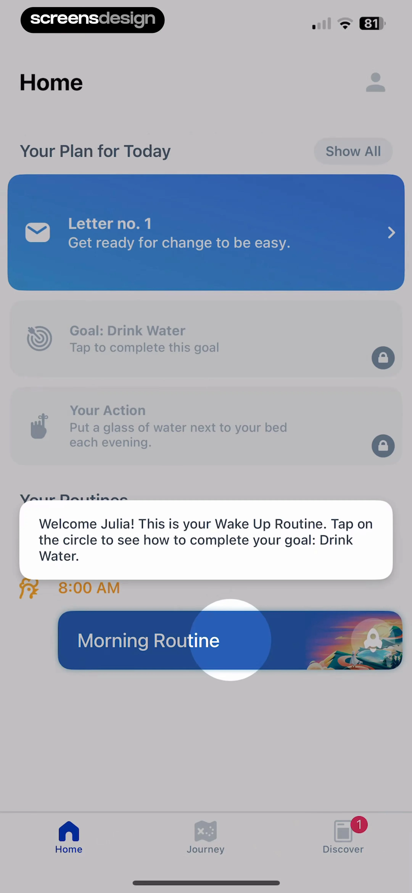

---

## Drink Water ritual — the signature full-bleed illustration habit

The most-photographed Fabulous moment: the active "Drink Water" ritual, where the entire screen becomes a painterly illustration while audio narration plays.

![Drink Water active ritual: full-bleed painterly scene of a long-haired figure in a flowing white dress drifting through turquoise underwater light, surrounded by air bubbles. Headline "Drink Water." Card overlay: "👉 This week, drink water as soon as you wake up. You're hydrating your body and, just as importantly, you're demonstrating follow-through." A "TODAY" status pill. Bottom controls: Skip / coral check (complete) / Snooze. A "What can you do to stay hydrated today, Julia?" reflection prompt sits at the very bottom — pairing action with reflection.](images/fabulous/screensdesign-07-streak.webp)

---

## Coaching — the audio library

The Coaching library is Fabulous's premium content — short narrated audio essays with full-bleed painterly cover art. Every coaching card has a distinct illustration style; together they look like a magazine of editorial illustration.

![Coaching library hero: tilted iPhone in a slight 3D perspective, headline "Coaching." Two coaching cards visible — top "Life is Too Short for Boredom / Your life is too valuable to let boredom steal your power" with a painterly illustration of a moustached man looking out a window at a rainy night, watercolor-style birds perched in tree branches, a small white spectral figure in the distance. Bottom card "Direct Your Attention / You have a superpower you can cue at any moment. Life is a wonder if you look closely enough" with a painterly summer scene — a man in mustard yellow examining a violet flower through a magnifying glass while a white cloaked figure floats above him. Each card has a circular play button. A teal "All Coaching Series" footer CTA. This is the platonic ideal of what Tend's "letters from your patron deity" could look like.](images/fabulous/thefabulous-1-min.webp)

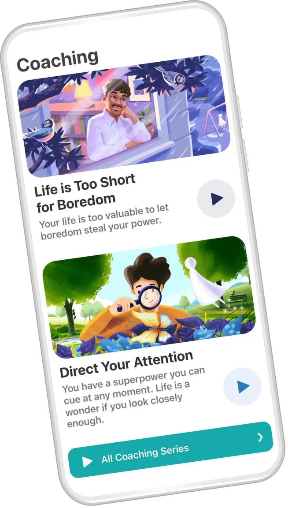

---

## Human coach — the premium social layer

Premium Plus offers a 1-on-1 human coach. The illustration here gets even more lush — a sunset mountain peak with a glowing yellow sphere ascending behind a celebrating figure, framed inside a wooden frame with butterfly cutouts. This is the most religious/awakening-coded image in the app.

---

## Community & Challenges

Fabulous frames challenges socially — a 30-Day Life Well-Balanced calendar gives users a printable bingo-style sheet, and live challenges spawn shared discussion threads.

![30 Day Life Well-Balanced Challenge calendar: white background, "FABULOUS" wordmark top-right (the sun-mountain logo + coral underline), title in big black + cyan "30 DAY LIFE WELL-BALANCED CHALLENGE." A 5-column × 6-row grid of day cards — Day 1 "Observe the world around you" (telescope), Day 2 "Get inspired by your environment" (rocket), Day 3 "Sit & think for 20min" (meditating figure), Day 4 "Find an app that can help you" (app icon), Day 5 "Turn off unneeded notifications" (bell), and so on through Day 30 "Celebrate how far you've come" (party emoji). Each day card has a single emoji/icon and a brief instruction with cyan underlined key phrases. Treated as a printable poster.](images/fabulous/blog-lwb-1.png)

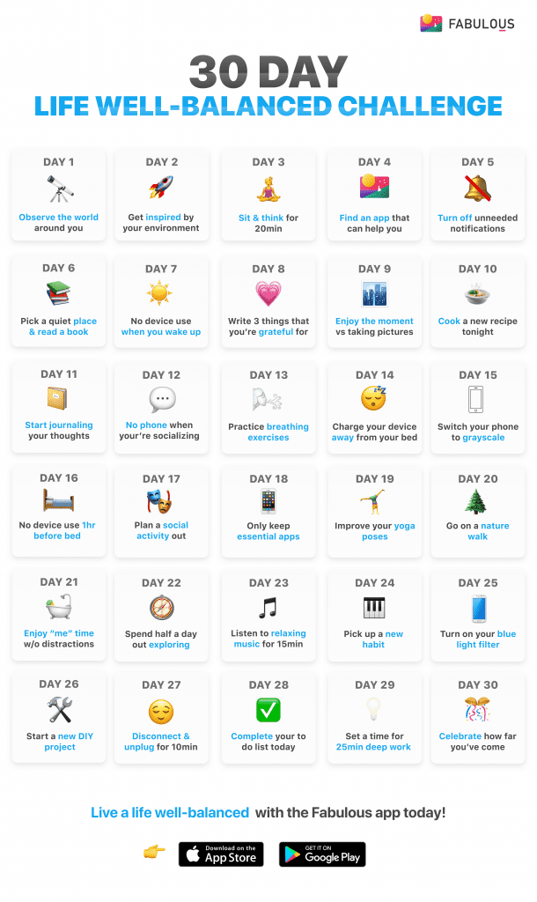

![Community Discussion view: tilted iPhone, headline "Discussion / 30-day Meditate Challenge / 10%" with a row of participant avatars and an "Invite" CTA. A discussion post from "Smita Gray" — "Today I got up earlier and naturally all I wanted to do was mediate. I sat out in the garden, the weather was perfectly cool. I used the Bells only as I am surrounded by nature; trees, sounds of the birds singing and tress swaying genently in the wind. I am now ready to take on the day. Thank you, Fabulous. 🙏" — with engagement counts (Delaney and 192 others / 72 comments). Floating reaction badges: a heart-eyes face from a user, a thumbs-up from another, a waving hand. A reply from Kathy Fay below. The community feels supportive, not competitive.](images/fabulous/thefabulous-5-min.webp)

---

## Settings / account

Settings is one of the few utilitarian screens — but even here the top of the screen is dominated by a paper-cut illustration of the protagonist standing on a mountain at night under floating geometric shapes.

![Settings: top quarter is a deep purple/blue paper-cut scene — small white cloaked figure on a layered blue mountain at night, a giant orange moon rising on the right, two red/pink geometric cubes floating top-left, three triangular shapes top-right, scattered stars. White "Done" link top right. A peach "Join Fabulous Sphere" CTA sits over the illustration. Below the hero: a teal progress card "An Unexpected Journey / Feel Energized 7%" with a partial ring. Then a list — All Journeys, Sign In ("Required to save your journey progress"), Settings (gear), Invite your friends (coral), Send Feedback. The settings list is utilitarian but the hero illustration keeps the screen on-brand.](images/fabulous/pratt-IMG-1266.png)

---

## Article / educational content

When the user opens an educational article, the layout switches to a magazine-style template — full-bleed photographic header, clean typographic body, restrained UI. The contrast between this and the illustrated habit screens is intentional: education = real-world photo, ritual = painted illustration.

---

## Paywall — the famously aggressive monetization

Fabulous is known for some of the heaviest paywall pressure in the wellness category. Multiple variants exist; here are three captured by Adapty and ScreensDesign.

![Paywall v1 — "Letter from Future Self": deep purple background, a glowing yellow hexagonal triforce amulet at top, a blue gradient pill "Enjoy your first week, it's free!" The body is structured as a letter — "Nadya, do you copy? / It's me, future Nadya. I'm calling from 2024 because today is an important day for you — for us. / Monday, February 27, 2023 is the day we decided to change our lives for the better. / I have excellent news: I'm healthy, in great shape, and worry-free, thanks to the choices you're making. / I'll be with you every step of the way. / See you soon, Future Nadya." Pinned bottom: "2 taps to start, super easy to cancel" + a magenta "Try Free for 7 Days Nadya" CTA. The use of *the user's name* in the CTA is a Fabulous signature.](images/fabulous/adapty-paywall-1.webp)

![Paywall v2 — scrolled down on the same paywall: hot-pink gradient header card "Get Fabulous Premium Membership / Billed every 12 months / 3,33 USD /month" (note the small per-month framing of a yearly bill — classic dark pattern). Below is a low-poly indigo night scene — geometric triangles, the same triforce, the white cloaked figure standing on a blue cliff, an orange sun rising. White CTA "JOIN FREE FOR A WEEK." Footer: "Terms & Conditions | Privacy Policy / You won't be charged until after your free week ends." Then a second pinned magenta "Try Free for 7 Days Nadya" CTA at the bottom. Two CTAs for the same action = the conversion-pressure tell.](images/fabulous/adapty-paywall-2.webp)

![Paywall v3 — "Build a Routine based on your goals": indigo background, "I have excellent news: I'm healthy, in great shape, thanks to the choices you're making. I'll be with you every step of the way. / See you soon, Future Julia" (letter ending). A second card overlays — "Build a Routine based on your goals!" with four hand-drawn habit cards (TAKE IT EASY / GET ENERGIZED / BEAT BOREDOM / CONNECT WITH YOURSELF) above a painterly illustration of a meditating figure surrounded by yellow flowers. A green toggle "Free trial enabled" sits on top of a wide white CTA "Try free for 7 days." Fine print below explains auto-renewal. The information density is overwhelming — and *that's the point.*](images/fabulous/screensdesign-04-paywall.webp)

---

## Brand marketing examples

A few additional illustration moments from thefabulous.co marketing site that show how the brand presents itself outside the app.

---

## Design language & takeaways for Tend

1. **Lush, full-bleed illustration is the brand.** Fabulous's most distinctive design decision is that nearly every screen has a painted hero illustration, not an icon. The illustrations rotate between painterly (sunset coaching cards, underwater Drink Water), paper-cut (legacy mountain morning ritual), and isometric low-poly (the Fabulous World pyramid, the night-sky settings hero). For Tend: commit to one or two illustration registers per deity/patron and use them as the *primary* visual element on every habit screen — not garnish.

2. **Narrative framing is the product.** Habits are "chapters" in a "Journey," your future self writes you a "Letter," your goals are signed in a "Contract." Tend should not invent a new framing — adopt the proven ones and *re-skin* them: deity-coded scrolls instead of letters, offering covenants instead of contracts, patron mythologies instead of Journeys. The behavioral-science evidence already favors this approach.

3. **The "Sacred uncheck" copy is your validation.** Fabulous's "we don't want you unchecking completed habits! …we really want to make the act of completing a habit a sacred thing" is the literal word *sacred* in product copy, in market for years, no backlash. Tend's offerings-to-deities frame is already validated by Fabulous's own UX writing.

4. **The Contract / Commitment screen is the single most stealable pattern.** Indigo background, alchemical flasks/scrolls/glowing amulet still-life, tap-and-hold to commit, body text in first-person ("I, [name], will…"). This screen is *already witchy* in Fabulous's hands — Tend can lean harder into the occult register (sigils, sealing wax, oath language) and have a direct competitive interpretation.

5. **The Ritual Launch button is a UX primitive.** A single coral/magenta "Launch" CTA that triggers a sequenced, audio-coached, full-bleed-illustrated walkthrough of every habit in the morning routine. This is the entire reason Fabulous feels different from a checklist. Tend's daily offerings should have a "Begin the offering" launch sequence — sound, illustration, narration, one habit at a time, with skip/check/snooze controls.

6. **Onboarding is an illustrated personality quiz, not a tour.** 40+ screens of solid-color backgrounds with one question each, choice cards textured with constellation/parabola line art, blue=identity / merlot=struggles / purple=aspiration. Each emotional category gets a palette. Tend's onboarding should map the user to a patron deity via this exact pattern — long, illustrated, narratively framed.

7. **Personalize ruthlessly.** The user's name appears in the chapter title ("In which Taylor learns…"), in the contract ("Julia's Contract"), in the paywall CTA ("Try Free for 7 Days Nadya"), in the coaching letter salutation, in tooltip onboarding ("Welcome Julia! This is your Wake Up Routine"). Tend should weave the user's name and chosen patron into every narrative beat.

8. **Educational content uses a *different* aesthetic on purpose.** Articles use real-world photography and clean magazine typography; rituals use painterly illustration. The contrast tells the user *this is reality, that is mythology.* Tend can do the same — keep tarot/oracle/lore content magazine-clean, but make the daily ritual flow lush and dreamlike.

9. **Celebration is a habit, not an afterthought.** Cinnamon Sunrise's screenshot shows "Celebrate!" as the literal last item in a 5-step morning ritual — same row, same weight, same icon treatment as Drink Water and Exercise. Tend should ritualize the close-out of each offering session as its own beat (close the altar, thank the patron, mark the day).

10. **Paywall pressure is the cost of this aesthetic.** Fabulous's paywall is famously aggressive — multiple CTAs, "Future You" letter, per-month framing of a yearly bill, name-stuffed buttons. The illustration investment is real and they recoup it via heavy conversion pressure. Tend should plan a softer paywall but should not underestimate the production cost of this illustration style — every screen has bespoke art.

---

## Sources

- [The Fabulous official site](https://www.thefabulous.co/) — marketing screenshots & illustration set
- [The Fabulous science page](https://www.thefabulous.co/science-behind-fabulous/) — behavioral-science framing
- [Apple App Store listing](https://apps.apple.com/us/app/fabulous-daily-habit-tracker/id1203637303)
- [Google Play listing](https://play.google.com/store/apps/details?id=co.thefabulous.app)
- [Adapty paywall library — Fabulous Daily Habit Tracker](https://adapty.io/paywall-library/fabulous-daily-habit-tracker/) — paywall variants
- [ScreensDesign — Fabulous showcase](https://screensdesign.com/showcase/fabulous-daily-habit-tracker) — onboarding flow capture
- [AppFuel — Fabulous](https://www.theappfuel.com/apps/fabulous) — 25-screen iOS onboarding capture
- [Google Design library — Engagement is Fabulous](https://design.google/library/engagement-is-fabulous-health-app) — Material Design Award case study
- [Pratt IxD — Fabulous design critique](https://ixd.prattsi.org/2018/09/design-critique-fabulous-motivate-me-ios-app/) — Morning Ritual / Letter / Settings flows
- [Cinnamon Sunrise — Fabulous review](https://cinnamonsunrise.com/blog/review-fabulous-app/) — legacy material-design era screenshots
- [Makeheadway — Fabulous review](https://makeheadway.com/blog/fabulous-app-review/) — current-era Journey & Discover screens
- [Fabulous blog — 30 Day Life Well-Balanced Challenge](https://blog.thefabulous.co/30-day-life-well-balanced/) — challenge calendar
- [Uddipana Baishya case study — Fabulous for New Users](https://www.uddipana.com/work/fabulous-for-new-users) — UX research artifacts
- [The Behavioral Scientist — Fabulous onboarding critique](https://www.thebehavioralscientist.com/articles/fabulous-app-product-critique-onboarding)
- [Ben Davies-Romano — UX review of Fabulous](https://bendaviesromano.medium.com/feeling-fabulous-an-honest-ux-review-of-the-fabulous-app-f792b15b4b58)
