# Habitica — Visual UX Research

Habitica (formerly HabitRPG) is a free habit tracker that wraps a standard to-do list inside a 16-bit-style RPG. Players create a pixel-art avatar, then earn XP, gold, gear, pets, and mounts by checking off real-world Habits, Dailies, and To-Dos. Missing Dailies damages the avatar's HP; "Death" wipes XP and one piece of gear. Multiplayer (Parties, Quests, Challenges) makes accountability social: party members take collateral damage when others miss tasks, and they collectively chip a boss's HP by completing real work. The audience skews toward gamers, ADHD/neurodivergent users, and people for whom "checkbox dopamine" alone doesn't stick — i.e., users who need narrative consequences attached to behavior.

Visually, Habitica is the rare productivity app that fully commits to a non-utilitarian aesthetic: chunky pixel sprites, JRPG-style stat bars, brown wood market UIs, and a SNES-era serif display font are non-negotiable parts of the brand. The product trade-off is density: even on mobile, every screen carries an HP/XP/MP triple-bar header, a gem/gold ledger, and a 5-icon bottom nav.

---

## 1. Marketing positioning & overall mood

These are the screens Habitica's team chose to lead with on the App Store and Play Store — useful as a statement of what the brand believes is most important to show first.

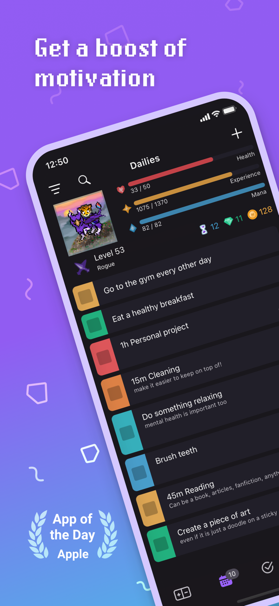

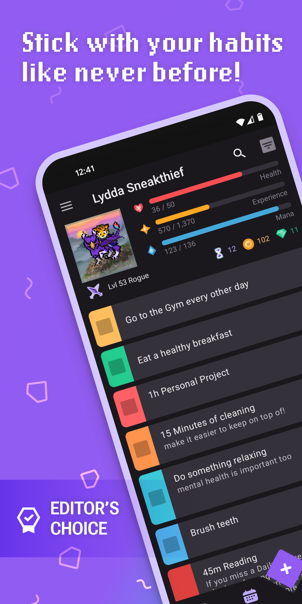

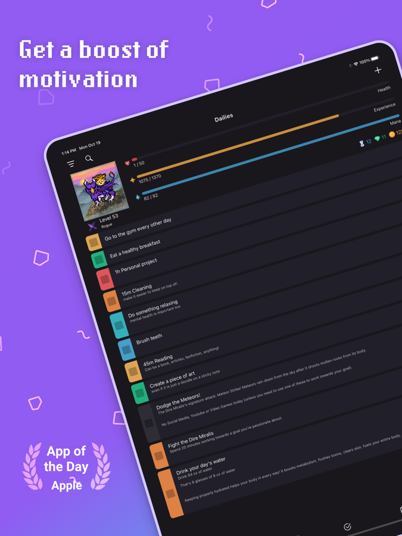

---

## 2. Home dashboard — Habits / Dailies / To-Dos / Rewards (mobile)

The four-tab task model is Habitica's core IA. Each tab is reached via the bottom tab bar (Habits, Dailies, To-Dos, Rewards, Menu).

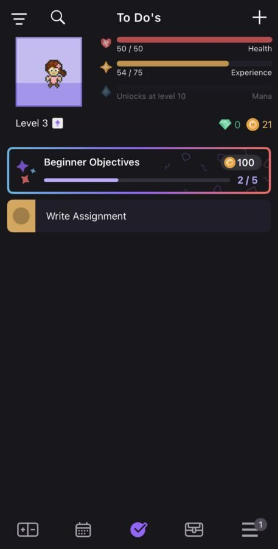

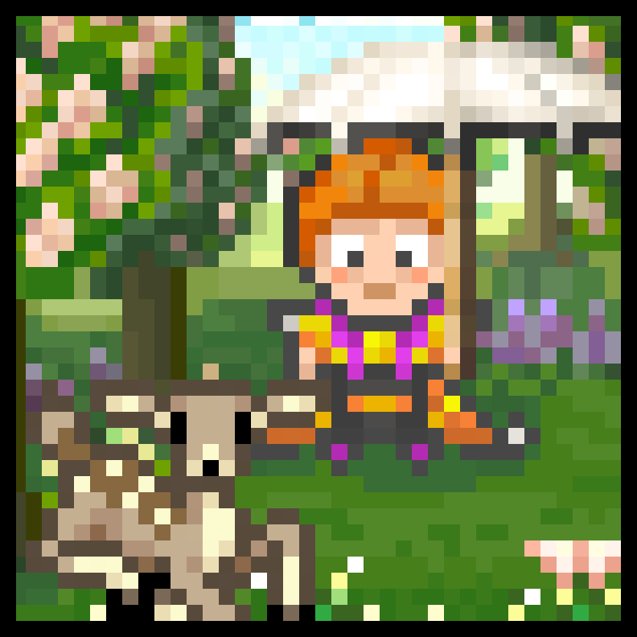

---

## 3. Task creation flow

---

## 4. Avatar & character creation

---

## 5. Stats & header (HP, XP, MP, gold, gems, streak)

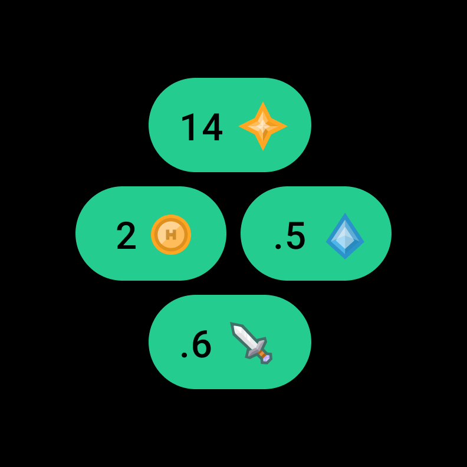

---

## 6. Class system (Warrior / Mage / Healer / Rogue)

---

## 7. Rewards screen & loot loop

![Rewards tab on mobile: a centered animated treasure chest with a "+1" gem-encrusted sword pulsing on top, two flanking chests carrying a potion and a runestone. The card list below mixes Habitica's built-in rewards with USER-DEFINED rewards: "Watch 15 min of videos on your favorite app :)" for 3 gold, "Buy a coffee" for 20 gold, "Grab some take out — You deserve to treat yourself a lil!" for 100 gold. The killer-feature is this dual-economy where users can convert in-game gold into permission to do real-life indulgences.](images/habitica/21-playstore-screenshot.png)

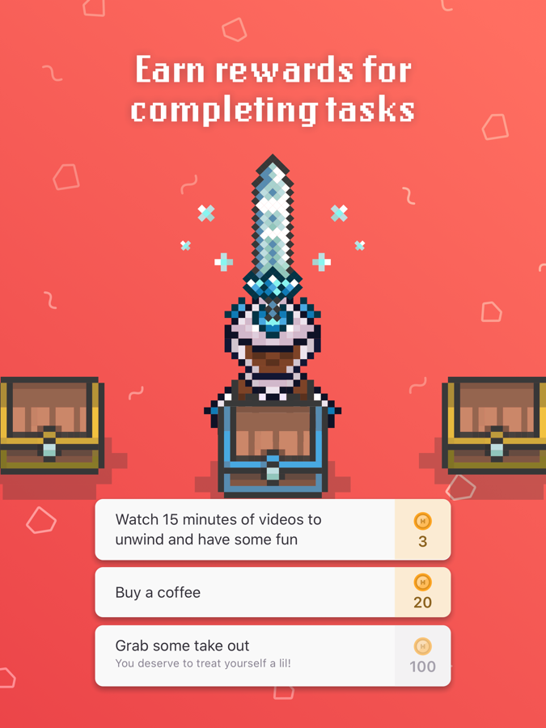

---

## 8. Check-in rewards & daily-loop hooks

---

## 9. Pets, mounts & collection

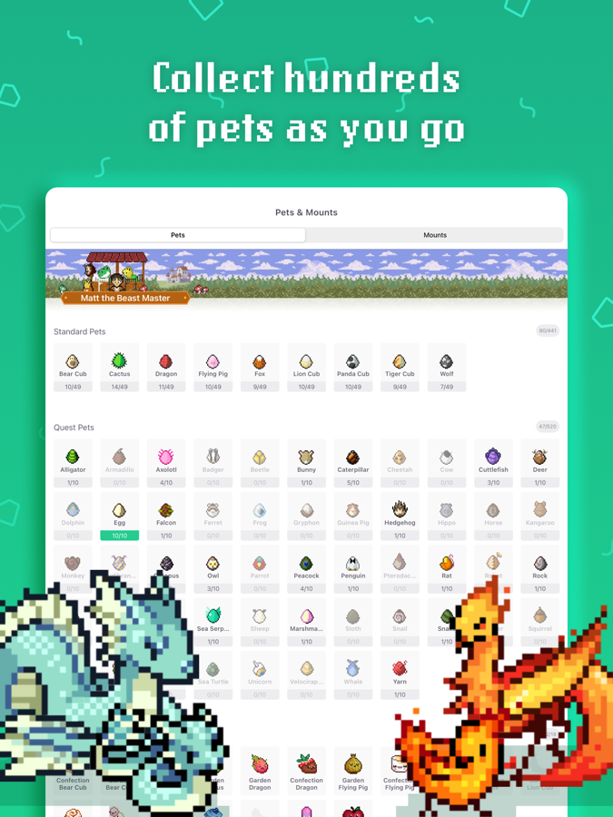

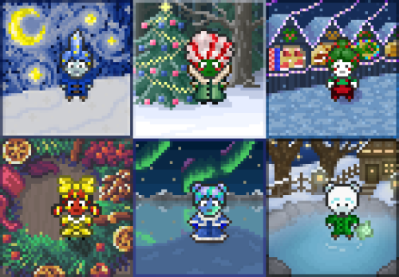

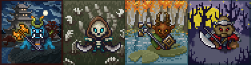

---

## 10. Party, quests & raid bosses

![Party screen "Vice Awakens": a hero-sized boss banner of "Vice, the Shadow Wyrm" pixel art, a participation counter (3/10 Participating), a boss HP bar (gradient red→yellow→green, 1224/1500 HP), a bright orange "21 Damage Done" button, then a MEMBERS list. Each member row shows their avatar in a tile, username with leader/role chip, level, HP/XP mini-bars in red+blue. Critical UX detail: when YOU miss a Daily, OTHER party members take collateral damage — turning social accountability into a survival mechanic.](images/habitica/29-playstore-screenshot.png)

![Party detail page (iPad/landscape): left rail shows the active quest "Vice Awakens" with party-member avatars and their levels, right column is a real-time chat thread with timestamps, mentions, and inline reactions like "[user] sent Blessing for the day" (a buff one party member casts on another). Threading and quoting are supported.](images/habitica/10-appstore-ipad-quests.png)

---

## 11. Challenges (curated task packs)

---

## 12. Achievements & streaks

---

## 13. Profile screen

---

## 14. Smartwatch / Wear OS surface

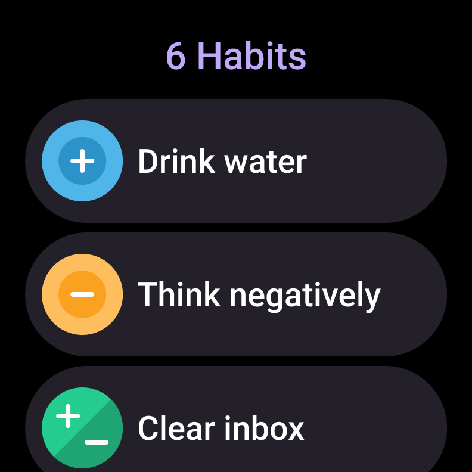

---

## 15. Older Android / legacy UI reference

![Habitica's older Android UI (Wikipedia screenshot, circa 2017–18): purple-themed header with hamburger menu, avatar tile (Lvl 19 Rogue, Gloria B), then a 4-tab top bar (HABITS / DAILIES / TODOS / REWARDS) instead of bottom nav. Notable: floating action button is a "+" with a contextual sub-menu showing "New Habit / New Daily / New Todo / New Reward" as quick-add chips. The colored vertical strip on the left of each task is still present — color persistence is one of Habitica's longest-running visual conventions.](images/habitica/33-wikipedia-android.png)

---

## 16. Brand mascot & on-boarding tone

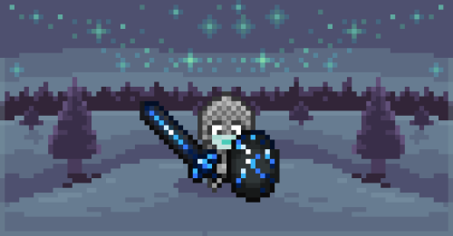

---

## 17. iPad / landscape rewards screen

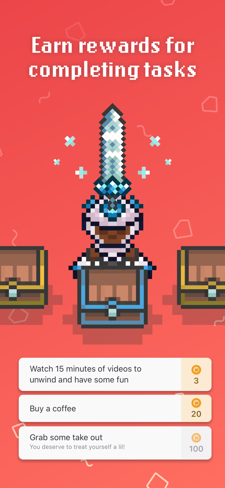

---

## Design language & takeaways

- **Aesthetic fully committed to 16-bit JRPG, not a thin theme layer.** Every UI element — the brown-wood market backgrounds, the gradient HP/XP/MP bars, the chunky pixel font for numerals, the diamond-gem currency icon — is consistent with a fictional SNES-era game world. This is rare in productivity apps and is Habitica's strongest differentiator. The trade-off: zero appeal to users who want a "clean" Notion/Things aesthetic.

- **Dual economy is the killer feature.** Users earn in-game gold that can be spent on user-defined real-life rewards ("Buy a coffee — 20 gold", "Grab some takeout — 100 gold"). This turns productivity into a saving-and-spending loop rather than a pure-grind loop. Most habit-tracker competitors only offer in-app rewards.

- **Permanent HP/XP/MP header is non-negotiable.** Every task screen reserves the top ~25% of mobile real estate for the stat header. This is what makes Habitica feel "RPG" rather than "checklist with a sprite" — but it also means task lists are visually cramped vs. competitors like Todoist that maximize task list density.

- **Color-coded left edge for difficulty, persistent across every task type.** Habits, Dailies, To-Dos all use the same red→orange→yellow→teal→blue stripe on the left of each task row. The color is set at creation time via the difficulty picker (Trivial/Easy/Medium/Hard) and reinforced everywhere — instantly readable signal of where you're succeeding vs. struggling.

- **Negative consequences are explicit, not implied.** HP drops when Dailies are missed. Party members take collateral damage when you miss. Hit zero HP and you "die" — losing a piece of equipment and XP. This is the opposite of most modern habit apps (Streaks, Atomic Habits, etc.) which are aggressively positive-only. The negative loop is polarizing but is exactly why the userbase that loves Habitica calls it "the only thing that worked".

- **Social accountability as a survival mechanic.** Parties of up to 30 turn habit-tracking into a co-op MMO — quest bosses' HP only drops when YOU complete your real-world tasks, and the boss damages the whole party when anyone misses. This is structurally different from "friend feed" social in competitors; it's enforced co-dependence.

- **Content gating via "check-in" streaks.** Quests, equipment, and Armoire items unlock at 7 / 22 / 30+ consecutive logins. Habitica blends pure habit-tracking with collectible-game retention tactics — and unapologetically so.

- **Long-tail collection (480+ pets/mounts) drives multi-year retention.** Where most habit apps lose users at 3-6 months, Habitica's collection mechanic gives engaged users a years-long reason to keep checking in. Each pet has unique pixel art rather than recolored variants — high art investment is part of the moat.

- **Dense by design — five-tab bottom nav, dual stat ledgers, persistent quest HUD.** Habitica deliberately rejects iOS HIG-style minimalism. New users have a steep onboarding curve (Beginner Objectives card is the only concession), and the team's design philosophy seems to be "trust users to absorb the complexity, because that complexity IS the product".
