# Hades — Visual Design Research

## Overview

**Hades** (Supergiant Games, 2020) and its successor **Hades II** (Early Access, 2024) are, for Tend's purposes, **the single best deity-portrait reference in modern media**. Every god in the pantheon receives a distinct visual identity: a signature color, a domain-expressing silhouette, a personality voice that comes through in dialogue, and a "name plate + bust" presentation that has become the canonical UI grammar for "a god is now speaking to you."

This is precisely Tend's design problem. A witchy/pagan/occult daily-routine app where habits are offerings to patron deities lives or dies on whether each deity feels like a **distinct, characterful presence** — not a stock-photo Greek bust, not a generic glowing-rune mascot, not a tarot card. Tend's pantheon needs Hades' discipline: one signature color per deity, one silhouette read at a glance, one tonal voice, one domain-iconography vocabulary. The "boon" mechanic — a deity blesses your run with a domain-flavored gift, presented through a portrait, a name plate, and a single line of in-character dialogue — is also the closest existing analog to a "daily blessing / chosen offering" screen.

Two specific things Hades nailed that nobody else has:

1. **Modernized mythology without losing reverence.** The gods look like fashion-week models in deconstructed Art Deco armor. They are recognizably Olympian (Zeus = lightning, beard, gold; Poseidon = trident, teal, hair like surf) but designed by 2020s character artists, not lifted from a 1955 textbook. Tend wants exactly this: deities a 28-year-old witch on TikTok would recognize and follow.
2. **Personality through palette.** Each god has a 2-color signature (Ares = bone-white + arterial red; Aphrodite = rose + dusty pink; Poseidon = teal + jade; Dionysus = grape-purple + leaf-green). The color codes the boon icons in the HUD, the dialogue name plate, the rays-of-light coming off the portrait, and the trinkets and altars associated with them. The whole game teaches you, mechanically, to read "purple sparkle = Dionysus is offering you something."

The remainder of this document walks through what we captured and what Tend can lift.

---

## Hades 1 Key Art — Zagreus, the Player as Acolyte

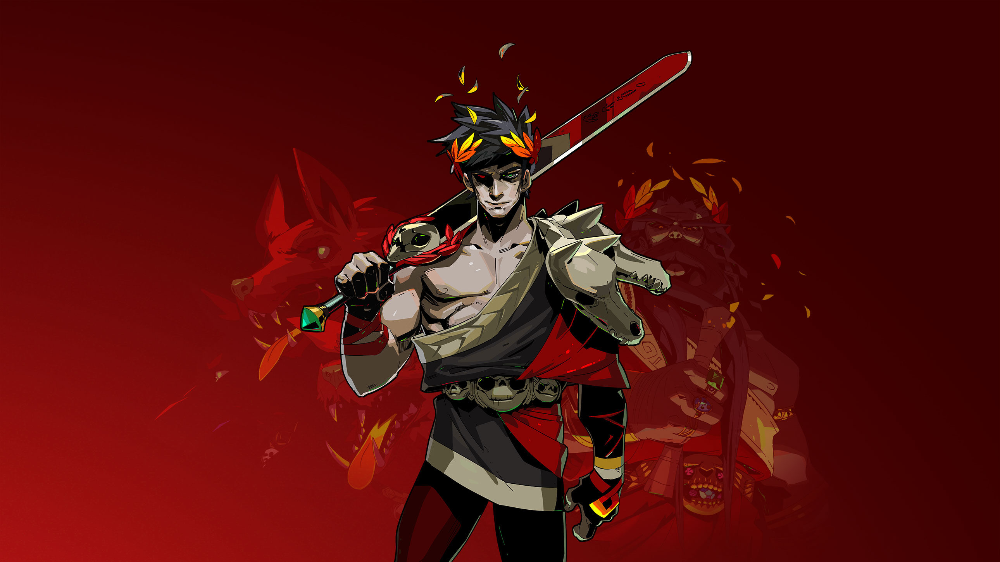

The hero shot. Zagreus stands in front of a blood-red gradient, sword over shoulder, surrounded by faded silhouettes of his patron figures (Cerberus left; Hades right). The composition rule: **the protagonist is solid and colored; the patrons are tinted silhouettes behind them**. For Tend's home screen, this is the template — the user (or a user-avatar) front and center, their chosen deities rendered as faded sentinel-silhouettes behind them, all sharing one palette.

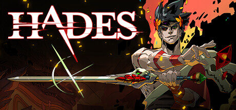

Wordmark treatment: serif capitals with the H lengthened into a dagger-stroke, set against a black ground with one red blood-drip. The "letter as weapon" gimmick is the cleanest piece of "modern occult typography" in games. Tend's wordmark could use the same move — one letter modified into a domain icon (a T extended into a candle, or a D crossed into a sigil).

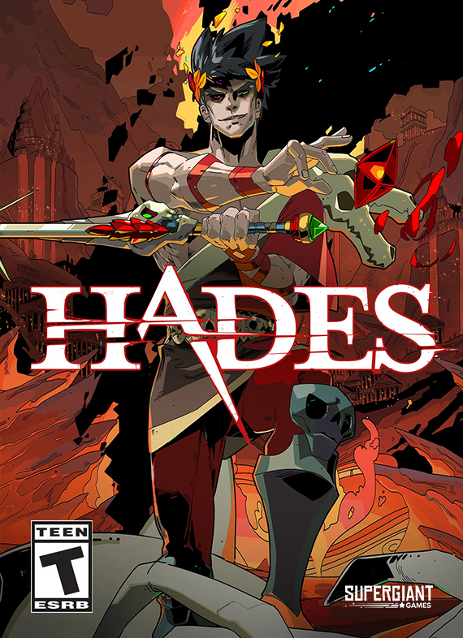

The boxed cover. Vertical, single figure, mid-motion, hard red gradient. The vertical 2:3 ratio is a phone-portrait ratio — Tend's "deity card" mockups should test exactly this aspect.

---

## The Olympian Pantheon — Six Reference Portraits

Hades' design team produced a "name plate + character bust" treatment for every boon-giving Olympian. The format is **horizontal letterbox, character pushed to the right edge, name + title in serif caps on the left, signature color as background field**. This is the highest-density "introduce a deity" UI we've seen anywhere — Tend should copy it almost verbatim for deity selection.

### Aphrodite — Goddess of Love

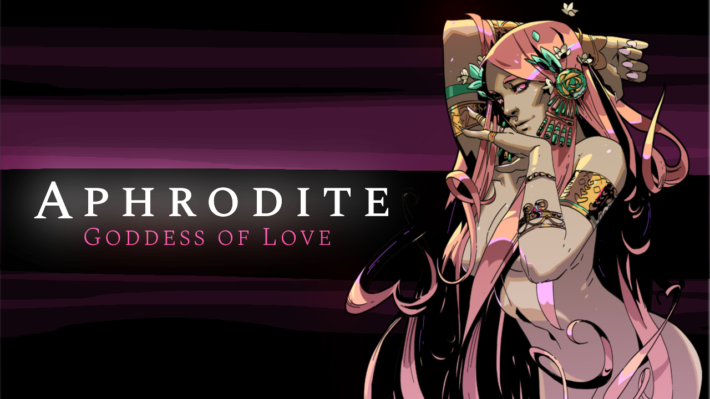

**Signature palette:** rose pink + dusty mauve + magenta black. **Distinctive markers:** flower-crown headdress with cascading petals; cheek piercing; bare shoulder with delicate gold tattoo; eyes half-lidded. **Domain expression:** every line on her is soft and curving — no hard angles. The visual reads "love" before you ever read the title. **Tend lesson:** a deity for love/relationships/self-care habits should be 100% curved silhouettes, soft pinks, and asymmetric jewelry; absolutely no metal armor.

### Poseidon — God of the Sea

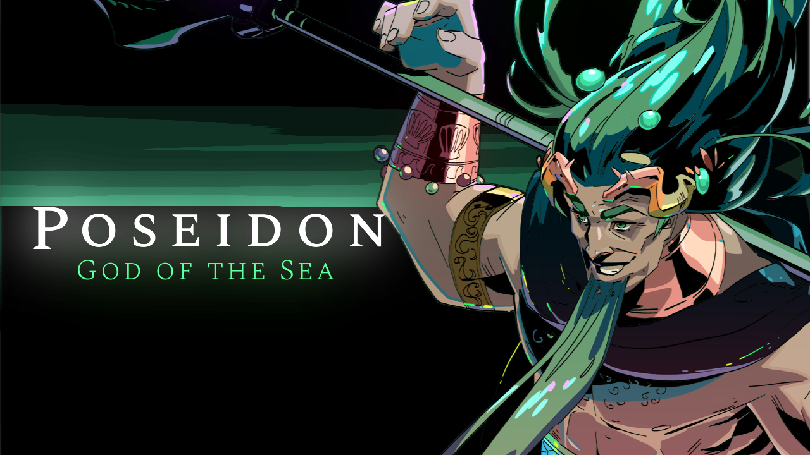

**Signature palette:** teal + jade + foam-white. **Distinctive markers:** hair literally rendered as breaking waves; broad shoulders; trident; an *exuberant* open-mouthed grin (he is the loudest, friendliest Olympian). **Domain expression:** the entire body language is "tidal" — leaning forward, motion lines, asymmetric tilt. **Tend lesson:** the deity for flow/spontaneity/emotion can be the *loud* one. Not every patron has to be solemn. Movement, asymmetry, and a smile differentiate this archetype.

### Ares — God of War

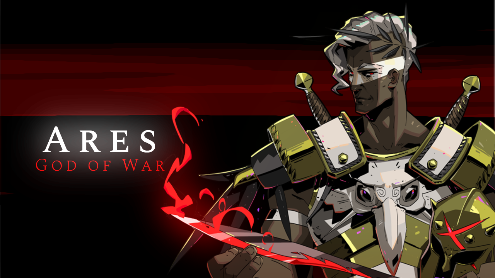

**Signature palette:** bone-white + arterial red + black. **Distinctive markers:** closed eyes (meditative not aggressive — a counterintuitive choice for a war god), white skin and hair, deconstructed Spartan armor with one shoulder bare, sword tip painted red. **Domain expression:** Ares is rendered as *grief* and *discipline*, not bloodlust. The closed eyes recast war as solemn ritual. **Tend lesson:** the patron of difficult/disciplinary habits (cold showers, hard workouts, conflict) should be sober and ascetic, not snarling. Hades shows you can use red without making it edgy.

---

## Adjacent Beings — Patrons of the Marginal

Beyond the twelve Olympians, Hades casts a wider net: the Erinyes (Furies), primordials, sleep-and-death twins. These are arguably the most useful references for Tend, because witchy/pagan apps tend to lean **chthonic** — Hecate, Persephone, Cerridwen, Lilith, the Morrigan — not just the sunny Olympians.

### Thanatos — God of Death

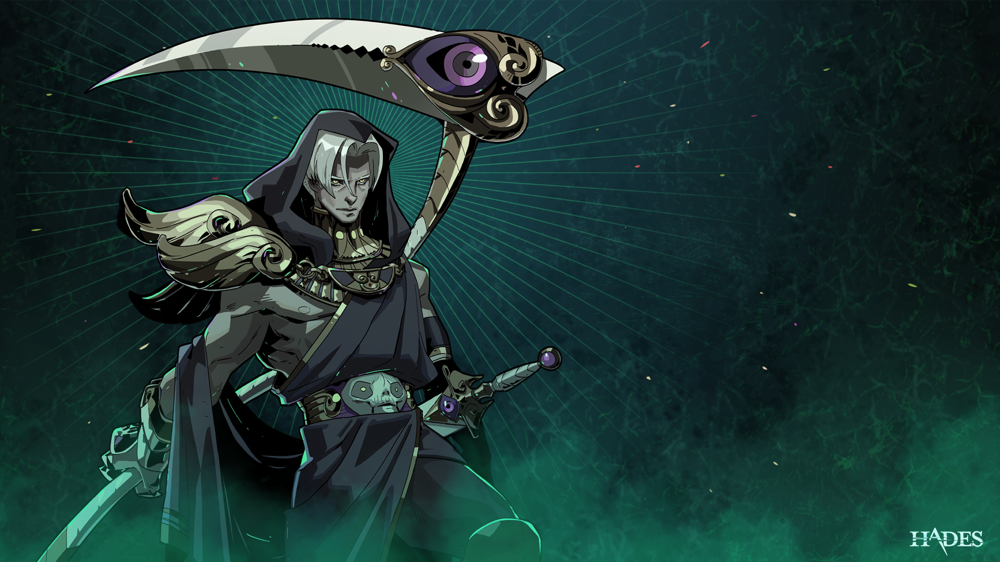

**Signature palette:** teal + lavender + silver + bone. **Distinctive markers:** lowered hood, melancholy half-smile, massive ornamented scythe with a single jewel-eye in the blade socket, **a halo of teal rays radiating behind him in sunburst geometry**. **Domain expression:** death rendered as gentle, patient, and *elegant* — not scary. The sunburst behind him is straight Art Deco / Maxfield Parrish, framing him like a saint icon. **Tend lesson:** a deity of endings/release/letting-go (the patron for "quitting smoking," "ending a relationship," "shadow work") should use this exact framing: cool palette, sunburst halo, sad-eyed but compassionate. Death as healer.

### Chaos — Primordial

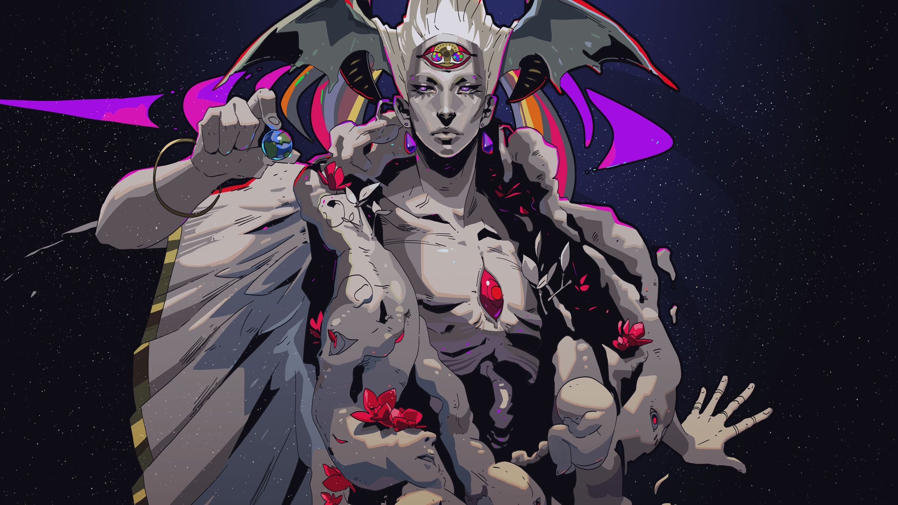

**Signature palette:** prismatic (rainbow shards) + bone-white + black void + a single fuchsia accent. **Distinctive markers:** four arms; iridescent prism-shard wings; chest-jewel; eyes closed in serene trance; surrounded by *another set of disembodied hands and red lotus blooms*. **Domain expression:** primordial = pre-form, pre-gender, pre-color (hence prismatic refraction rather than a single hue). **Tend lesson:** for "non-pantheon" or "self-as-deity" concepts (the inner witch, the higher self, the source), this is the visual template — androgynous, prismatic, surrounded by repeated body-part motifs that read as "more than human."

### Dionysus — God of Wine

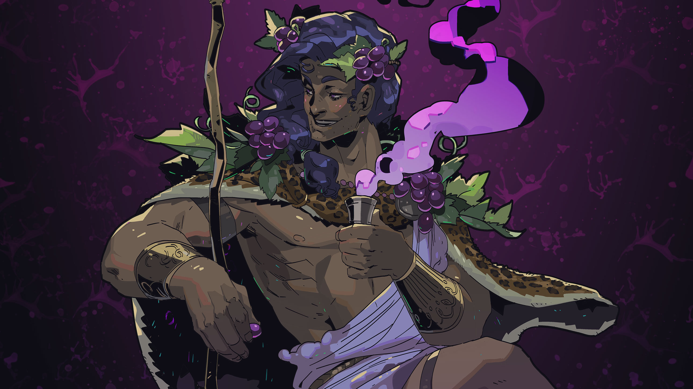

**Signature palette:** grape-purple + leopard-tawny + leaf-green + champagne pink. **Distinctive markers:** grape clusters woven through dark indigo hair; leopard-spotted fur sash; chalice of fizzing rosé; loose body language, smiling, **the only Olympian rendered with body fat and softness**. **Domain expression:** indulgence, rest, the social. **Tend lesson:** the patron of pleasure/rest/celebration cannot be muscular and chiseled like the other gods — soften the silhouette, add body diversity, include a *prop in hand* (the chalice is the read). For a habit-app deity of "celebrate small wins," this is the move.

### Alecto and Tisiphone — The Erinyes (Furies)

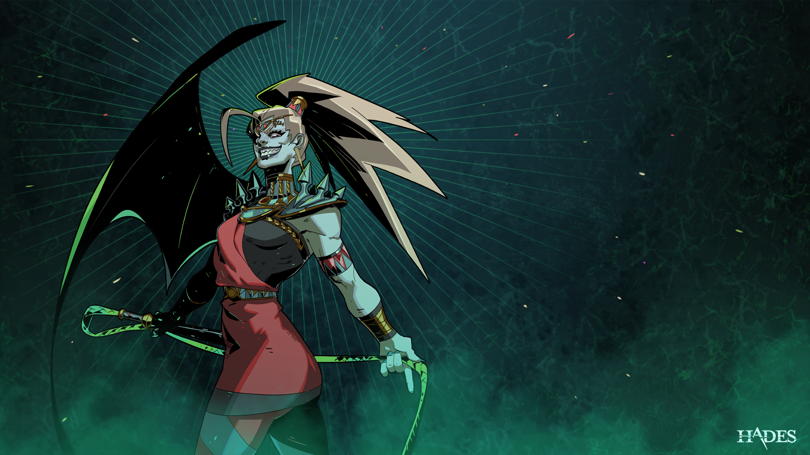

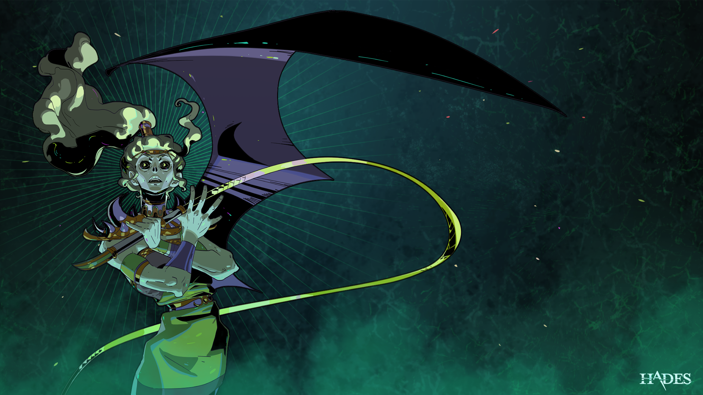

The three Erinyes (Megaera, Alecto, Tisiphone — Alecto and Tisiphone shown above, Megaera in the gameplay shots below) are a master class in **sister-design**: same costume language, same wing shape, same sunburst frame, but each with a distinct color and personality (Alecto = arterial red rage; Tisiphone = wide-eyed traumatic vengeance; Megaera = jealous blue-purple). **Tend lesson:** if Tend wants a trio of related deities (Maiden/Mother/Crone; Past/Present/Future; Sun/Moon/Earth), this is the recipe — keep 80% of the design language identical and vary only palette, prop, and expression.

### Megaera, the Fury — In Battle

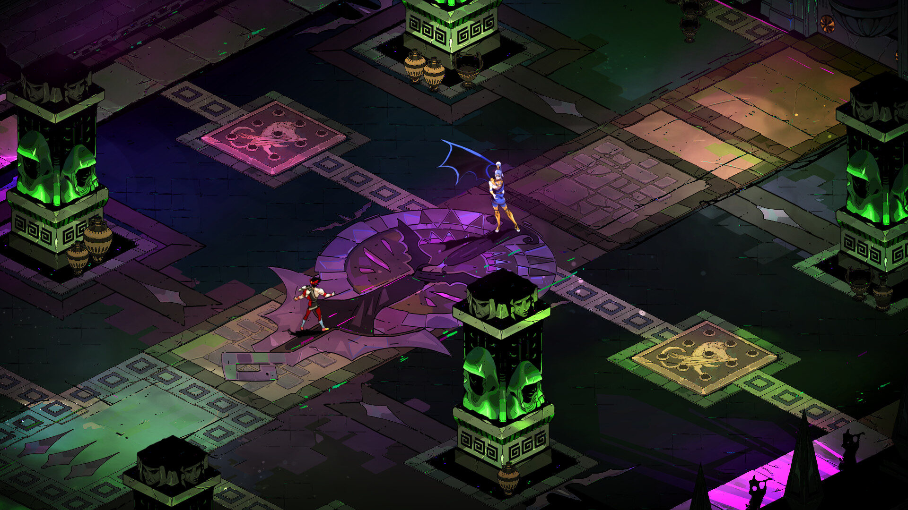

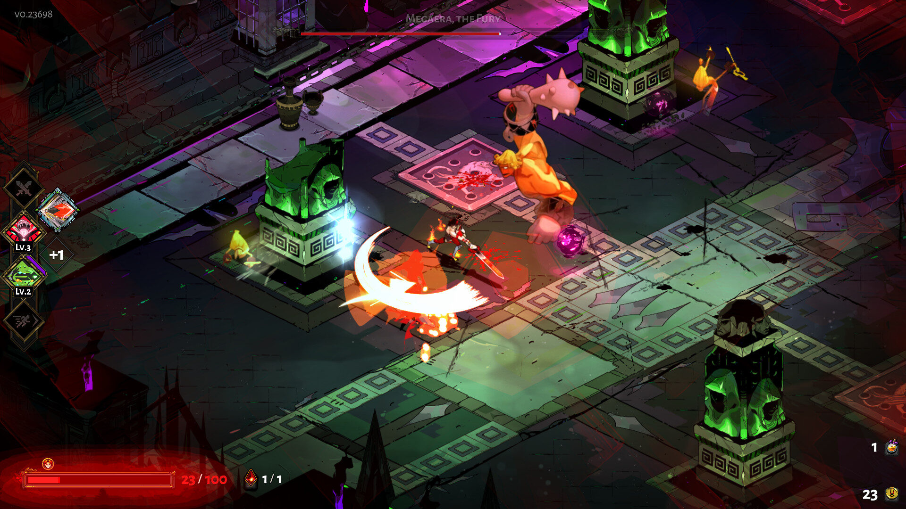

These show how a deity's signature palette **carries into environment lighting** — Megaera's domain is lit in her green and purple. When she enters, the room *is* her color. **Tend lesson:** when a user opens a deity's altar screen, the entire UI palette should shift to that deity's two-color signature. The phone becomes a temple to that god for the duration of the interaction.

---

## Hades 1 Dialogue UI — The Boon Conversation

This is the single most important UI pattern in Hades for Tend. Every time a god offers a blessing, the screen presents:

1. A large left-anchored **character portrait** (60–70% of screen height, head at the top, body cut off mid-thigh).
2. A horizontal **name-plate banner** with the deity's name in serif caps + their title in italic underneath, in the deity's signature color, with a small ornamental flourish in the corner (a flame for Athena, a leaf for Dionysus, etc.).
3. A **dialogue box** to the right of the portrait, parchment-textured, with a single short paragraph of in-character speech.
4. The 3D game world stays visible but desaturated and slightly blurred behind, so the deity feels overlaid on reality, not in a separate menu.

### Athena — Goddess of Wisdom

The canonical example. Athena: lapis-blue Corinthian helmet, gold armor, owl figurine in left hand, owl-stamped shield, severe expression. Her name plate has a tiny flame ornament in the leading edge — every deity gets one. The dialogue is **first-person, in-character, conversational** ("you reside in" — she addresses the player directly). **Tend lesson:** copy this format wholesale for the daily-blessing screen. Portrait left, name plate, parchment box, one line of in-character speech that gives daily intention. The dialogue can be procedurally selected from a 20-line pool per deity, exactly how Hades does it.

### Zagreus and Hades (Player and Father) — House Hub

Same UI grammar applied to the player character. Note **Cerberus** (the three-headed red dog) lounging in the background — the hub space is alive with characters going about their business while you talk. **Tend lesson:** the home screen can have ambient characters (a familiar/cat, other deities visible at distance) that exist as scenery, not as interactive elements. This makes the world feel populated and ritualized rather than empty.

---

## House of Hades — The Hub as Sanctified Space

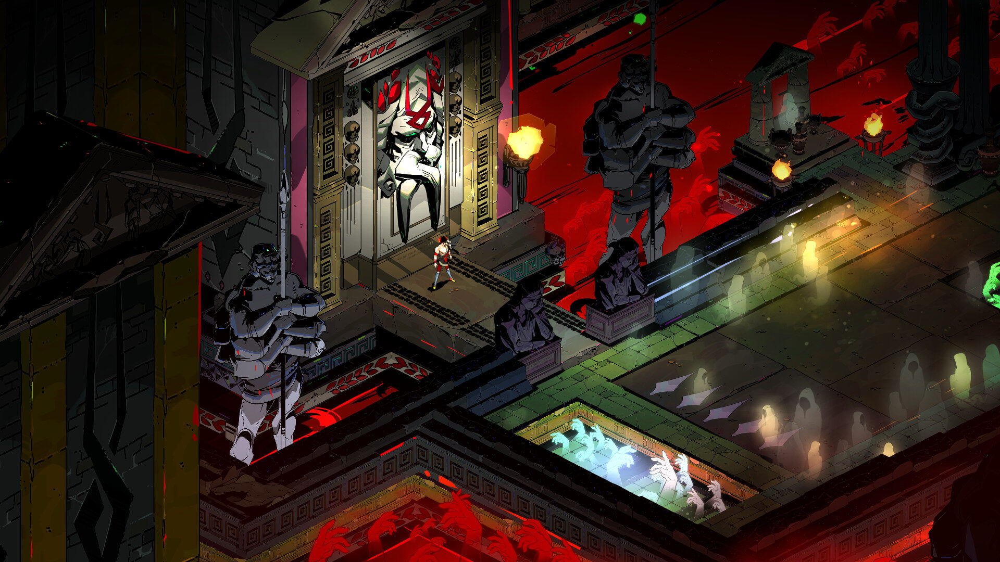

The hub is the **always-returned-to home** — a literal underworld manor with the great door (gameplay entrance) front and center, side rooms for upgrades, training, the Mirror of Night, the contractor. The architecture is symmetrical, vertical, gold-and-obsidian, with red-orange torchlight. **Tend lesson:** the app's home view can be an *interior* (a witch's cottage, a personal altar room, a temple) where each interactable is a piece of furniture (the altar = daily offering, the bookshelf = lore library, the cauldron = mood log, the door = "go out and live the day"). Diegetic UI: the room *is* the menu.

---

## Gameplay Arenas — Each Realm as a Color Statement

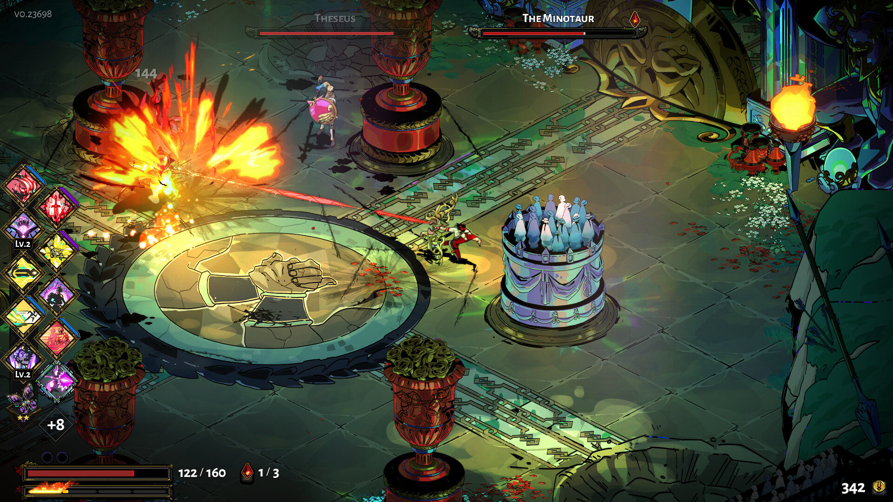

**Tartarus is green.** Underworld stone, jade torches, all green-cyan-teal lighting.

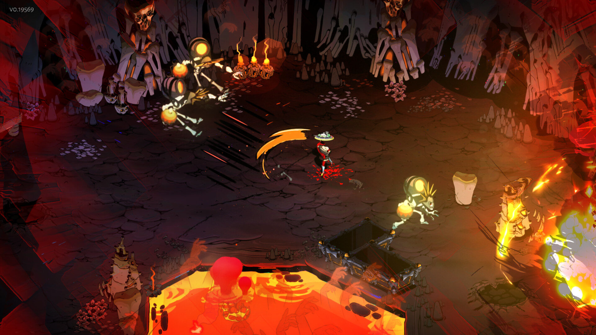

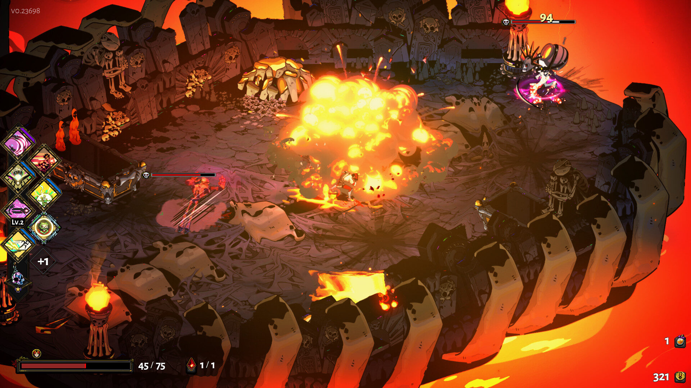

**Asphodel is orange.** Lava, magma, red-orange skies, bone architecture.

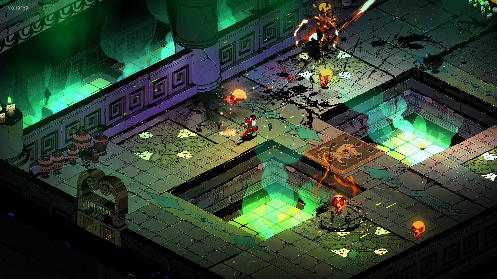

**Elysium is mixed: jade + magenta + gold.** Heroic afterlife, lush, ornate.

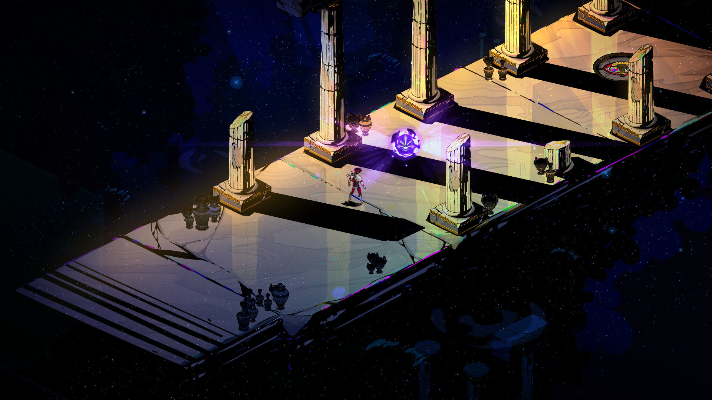

**Temple of Styx is starfield + gold marble** — the in-between.

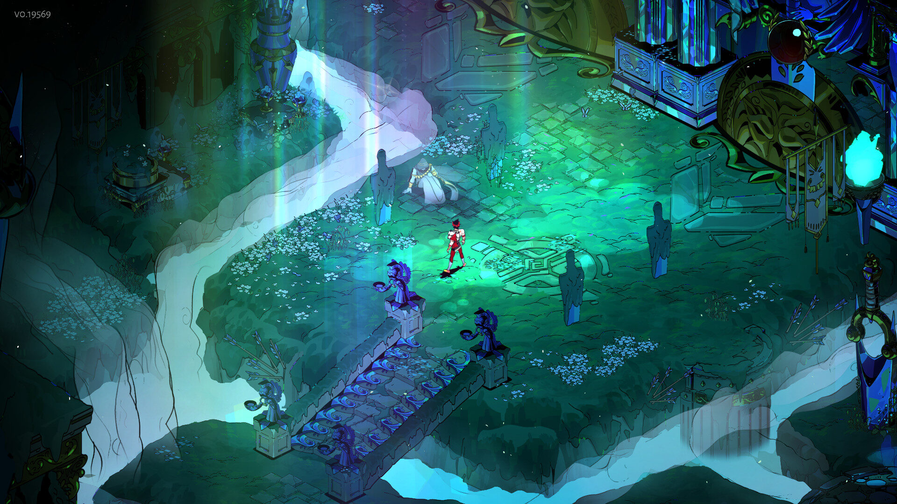

**Tend lesson:** if the app has multiple "rooms" (different goals, different sections, different deities), each must commit to a single dominant hue. Color is how the player knows where they are without reading a label. Resist the temptation to make every section "purple witchy" — give each its own.

---

## Hades 2 — Melinoë the Witch (Direct Tend Reference)

Hades II promotes a *witch* to protagonist. This is unusually close to Tend's actual brand. **Melinoë** is a chthonic princess trained by **Hecate** to perform magic against Chronos. She uses sigils, a magic torch, an athame, lunar imagery. The aesthetic shift from Hades 1 to Hades 2 is from *Mediterranean-Mediterranean classical heroic* to *Eastern-European pagan witchcraft* — and that shift is exactly Tend's territory.

### Hades 2 Key Art

**Signature palette change:** Hades 1 was red-on-black; Hades 2 is **emerald green on black**. The wordmark itself is green, the sigils ringing the title are green. **Body language:** Melinoë is arms-out, blades down, eyes lowered — a *summoning* pose, not a heroic strike. She is a witch first, a fighter second. **Tend lesson:** Tend's brand color should be a moon-witch green or violet, not a "spooky" red. Green codes ritual herbalism, plant magic, moonlight, ether — the actual mood of contemporary witch practice.

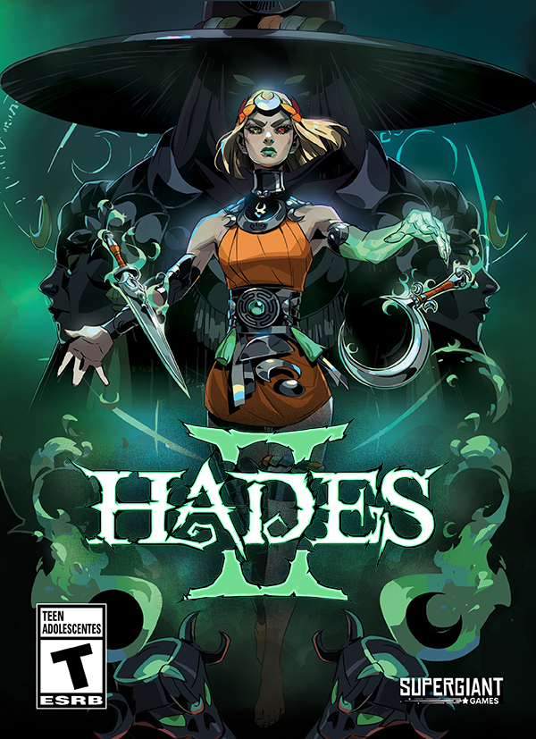

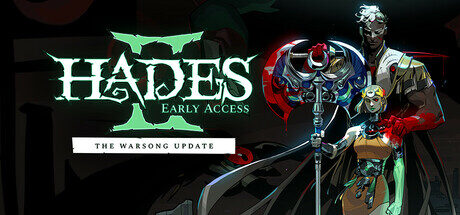

### Melinoë — The Witch Protagonist

The new dialogue UI is **darker, more occult, and crescent-shaped**. Note the differences from Hades 1:

- The name plate is no longer a flat horizontal banner — it's a **crescent moon** with the name set inside.
- The font shifted: still serifed, but with sharper terminals.
- The portrait is more 3/4 length, and crucially **her hands are visible** (the left hand glows green; in casting). The "glowing palm" gesture telegraphs *this character does magic*.
- Sigil tassels and beadwork hang off the dialogue frame — diegetic ornament.

**Tend lesson:** for the witch genre specifically, abandon the strict horizontal name plate and embrace **crescent / circle / arched** UI shapes. Add **dangling charm beads** and **floating sigils** as frame ornament. Use the **glowing palm** as a universal "magic is happening" signifier — it can mark the "complete this offering" CTA.

### Hecate — The Headmistress

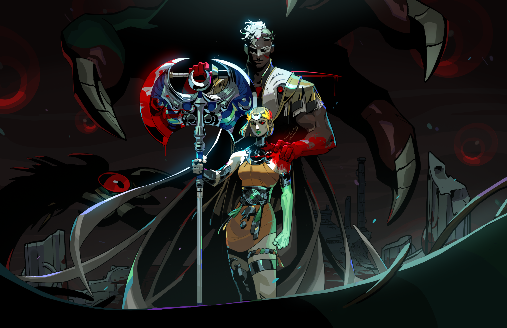

**Hecate** is the headmistress of Melinoë's coven and the closest thing to a "patron deity" character in any modern game — exactly Tend's design problem. Her design:

- **Tall, dark-skinned, lean** — she has visible age and gravitas, unlike the Olympians.
- **Silver-white braided hair** — the elder-witch signifier.
- **A staff topped with a moon-mask** that doubles as her domain-icon (Hecate = crossroads, moon, gateways).
- **Layered fabric robes in muted earth tones**, with one red shoulder accent.
- **A red rune-eye in the moon-mask** — her color carries through her gear, not her clothes.

**Tend lesson:** This is the visual archetype for the app's primary "guide" deity if Tend has one. Older, weathered, with **a single signature implement (the staff/mask) that is more recognizable than her face**. Tend's onboarding deity (the witch who teaches the user the system) should be a Hecate, not a Melinoë.

### Hades 2 Witchy Environments

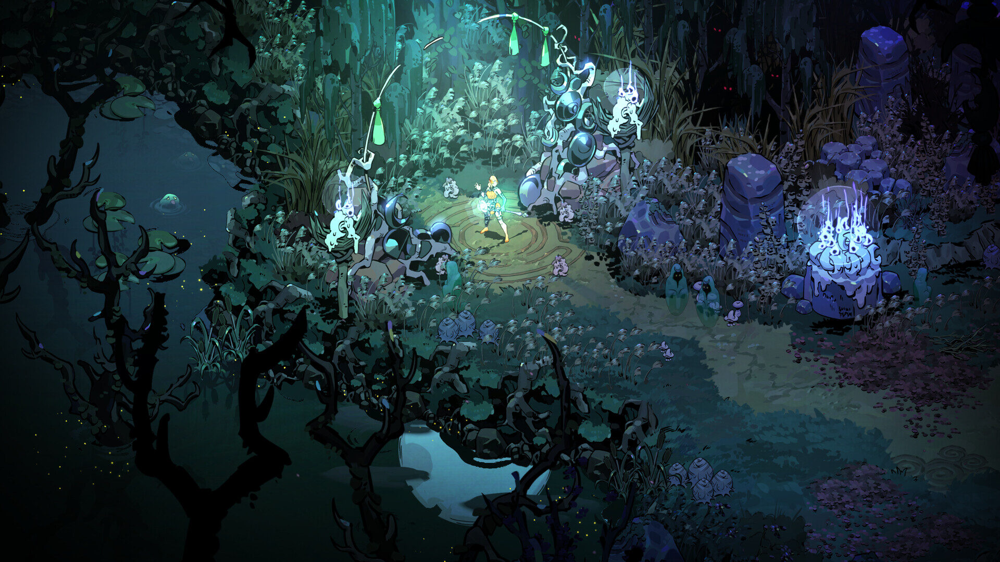

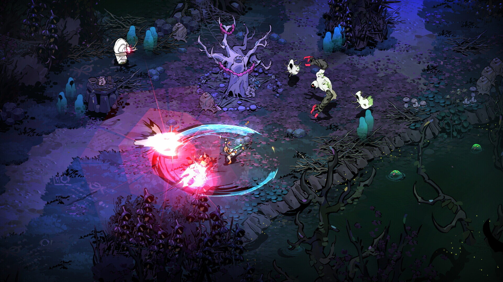

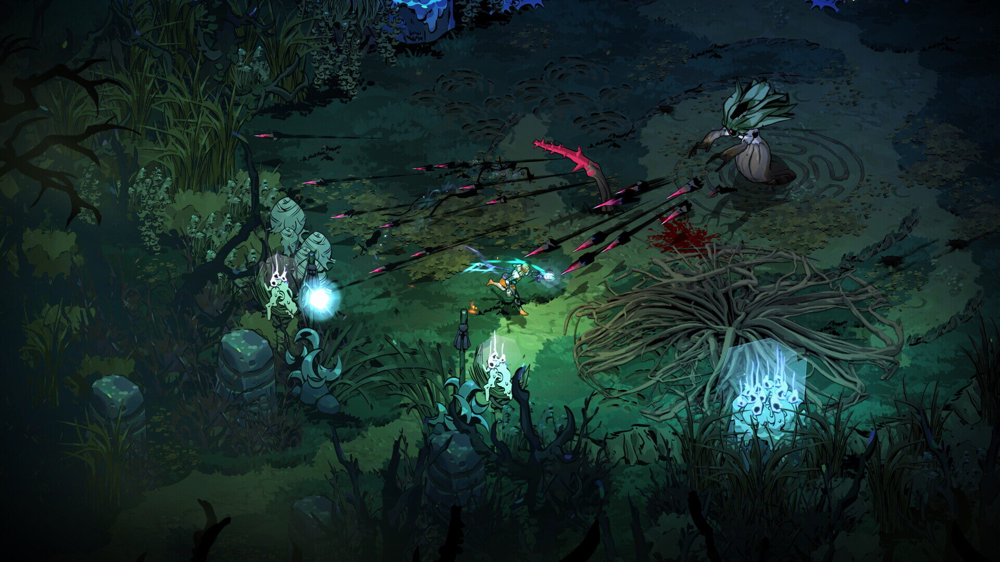

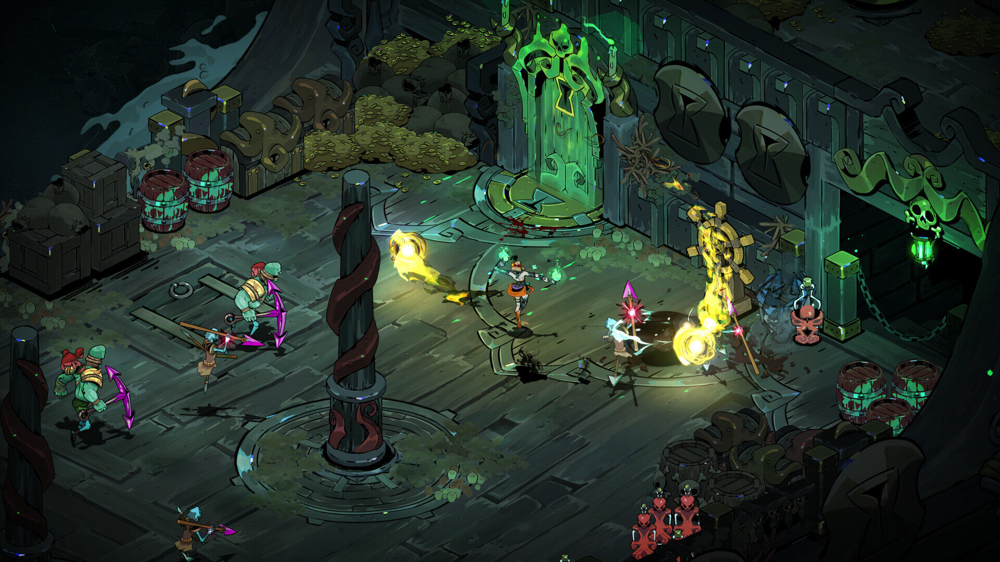

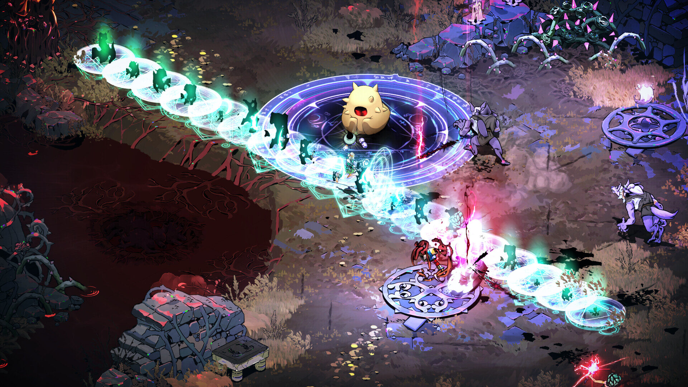

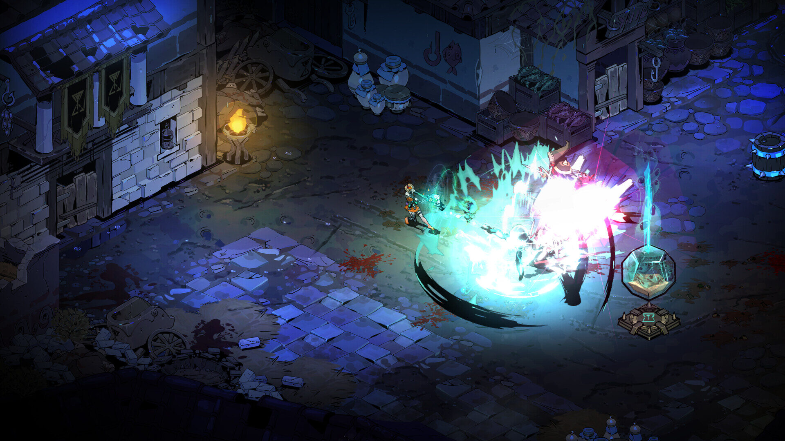

The Hades 2 environment palette is **moonlit forest, mossy stone, glowing mushroom, sigil-circle, swamp**. This is *exactly* the visual vocabulary Tend's environment art should use: ferny green, witchy teal, lichen, twilight purple, gold candlelight. **Crucially: no neon, no red.** Hades 1's underworld is hellish; Hades 2's is *enchanted*.

### Nemesis — Goddess of Retribution (H2)

Compare to Hades 1's Athena: same **horizontal-portrait + name-plate + dialogue-box** grammar, but **darker UI chrome**, **crescent name-plate shape** (instead of flat banner), **monochrome black background** (instead of parchment), and **a tiny "next" indicator (the green orb) bottom-right**. The grammar is preserved, the skin is upgraded for the witchy aesthetic.

The character bust *can* be lifted out of the dialogue UI and used as a wallpaper / lock-screen / loading screen, demonstrating the **portrait works at every scale** from inline avatar to full-bleed hero. Tend should design each deity portrait this way: legible at 64px (list-row avatar) and at 2160px (lock screen).

### Melinoë + Nyx — Eclipse Hero Art

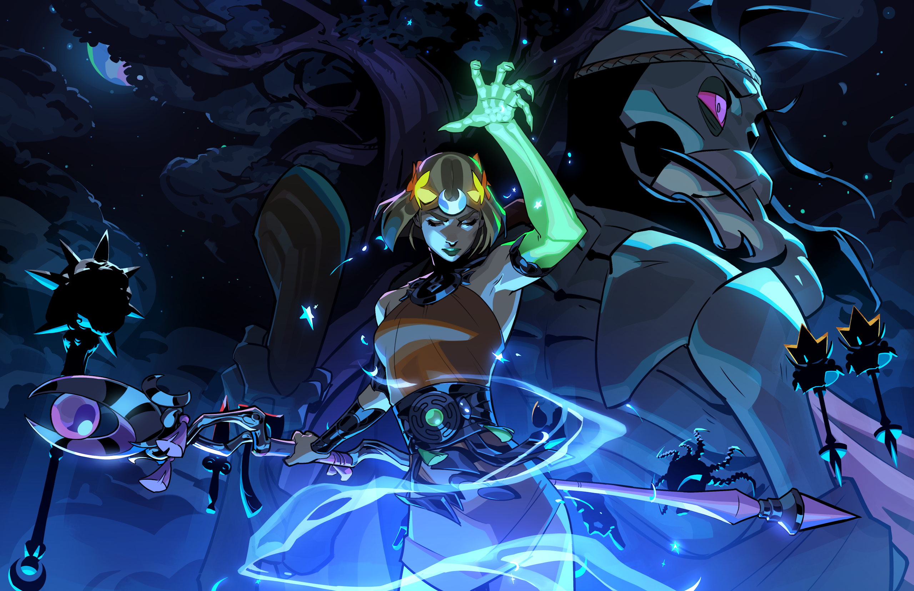

This piece shows **two characters in compositional dialogue** — Melinoë active in foreground, Nyx passive (eyes closed, mask-faced, immense) behind. The visual storytelling is "the protégé is enacting the will of her teacher." **Tend lesson:** when a user is performing an offering, the deity should loom larger behind them in the screen composition. The user is small and active; the deity is large and still.

---

## Hades 2 Page Background — Minimal Logomark

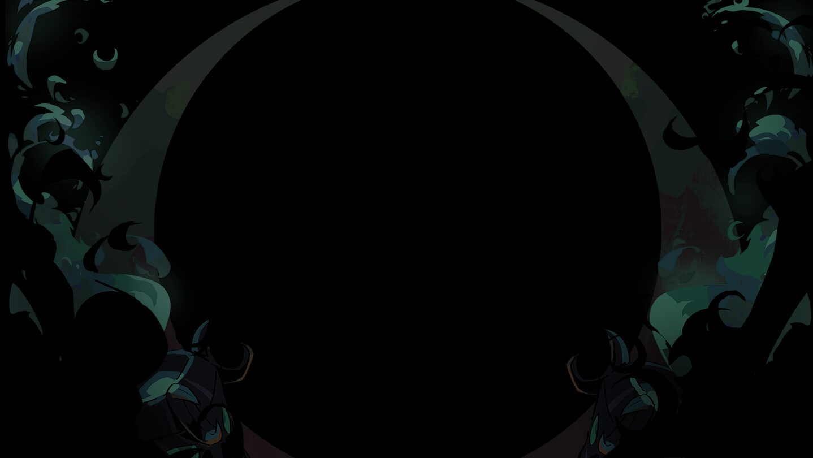

The Steam page background is almost pure black with a single thorned-eclipse ringel. **This is the move for app loading screens and splash:** a single sigil-as-aperture, surrounded by ornamental thorn/vine/sigil silhouettes that bleed off-frame. No text, no logo, no chrome. The branding *is* the sigil.

---

## Design Language & Takeaways for Tend

1. **Each deity gets exactly two signature colors.** Not three, not "a palette." Ares is bone-white + arterial red. Aphrodite is rose + magenta. Poseidon is teal + jade. Lock the pair, then propagate it to the deity's portrait, name plate, boon icons, altar lighting, and any environmental tinting. The user learns the pantheon by color before they learn it by name.

2. **The "name-plate banner" UI is canonical.** Horizontal banner, serif caps for the name, italic small caps for the title ("ATHENA / Goddess of Wisdom"; "HECATE / Witch of the Crossroads"), tiny ornamental flourish (flame, leaf, moon, key) in the leading edge. Tend's deity-selection cards and dialogue overlays should both use this shape.

3. **Portrait + parchment dialogue is the offering-screen template.** Large left-anchored deity portrait, a single line of in-character speech in a parchment box to the right, world dimmed behind. Procedurally pull from a 15–25 line per-deity dialogue pool so the deity never says the same thing twice in a week.

4. **Boon = daily blessing.** Hades treats a god's gift as a one-line offer ("Lightning Bolt: +15% damage on next attack") attached to the character's portrait and color. Tend's daily-blessing screen is literally this: a deity says one line, you choose to "accept" one of 2–3 offered intentions/affirmations, the choice carries that god's color into the day's UI.

5. **Domain expression through silhouette.** Every Hades god is identifiable as a 200-pixel silhouette: Aphrodite by petal-headdress, Poseidon by trident-and-wave-hair, Ares by Spartan-shoulder-and-sword, Hecate by moon-staff. Tend's deity icons need to pass this test — readable as a black silhouette in a list row.

6. **Modern faces, ancient costumes.** The gods look like 2025 cover models in deconstructed mythological armor. Bare shoulders, asymmetric drape, contemporary makeup, multi-ethnic. This makes them *aspirational* rather than dusty. Tend's deities should be illustrated by someone who's seen *Arcane* and *Vox Machina*, not someone copying Roman statuary.

7. **Personality through expression and pose.** Ares meditates with closed eyes (war as discipline). Poseidon laughs (sea as joy). Thanatos half-smiles sadly (death as mercy). Aphrodite gazes sidelong (love as knowing). Pose the deity to telegraph the *aspect of the domain you want the user to invoke* — not the deity's most famous feature.

8. **Sister-trinity rule.** When you have a related set (the three Furies; Maiden/Mother/Crone; Sun/Moon/Star), keep 80% of the costume language identical and vary only color, prop, and expression. The viewer instantly reads "these three belong together."

9. **The hub as diegetic interior.** Hades' "House" is a literal underworld manor where every game system is a piece of furniture (the great door, the Mirror of Night, the contractor's bench, Skelly the training dummy). Tend's home should be a witch's cottage where the altar is the daily ritual, the bookshelf is the lore codex, the cauldron is the mood log, the door is "go live your day."

10. **Environment color is identity.** Tartarus is green, Asphodel is orange, Elysium is jade/magenta. When the user enters a deity's altar, the entire screen tints to that deity's palette. The phone *becomes* a temple to that god for the duration.

11. **Art Deco sunburst as halo.** Thanatos, the Furies, and Hades 2's title art all use **sunburst ray-lines emanating behind a centered figure** as their composition. This is the modern-mythology halo. Tend should bake this into the deity-portrait template — every god gets a colored sunburst behind them at 30% opacity.

12. **Hades 2 = the right reference for witch app.** Hades 1 is heroic-Mediterranean (red, gold, marble). Hades 2 is occult-pagan (green, silver, moonlit forest, mushroom, sigil, athame, herbal). Tend should weight 80% toward Hades 2 references and 20% toward Hades 1. The aesthetic of *witch* is Hades 2.

13. **Ornament with charms, beads, and sigils, not chrome.** Hades 2's UI hangs **dangling beadwork** off the dialogue frames and uses **sigil tassels** as decorative anchors. Tend should do this — UI cards have charm-cords dangling from corners, dialogue boxes have sigil-clasps, lists have tasseled dividers. Diegetic occult ornament.

14. **Glowing palm = magic CTA.** Melinoë's left hand glows green when she casts. Make the "complete this offering" / "accept this blessing" button feel like a glowing palm — soft outer glow in the deity's signature color, brightens when held, releases particles when tapped.

15. **Codex as lore library.** Hades' codex slowly fills out — one entry per character met, with portrait, name, title, and a written entry. Reading codex entries is the *bedtime* meta-game. Tend's lore section should work the same: one page per deity, unlocked by repeated interaction, written in voice, with portrait at top and journal-style notes. This is the "deity correspondence library" the brief calls for.
