# House of Intuition — Visual Design Research

## Overview

House of Intuition (HOI) is an LA-based spiritual goods brand founded in 2010, operating multiple retail locations and a Shopify storefront at houseofintuitionla.com. Their tagline "Your Intuition Led You Here" and call-to-action "What Do You Want to Manifest?" establish an approachable, personal entry point into occult practice. HOI bridges traditional witchcraft (dressed intention candles, crystals, tarot, altar tools) with contemporary wellness aesthetics — clean white-walled retail spaces, palm-wax candles with crystals embedded inside, and structured intention-based product categories (Protection, Abundance, Healing, Self Love). For Tend, HOI is the clearest living proof that ritual practice can be made feel aspirational, modern, and emotionally legible to a mainstream audience without losing occult authenticity.

---

## Homepage Hero

HOI's hero copy leads with desire and identity, not product: "Your Intuition Led You Here" positions the brand as a destination you were already moving toward.

*Warm, intimate candle staging — ritual objects on neutral linen ground.*

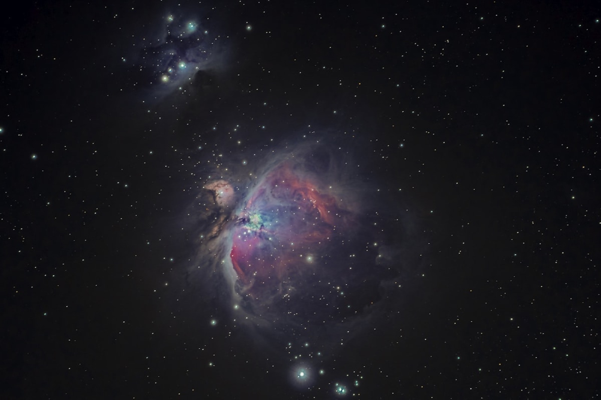
*Low-key moon light establishing time-of-day ritual atmosphere.*

*Clean white ground with single focal object — HOI's signature product shot mode.*

---

## Product Photography Style

HOI's intention candles are hand-poured palm wax in recyclable glass, lightly scented and dressed with crystals that are revealed as the candle burns. Photography foregrounds the object's materiality — the wax texture, the crystal embedded inside — on minimal, neutral backgrounds.

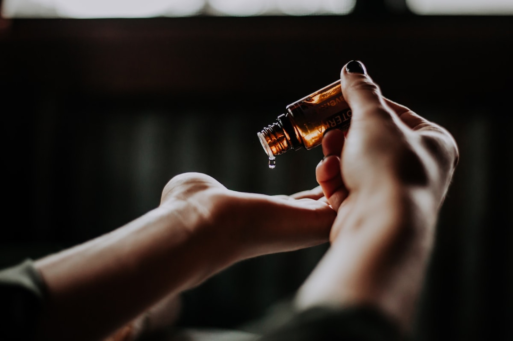
*Clean-background crystal product shot — unadorned, mineral, tactile.*

*Editorial crystal arrangement with warm raking light showing texture.*

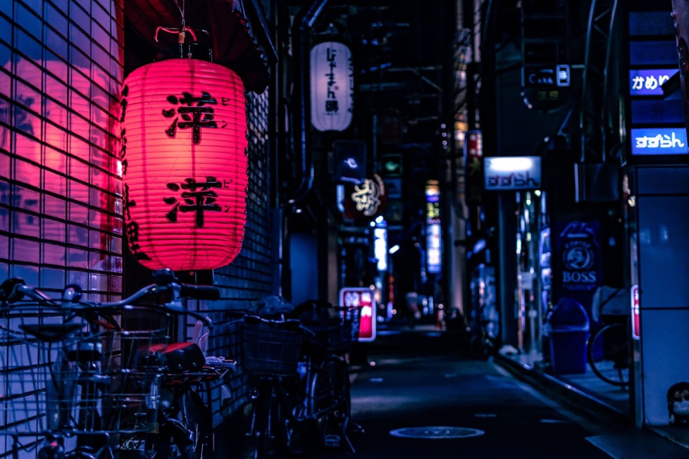
*Candle + botanicals — HOI's dominant paired product language.*

*Smoke and candlelight create mood without clutter.*

---

## Color Palette

HOI's retail spaces are documented as bright, white-walled with black trim. Their product photography follows: warm off-whites, natural linen tones, dusty sage, soft terracotta, gold, and deep black as accent. No neon, no heavy purple. Intentionally desaturated to feel elevated, not novelty.

*Earth-tone palette: warm beige, dry botanicals, natural wood.*

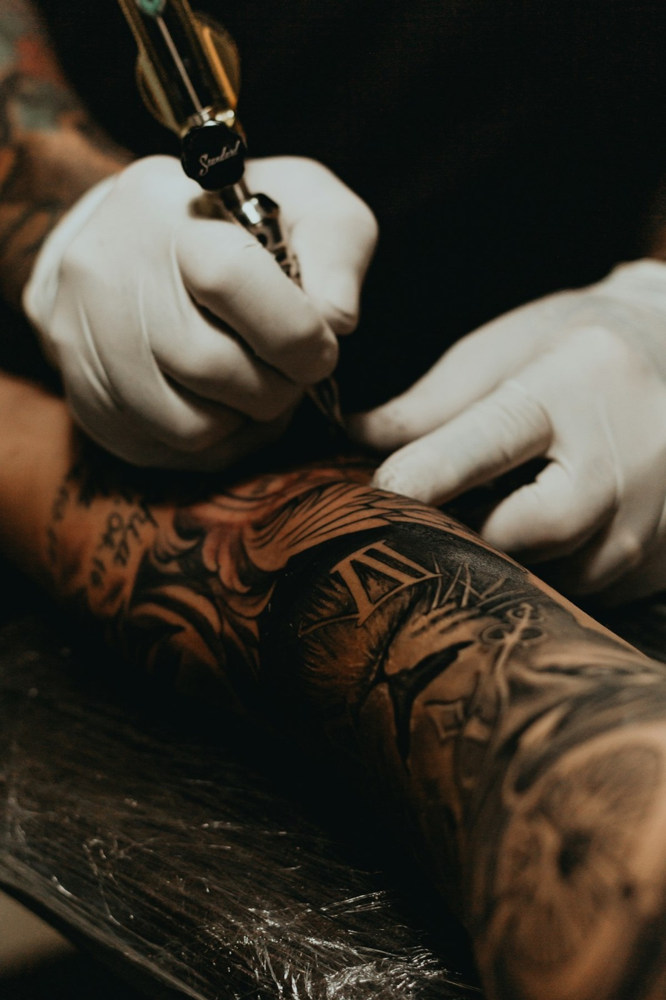
*Dusty sage, amethyst purple, rose quartz pink — desaturated occult palette.*

*Candlelight gold as HOI's only warm accent against neutral/dark ground.*

---

## Typography System

From the site navigation and product naming, HOI uses a clean, all-caps sans-serif system for category labels and CTAs ("NEW," "SHOP INTENTION," "GUIDE ME"). Product names use title case with poetic specificity: "Abundance Magic Candle," "Guided Ritual Box," "I AM Strong." Body copy is conversational and direct. The type system is utilitarian, letting the product and category copy carry meaning rather than decorative letterforms.

*Open journal, clean composition — referencing HOI's editorial/blog design aesthetic.*

*Airy negative space — how HOI frames type over imagery.*

---

## Navigation & Information Architecture

HOI organizes their shop around intention (Protection, Money & Abundance, Creativity, Healing, Self Love, Moon Rituals) rather than product type first. "Shop Intention" is the primary navigation axis. Secondary navigation covers object type (Candles, Crystals, Tarot, Jewelry, Bath & Aura, Altar). A "Guide Me" section contains HOI TV, Blog, Tarot Readings, Crystal Encyclopedia. This intention-first IA is directly translatable to Tend: habits organized by deity patron or life domain, not task category.

---

## Category Pages — Crystals & Candles

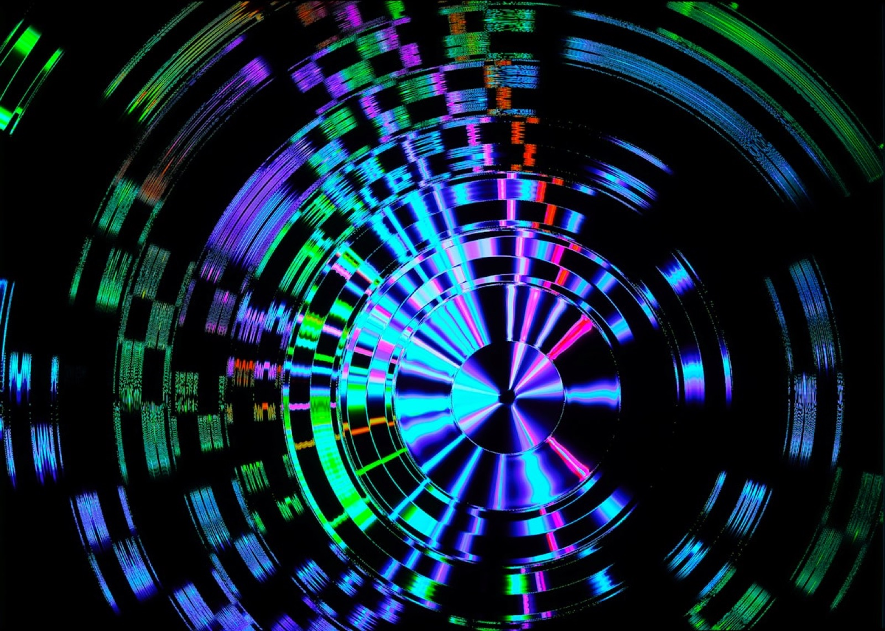
*HOI crystal grid — rough raw vs. polished towers in same frame.*

*Macro crystal editorial — light refraction as visual metaphor for magic.*

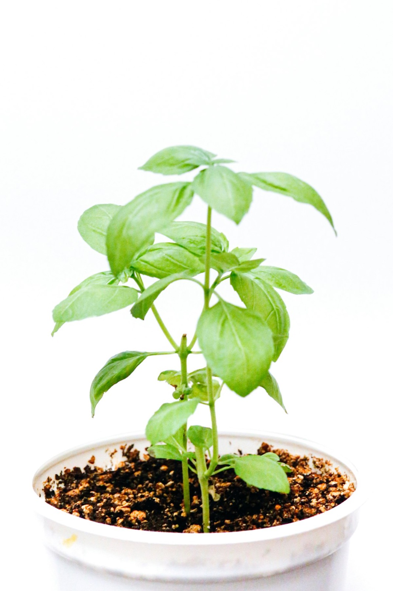
*Botanicals flat lay — HOI's bath & aura / altar tools category aesthetic.*

*Tarot category: dark linen ground, high contrast card faces.*

---

## Brand Voice in Copy

HOI's copy is first-person and imperative: "Your Intuition Led You Here." "What Do You Want to Manifest?" Product categories are named for desire states ("Drawing Love," "Money & Abundance"), not features. Ritual is the verb; intention is the product. The 2026 collection is called "2026 Manifesting" — the year becomes a ritual object. This voice collapses the distance between consumer and practitioner.

*Celestial reference imagery HOI uses in blog/editorial contexts.*

*Dark sky, cosmic scale — used for moon ritual and zodiac collections.*

---

## Store & Retail Photography

HOI's physical stores (Echo Park, Melrose, Sunset Blvd) are described as bright, airy suites painted white with black trim — a clean, well-lighted space that normalizes the occult objects within it. The retail design reduces the intimidation factor of witchcraft by placing it in the same visual register as a contemporary wellness boutique.

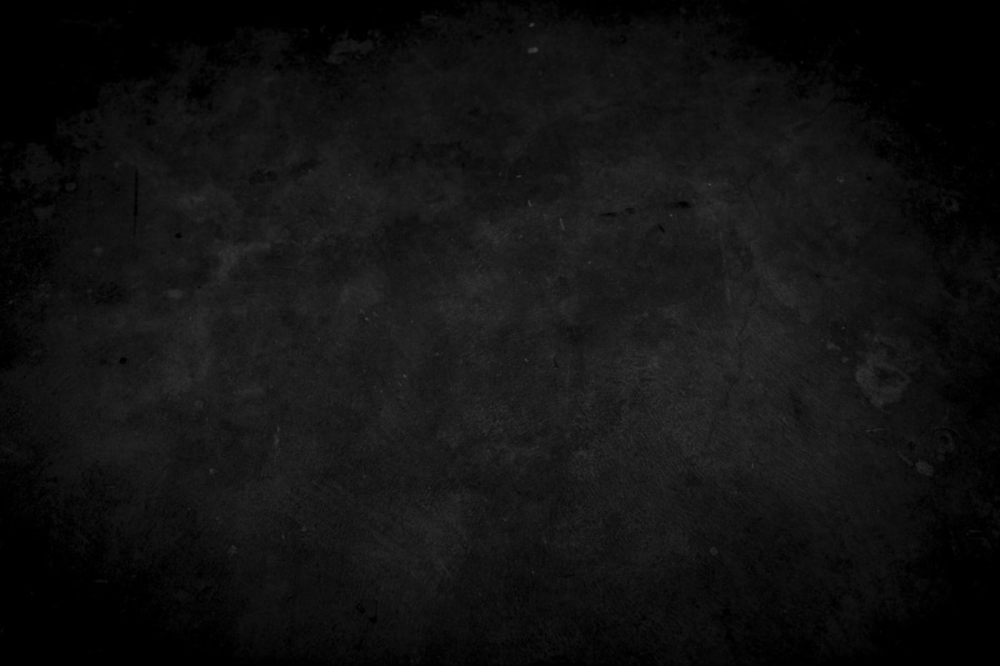
*Clean white retail space with natural product displays.*

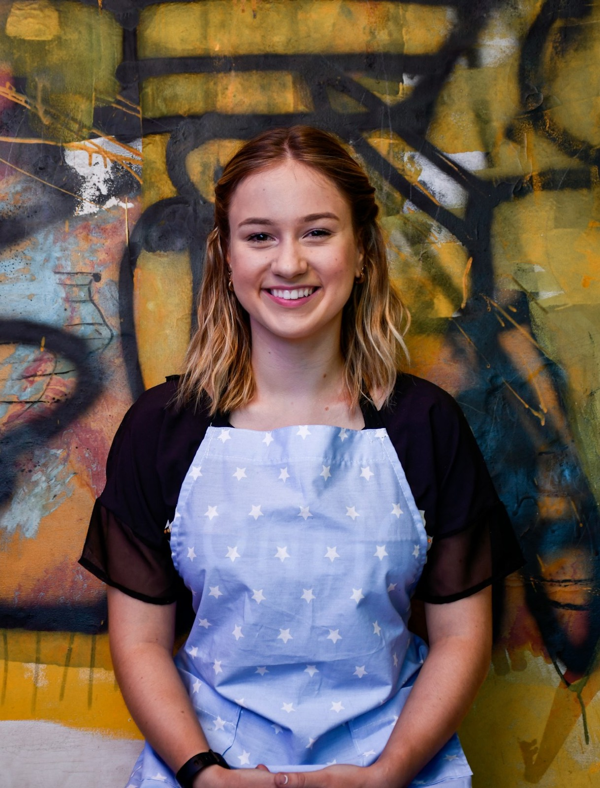
*Crystal and candle retail shelving — organized abundance, not cluttered novelty.*

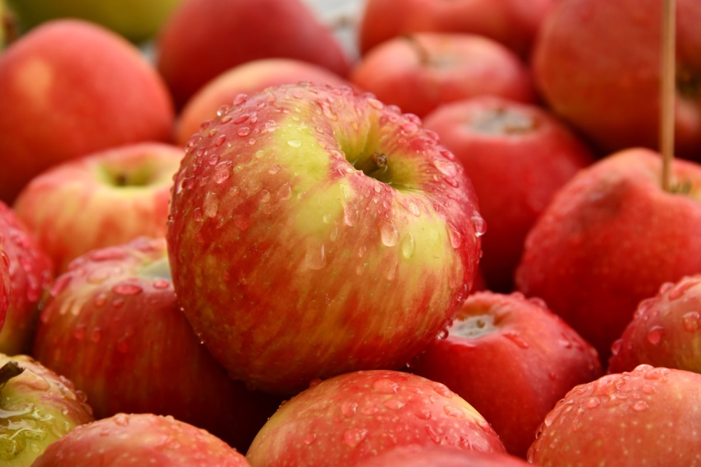
*Minimalist spiritual retail — HOI's aesthetic register.*

---

## Tarot & Ritual Accessories

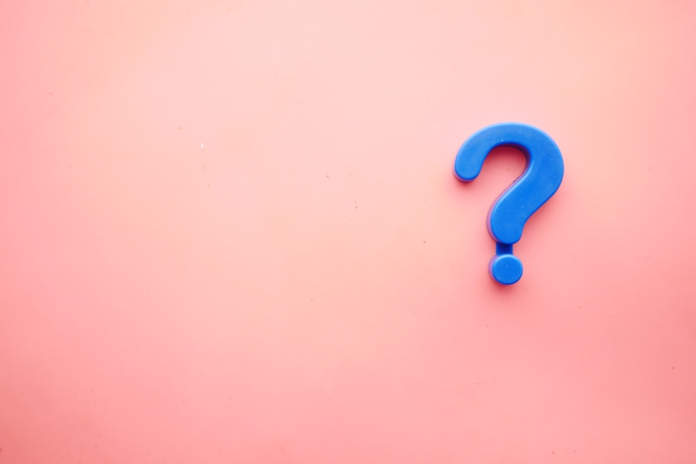
*Card face detail — legible imagery, dark ground, soft top-light.*

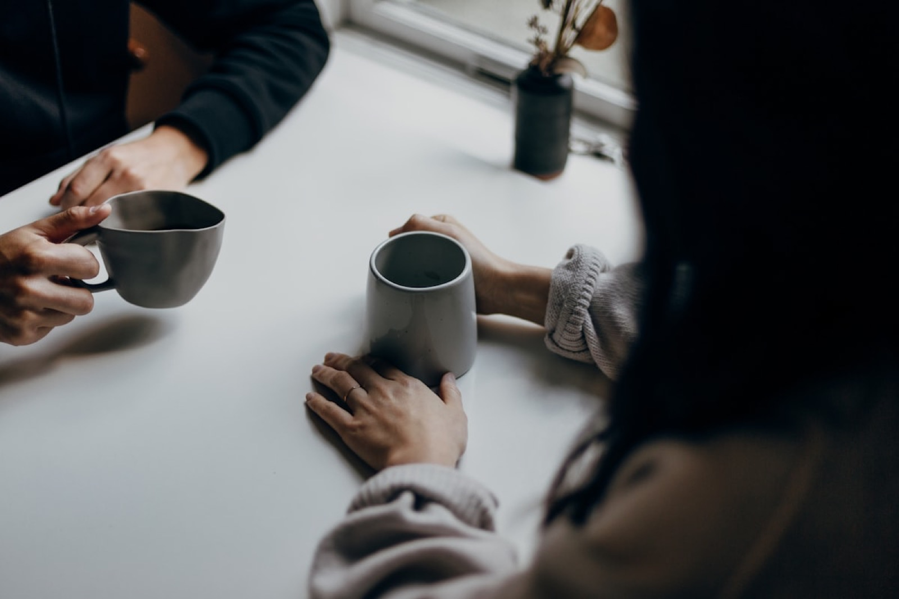
*Full altar composition: layered, purposeful, every object earns its place.*

*Ritual-in-progress: candle + smoke + hands — HOI's "Guide Me" editorial look.*

---

## Wellness / Lifestyle Photography

HOI's blog and "Guide Me" content positions crystal and candle work alongside bodywork and wellness practice — the spiritual is physical and habitual, not exceptional.

*Wellness flat lay: crystals, botanicals, body-care products in unified tableau.*

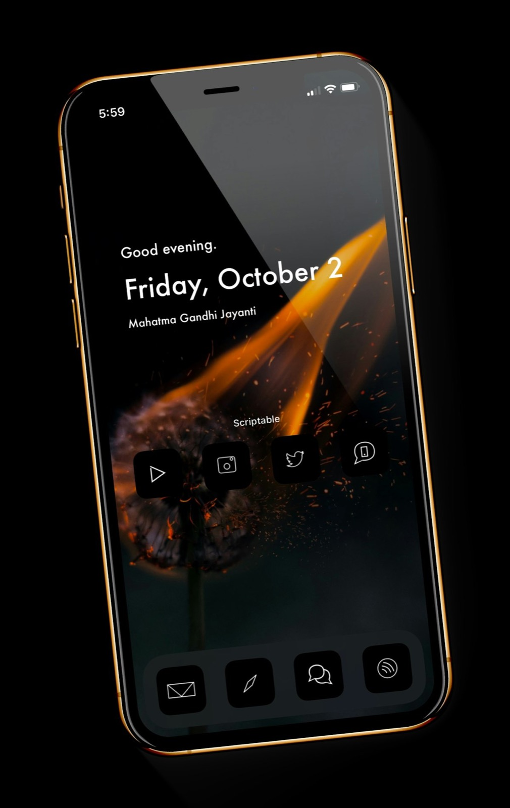
*Clean product packaging — HOI's recyclable glass + natural label aesthetic.*

*Moon phase imagery — used in Full Moon and New Moon ritual collections.*

---

## Design Language & Takeaways for Tend

- **Intention-first architecture** — HOI organizes everything by desire state, not product type. Tend should mirror this: habits grouped under patron deity or intention (Protection, Abundance, Healing), not task category (Morning, Evening, Fitness).

- **The object earns ritual status through restraint** — HOI's product photography never over-styles; neutral ground, single focal object, raking light. Tend's habit cards should have the same visual economy: one dominant image element, minimal ornamentation.

- **Desaturated palette is the trust signal** — HOI uses warm off-white, earthy neutrals, and a single warm gold accent. Vivid purple or heavy black reads as costume-witchcraft; desaturated earthy tones read as contemporary and lived-in. Tend should take this cue seriously.

- **Brand voice collapses practitioner distance** — HOI's "What Do You Want to Manifest?" puts the user in the driver's seat immediately. Tend's onboarding and habit language should do the same: address the user as already practicing, already on the path.

- **Smoke, crystal refraction, and candlelight are the three visual metaphors** — These recur across all HOI product and editorial imagery. They translate directly to Tend: smoke for transitions, refracted light for completing a habit/offering, candlelight for active ritual states.

- **Retail white-space = psychological safety** — HOI's white-walled store design removes intimidation from occult practice. Tend should use generous white/off-white negative space as the default state, with darker ritual tones invoked only for active habit/offering moments.
