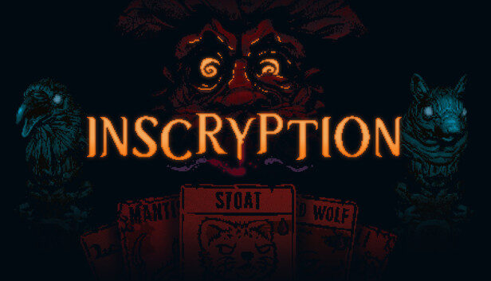
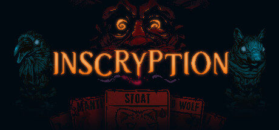
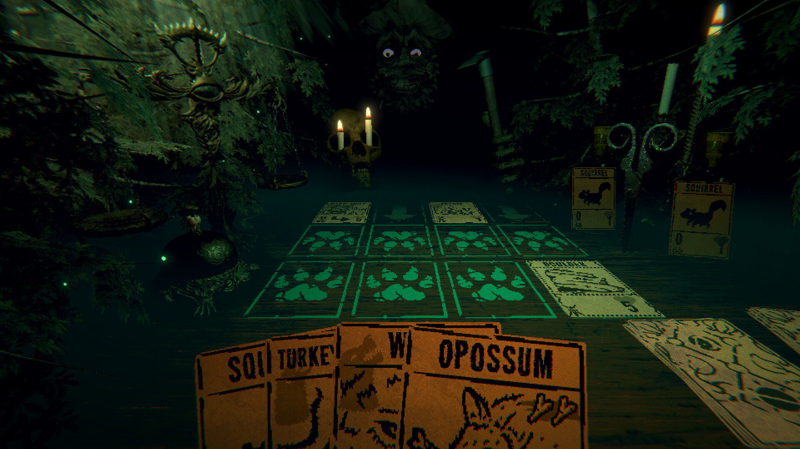
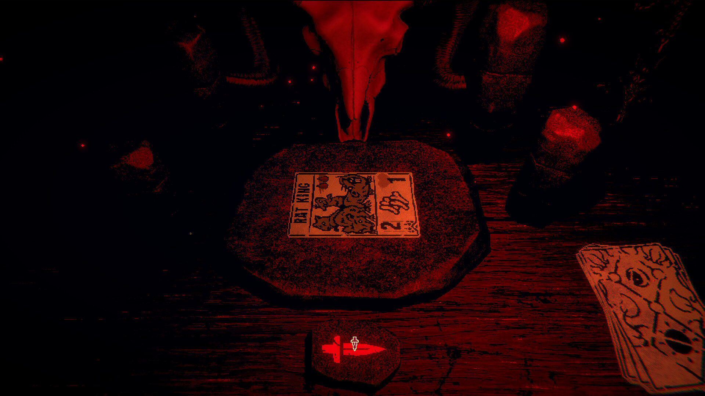
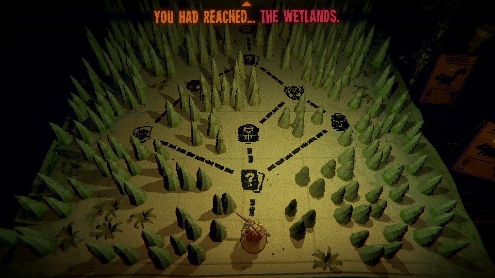
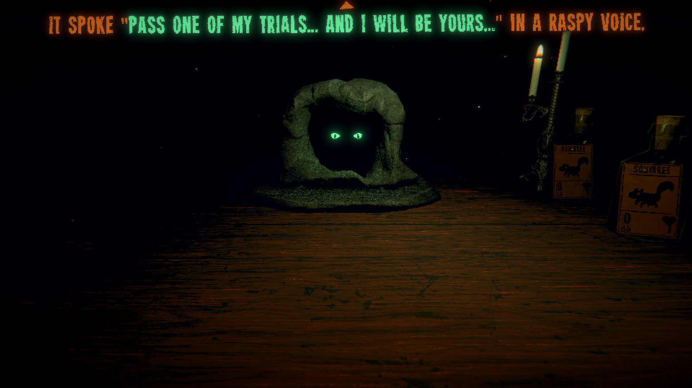
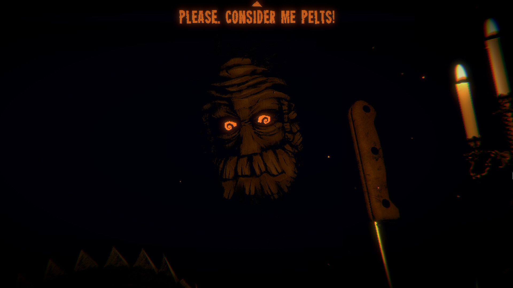
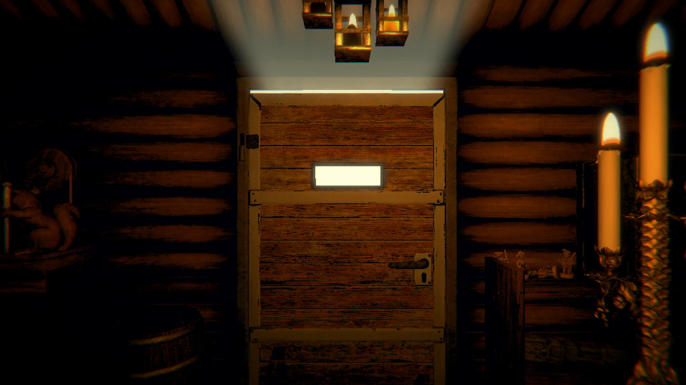
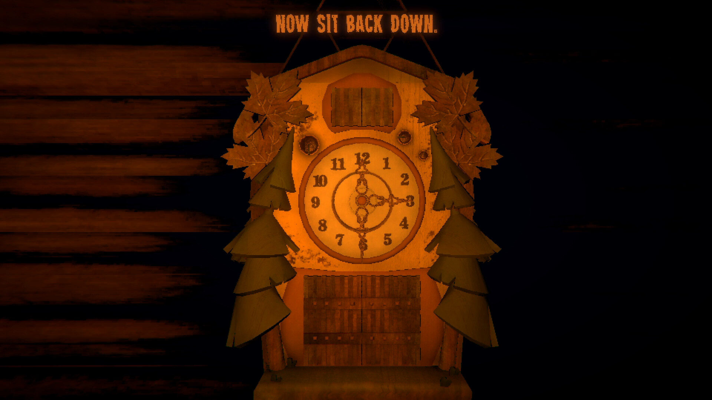
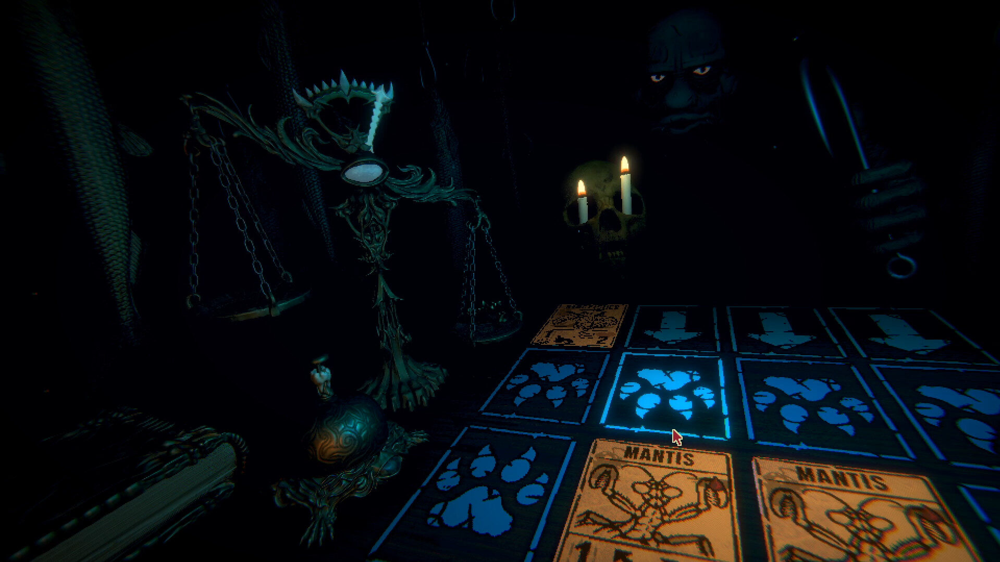

# Inscryption — Visual Design Research

## Overview

Inscryption's Act 1 is, structurally and atmospherically, a folk-witch ritual experience. A lone player sits across a table from Leshy, a forest god whose eyes glow from the dark. The cabin is lit by a single candle. Cards are hand-drawn on rough paper, depicting woodland creatures — squirrels, stoats, wolves, elk. To play a strong card, you must **sacrifice** weaker creatures on the board: a literal offering mechanic dressed in folk-horror clothes. Blood is the currency. The forest is the temple.

For Tend, this is a near-perfect mood reference. Tend treats habits as offerings to patron deities; Inscryption already solved the visual problem of "small ritual transaction with a watching deity." The lessons are about restraint (one light source, one table, one watcher), tactile materials (parchment, wax, wood, bone), and how a deity can be present without ever being fully visible.

## Key art & Steam capsule

The marketing art leans hard into the watching-eyes-in-the-dark motif: glowing yellow pupils floating in pitch black, with cards and candles arranged like an altar. Title typography is a serifed, slightly carved-looking display face — restrained, woodcut-adjacent, not gothic-blackletter.

- 
- 
- 

Takeaway: the brand identity is 90% darkness, 10% warm light. Almost nothing is fully rendered. Tend should resist the urge to over-illustrate altars.

## Cabin interior & the table

The cabin is a single set: a wooden table, a candle, a small board for placing cards, a few trinkets (a watch, a knife, a pack of cards, a stoat figurine). The camera barely moves. Everything outside the candle's reach is black. The wood grain is heavily textured — knots, scratches, water rings — and reads as "object that has been used for ritual a long time."

- 
- 

Takeaway: a constrained "ritual surface" framing — one table, one light, props that suggest history — is more evocative than a fully rendered scene.

## Hand-drawn cards

The cards are the soul of Act 1. Each is a small ink drawing on cream/parchment stock, framed by a simple woodcut border. Creature art is sketchy, slightly crude, and feels like a forest god's own hand drew it. Stats (attack/health) are stamped numerals in the corners; sigils (special abilities) are small woodcut glyphs. The card backs are a uniform woodcut pattern.

- 
- 
- 

Takeaway: this is the strongest direct lift for Tend. Habits/offerings rendered as small parchment cards with a woodcut sigil per deity would map cleanly onto Tend's metaphor.

## Leshy, the dealer

Leshy is never fully shown. You see his glowing eyes, occasionally a clawed hand placing a card, sometimes a crude wooden mask. His presence is communicated by voice, by the rustle of cards, by the candle flickering. He is "across the table" — close, but not visible. This is the deity-presence problem solved with extreme restraint.

- 
- 

Takeaway: Tend's deities should be felt, not fully drawn. A sigil, a hand, a pair of eyes, an off-screen voice in copy — all carry more weight than a character portrait.

## Map of the woods

Between encounters, Act 1 zooms out to a small hand-drawn map of the forest: a winding path, ink-drawn trees, tiny icons for campfires, traders, battles, and bosses. The player token is a small carved figurine moved along the path. It looks like a page torn from a witch's travel journal.

- 

Takeaway: a "journey map" view for a multi-day ritual streak in Tend could be rendered as a hand-drawn path with parchment ground and ink iconography — far more atmospheric than a calendar grid.

## Card-sacrifice as offering metaphor

This is the single most relevant mechanic for Tend. To summon a strong creature, you tap weaker creatures already on the board; they are consumed, leaving behind blood drops that fuel the new card. The animation is small but visceral — a card flips, bones briefly visible, then it's gone. Leshy watches.

The reading: **a small, repeated act of giving up something modest produces something greater, witnessed by a deity.** This is precisely Tend's "habit as offering" frame. Inscryption's lesson is that the sacrifice animation should be quick, tactile, and slightly costly-feeling — not celebratory, not gamified with confetti. A flicker. A puff of smoke. A drop of wax. The deity acknowledges by leaning forward, by a candle brightening, by a single line of voice — never with a XP bar.

## Color palette

- Deep black (#0A0806) — dominant negative space, the dark around the candle.
- Candle amber (#E8A24A / #B8772E) — primary warm light, on faces of cards and edges of wood.
- Parchment cream (#D9C9A3) — card stock, map paper.
- Ink near-black (#1A140E) — card linework, sigils.
- Dried blood (#6B1F12) — sacrifice indicator, sparingly used.
- Forest moss (#3A4A2E) — accent on creature art, never UI chrome.

The palette is mostly two values (black and amber) with parchment as the only mid-tone. Saturation is low; everything reads aged.

## Typography

Two registers. The title and chapter cards use a carved serif display face with slightly irregular weight — woodcut feeling, not blackletter, not Trajan. In-game card numerals and sigil labels use a stamped/letterpress style: even spacing, slight ink bleed, monospaced numerals. There is no sans-serif anywhere in Act 1. No system fonts visible.

Takeaway for Tend: pair one carved/woodcut display serif (deity names, chapter headers) with a small letterpress-style numeric face for streak counts and offering tallies. Avoid any UI sans for ritual surfaces.

## Design language & takeaways for Tend

- **Darkness is the brand.** ~80% of every frame is black. Tend should treat negative space as sacred and resist filling ritual screens with chrome or decoration.
- **One light source per scene.** A single candle defines the entire visual logic. Tend's offering screens should pick one warm light and let everything else fall off.
- **Deities are presence, not portraits.** Leshy is eyes, a hand, a voice. Tend's patrons should be sigils, gestures, and copy — never full character art that flattens their mystery.
- **Offerings are parchment cards with woodcut sigils.** This is a direct, almost 1:1 lift. Habits-as-cards with corner numerals (streak count) and a deity sigil would carry the metaphor without explanation.
- **Sacrifice animation should be quick and slightly costly.** No confetti. A flicker, a wisp of smoke, a single acknowledging beat from the deity. Tend should under-celebrate completions.
- **Type pairing: carved serif + letterpress numerals.** No sans-serif on ritual surfaces. Tend's offering UI should commit fully to a pre-industrial type voice and reserve sans for settings/admin only.
