# Moonly — Visual Design Research

## Overview

Moonly (moonlyapp.com, "moonly" — moon-rhythm + astrology + tarot + rituals + affirmations + meditations) is **the most direct functional parallel to Tend** in the competitive set. Like Tend, it organises a daily self-care practice around an esoteric primary axis (here: the lunar cycle), it frames everyday actions as **rituals** rather than tasks, and it leans hard into a witchy-but-mainstream aesthetic that targets a Gen-Z/Millennial wellness audience without alienating non-practitioners. It is also notorious for some of the most aggressive paywall pressure tactics in the spiritual-wellness category — instructive for Tend as a list of things **to avoid**.

Notable differences from Tend: Moonly's "deity" surrogate is **Luna, the in-app astrologer persona** (a 3D-rendered moon priestess), not patron gods. Its primary IA is the **lunar calendar**, not custom routines. And Moonly stays mostly in a single visual register (deep purple/indigo dark mode + glossy 3D), where Tend wants something more textured and paper-grain.

Editor's Choice on App Store, claims "10 million users / 10 million souls".

---

## Onboarding & brand entry

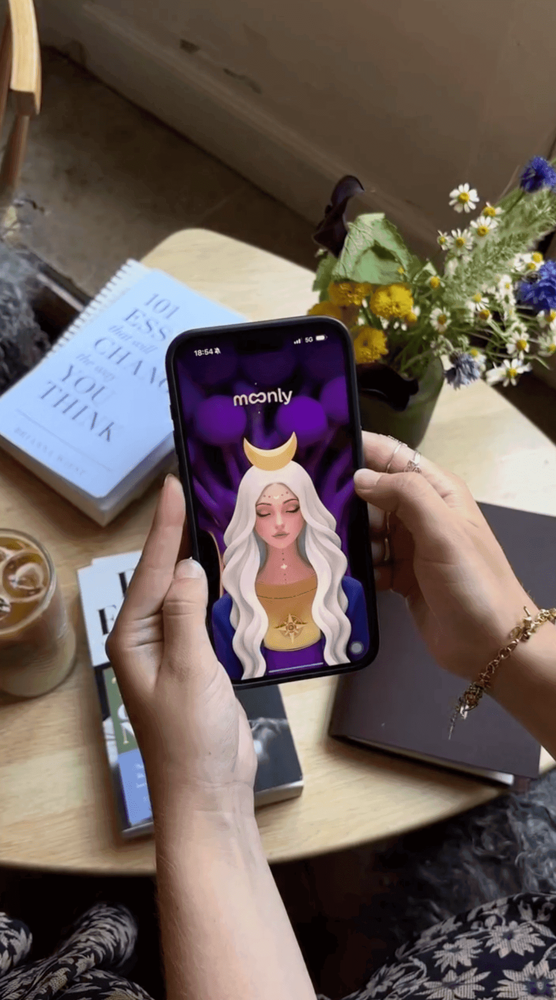

The brand entry leans **3D illustrated priestess avatar** ("Luna") over a purple radial gradient. Crescent-moon icon doubles as the wordmark's "oo" ligature — a key brand device. The whole identity is anchored on this single character, who reappears as astrologer, meditation guide, and tarot reader throughout.

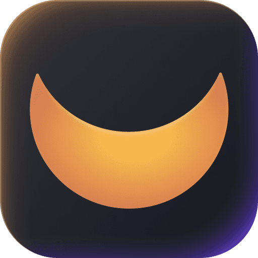

App icon: solid warm crescent on near-black. No texture, no occult symbology — deliberately mass-market.

---

## Home / daily hub

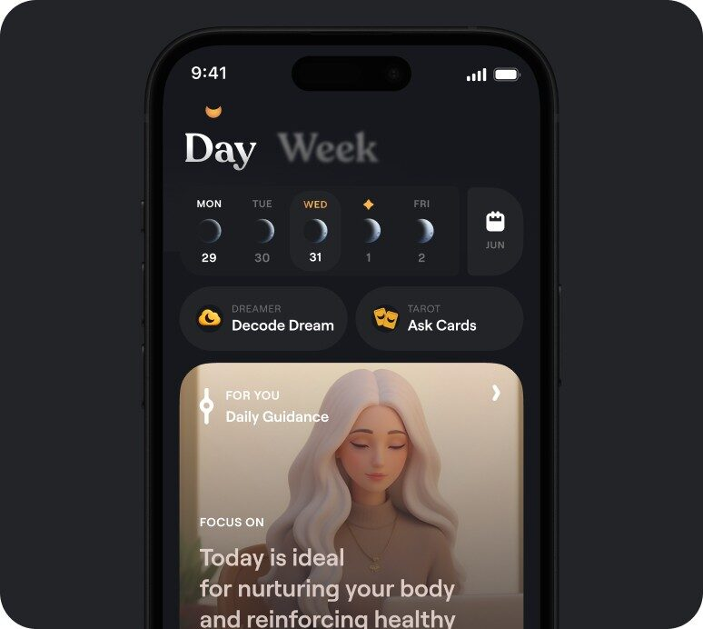

The home screen does several smart things Tend should study:

1. **Day/Week toggle in giant serif type** with the inactive label blurred (not dimmed) — feels editorial, not chrome-y.
2. **Date strip uses moon-phase glyphs**, not numbers as primary identity. Each day is *that night's moon*. This is the IA-defining move.
3. **Two task entry chips** ("Decode Dream", "Ask Cards") sit above the fold — fast, ritualised actions, not buried.
4. **"Daily Guidance" hero card** is illustrated + narrative ("Today is ideal for nurturing your body…") rather than a checklist.

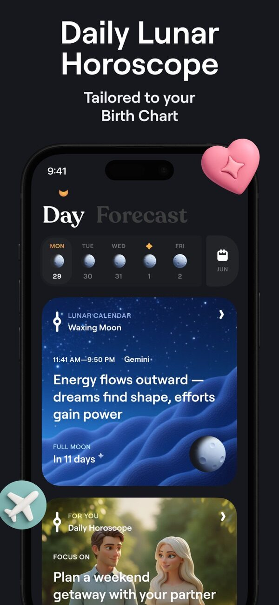

Important detail: **lunar countdowns** ("Full Moon in 11 days") appear as ambient context on the daily card. Tend could do the analogue: deity-themed feast days, sabbats, or season-cycle markers.

Week view is a **single editorial card per period**, not a grid. The 3D icon (coin) is the only burst of saturated colour against the muted card — a recurring composition device.

---

## Lunar calendar — the primary IA

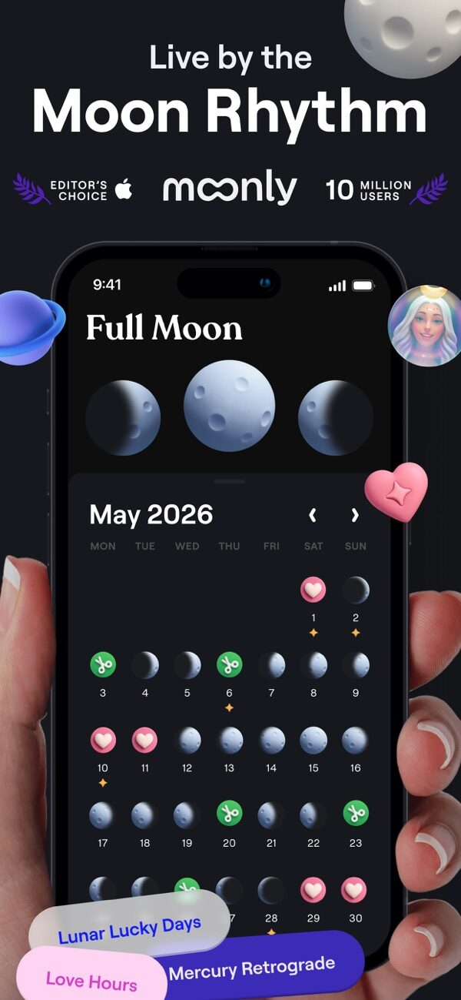

This is the design centrepiece and the model for what Tend's deity-cycle calendar could feel like:

- **Each date cell is rendered as the actual moon phase** for that night — a sphere with phase-correct shading. The calendar *is* the lunar cycle, visualised.
- **Symbolic overlays** ride on top of dates: heart = love-favourable, scissors = haircut-favourable. These come from folk-lunar tradition and turn the calendar into a recommendation engine without language.
- **Filter chips at the bottom** ("Lucky Days", "Love Hours", "Mercury Retrograde") re-skin the same grid with different overlays — one canvas, many lenses.

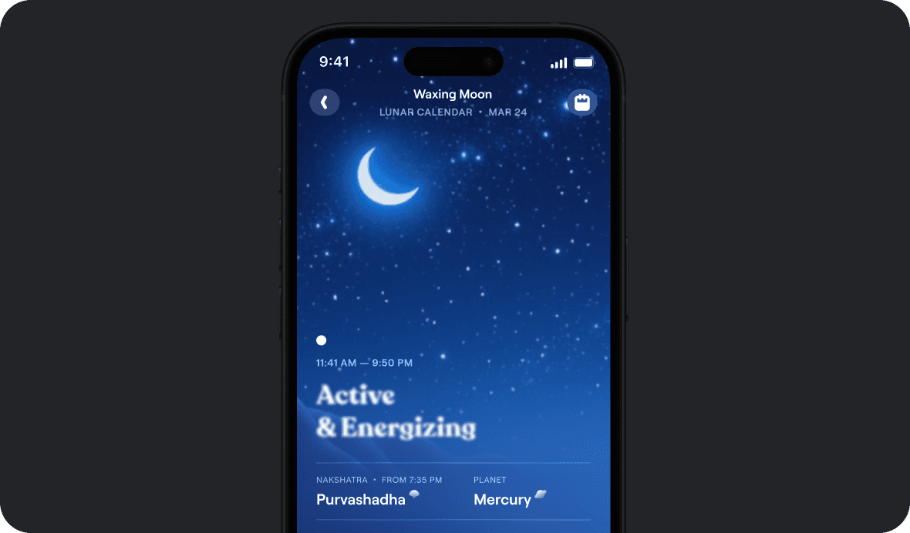

Drilling into a date opens a **full-bleed cosmic photographic background** (starfield, watercolour cloud), display-serif headline, and small-caps metadata. This is Moonly's strongest visual moment — it stops feeling like an app and starts feeling like a meditation card or a Tarot-deck booklet page.

Same template, different lunar phase. Reusing one composition across all 8 phases is a key efficiency — Tend can use one card template across all deities/cycles.

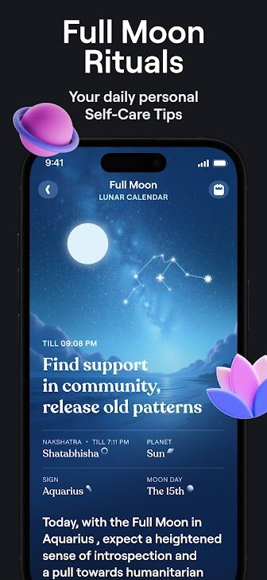

---

## Daily ritual / "for you" content

The "ritual" content is never a checkbox. It is **illustration + narrative paragraph + soft category tag** — the user is meant to read and absorb, not tick. Compare to Tend's "offerings" framing: this validates the bet that habits should feel narratively held, not mechanically completed.

---

## Tarot — daily draw and full deck

- **3D-illustrated tarot art**, not traditional Rider-Waite line work. Soft pastels, friendly faces, lit like Pixar — explicitly **non-threatening**, which is the same audience-broadening move Tend needs for "patron deity" framing.
- **Spread types as segmented chips** at top (3-card / 1-card / pull). Single control bar instead of nested menus.
- **"All Cards" full-deck explorer** below the daily reading — gives premium users something to browse beyond the daily draw.

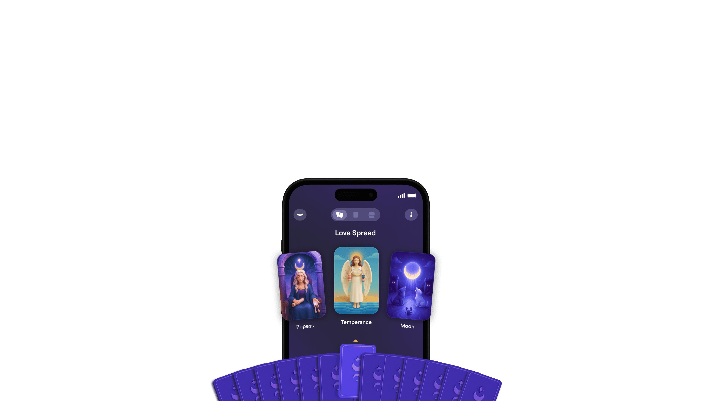

This is the **spread-pick interaction**: tap a face-down card from the fan, it flies up into a slot, flips. Tactile, ritualistic, hard to do badly. Tend's "draw an offering" or "pull a sign from your patron" could borrow this exact gesture.

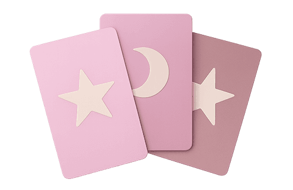

---

## Affirmation

Notes for Tend:

- **One affirmation per day**, full screen, no scroll. The affirmation *is* the screen.
- **Instagram Stories export** sits as a primary button — Moonly treats sharing as a top-level ritual action, not a settings option. Every daily artifact (affirmation, tarot pull, horoscope) is built to leave the app as a Story.
- **Three category circles at bottom** let the user re-roll into a different theme.
- The cat with the crescent forehead-mark is Moonly's secondary mascot — a softer, less anthropomorphic deity stand-in.

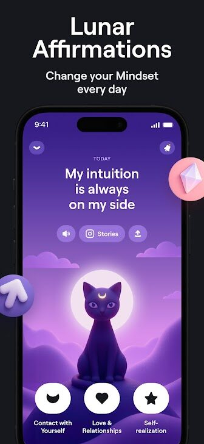

---

## Breathing & guided meditation

Strong reference for Tend:

- The **player is the artwork** — no separate cover-art card, no chrome, no waveform. Album-art-as-full-screen.
- **"Created by Humans" badge** with a struck-through robot icon is a positioning play — explicitly anti-AI, signalling craft. Worth Tend considering as authenticity signal.
- Session titles are **mythological/elemental** ("Vishnu Mantra", "Earth Healing", "Inner Fire") not clinical ("5-min breathing exercise").

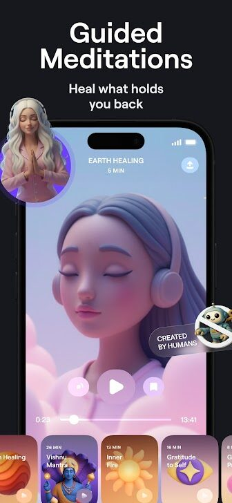

I did not find a dedicated **breathing exercise** screen — Moonly appears to roll breathing into the same audio-meditation surface rather than a separate visual primitive (no expanding-circle, no inhale/exhale). Tend's breathwork can therefore differentiate.

---

## Yoga & movement

No yoga/movement screens appear in the captured set. Moonly markets meditation and ritual but does **not appear to ship a yoga/movement module** as of this capture. (Marketing photo `marketing-09.jpg` shows lifestyle yoga imagery but nothing in-app.) This is a gap Tend could own.

---

## Journaling / dream decoder

Moonly's "journaling" is actually a **dream decoder** — you type a dream, it returns a stylised interpretation card. This is much more compelling than a blank journal field because:

- The output is **an artifact** (illustrated card with a date) — shareable, savable.
- The user is **guided** ("what did you dream?") not blank-paged.

Tend could pair "offerings" with a similar **prompted reflection** (one question, one illustrated response card) instead of an empty `<textarea>`.

---

## Mood check-in

Not directly evidenced in app screenshots — Moonly's mood-equivalent appears to be the **birth chart + compatibility + daily horoscope** stack, which serves the same "how am I feeling and why?" purpose with cosmic causation as the explanation layer. Note this contrast with Tend: Moonly blames the stars, Tend can have you offer to a deity.

---

## Birth chart

Two key moves:

1. **The chart wheel is an isometric 3D sculpture**, not a flat astrological diagram. Planets are physical objects on a grid. This is what makes the birth-chart approachable to non-astrology users — it reads as *infographic*, not *occult*.
2. **Insights below are gradient cards with one 3D hero object each** — scorpion for Scorpio, hourglass for Saturn, book for Teacher, etc. The composition is identical to Apple Health's category cards: small-caps tag, headline, hero object.

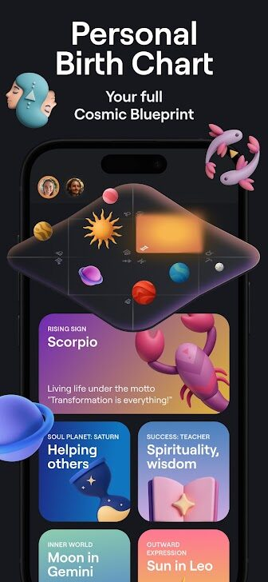

The **copy voice** matters: "Seeks cosmic signs to confirm the spreadsheet" is funny, modern, and undercuts the woo just enough to be safe for non-believers. Tend's voice for deity offerings should sit in this register — earnest but witty.

---

## Compatibility

Compatibility is a **paywall magnet** — Moonly funnels free users here heavily. Layout learnings:

- **Avatar bubbles with floating hearts** at top is the page identity — visceral, not data-driven.
- **Six progress bars with mini icons** read like a Pokémon stat sheet. Game-y, comparable, addictive.
- **Gradient story cards** below ("Past life Bonds" violet, "Romance and sex" pink) tease premium content.

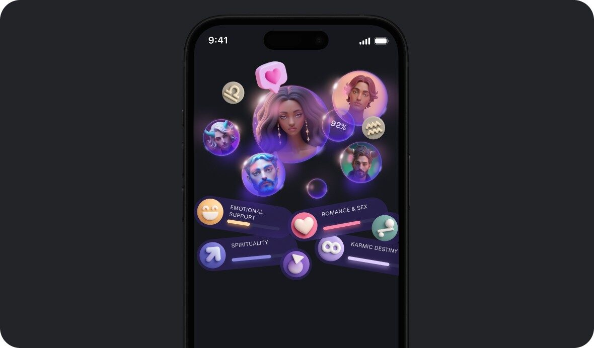

The **multi-partner picker** as floating avatar bubbles is a beautiful pattern — feels social, not transactional.

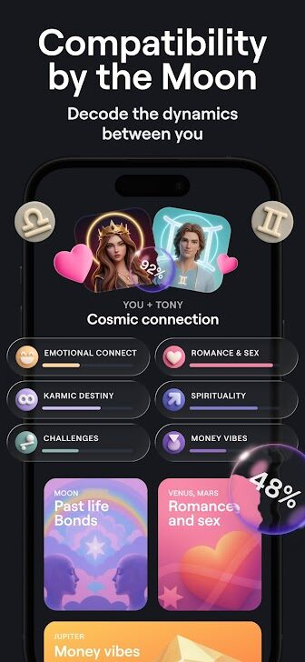

---

## Sound bath / sound

No dedicated sound-bath screen surfaced in captures, but the paywall (next section) lists "Sounds" as a top-six feature with a stained-glass-flower icon. Sounds appear to be a tab inside Meditations rather than a top-level destination.

---

## Sabbat / wheel-of-the-year content

Moonly **does not appear to surface pagan sabbat content** (Samhain, Imbolc, Beltane, etc.) as named events. Its calendar is **lunar, not solar**, and it sidesteps explicit witchcraft framing in favour of "moon rhythm" and "modern spirituality". This is a deliberate broadening move — and a gap Tend can claim if it wants to be more explicitly pagan.

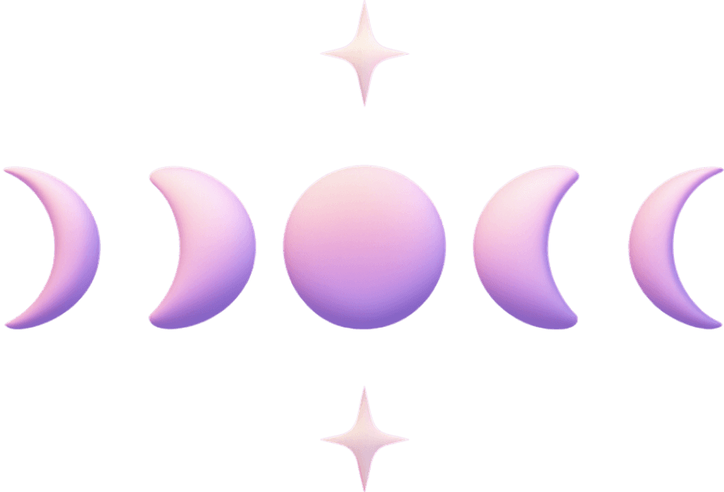

---

## Astrologer chat (premium hook)

Important pattern: **the AI assistant is anthropomorphised as Luna, the moon priestess** — same character as the app's mascot. Tend has a real analogue: chat with your patron deity. The character-card framing at top (Luna in her cosmic setting) plus standard chat bubbles below is a clean way to make AI feel like *talking to a being*, not *querying a model*.

"NASA-Grade Accuracy" badge is worth noting — Moonly leans on **scientific-authority signalling** to justify its mystical claims. Same play that Co-Star uses. Tend may not want this energy.

---

## Paywall — multiple variants

This is the **canonical Moonly paywall** as archived by Adapty (a paywall analytics service). Tactics in play:

1. **"-50%" sticker pre-selected** on the most expensive plan — the annual is framed as the *discount*, not the upsell. Anchoring via the monthly price.
2. **"Cancel anytime"** on every card to reduce commitment friction.
3. **Six feature icons above the plans** — visual abundance, "look how much you get".
4. **CTA labelled "Start"**, not "Subscribe" or "Pay" — softens the transaction language.
5. **Restore/Terms/Privacy in 9pt grey** at the bottom — minimal legibility, App Store-minimum compliance.

**Aggression for Tend to avoid:**
- Moonly is **widely reported** (Reddit r/witchcraft, r/Apple, App Store reviews) for: trial-to-paid silent conversion, opaque cancel flows, paywall-on-launch with no skip button, fake "limited-time" discount countdowns, and pop-up paywalls after every primary action. The Adapty paywall above is the *clean* version — the in-product reality is harsher.
- The Editor's Choice + "10 million users" social proof in marketing is real, but the negative reviews are unusually concentrated on **billing**, not features.

---

## Settings

No clean settings screen surfaced in captures. Moonly's settings appear conventional (notifications, account, subscription, restore purchase) — not a design surface they invest in. The interesting setting from a Tend perspective is **notification timing tied to lunar events** (new-moon affirmation, full-moon ritual reminder) — Moonly does this; Tend's analogue is deity-specific reminders.

---

## Pastel paper-grain visual language

Moonly is **not actually a paper-grain app** — its primary register is **glossy dark mode** (deep purples, midnight blues, electric violet) with **3D plasticine illustrations** rendered with soft global illumination. This is closer to Pixar/Apple Memoji than to grimoire/parchment.

Where pastels and "paper" energy show up:

The pastel moments are **accents**, not the base layer. Moonly's base is dark/glossy; the pastels punctuate. Tend's bet on **paper-grain + pastel as the base layer** is genuinely different from Moonly and is a defensible visual position.

---

## Typography

Two-family system, used consistently across every screen:

1. **Display serif** for headlines and affirmations — a high-contrast didone-ish serif ("Full Moon", "Active & Energizing", "Day Week", "My intuition is always on my side"). Looks like Apoc, GT Sectra, or similar. **Editorial, not religious** — this is the most important typographic decision Moonly makes; it could have gone gothic blackletter and chose magazine instead.
2. **Geometric sans** for everything else: navigation, metadata, small-caps tags ("RISING SIGN", "FOCUS ON", "TILL 09:08 PM"), buttons. Looks like Inter, SF Pro, or close cousin.
3. **All-caps small-caps tags** as the connective tissue between sans and serif — every card has a tiny uppercase label above its serif headline.

The crescent moon glyph appears as a typographic mark: it replaces the "oo" in "moonly", appears as a header ornament above "Day", and is the bullet on metadata items. **One brand glyph, used as punctuation**.

---

## Design language & takeaways for Tend

1. **Make the cycle the IA, not a feature.** Moonly's calendar is the home tab and every date *is* its moon phase. Tend's deity/cycle calendar should be similarly load-bearing — not buried under "Insights" or settings. The user should be able to look at the home screen and immediately see *where they are in the cycle*.

2. **One template, many phases.** Every Moonly lunar-phase detail screen is the same layout (full-bleed photographic background + display-serif headline + small-caps metadata + narrative body). Eight phases, one template. Tend can do this with deities/sabbats: one ritual-card composition, infinite content.

3. **Symbolic overlays beat text labels.** Moonly's calendar uses tiny pink hearts and green scissors to mark "love-favourable" and "haircut-favourable" days. No words needed. Tend's offerings could ride on the calendar this way — small deity sigils as date overlays.

4. **The output of every ritual should be a shareable artifact.** Affirmation, tarot pull, dream interpretation, horoscope — every Moonly daily artifact has an "Export to Story" button as a primary action, with the design pre-composed for IG portrait. Tend should design every "offering" screen as *already a shareable card*.

5. **Anthropomorphise the AI as a character, not a model.** Moonly's astrologer chat is "Call with Luna" — same priestess who is the app's mascot. This is *much* warmer than "AI assistant". Tend's patron deities are a natural fit; lean into named character + character card at the top of the chat surface.

6. **The 3D-plasticine illustration register is broad-appeal.** Soft, friendly, non-threatening, photographable. Moonly explicitly chose this over Rider-Waite line work or grimoire engravings. **Tend's bet on paper-grain + pastel + hand-drawn is the differentiator** — but study Moonly's character work for warmth.

7. **Editorial serif + geometric sans + small-caps tag is a winning trio.** Don't use blackletter or "magic" display fonts. Moonly looks like a high-end magazine, not a tarot shop, and that is why it cleared 10M downloads.

8. **The "Created by Humans" anti-AI badge is a positioning play worth borrowing.** Especially as Tend's competitors lean harder on AI-generated meditation/ritual content, an explicit *crafted by practitioners* signal is meaningful brand equity.

9. **Dream decoder > blank journal.** Moonly never shows the user an empty text field. Every reflection is a prompted question with a beautifully composed illustrated response card. Tend's journaling should follow this — never an empty `<textarea>`, always a prompt + an artifact.

10. **PAYWALL TACTICS TO AVOID:** Moonly's reputation in `r/witchcraft` and App Store reviews is overwhelmingly: paywall-on-launch with hidden skip, pre-selected annual with "-50%" anchor, fake countdown urgency, opaque cancel flow, repeat paywall pop-ups after every primary action, silent trial-to-paid conversion. Tend should explicitly **not** do any of these. Use the Adapty paywall layout (clean feature grid + three plans + Start CTA) as a reference for the *structure*, but ship it with: clear skip button, no countdown, no "-50%" sticker on a price that was never higher, easy cancel, and exactly one paywall per session.

11. **Witchy-but-inclusive tone.** Moonly's copy ("Seeks cosmic signs to confirm the spreadsheet", "NASA-Grade Accuracy") winks at the user — it knows you might be skeptical and that's fine. Tend's deity-offering framing should sit in the same register: earnest but self-aware, never preachy.

12. **No yoga, no explicit sabbats — gaps Tend can own.** Moonly stays in lunar/astrological territory and avoids movement and pagan-calendar content. If Tend ships both, it differentiates on breadth without competing on Moonly's terms.
