# REKA — Visual Design Research

## Overview

REKA (Emberstorm Entertainment / Fireshine Games, Steam Early Access) is a Slavic folk-pagan witchcraft game where you apprentice to Baba Jaga and customize a chicken-legged hut. It is the strongest folk-pagan aesthetic reference available — AAA-tier art quality applied to genuine Slavic folklore rather than the more common Wiccan/occult or "Hot Topic witch" register. If Tend's spiritual identity leans folk-pagan (patron deities, offerings, hearth-witchcraft) rather than ceremonial occult, REKA is the visual benchmark: amber lantern light, autumnal birch forests, hand-carved wood, embroidered linen, and the witch's hut as an owned, customizable spiritual home.

## Key art & store presence

REKA's store presence leads with the chicken-legged hut silhouette against fog and forest — instantly readable folklore branding without text.

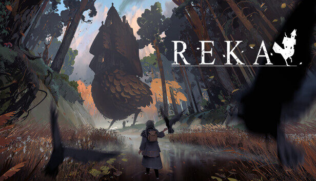
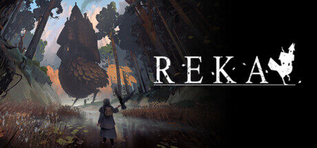
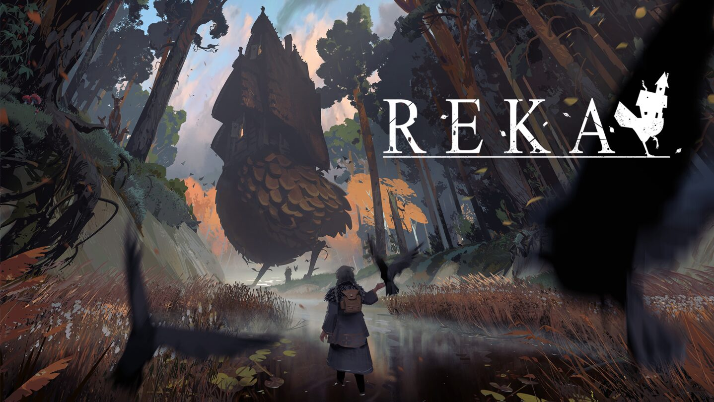

## The chicken-legged hut — exterior

The hut is the game's core motif: a hand-built wooden cottage on giant chicken legs, perched in mossy clearings. It functions as a portable, sentient home — a powerful metaphor for a user-owned spiritual space that travels with you.

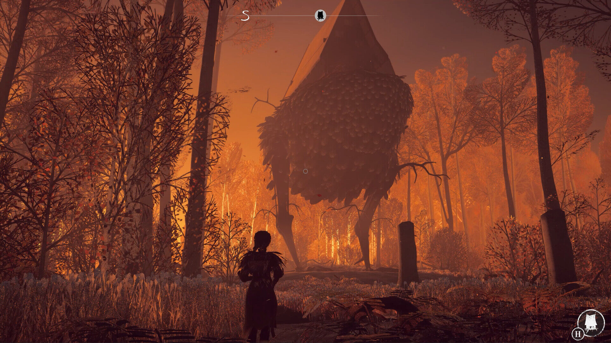
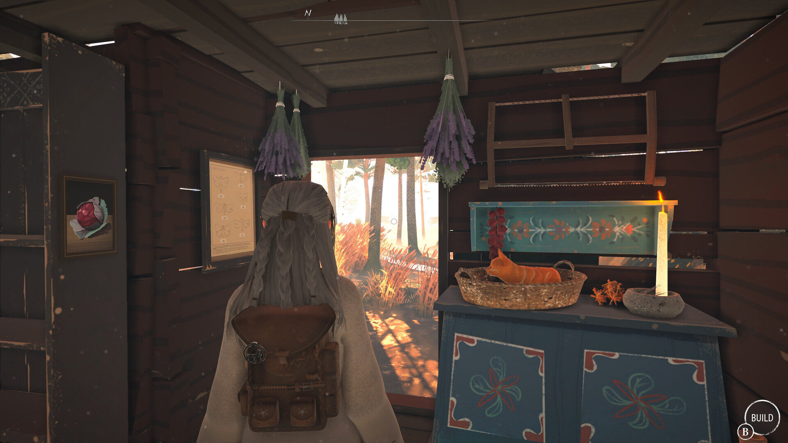
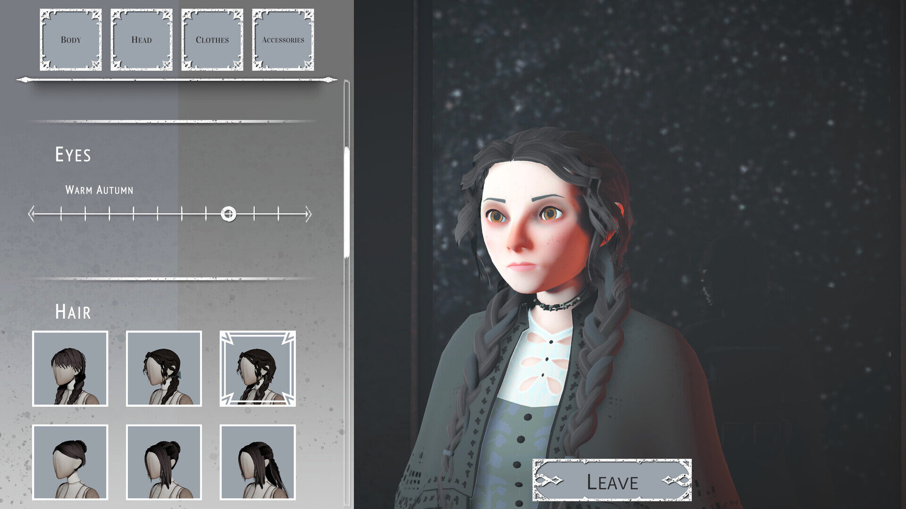

## Hut interior — kitchen, brewing, altar

Interiors are warm and lived-in: hanging herbs, copper pots, embroidered textiles, wood-burning stove. The cauldron and herb-drying racks double as both kitchen and altar — domestic witchcraft, not ceremonial occult.

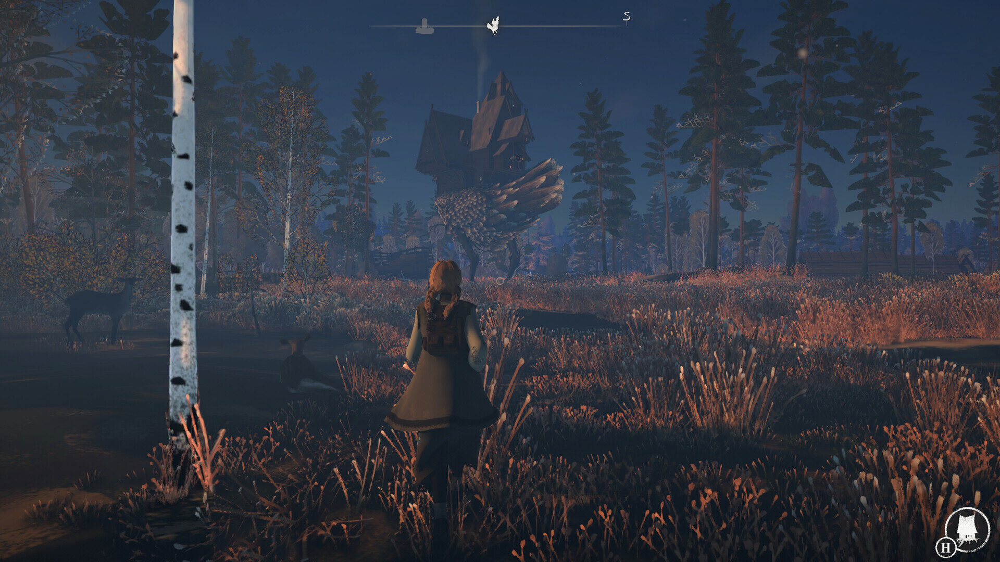
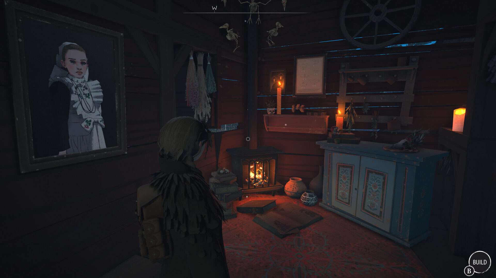
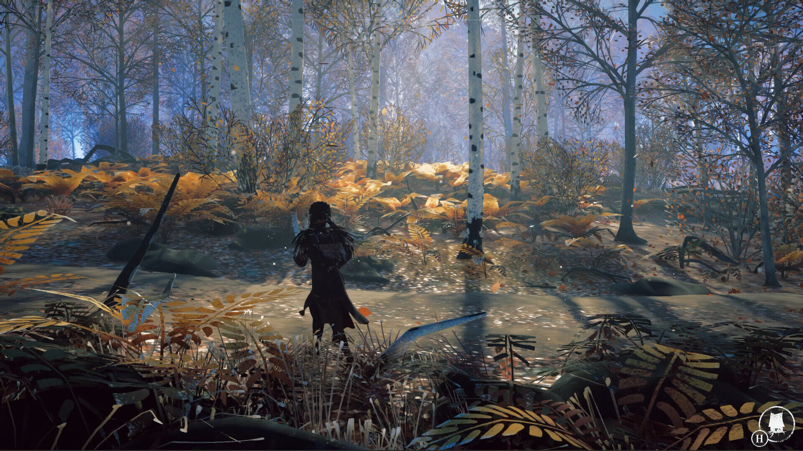

## Hut customization & herbalism foraging

Players customize the hut's contents — placing furniture, herbs, jars, charms — and forage seasonal ingredients in the surrounding forest. The loop is: gather → arrange → brew → offer.

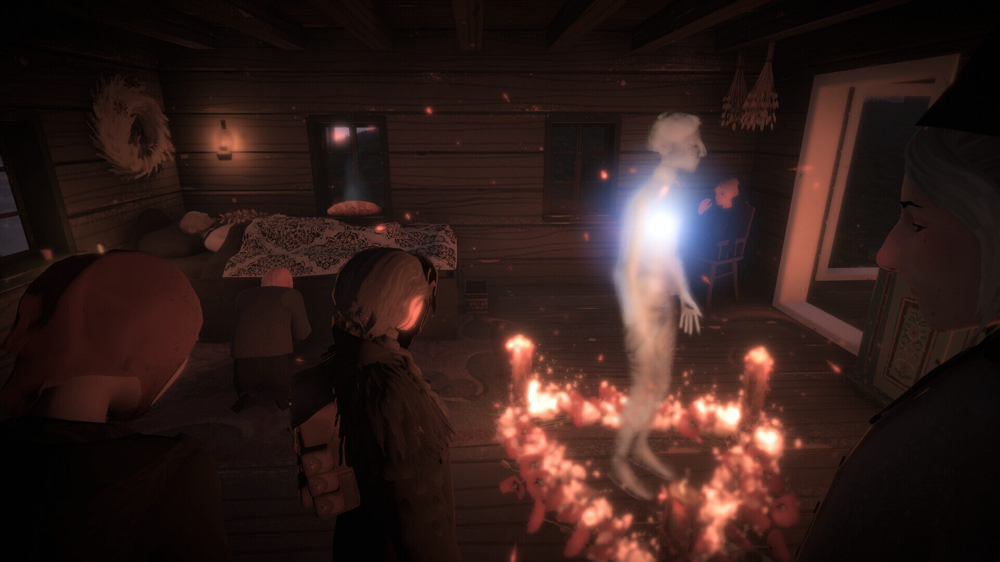
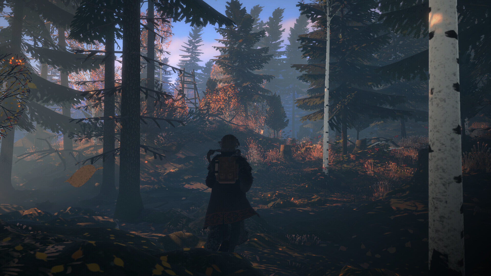
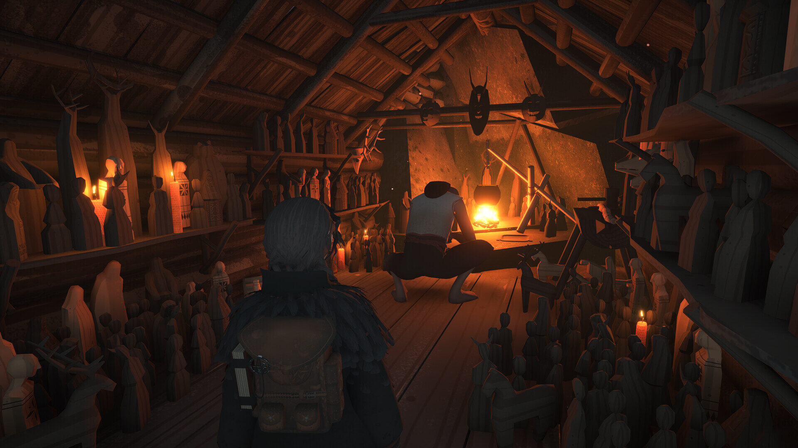

## Color palette & Slavic-folk symbols

The palette is autumnal and grounded: amber lantern-yellow, deep forest green, aged oak brown, ember red, birch white, slate fog grey. Symbols are embroidered geometric folk patterns (rhombuses, sun-wheels, birds) rather than pentagrams or sigils — wholly distinct from goth-occult vocabulary.

## Design language & takeaways for Tend

- Folk-pagan beats Hot Topic occult. REKA proves a witchcraft aesthetic can feel warm, domestic, and AAA without leaning on black-and-purple goth iconography. Tend should reach for embroidery, wood, and amber rather than skulls and sigils.
- The hut as user-owned spiritual home. A customizable hearth-space (altar / shrine / hut view) gives users somewhere their practice lives — accumulating offerings, herbs, and charms as a visible record of consistency.
- Autumnal palette as default season. Amber, moss, oak, ember, birch — Tend's color system should anchor here rather than midnight black, signaling abundance and hearth-warmth instead of edgy mystery.
- Apprentice-to-old-witch framing. The Baba Jaga mentor archetype is a clean onboarding frame: the user is a novice being taught, not a master being audited — softer, more forgiving than streak-based productivity tone.
- Domestic ritual objects are the interface. Cauldrons, jars, drying racks, embroidered cloths — REKA shows that everyday objects (not arcane glyphs) carry the spiritual register. Tend's offering UI should feel like placing items on a shelf.
- Forest and seasonality as ambient backdrop. The world breathes autumn; weather and light shift. Tend can lean on seasonal palette rotation and ambient nature framing rather than abstract gradients.
