# Rite of Ritual — Visual Design Research

## Overview

Rite of Ritual is a Calgary-based metaphysical boutique offering crystals, tarot, ritual tools, candles, apothecary supplies, and occult books from a physical shop at 211 17th Ave SE and a Shopify e-commerce store. Their brand occupies a sweet spot between dark/moody witch aesthetic and warm, inclusive community space — sophisticated but never cold. This is directly relevant to Tend: both brands treat everyday acts (shopping, ritual, habit) as intentional offerings infused with meaning, and both must earn trust from a spiritually-adjacent audience that is highly sensitive to authenticity vs. performance.

---

## Branding & Logo

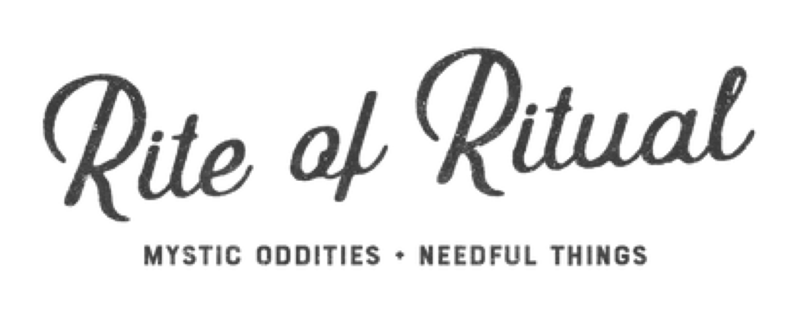

The wordmark is clean and modern — no heavy gothic letterforms. It reads as intentional restraint: the brand trusts its product photography to carry the moody weight rather than leaning on ornate type.

---

## Homepage / About — Lifestyle Photography

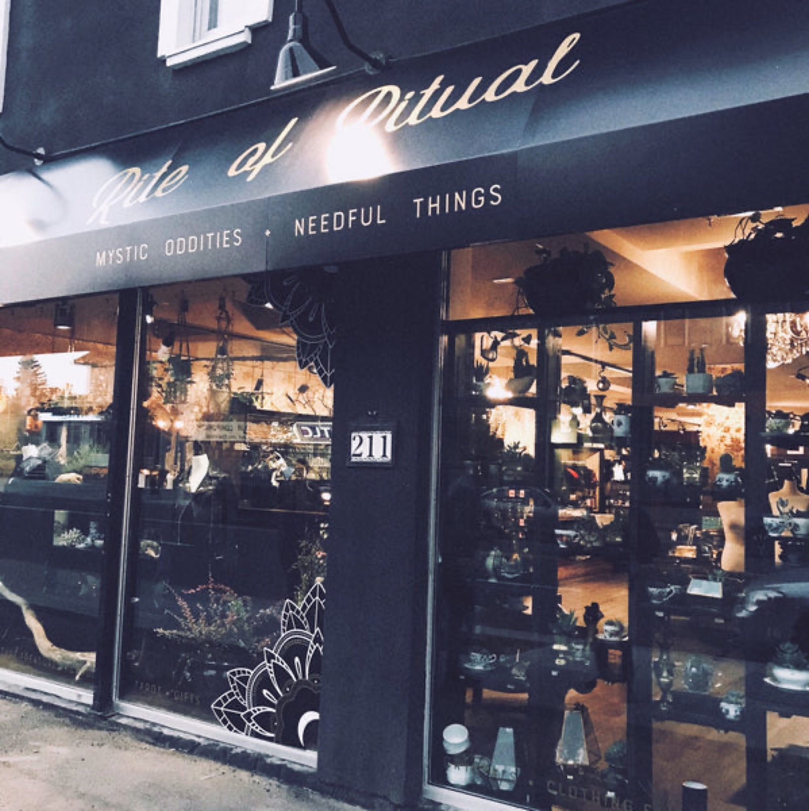

The brand uses candid, warm-lit lifestyle photography on editorial pages. The aesthetic is lived-in and tactile — not sanitized studio white. This signals "real practitioners" over "Halloween costume store."

---

## Apothecary Product Styling — Ritual Oils

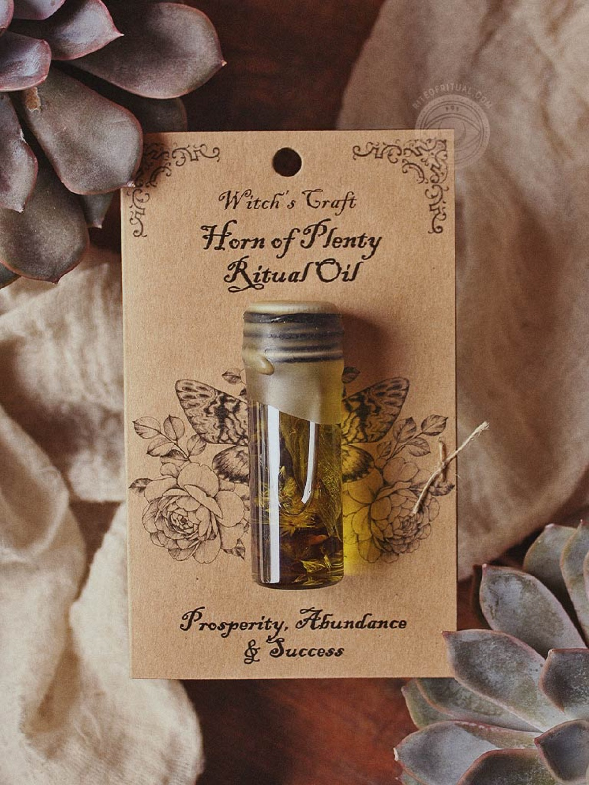

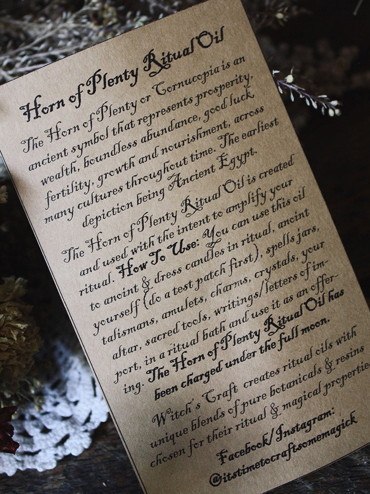

Product shots are styled against dark, textured backdrops with natural props (dried botanicals, crystals, cloth). Labels are hand-illustrated or hand-lettered in style. This is the core Tend reference for how to make a "daily dose" feel sacred.

---

## Dark/Moody Color Palette — Astro Magic Series

The Astro Magic series is the clearest example of their brand color system: deep navy, forest green, aubergine, and black with gold or metallic accents. Each product in a set is individually colorized by astrological association — a system Tend could replicate for deity-associated habit themes.

---

## Candle & Spray Apothecary Styling

Spray products show their label design system most clearly: a consistent shape template with swappable color and illustration per intention. The apothecary format (glass bottles, clean serif product names, ingredient-adjacent copy) translates directly to Tend's "offering" framing.

---

## Typography & Illustration — Zodiac Card Series

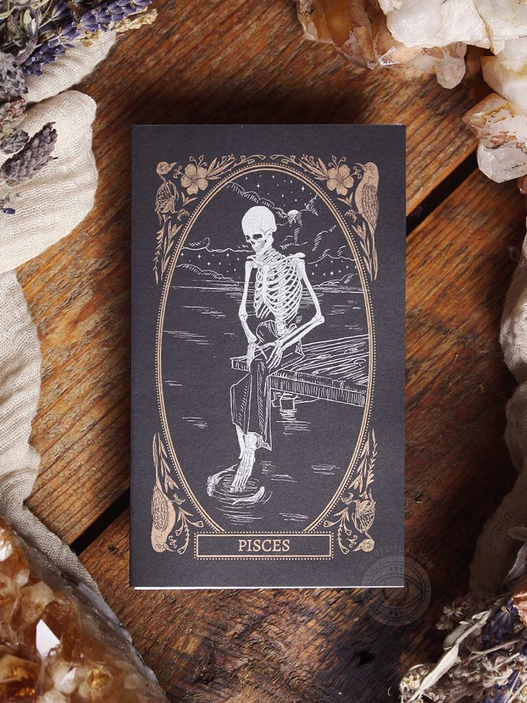

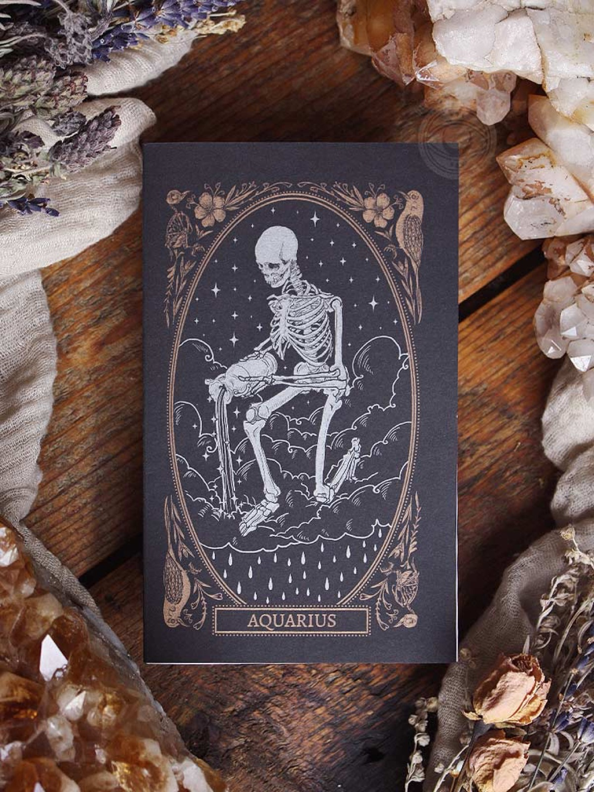

Their card line uses layered decorative illustration with dense celestial linework — constellations, botanical borders, symbolic glyphs. Typography is a mix of display serifs and fine decorative caps. This is the reference for Tend's deity card or habit tile design language.

---

## Brand Copy Voice — Journals & Books

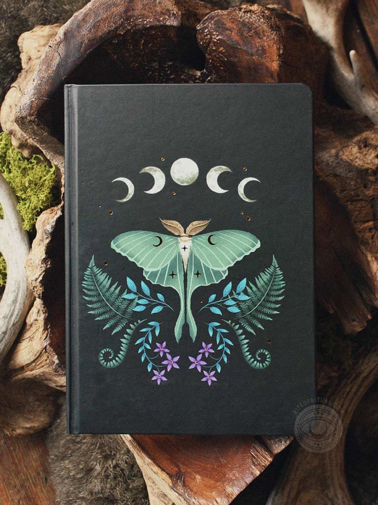

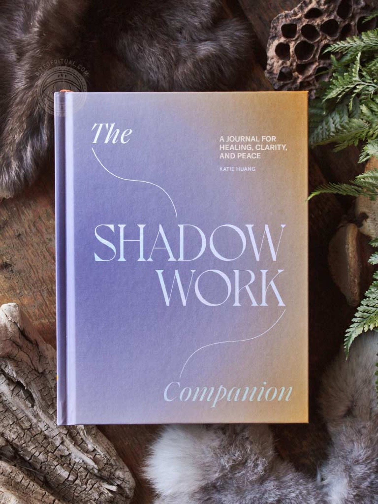

Product naming is direct and emotionally resonant: "Shadow Work Companion," "Luna Moth," "Seasons of Tarot." Copy avoids ironic distancing and treats the spiritual seriously without being precious. Tend's habit naming (e.g., "offering to [deity]") can adopt the same earnest-but-grounded voice.

---

## Botanical Apothecary Books — Prop & Lifestyle Reference

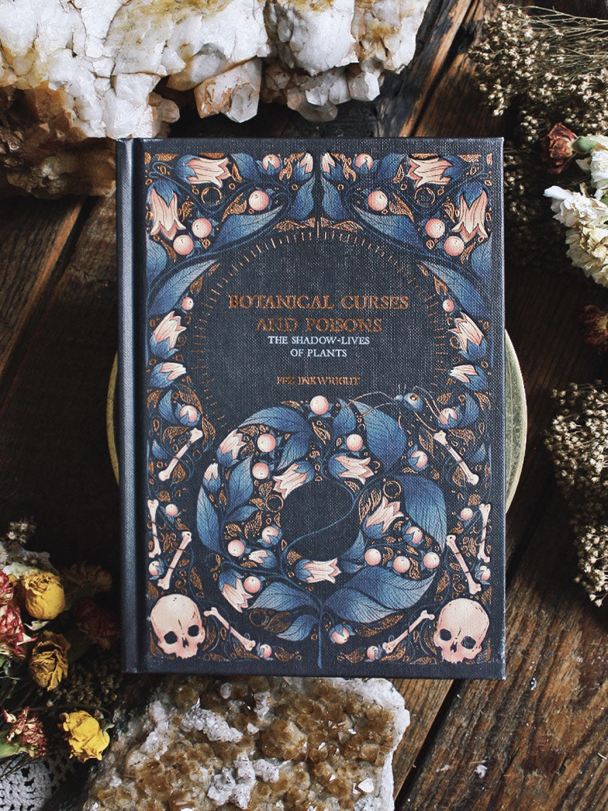

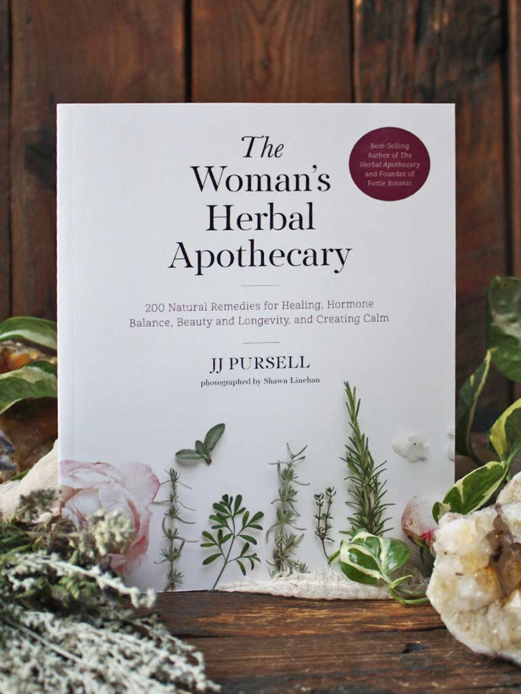

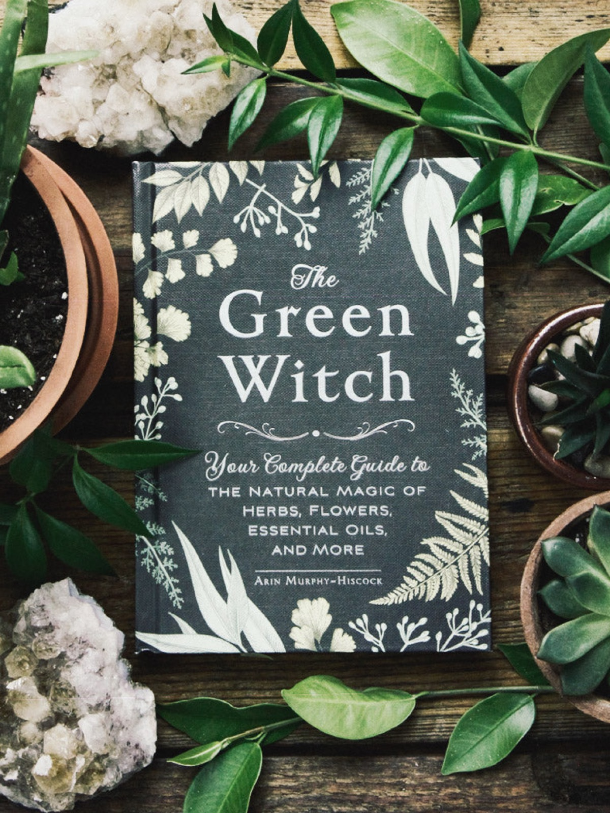

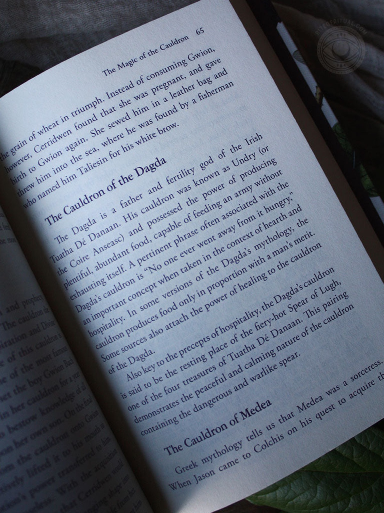

The book selection reveals the brand's aesthetic coordinates: dark academia, botanical illustration, earth tones shot through with black. These covers are strong UI mood-board reference for Tend's onboarding screens or deity selection pages.

---

## Overall Mood & Atmosphere

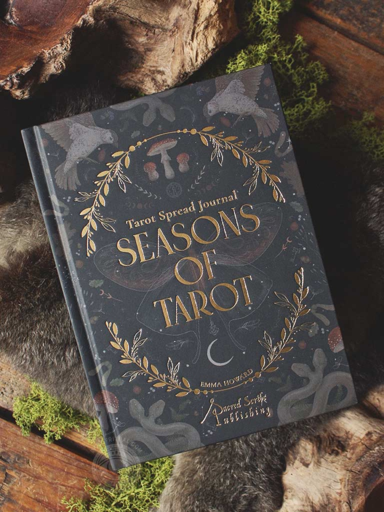

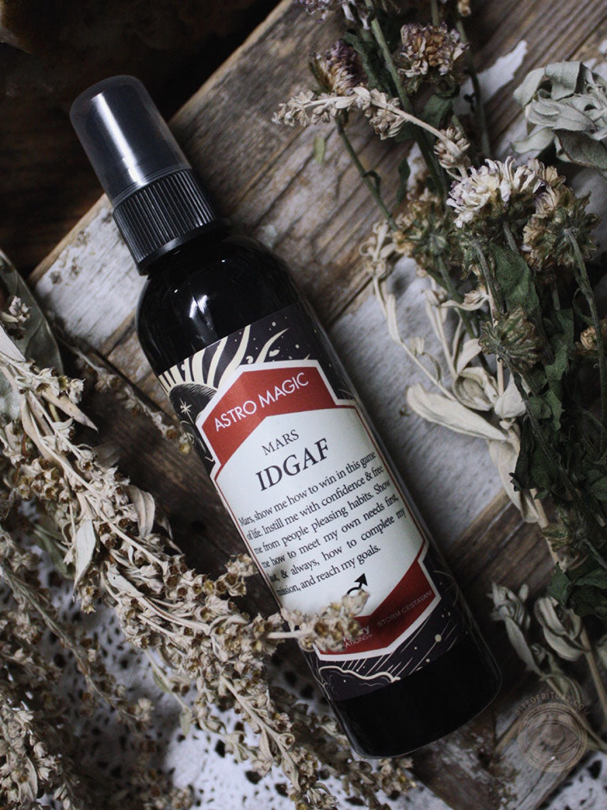

The store's atmosphere — both physical and digital — reads as a curated apothecary where every object has a reason. Nothing is accidental. The mood is serious without being severe, dark without being inaccessible. The tagline "We've Been Waiting for You" encapsulates it: you belong here, and the space was assembled in anticipation of your arrival.

---

## Design Language & Takeaways for Tend

- **Restraint earns authority** — The logo is clean and modern; the dark mood comes from photography and palette, not from gothic typography. Tend should follow this: let the deity imagery and color system carry the occult weight, keep UI chrome minimal.

- **Color as ritual taxonomy** — The Astro Magic series assigns a distinct jewel-tone palette to each celestial body. Tend can map colors to deities or habit domains so users build an immediate visual vocabulary for their practice.

- **Apothecary label = habit card** — Their intention sprays (cleansing, protection, love) are functionally identical to Tend's "offering" concept: named intention + ritual object + consistent visual template. Study the label format closely for habit card design.

- **Earnest voice, no irony** — Product copy treats shadow work, protection spells, and lunar cycles as real and serious. Tend's habit copy should do the same: name the deity, state the offering, skip the wink.

- **Dark backgrounds, warm light** — Product photography uses near-black or very deep jewel-tone grounds with warm, directional light sources. This makes objects glow without feeling cold or clinical. Tend's asset library should follow this lighting model.

- **Tactile surface texture signals craft** — Woven cloth, raw crystal, dried botanicals, and matte glass appear repeatedly as props. This telegraphs "handmade, intentional, precious." Tend UI can echo this through subtle texture overlays or material-coded component skins.
