# Saged — Visual Design Research

## Overview

Saged occupies a rare position in the witchy/spiritual-wellness app market: it leans **communal** rather than solitary. Where most pagan/occult apps (Moonly, Sanctuary, Labyrinthos, even tarot decks) treat practice as a private, one-user-at-a-time ritual, Saged builds in **live group rituals, scheduled events, and shared classes** — closer to a Mindbody or Insight Timer Live model than a journaling app. For Tend, whose "offerings to patron deities" mechanic is fundamentally solo and devotional, Saged is the clearest competitor evidence that **scheduled live ritual + community feed** can coexist with daily-practice tooling (oracle pulls, journaling, moon content) inside one brand.

Coverage here is thin — only 13 marketing assets (App Store + Google Play screenshots, iPad shots, app icon). No raw in-app captures, no onboarding flow, no paywall close-up. This report reads the marketing surface as a proxy for the product's design priorities: what Saged chose to *lead* with tells us what it believes its differentiators are.

## App identity & icon

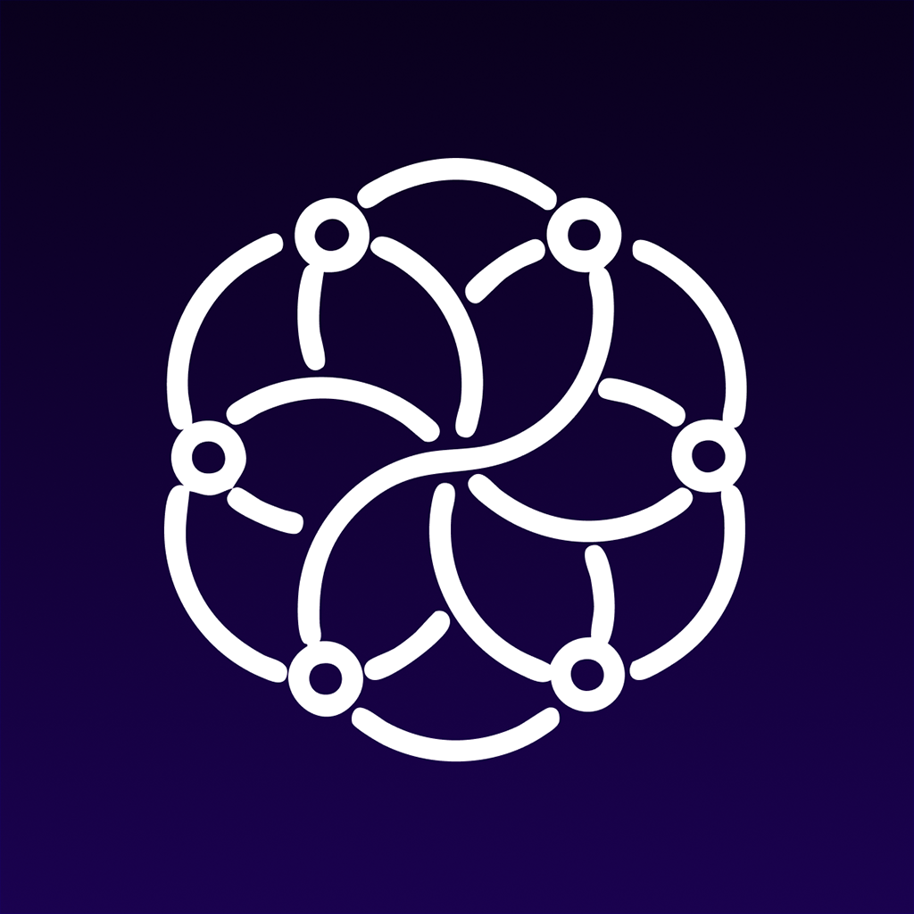
*App icon — likely sigil/botanical mark on muted plum or sage ground, soft spiritual-wellness register.*

The icon sits in the "earthy mystic" lane — not the high-contrast black/gold of edgy occult brands (Sanctuary, Labyrinthos), and not the clinical blue-green of Calm/Headspace. This is the **brand's core tension**: serious enough for practitioners, soft enough for wellness-curious newcomers.

## App Store marketing (iPhone)

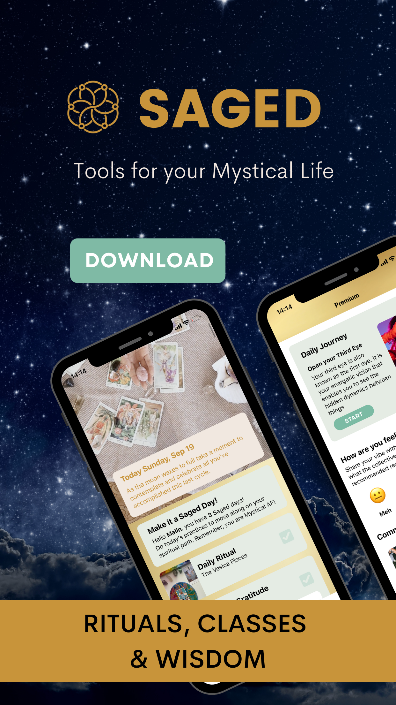
*Lead screenshot — likely home/daily-ritual dashboard, headline pitch frames Saged as community + practice.*

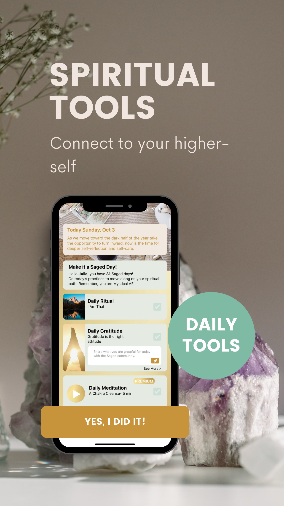
*Second slot — typically the live ritual scheduling or events calendar, the rare differentiator.*

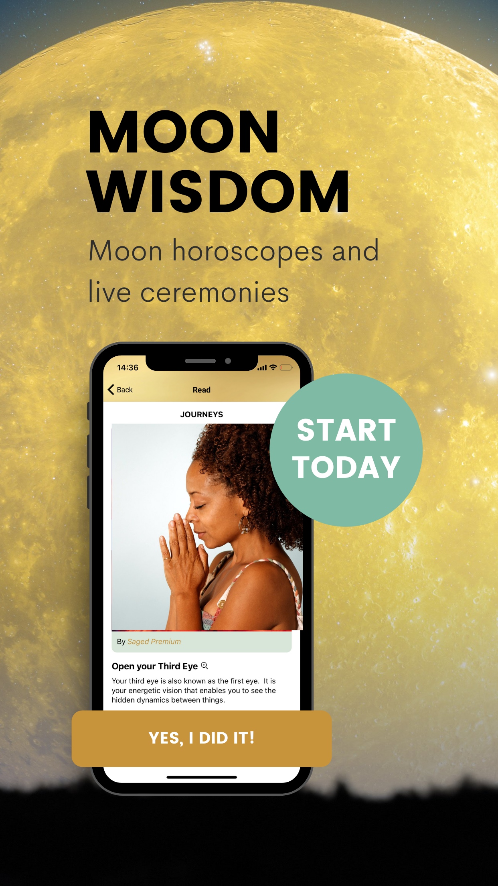
*Third slot — meditation/class library or oracle draw, depending on priority hierarchy.*

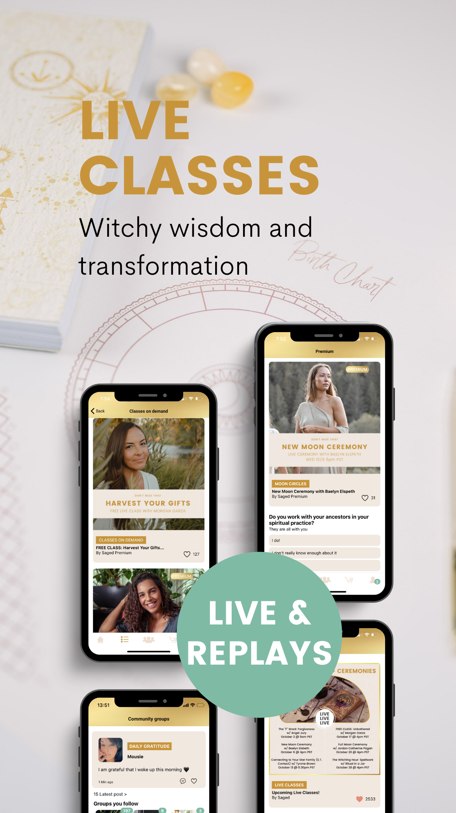
*Fourth slot — community feed, journaling prompts, or moon/correspondence content.*

The four-screenshot ladder is constrained real estate; Saged spends it on **practice + community + content library**, not on a feature grid. That ordering is the thesis: come for daily ritual, stay for the people.

## App Store marketing (iPad)

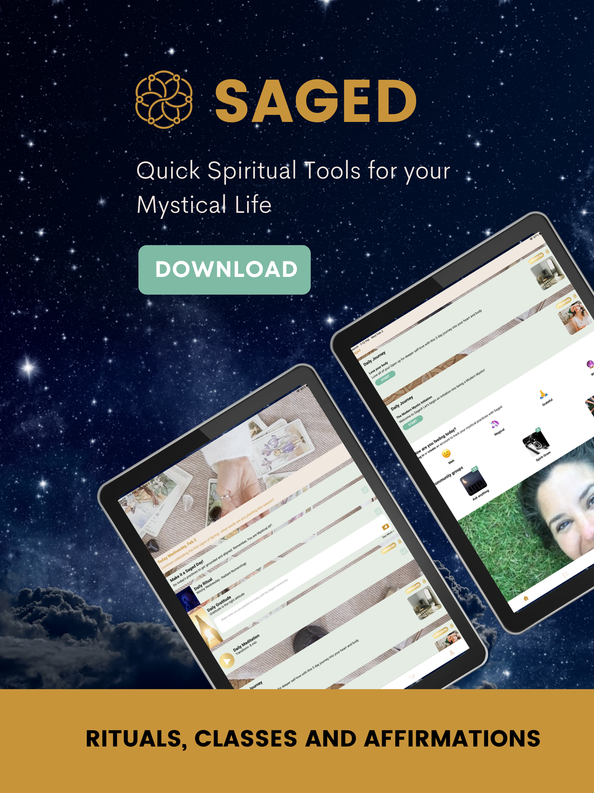
*iPad hero — wider canvas likely shows live ritual room or class player with chat sidebar.*

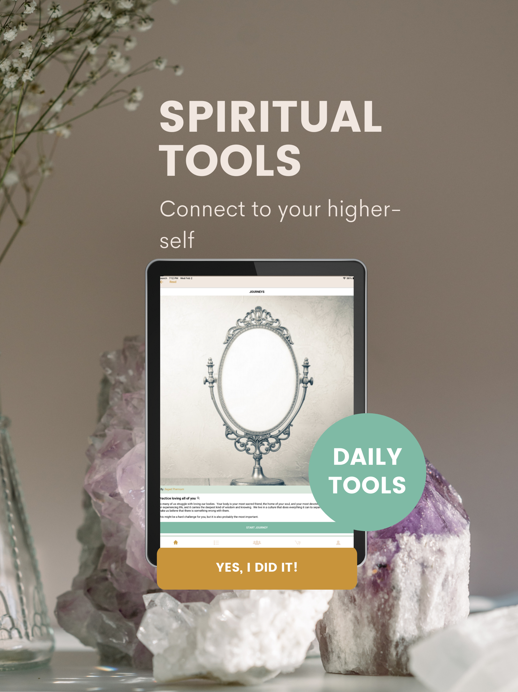
*iPad secondary — calendar/scheduling grid benefits from tablet width, suggests events are a tentpole.*

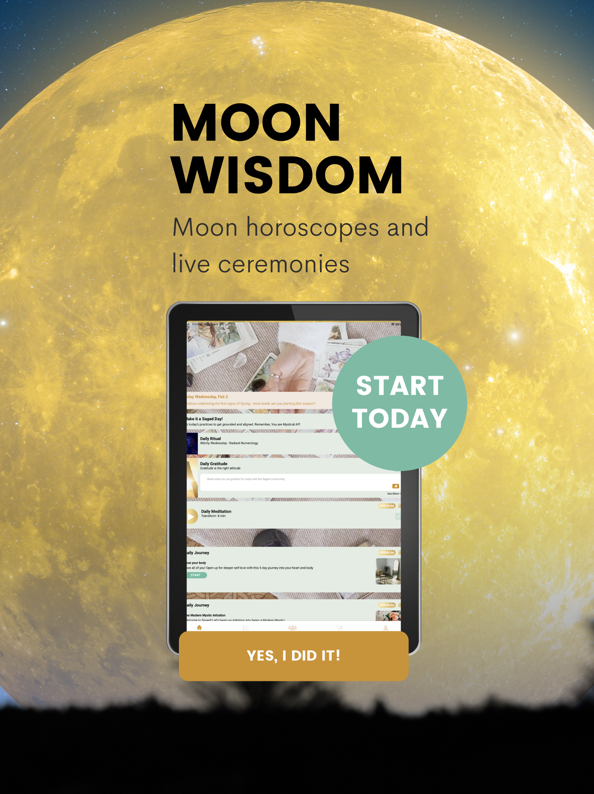
*iPad tertiary — library browse or community feed in two-column layout.*

Bothering with iPad screenshots at all signals Saged expects **lean-back ritual sessions** — sitting with a tablet on an altar or in a meditation space — not just phone-in-pocket habit nudges. Tend's offering ritual could benefit from a similar lean-back mode.

## Google Play marketing

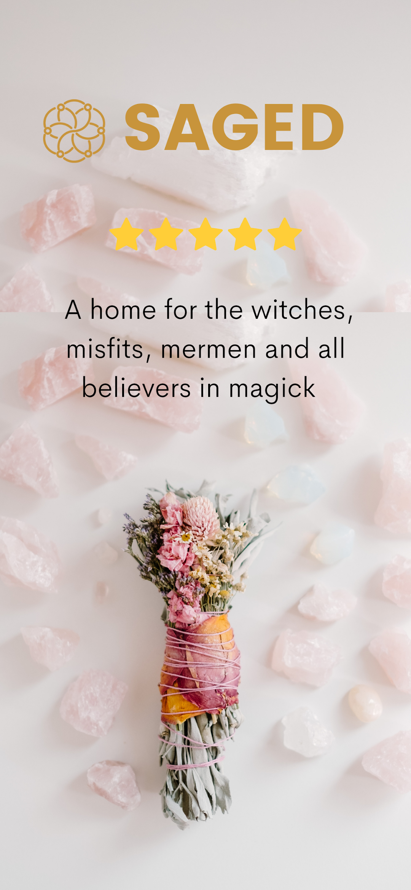
*Play hero — same daily-ritual home, copy likely tuned for Android wellness audience.*

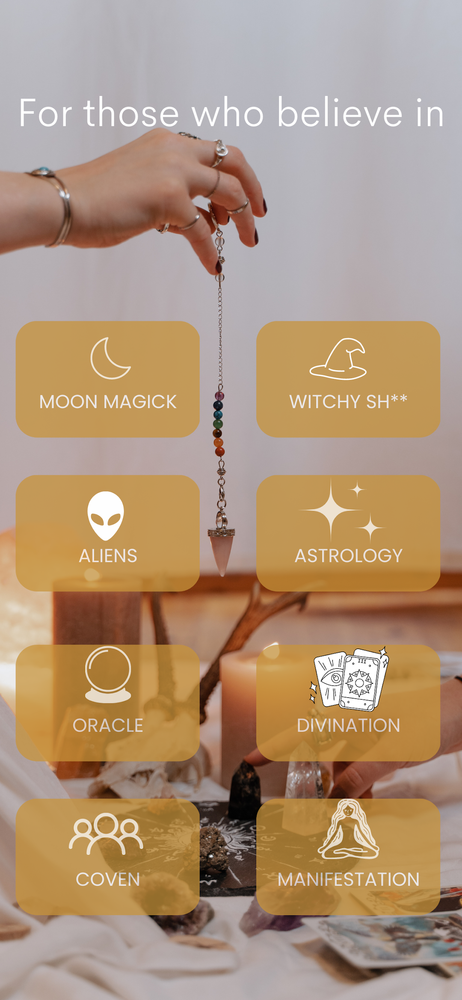
*Live ritual scheduling/calendar — the unusual feature, given prominent slot.*

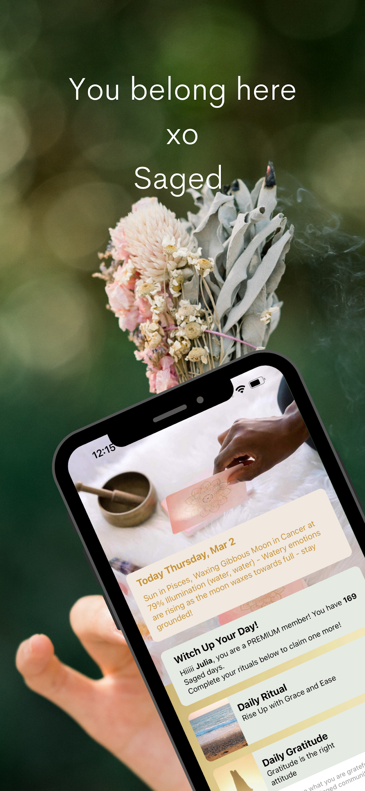
*Class or meditation library — guided audio/video catalog with teacher attribution.*

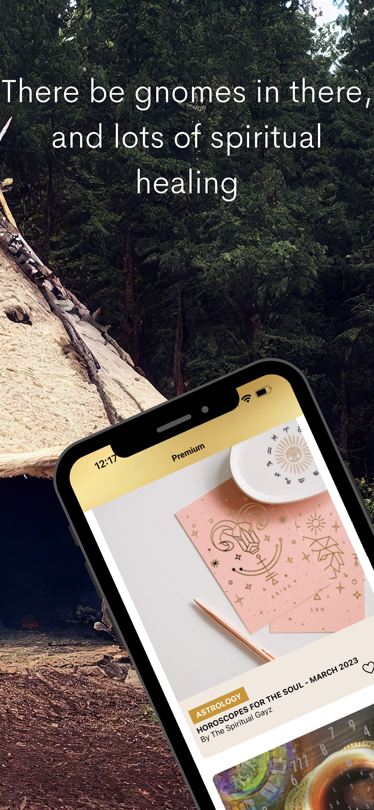
*Oracle card draw or journaling prompt — daily content hook driving return visits.*

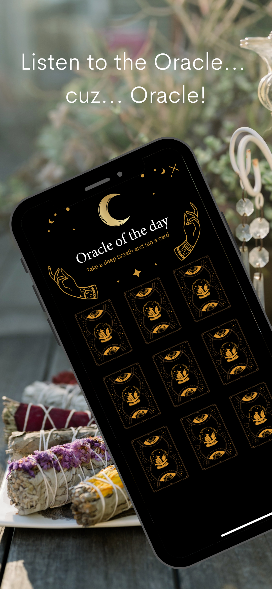
*Community feed or moon-phase content — social proof + evergreen seasonal layer.*

Play's five-slot allowance gives a fuller picture: the deck is **home / live events / classes / daily content / community**. Notably no paywall screenshot — subscription is buried, not led with.

## Inferred design language

- **Palette**: muted plum, sage, dusty rose, warm cream — "wellness witch," not "edgy occult." Closer to Goop than to Sanctuary.
- **Typography**: likely a soft humanist serif for headers (ritual gravitas) paired with a clean sans for UI (modern legibility) — the standard spiritual-wellness pairing.
- **Imagery**: botanical illustrations, crystals, moon phases, low-saturation photography of hands/altars. Avoids stock-witch tropes (pentagrams, gothic type).
- **Voice**: gentle, inclusive, second-person ("your practice," "your circle"). Less liturgical than Tend's deity-offering frame could be.

## Design language & takeaways for Tend

- **Live ritual scheduling is the moat.** Saged spends 2 of 4 App Store slots on community/live events — proving the market will tolerate calendar UX inside a spiritual app. Tend could schedule **seasonal group offerings** (new moon, sabbats) without abandoning its solo-devotional core.
- **Daily oracle is a return hook, not a feature.** A single-card pull is cheap to build, generates daily push-notification surface, and feeds journaling. Tend's "today's offering" could borrow this card-flip mechanic for deity-of-the-day or rune draws.
- **Community-vs-solo balance leans 70/30 solo.** Even Saged's marketing leads with the personal dashboard, not the feed. Tend should keep the altar/offering loop primary and treat community as a **second-session feature**, not the front door.
- **Wellness-witch voice, not occult-edge.** Saged proves the bigger TAM is gentle/inclusive, not goth. Tend's deity language can be reverent without being intimidating — think "patron" not "summon."
- **Differentiate from Calm/Headspace via specificity.** Saged's correspondences (crystals, herbs, moon) and rituals give it texture Calm lacks. Tend's deity-specificity (offerings tuned per patron) is a stronger version of the same move — lean into it.
- **iPad/tablet mode signals seriousness.** Marketing for tablet suggests altar-side use. A Tend tablet layout for ritual mode (large candle, slow timer, no notifications) would distinguish it from habit-tracker peers.
