# Sayonara Wild Hearts — Visual Design Research

## Overview

Sayonara Wild Hearts (Simogo, 2019) is a "pop album video game" — a 30-minute linear rhythm runner structured like a tarot-card concept album, with 23 chapters named after major arcana archetypes. Pure black grounds saturated neon (magenta, violet, electric blue, gold); every frame is composed like a music video still. For Tend, this game is the closest existing product to what the app should feel like: occult symbolism rendered at production quality, emotional intensity without irony, and a formal structure — tarot chapters, symbolic figures, ritual progression — that maps directly onto Tend's offering/deity framework.

---

## Key Art & Title Screen

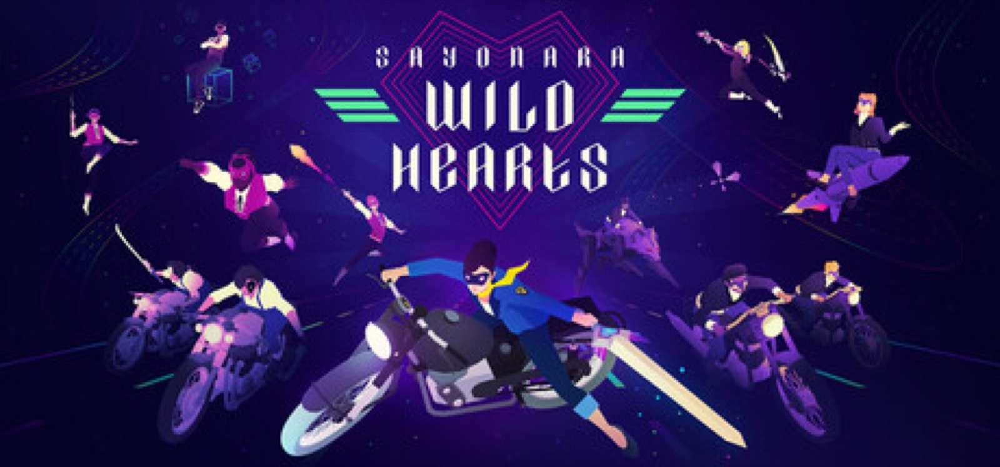

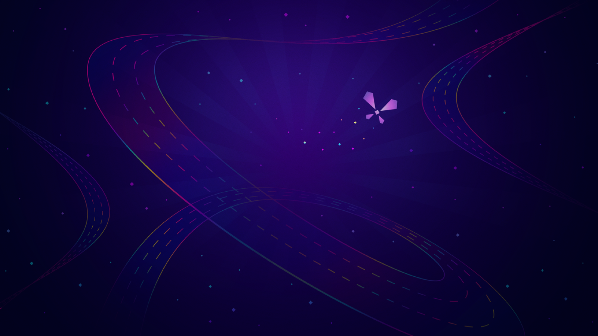

**Notes:** The wordmark uses a tight, rounded sans at display size on absolute black — zero decoration, zero gradient on the type itself. All ornament is reserved for the imagery below it. The background art uses deep indigo-to-magenta atmospheric gradients that feel more like velvet than light.

---

## Neon Color Palette & Atmosphere

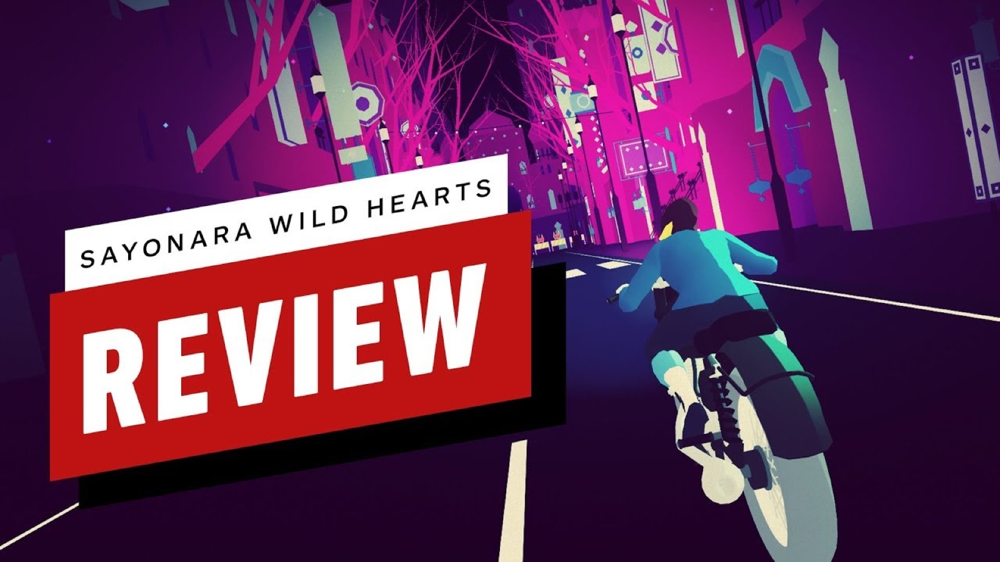

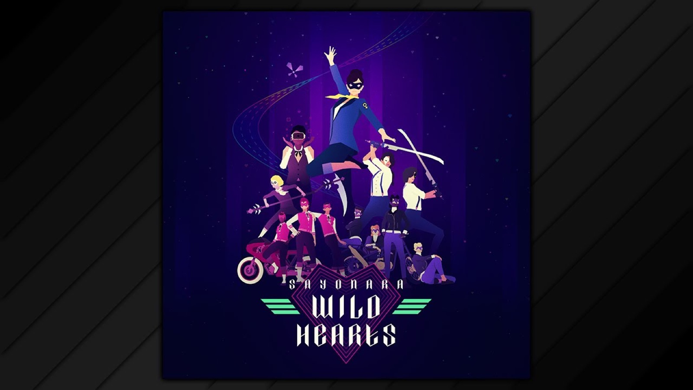

**Notes:** The palette is a strict system: pure black base, then exactly three neon channels at full saturation — typically magenta (#FF2D78), electric violet (#8B31FF), and cobalt (#1A8FFF). White is reserved for protagonist silhouette and UI text only. No midtones. No desaturation. No neutrals except black.

---

## Protagonist Design

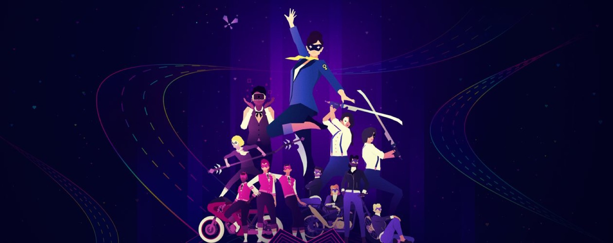

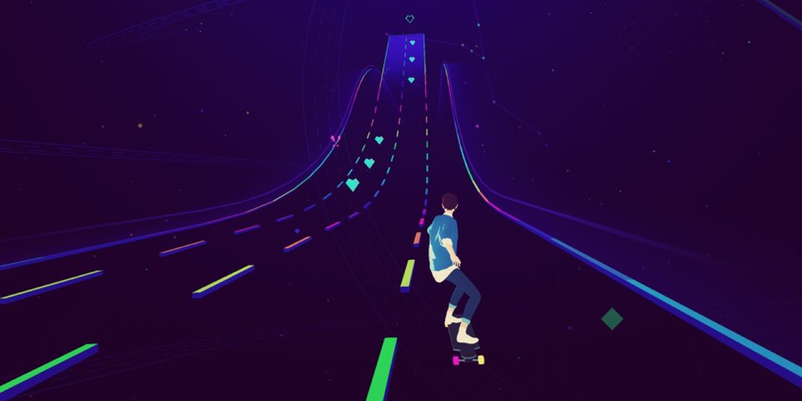

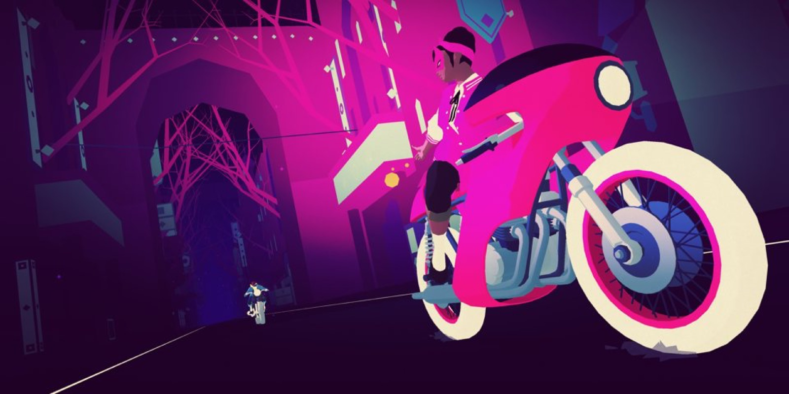

**Notes:** The protagonist is always in white or near-white — a deliberate inversion of the neon surroundings, making her readable at any speed. She's never named; her identity is archetypal, not personal. This maps perfectly to Tend's "vessel" concept: a self who brings offerings rather than one with a fixed story.

---

## Cosmic & Lunar Imagery

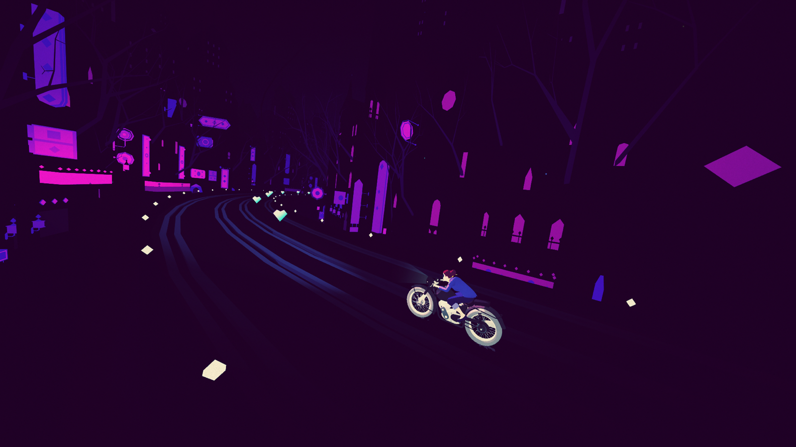

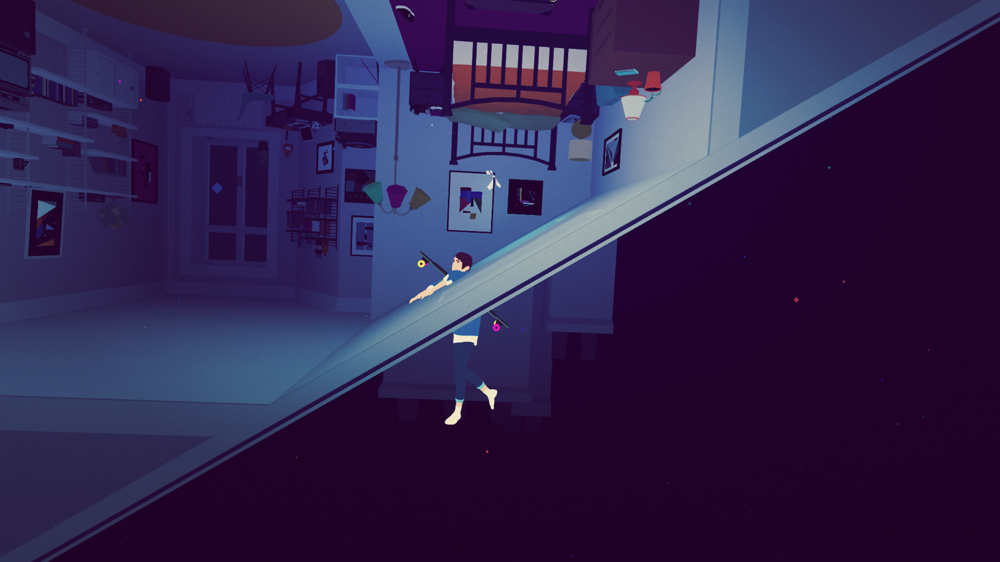

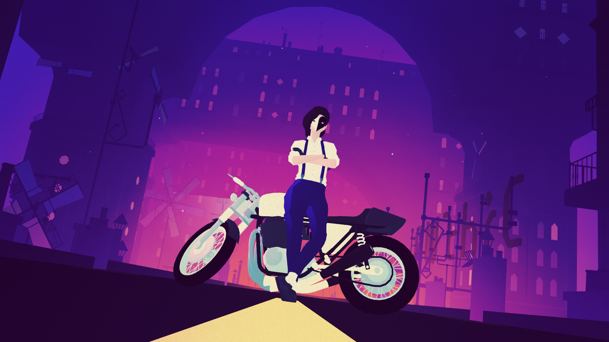

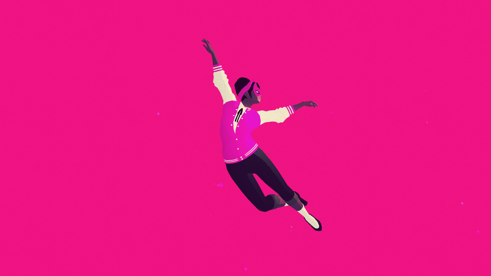

**Notes:** The moon appears in nearly every chapter as a structural anchor — it's both wayfinding (always behind the protagonist) and symbolic (cycle, return, the feminine divine). The stag is the game's central power animal, functioning exactly like a patron deity totem.

---

## Tarot Chapter Structure & Arcana Figures

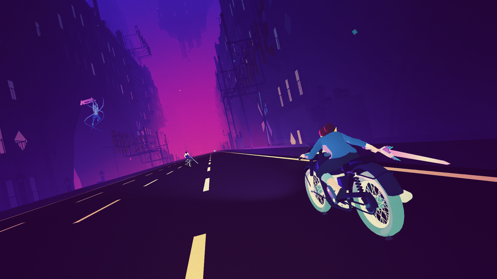

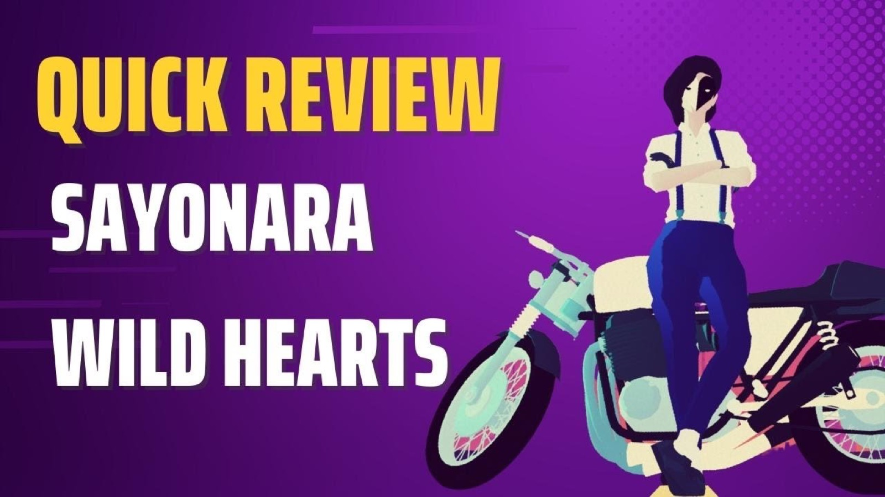

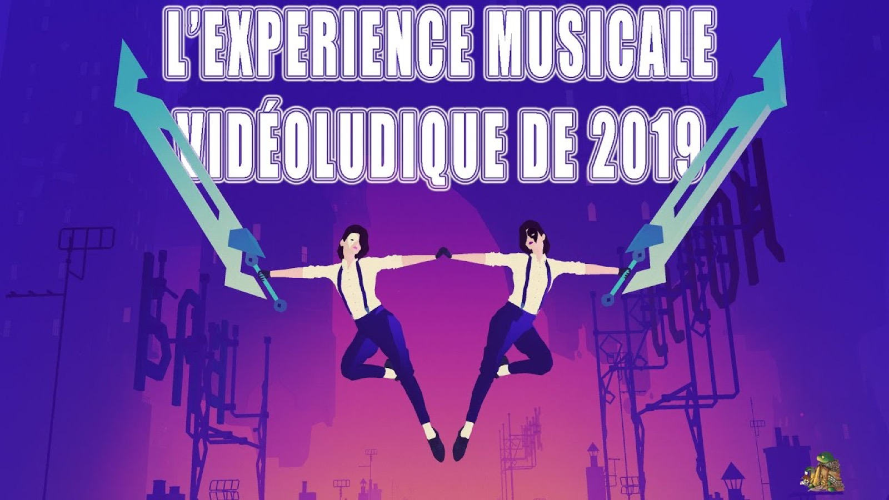

**Notes:** Each chapter break is a full-bleed tarot card: centered title in serif or condensed display type, symmetrical composition, one dominant color field, one symbolic figure. Zero UI chrome. The "arcana" boss characters each have a distinct neon palette, crown geometry, and elemental motif — Wolf, Butterfly, Sword — all functioning as patron archetypes.

---

## Typography Treatment

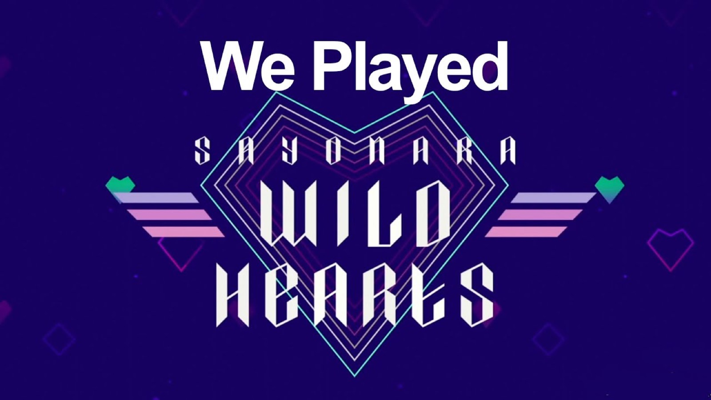

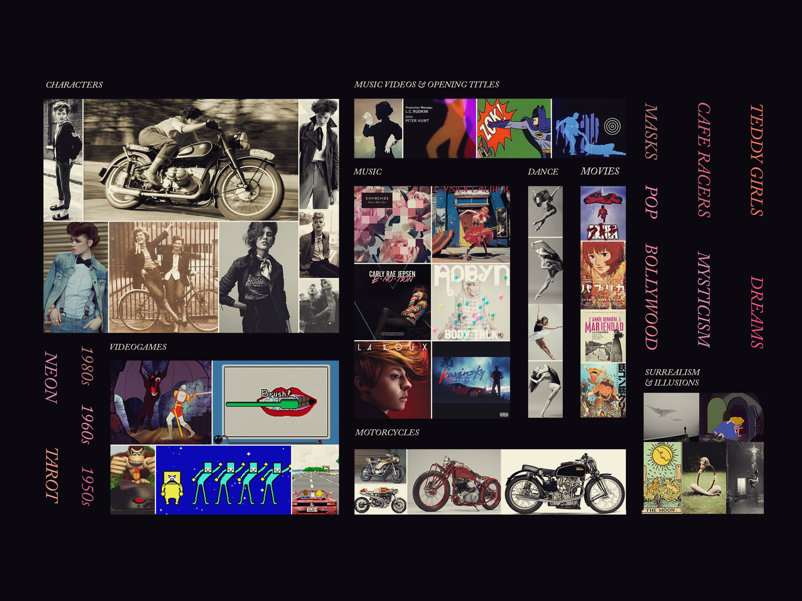

**Notes:** Type in SWH is always one of two modes: (1) a heavy rounded sans at full-bleed scale for chapter titles, or (2) constellation/star-dot letterforms where glyphs are formed by connected stars. Both modes are extremely high contrast, always white on black. No body copy ever appears in-game — every text element is a display headline.

---

## Design Language & Takeaways for Tend

- **Black is not a background, it's a material.** In SWH, black carries the same weight as the neon — it's the ground from which luminance erupts. Tend should treat its dark UI surface as active, not empty: vignettes, subtle noise texture, and radial light blooms from interactive elements.

- **Restrict the palette to 2–3 neons maximum.** SWH never uses all its colors simultaneously. Each chapter/deity in Tend should own a specific neon pair; switching deities should feel like changing the room's lighting, not its color scheme.

- **Archetypes, not characters.** The protagonist is a vessel; the bosses are forces. Tend's deities should be rendered as geometric/symbolic figures — not illustrated portraits — so users project meaning onto them rather than reading a fixed personality.

- **Tarot card transitions as ritual punctuation.** Every major action in Tend (completing an offering, ending a day, entering a deity's domain) deserves a full-bleed chapter-card transition: one symbol, one color field, one word. This is the structural equivalent of lighting a candle.

- **The moon as persistent wayfinding.** In SWH the moon is always present; it grounds spatial orientation. In Tend, a lunar phase indicator could serve the same role — always visible, always meaningful, always anchoring the user in cyclical time.

- **White silhouette = the self.** The user in Tend is always rendered in white: their streak, their name, their avatar. This makes them instantly readable against any deity's neon palette and keeps the emotional hierarchy clear: luminous surroundings, luminous self at center.
