# SleepTown — Visual Design Research

SleepTown is Seekrtech's sleep-domain sibling to Forest: same loss-aversion engine, different metaphor. Instead of planting a tree during a focus timer, you commit to a bedtime and wake-up window, and the app constructs a tiny isometric house while your phone sits idle through the night. Hit your goals → the house is yours, dropped into an ever-growing town tile. Touch your phone after bedtime → the construction site collapses into a broken crate of timbers and stones. Repeated nights of consistency accumulate into a screenshot-able micro-civilization, a Buildex of 70+ unique structures, weekly tickets that boost rare-building odds, and ultimately collaborative "Wonders of the World" (Taj Mahal, etc.) built across a friend Circle. The design language is unmistakable: chunky low-poly isometric buildings, mint/teal pastels, big rounded sans-serif type, and a single quiet town tile that *is* your sleep history.

**Relevance to Tend:** SleepTown is the cleanest non-Forest example of "accumulating visual record" as the entire UX. Tend's offerings-to-deities loop has the same structural problem SleepTown solves: how do you make N days of compliance feel like *one persistent object* a user can show off, return to, and grieve when broken? SleepTown's answer — an isometric tile that fills in one micro-structure at a time, with a hard "destroyed crate" failure state and a 2-days-off mercy mechanic — is directly portable to a witchy "altar grows over the lunar month" or "deity's domain accumulates icons" system. The building-as-record metaphor is a model for any accumulating-progress system, and the destruction state is the single most-imitated UX moment in the genre.

---

## App Store hero / "What you sell" framing

The screenshots a prospective user actually sees in 2025 on the US iOS App Store and Google Play, in order.

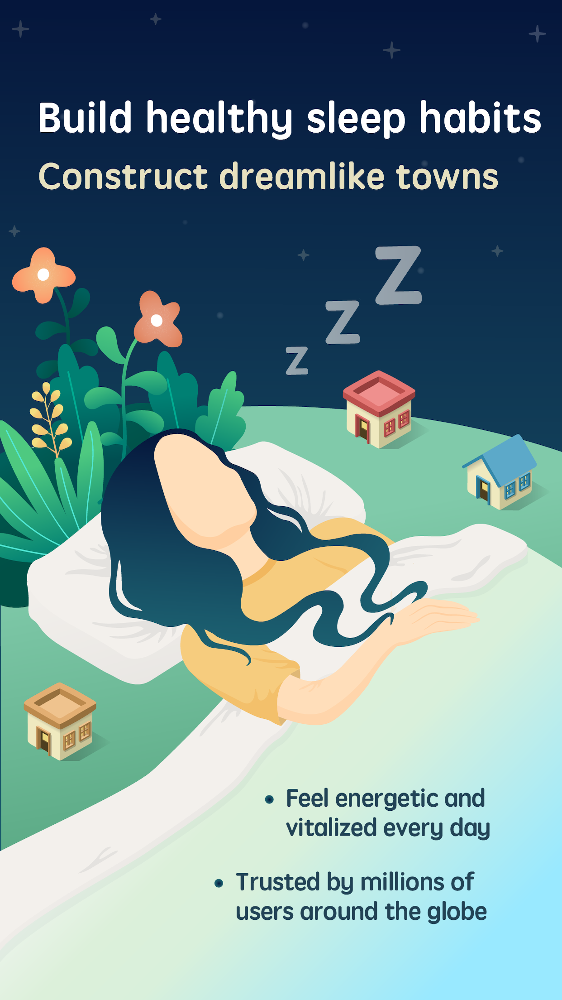
*Lead App Store screenshot. The hero doesn't show app UI at all — it shows the metaphor. Two-tone half illustration (daytime grass below, starry indigo night above), warm flat character art, and the smallest possible "preview" of the gameplay reward (three houses, one bottom-left already "yours"). Sells dreaminess before mechanics.*

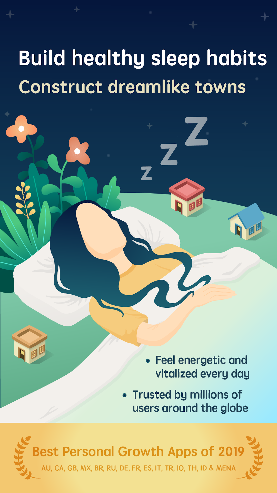
*Play Store uses the same hero but bolts on a 15-region award ribbon at the bottom — credibility framing for a $1.99 paid app.*

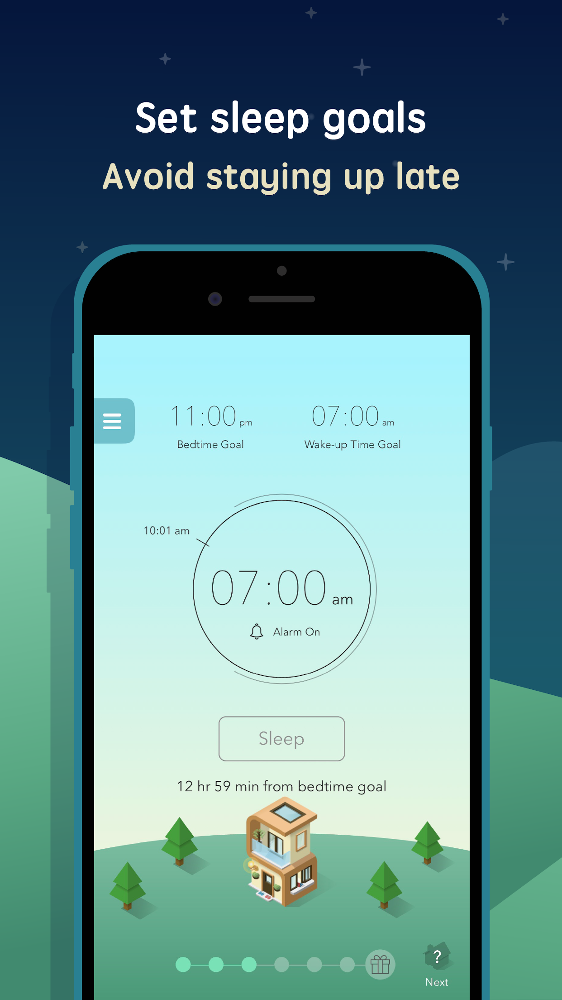
*Second screenshot communicates the entire core UI in one frame: bedtime/wake-up goal pills top, big round alarm clock center, "Sleep" CTA button, single house with trees waiting on the green ground plane.*

*The most important screenshot in the entire set. Loss aversion is taught in one image: the reward state (rays, exquisite Asian-style house) directly contrasts with the punishment state (broken crate of timbers). This is the SleepTown thesis in a single frame.*

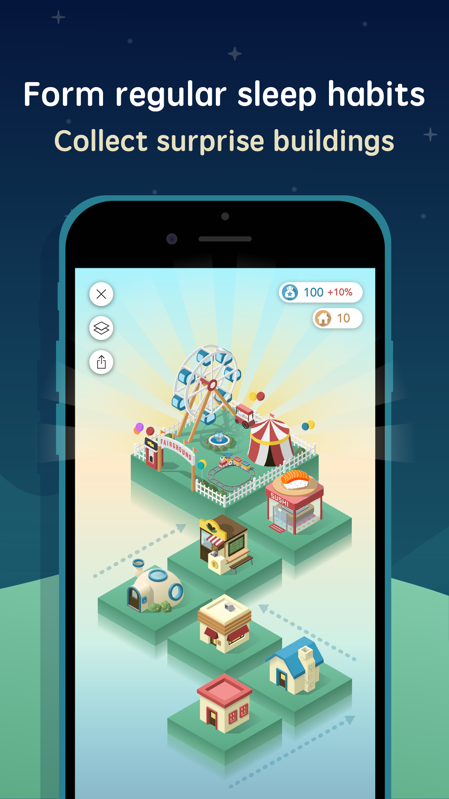
*Pivots from single building to long-term collection. Carnival-themed tile (ferris wheel + striped circus tent) suggests holiday/rare buildings exist. The "+10%" coin badge teases streak bonuses.*

*Sells the Circle feature. Note the progress bar is shared across members — each successful sleep contributes "energy" to one giant collective build. The Wonder visual is dramatically different from individual buildings (island base, scale, snow).*

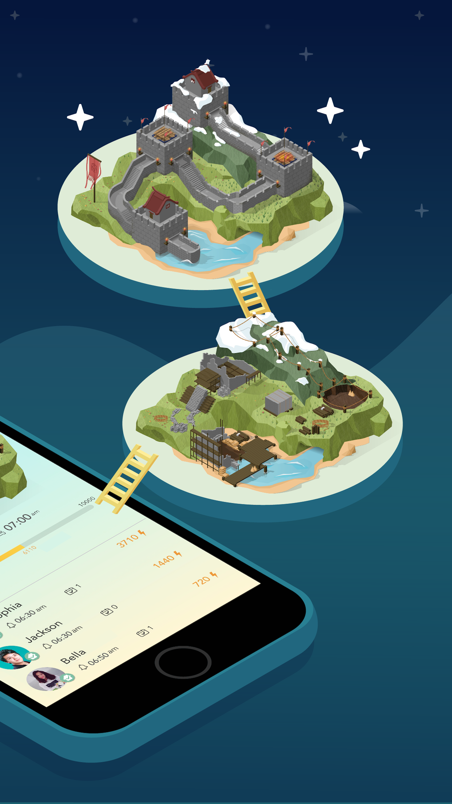
*Pure aspiration shot — no UI chrome at all, just two completed Wonders as floating sky islands with ladder-as-progression. This is the "lush forest" of SleepTown.*

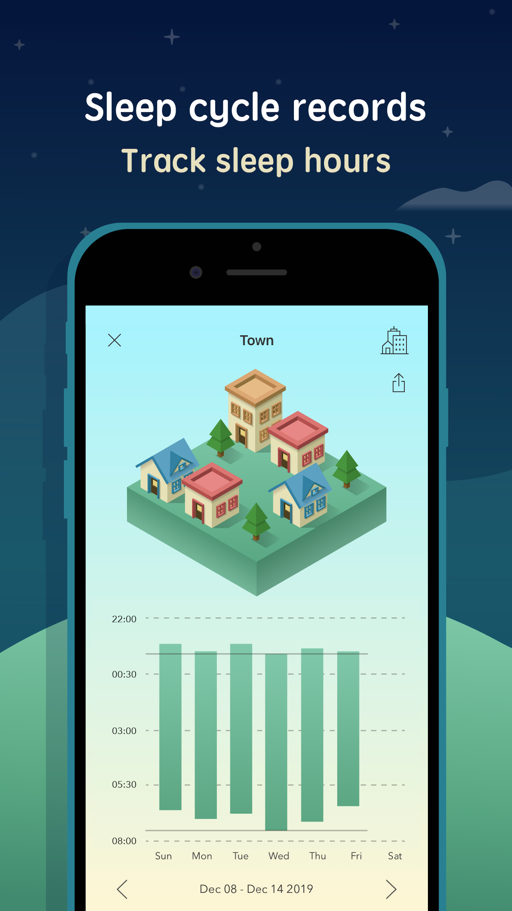
*Shows the secondary data view: each completed week becomes both a town tile (visual) and a bar chart (quantitative). Town tile sits *above* the chart, not the other way around — the visual is the primary record.*

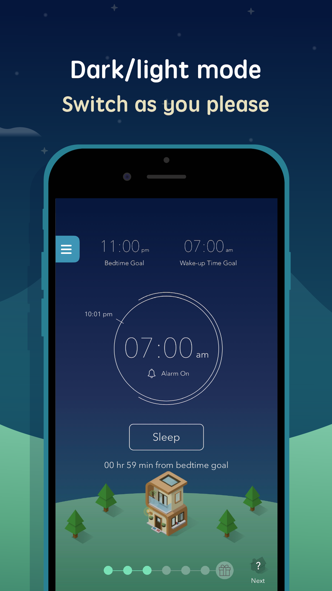
*Dark mode preserves the same isometric building, but the sky inverts to starry navy and the green ground darkens. Building emission glow becomes the focal point.*

---

## Landing site & iPad framing

SleepTown's web landing (sleeptown.seekrtech.com) condenses the funnel to four illustrations and a phone mockup.

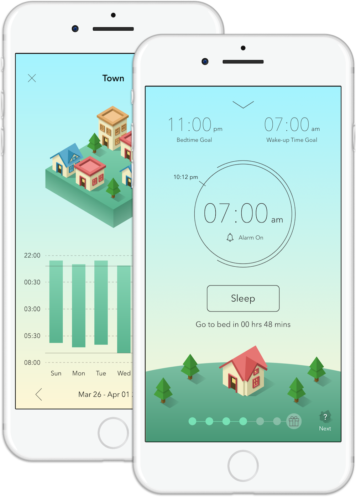
*Same dual-screen split used on TapSmart's featured image — Town view + Timer view is the canonical "two-panel sell." Note the landing page uses the older clean-mint palette before the dark-mode redesign.*

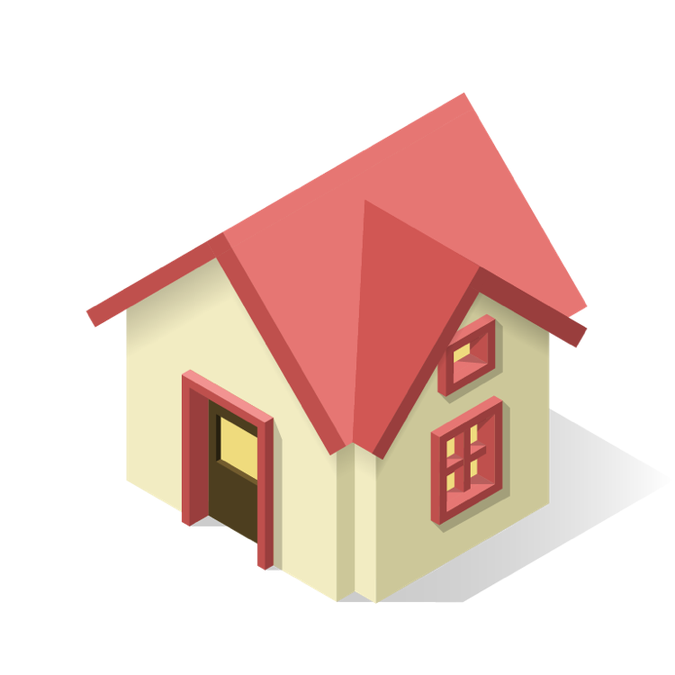
*The "completed building" hero asset, used in marketing materials. Pure asset on white — note the soft drop shadow and the slightly off-axis isometric (~30°). This is the canonical "house" silhouette that all 70+ Buildex variants are designed against.*

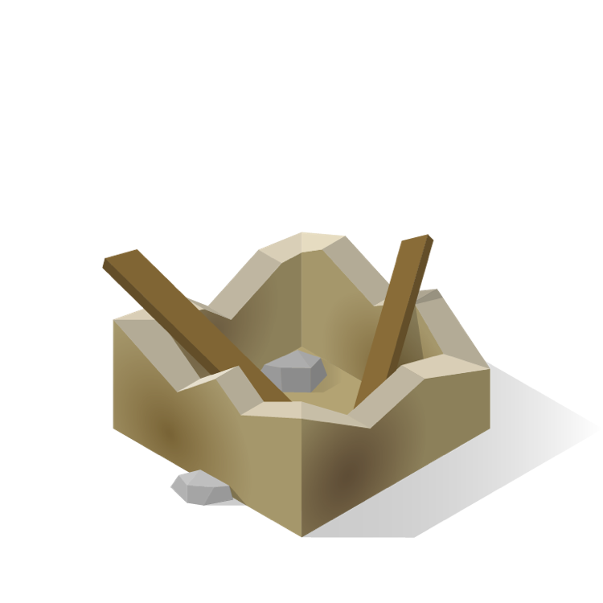
*The destroyed-building marketing asset, isolated. Tan/khaki color story (vs. the vivid yellow+red of the success state) signals failure without using red alarm color. The composition is deliberately "tipped over."*

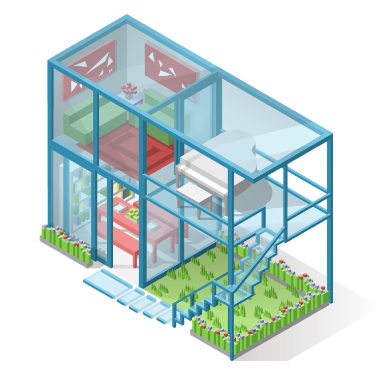
*Marketing asset for rare buildings. Far more architectural detail than the starter house — internal furniture, transparent walls, multiple landscaping pieces — communicates "you'll get cooler stuff if you stick with it" in one frame.*

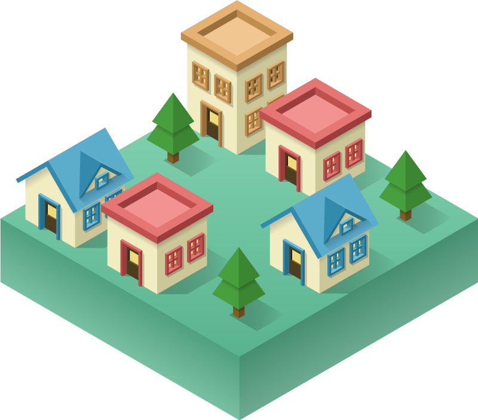
*The "promised land" asset. One platform, ~5 buildings, deliberate negative space between them. This is the *minimum viable* town that already feels like a place.*

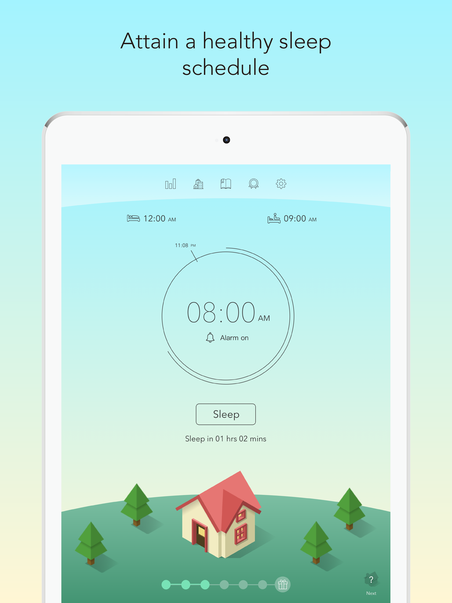
*iPad layout reveals the full top-bar nav (5 icons) usually hidden in the iPhone hamburger. Worth noting: the timer is sized to dominate even at iPad scale — vertical hierarchy is preserved.*

*A rare "under construction" marketing illustration. Wooden crane is the universal symbol — used as the literal "building in progress" state in-app. Pallet of bricks signals materials/effort.*

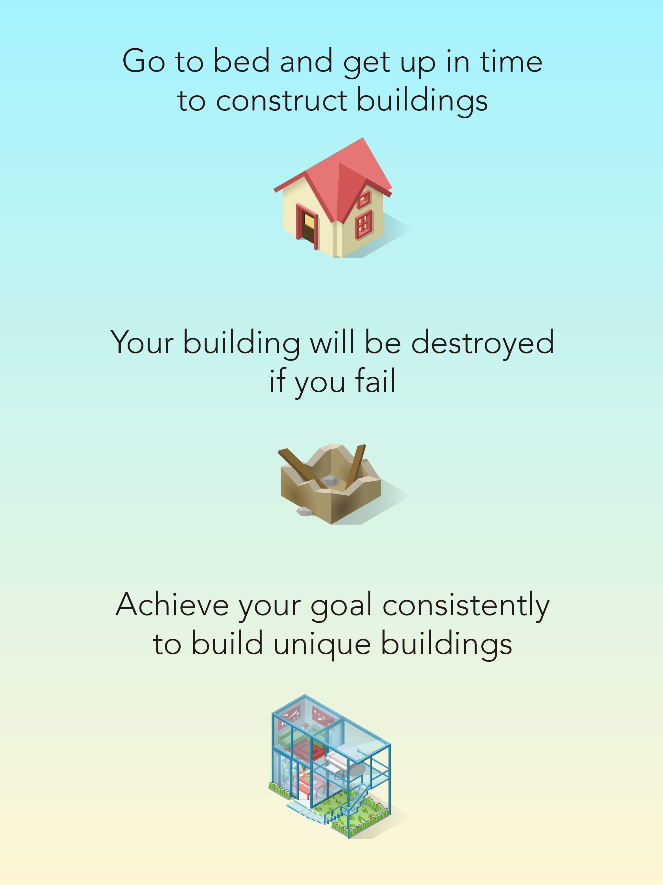
*The three-state cycle in one frame: success → failure → rare reward. This is the entire game-loop boiled to three illustrations stacked vertically.*

*The decoration/customization layer — coins buy ground tiles, trees, lampposts, fences. The two stacked tiles imply infinite expansion as you collect more buildings.*

---

## Onboarding flow

SleepTown's onboarding is a tooltip-overlay tutorial layered on the actual home screen (rather than a separate intro carousel like Forest).

*First in-app tooltip. The home screen is dimmed to ~50% black, the pill being explained is highlighted, and a white tooltip with a tail anchors below. The dot indicator at the bottom shows progress through ~8 tutorial steps.*

*Days-off explanation — the mercy mechanic. Two checkmarks pre-filled on Sun and Sat. The detailed copy explicitly addresses the previous-night-edge-case ("late the day BEFORE your day off"). Reduces onboarding anxiety about commitment.*

*Home screen after tutorial dismissal. Note how much of the screen is empty hillside — the building/timer floats in cyan, the ground anchors the "place" you're building on. No bottom nav, no tabs.*

*The first-launch carousel before tooltips begin. 5-dot indicator at the bottom suggests this is page 1 of 5. The half-night/half-day illustration is the most thematic illustration in the entire app.*

*Feature-announcement modal that runs on app update. Sheep-as-mascots is the only cartoon character moment in the app — used to soften a power-user feature (Circles + Wonders).*

---

## Bedtime / wake-up goal setup

The setup affordance is the entire home screen — there's no separate "settings" mode for sleep windows.

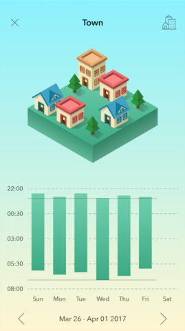
*The minimum-friction settings sheet: three rows total. Day-off picker is collapsed into a single row showing the two selected days as a single string. Total duration is computed and shown explicitly so users can see if 11→7 is the right window for them.*

*Dark-mode home with all UI elements. The arc surrounding the clock is the *visualization of how far around the dial the current time is from the wake-up time* — a continuous countdown ring, not just a label.*

*Real-user home with the "2-hour pre-bedtime build window" rule made explicit. Notice the ticket-streak mechanic is taught as a tooltip *on the home screen*, not in a separate help area — the home screen IS the help system.*

---

## Sleep state — building under construction

When you tap "Sleep", the app locks into a single non-interactable construction screen until your wake-up window opens or you exit the app (and destroy the build).

*Same as Hero 3 but worth re-examining: the *promise* (house under sunburst rays) and the *threat* (broken crate) literally share one screen during onboarding. The rays + slight float = "active construction in progress" visual language.*

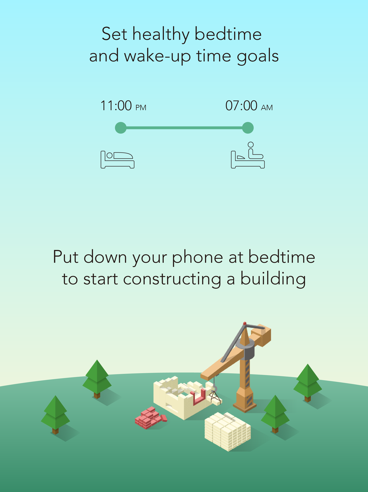
*Reused for emphasis — the construction-site illustration (crane + bricks) is the canonical "sleep in progress" graphic. The crane being wooden, not industrial, keeps the cozy palette.*

---

## Wake-on-time success — completed building

When you wake within the window and tap to claim, the building reveals with rays + stars animation.

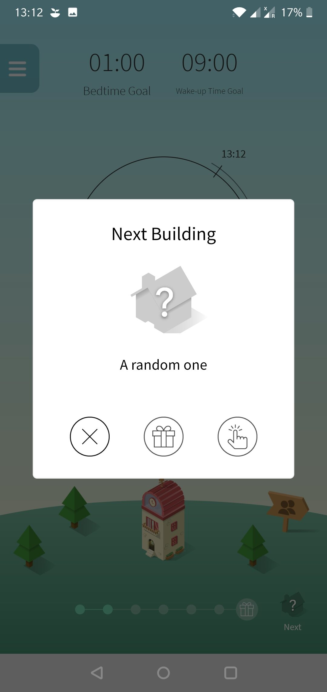
*The pre-construction "what am I building tonight?" picker. Three buttons: cancel, redeem ticket (gift box), or random pick (finger tap). The mystery-house question mark is the canonical "surprise reward" visual.*

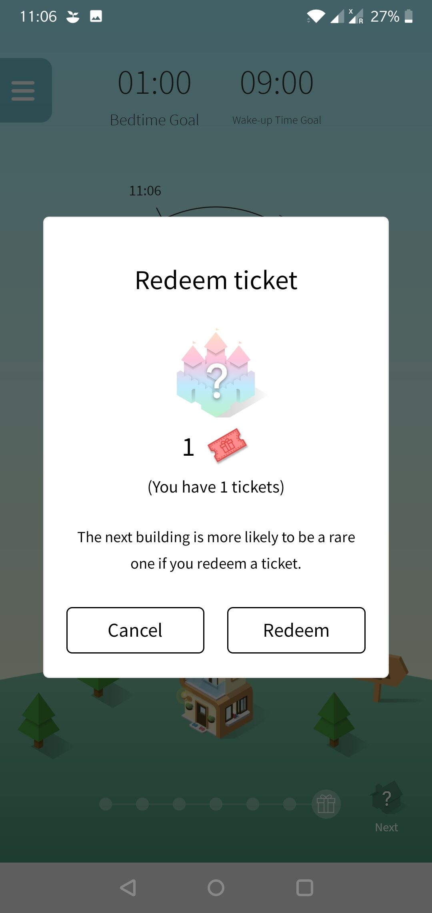
*The 7-day-streak ticket redemption. Beautiful detail: the unknown-rare-building is illustrated as a pastel "castle" silhouette with question mark — different from the standard mystery-house icon, signaling "this is the better gacha pool."*

*The Wonder of the World completion celebration. Yellow sunburst (vs. the smaller sunburst for individual buildings) signals scale. Stars + light-yellow confetti dots. Note the architectural fidelity — Taj Mahal is rendered with real reflecting pool and 4 minarets, not a generic "fancy temple."*

---

## Building destroyed state (phone-use failure)

This is the single most distinctive UI moment in the app and the entire reason loss-aversion users return.

*The destruction asset isolated. Critical design choice: it's not red, blood, fire, or a skull — it's a *broken construction crate*, framed as "the materials were ruined, try again tomorrow." Punishment without melodrama. Color story stays in the cozy palette.*

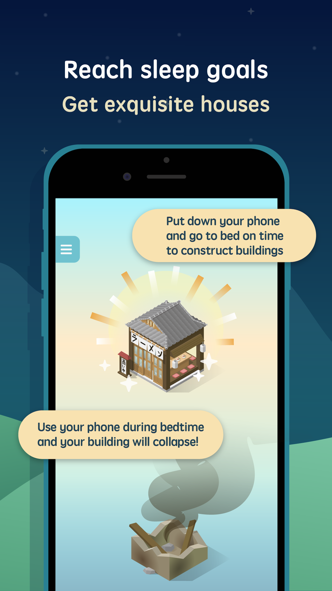
*Notice the crate sits *below* the active house in the marketing screenshot. It's the same physical position as a finished building, just broken. Implication: this same spot in your town could become either reward or scar tomorrow.*

---

## Town view — collected buildings over weeks/months

Each "Town" is a fixed-size isometric tile that fills in as you complete buildings.

*One week = one tile. Six buildings = six successful nights (with Sun "day off" implied). Bar chart below the tile uses the same green palette and is treated as secondary data. Spatial arrangement of buildings on the tile is automatic/randomized, not user-controlled.*

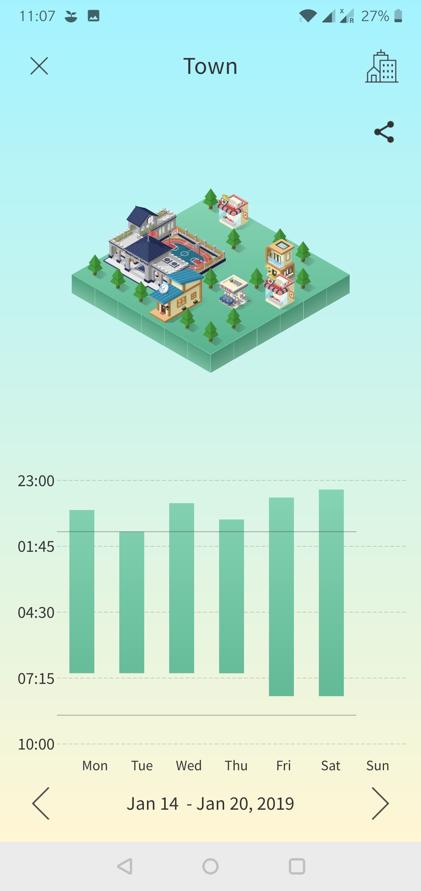
*Adjacent week's tile shows entirely different building set + arrangement. Continuity between weeks comes from the *big Town view* (next image), not from week-to-week tile evolution.*

*Julie's actual long-term town after 85+ days. This is THE screenshot SleepTown is built around — what one person's sleep consistency looks like as a single image. Every building is one successful night.*

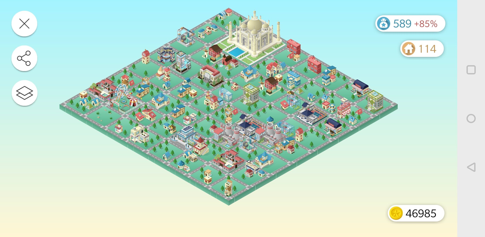
*Same Big Town a week later — 9 more buildings, streak bumped from 76% to 85%. Demonstrates how the town *grows* (densifies) over months, not just expands.*

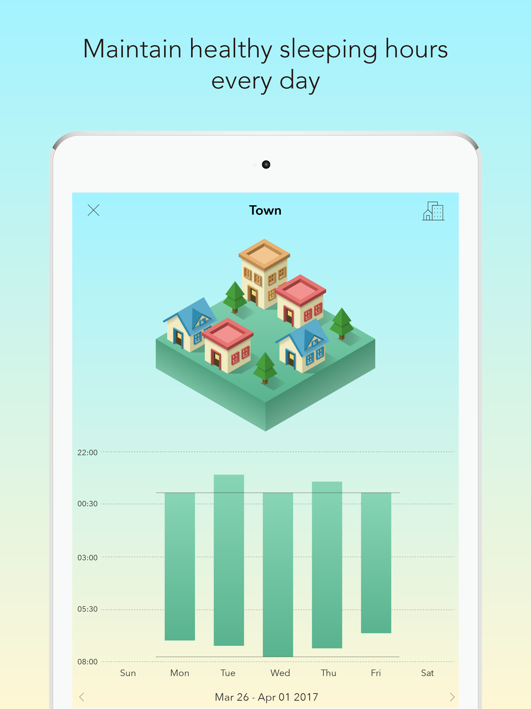
*The "medium-tenure" town view used in marketing — small enough to be readable, dense enough to feel rewarding. Note the deliberate gaps left for future buildings.*

---

## Building catalog (Buildex) — 70+ unique buildings

The Buildex is a paginated grid where unobtained buildings show as grey silhouettes ("Pokédex of houses").

*Standard starter Buildex page. Grey silhouettes are a powerful collection driver — exact silhouette shape is shown, so users can guess what it'll look like. Page indicator at bottom shows 7 pages of houses.*

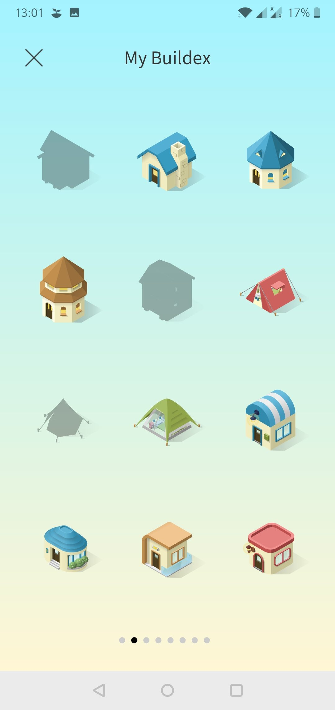
*Variety of building *types*: tents and modern shops mixed with traditional houses. The turret tower is one of the rarer architectural shapes.*

*Mid-pages show urban/commercial buildings. The 24-Z convenience store is a clear nod to 7-Eleven (recognizable retail parody is part of the charm).*

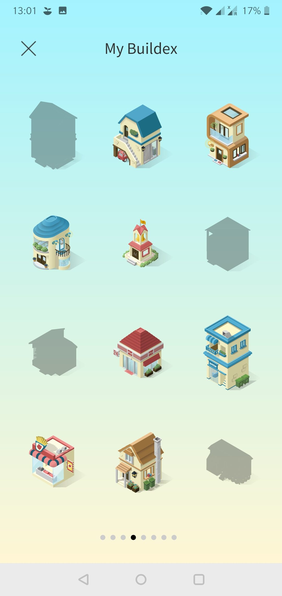
*Commercial variety expanded: greenhouse, food truck, gas station. The glass-cube cafe shares its style with the "rare building" marketing asset.*

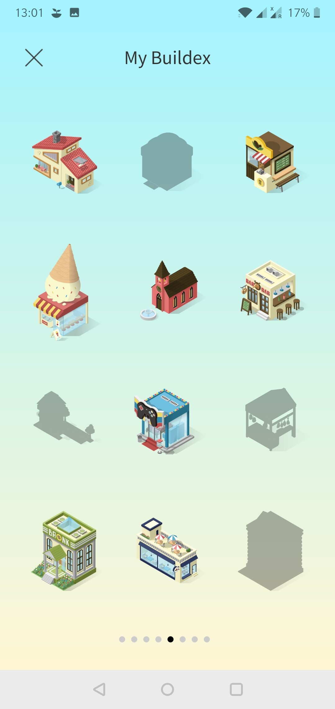
*Themed buildings: a literal ice-cream-cone-roof parlor, a church, a bar, an arcade with a giant gamepad sign. Each one feels handcrafted, not procedurally generated.*

*Civic buildings: police, fire station, factory. Police and fire share a paired color story (blue + red) and matching mass.*

*Late-game/rare buildings: the cinema literally says SLEEP TOWN on its marquee (self-referential branding). Ferris wheel + carnival is shown as one *composed scene*, not a single building — these are the multi-tile rares.*

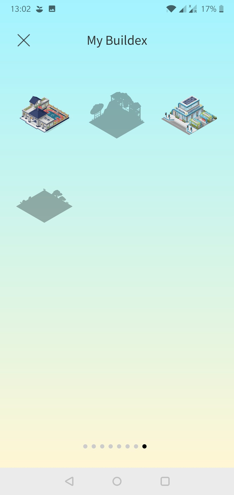
*The last page is sparse, signaling rarity. The SLEEP TOWN train station continues the self-referential branding.*

---

## Themed building sets

Holiday and regional themes overlay the standard building art with seasonal variants (snowfall, decorations, etc.).

*The Wonder islands include snow-cap rendering on mountainous variants — likely also extended into the December seasonal theme (Christmas overlay snow on existing buildings).*

*A themed scene composed of related buildings (carnival = ferris wheel + circus tent + concessions). This composite-set approach is how SleepTown delivers "holiday vibes" without seasonal-only rebuilds.*

---

## Achievements

*Achievement badges as physical octagonal "coins" with chunky drop shadows — locked ones are grey-stamped, unlocked are colored. Streak achievements (7/30/100 days) sit alongside collection counts and consumable milestones (cake = first-anniversary?). Bonsai tree (grey, locked) suggests a Zen/meditation tier.*

---

## Circle / Friends — shared sleep goals

The Circle is SleepTown's social layer: invite up to 15 members, share a single bedtime+wake goal, every successful night contributes energy to one collective Wonder.

*Early-stage Circle. The Wonder is barely started — earth pit + foundation outline + a few decorative sheep. Members ranked by energy contribution (250 vs 150). Shared bedtime goals enforced at the *circle level*, not per-member.*

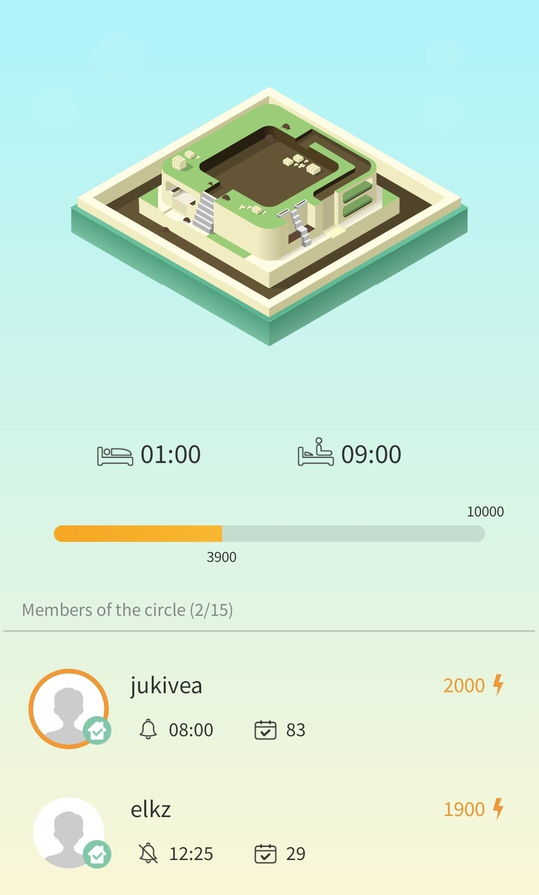
*Same Wonder a week later — interior structures + ramparts have appeared. Both members' energy contributions have jumped roughly 8x. The Wonder visibly transformed as the bar hit 40%.*

*Completed Wonders become permanent floating islands you can revisit. Yellow-ladder connection suggests "level up" path between them.*

---

## Settings — bedtime windows + days off

*Reused for the settings section: this is the entire sleep-window configuration UI. Day-off shows the two selected days as a compact summary, expanding to the full picker on tap.*

*The days-off configuration — the merciful "you can't fail on these days" mechanic. Hard-capped at 2 days per week. Explicitly addresses the edge case "what about the night before my day off?" — a remarkable amount of careful copy for one settings screen.*

---

## Color palette & isometric art style

*The canonical SleepTown building. Color palette is built around: cream/buff walls (#F5E6C8-ish), salmon-red roofs (#E07060-ish), warm browns for woodwork, with windows as cheerful yellow squares. Soft drop shadow, no outline — relies on color contrast to define edges.*

*Failure palette: drained of the warm reds and creams, replaced with desaturated tans and greys. Saturation is the primary signal of state, not hue shift to red/alarm.*

*Rare/aspirational building palette: cool cyan + transparent glass + bright internal accents. Distinctly more saturated than starter buildings, justifying its "rare" status visually.*

*Ground plane: mint/sage gradient (#9FD6B8-ish), platform edge in slightly darker mint. Pine trees are 4-step gradient cones with stubby brown trunks. The platform "floats" with a dark green cliff edge, visually distinguishing it from the cyan sky background.*

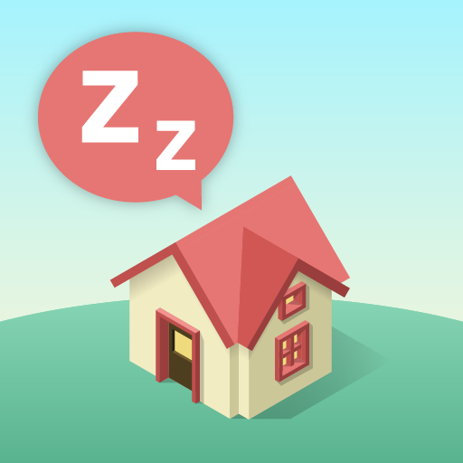
*The app icon distills the entire app to: one house (the reward), one Zz bubble (the action), one mint plane (the context). Pink (vs. red) for the bubble keeps the icon warm rather than alarming.*

---

## Design language & takeaways for Tend

- **Building-as-record is the entire game.** The Big Town tile (Julie's 114-building screenshot) *is* the long-term reward — there is no leaderboard, no XP bar, no level. The accumulated visual *is* the proof of consistency. For Tend, this means: an offering accumulating on an altar over a lunar cycle, or a deity's domain growing with each kept routine, should be a single screenshot-able image — not a stats screen with charts. The bar chart in SleepTown is *secondary*; the tile is primary.

- **Destruction over neutrality on failure.** SleepTown could have just "not given" you a building on a failed night. Instead it shows a broken crate sitting in the spot a house should be. That negative space is *occupied by visible damage* — far stronger loss aversion than absence. For Tend's pagan frame: a missed offering shouldn't just be a gap, it should leave a smudge, withered herb, or empty altar dish — *presence of absence*, not erasure.

- **The "days off" mercy mechanic is what makes loss-aversion sustainable.** SleepTown lets you pre-designate 2 days a week as immune to streak-breaks. This is the difference between "punishing app users hate" and "loving challenge users return to." Tend's "offerings" framing should include explicit Sabbath/holy-day mechanics where the user can declare 1-2 days/week as "the deity rests" without breaking accumulation. This is a *feature* (mercy, ritual rest), not a *concession*.

- **Isometric cozy is a defined visual genre.** SleepTown sits in a tight cluster with Forest, Habitica, Pocket City, Animal Crossing Pocket Camp, Townscaper: ~30° isometric, soft drop shadows, chunky low-poly forms, no outlines, cream/mint/salmon palette, warm yellow window glows. For Tend's witchy/pagan aesthetic, the same cozy isometric language could be inverted: midnight-purple/forest-green base palette, candle-flame yellow as the warm accent, with the same chunky low-poly form vocabulary applied to altars, candles, crystals, herb bundles instead of houses.

- **Color = state.** SleepTown communicates success (warm saturated reds/yellows), failure (desaturated tans/greys), and rarity (cool saturated cyans/glass) entirely through palette shifts — same forms, different paint. Tend can use the same trick: a fresh offering glows warm, a withered one desaturates, a rare/blessed one shifts to cool jewel tones.

- **Random rewards beat earned rewards for collection-driving.** SleepTown deliberately does not let you choose the building you'll get — every successful night is a surprise. The Buildex with grey silhouettes makes the *missing* buildings the motivator. Tend could apply this to gift offerings: don't let users select what they offer; the deity "asks" for something each day, and the user accumulates a grimoire of offerings-given-so-far with silhouettes of the not-yet-encountered.

- **The "ticket" streak booster is gentler than a streak counter.** SleepTown's 7-day streak doesn't reset on failure; it just *doesn't tick up*. The reward is a probabilistic rare-building boost (one ticket = higher chance of rare on next night). This is materially less punishing than Streaks/Duolingo's "you lost it all" framing. Tend's equivalent: 7 days of offerings earns the deity's "blessing" — a buff on the next prayer's outcome rarity, not a streak that disappears.

- **Shared rituals via a Circle, not a leaderboard.** SleepTown's Circle has one shared goal (a Wonder being built together) with energy contributions — not a leaderboard of who's most consistent. Members see each other's bedtime and streak, but the framing is *cooperation toward one collective object*, not competition. For Tend: a coven where members collectively build a shared shrine/altar/grove, with individual offerings contributing to a single accumulating structure visible to all. Much warmer than streak-shaming.

- **The home screen IS the help system.** SleepTown teaches mechanics through tooltips overlaid on the actual home screen during onboarding, not a separate tutorial. The hamburger menu hides 90% of the app. For Tend: avoid a tab bar. Let the altar/ritual screen be the central artifact and surface options as tooltip-overlays the first time they're relevant.

- **Self-reference in the catalog deepens the world.** SleepTown's Buildex contains a literal "SLEEP TOWN" cinema marquee and a "SLEEPTOWN" train station. These tiny in-world brand placements make the town feel like a place, not a stat collection. Tend could include offerings/buildings named for the app's own deity pantheon — a "Tender's Grimoire" book offering, a "Tend Stone" relic — to give the world an internal economy.

- **One-shot screenshot-ability is the marketing moat.** Look at every SleepTown App Store screenshot: each one is *one* compelling object on *one* background. The Big Town view, the destroyed crate, the Taj Mahal — all isolated, all beautiful at thumb-size, all shareable to Instagram with no context needed. For Tend: every major artifact (each deity's domain, each ritual screen, each completed offering set) should be designed to look good as a square Instagram screenshot. If it needs explanation, it's not ready.
