# Spiritfarer — Visual Design Research

## Overview

Spiritfarer (Thunder Lotus Games, 2020) is a cozy management game where Stella, the new Ferrymaster, ferries spirits to the afterlife by tending to them: cooking favorite meals, growing crops, fishing, hugging, listening. Its daily-loop verb — to *tend* — is literally Tend's namesake metaphor, and its hand-drawn Ghibli-influenced palette of dusk blues, lantern golds, and watercolor greens sits squarely in the visual neighborhood Tend wants to occupy. The game proves that a routine app can frame chores as quiet acts of devotion without ever feeling productivity-coded.

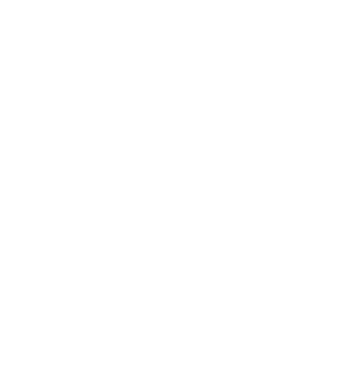
*Hand-lettered wordmark — flowing, organic, painterly. Reference for Tend's display type.*

---

## Key art & atmosphere

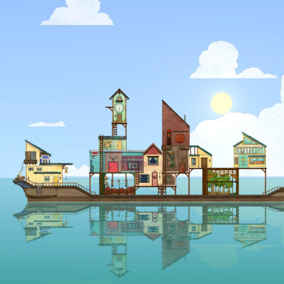
*Hero key art: lantern-lit boat afloat in a soft dusk sky — devotional, drifting, unhurried.*

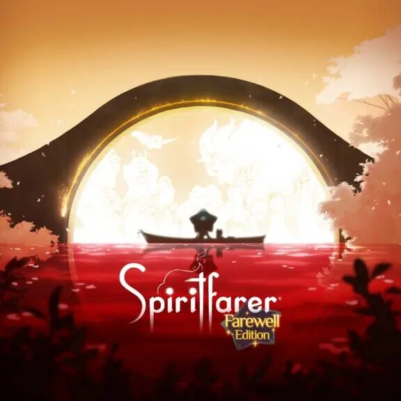
*Farewell Edition cover. Warm golden lantern light against twilight teal — Tend's altar palette.*

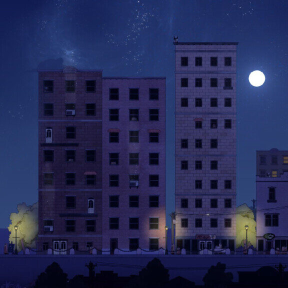
*Artbook composition with Stella, cat Daffodil, and spirits — soft halo lighting.*

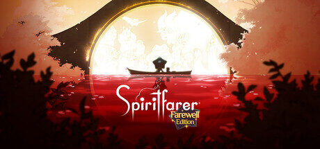
*Marketing banner balancing character ensemble against atmospheric backdrop.*

---

## Boat as living altar

The Everdoor boat is Spiritfarer's home base — a vertically-stacked sanctuary of bespoke buildings the player constructs for each spirit. Direct analog for Tend's altar/shrine metaphor.

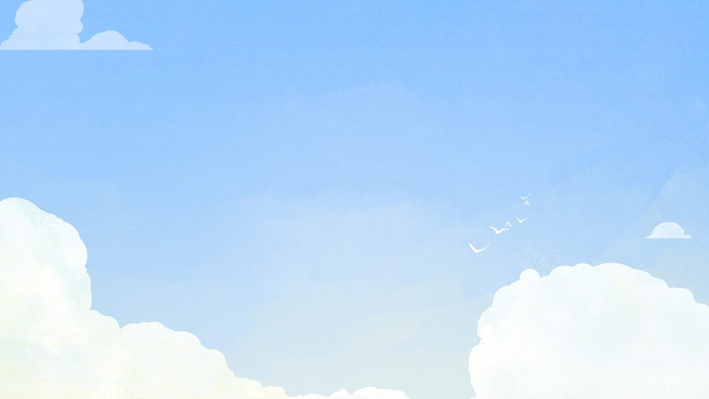
*Boat at golden hour — stacked rooms, glowing windows, a floating shrine on water.*

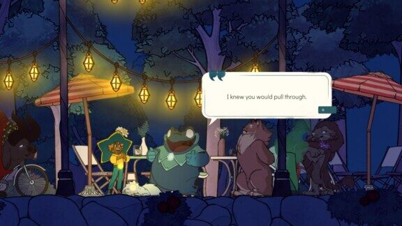
*In-game boat traversal. Note the silhouetted parallax layers and warm interior glows.*

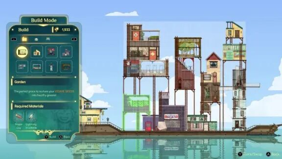
*Boat exterior at night. Lantern golds punch through deep teal — high-contrast intimacy.*

---

## Daily routines: cook, grow, fish, hug

The verbs the player performs daily — cooking favorite dishes, watering crops, casting lines, hugging spirits — are framed as small offerings, not chores. Closest mechanical mirror to Tend's "habits as offerings."

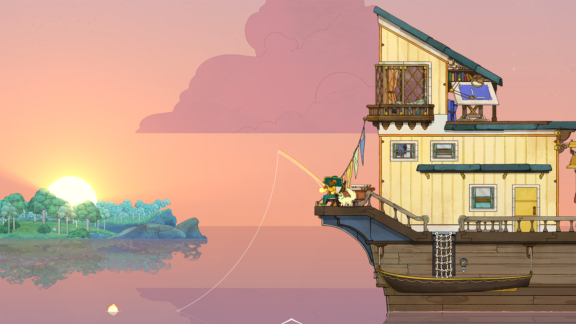
*Routine activity scene — soft sprite work, glowing UI cues, no productivity chrome.*

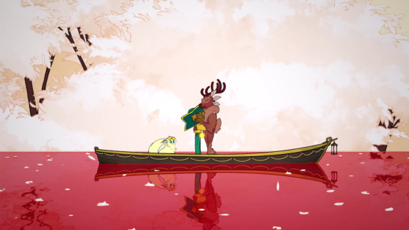
*Interaction beat: spirit + Stella in a daily ritual. Action communicated through pose.*

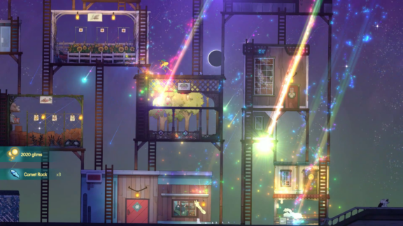
*Island/boat activity. Painterly backgrounds with sprite characters layered over.*

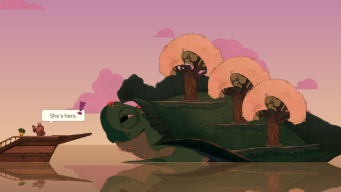
*Quiet moment on the boat — ambient, no HUD pressure.*

---

## Spirit character designs

Each spirit is an animal-form representation of a departed person. Strong identity through silhouette + single color accent — useful pattern for Tend's deity avatars.

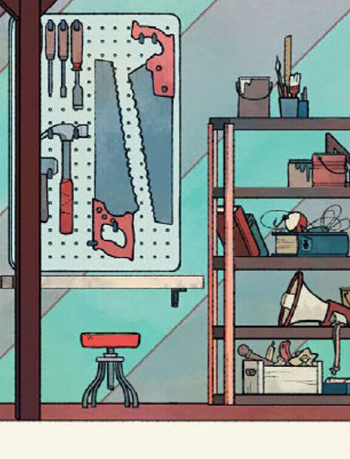
*Atul (frog spirit, uncle figure) — warm green, round forms, jovial silhouette.*

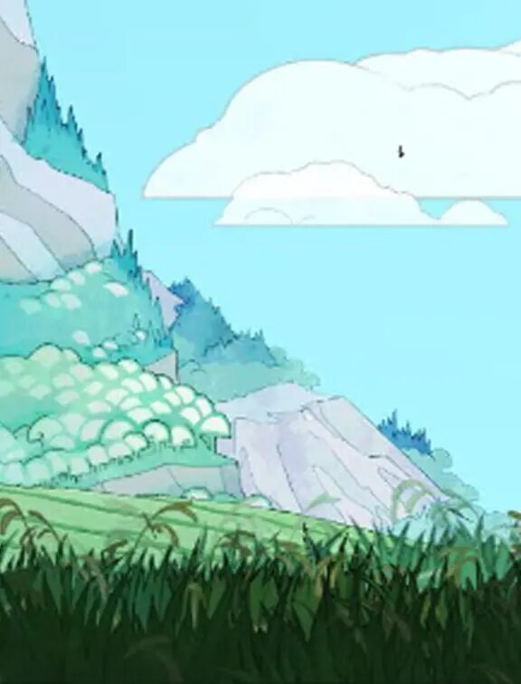
*Gwen (deer spirit) — elegant antlers, melancholy palette, smoking cigarette motif.*

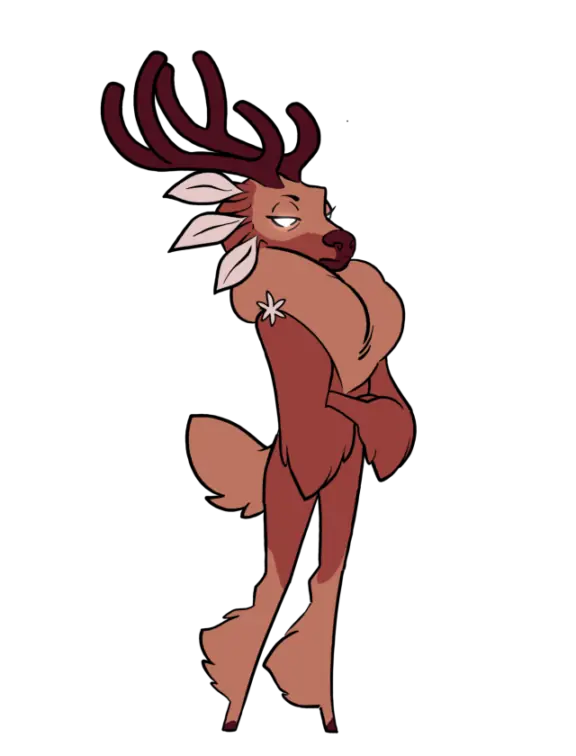
*Gwen full-body idle sprite — flowing coat, restrained palette, instantly readable.*

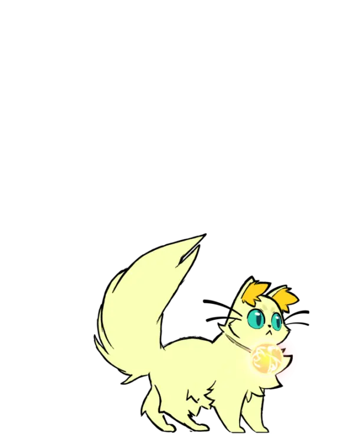
*Daffodil, Stella's companion cat — co-op character, sprite-scale charm.*

---

## Stella & conversation portraits

Portraits appear during dialogue — high-detail painted illustrations that contrast with the smaller sprite world. A two-tier illustration system Tend could borrow (sprite/icon for everyday, portrait for ritual moments).

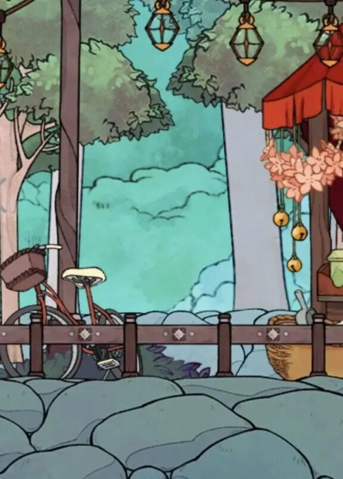
*Stella, the Ferrymaster — soft pastel palette, hood + lantern motif, calm gaze.*

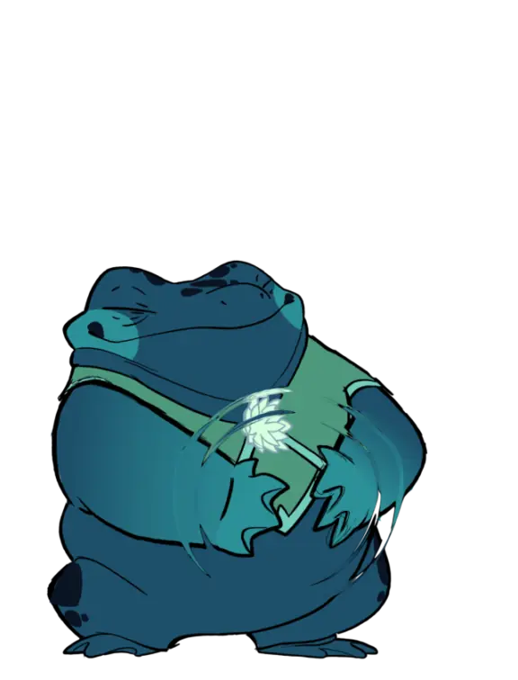
*Conversation framing — portrait + dialogue, character-led storytelling moment.*

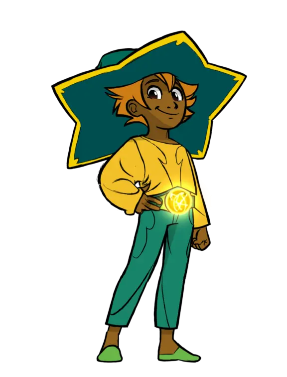
*Timeline / progression UI artwork — narrative arc made visible.*

---

## Painterly vignettes & environments

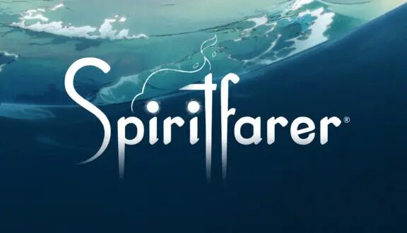
*Wide cinematic vignette — painterly cloudscape, distant islands, atmospheric depth.*

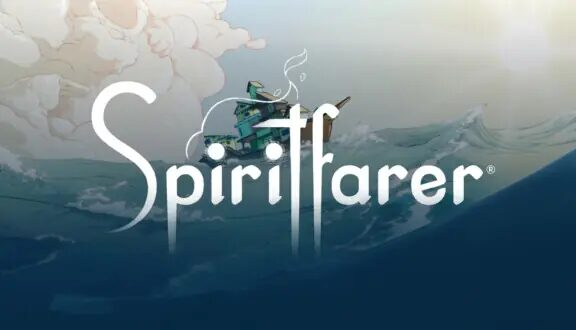
*Mood vignette: silhouette + warm gradient sky. Devotional, quiet, full of negative space.*

---

## Color palette (observed across set)

- **Dusk teal / midnight blue** — dominant sky and water tones; sets the "in-between" mood
- **Lantern gold / amber** — focal warmth, used sparingly for emphasis (windows, fire, magic)
- **Watercolor greens** — foliage and gardens, never saturated
- **Soft cream / parchment** — UI surfaces, dialogue boxes
- **Muted character accents** — each spirit owns one signature hue (Gwen's coral, Atul's green)

The palette is *low-saturation, high-warmth* — a candle-lit altar feel, not bright app feel.

## Typography

Logo and dialogue use a flowing serif/script with hand-drawn imperfections (visible in `logo_title.png`). Avoids the geometric sans defaults of most productivity apps. Tend should consider a similar humanist/hand-lettered display face paired with a calm reading serif.

---

## Design language & takeaways for Tend

- **The verb is "tend," not "track."** Spiritfarer never shows streaks, progress bars, or completion percentages — care is its own reward. Tend should resist productivity chrome wherever possible.
- **Two-tier illustration system.** Painted portraits for ritual/dialogue moments + simpler sprites/icons for everyday actions. Reserves visual weight for emotional beats — directly applicable to deity portraits vs. habit icons.
- **One palette, one mood.** Dusk-teal base + lantern-gold accent across every screen creates instant recognizability. Tend should commit to a single devotional palette rather than per-deity color schemes.
- **Lantern light as the focal metaphor.** Warm pinpoints of glow against cool backgrounds = sacred attention. Use sparingly in Tend for "offering complete" or "deity present" moments.
- **Animal-form spirits with single-accent palettes.** Each character is silhouette-first, color-second. Strong reference for designing Tend's patron deities so they read at icon scale.
- **Negative space is devotional.** Wide skies, empty water, unhurried compositions. Tend's screens should breathe — avoid filling every pixel with affordances.
