# SuperBetter — Visual Design Research

## Overview

SuperBetter (Jane McGonigal, post-concussion research at IGN/UPenn/OSU) is the closest research-backed parallel to Tend's deity-offerings reframing. It systematically renames the mundane components of behavior change into a fictional vocabulary: **challenges become Bad Guys**, **supportive people become Allies**, **small positive acts become Power-Ups**, **larger objectives become Quests**, all scored across four **resilience tracks** (mental, emotional, social, physical). The reframing isn't decoration — it's the therapeutic mechanism. Players sustain effort because the metaphor distances them from shame while keeping the underlying behavior literal. For Tend, this validates that an occult/deity overlay can carry real habit-tracking weight if the taxonomy is consistent, the iconography is distinctive, and the language never breaks character.

The visual system leans superhero-adjacent: rainbow gradients, shield-and-star marks, big "epic win" typography, and a deliberately optimistic color palette that signals "this is a game" the moment you open it.

---

## Onboarding & hero framing

SuperBetter onboards by casting the user as the protagonist of their own story before any tracking begins. The gameful quiz establishes baseline resilience, then a story-driven splash introduces the four-track system and the "you are the hero" frame.

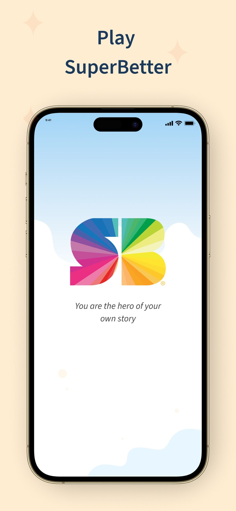
*Caption: Hero-framing splash positions the user as protagonist before any habit input — narrative before data.*

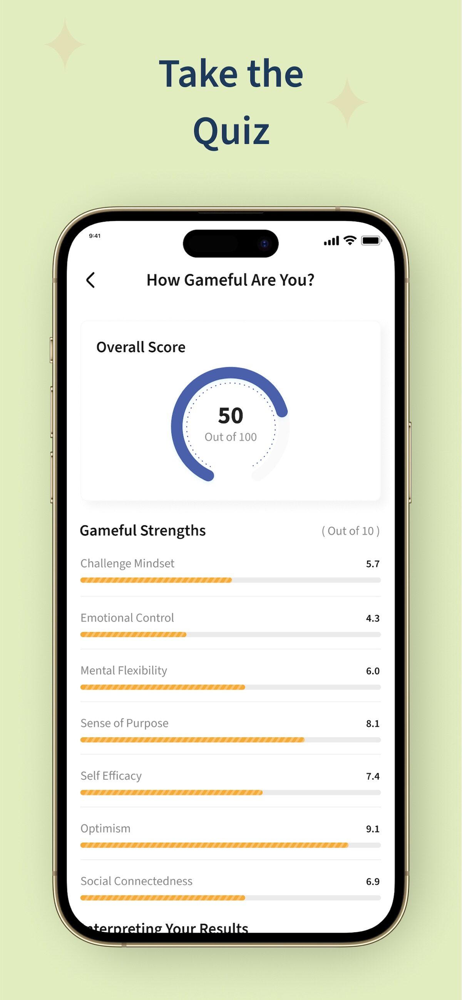
*Caption: Quiz-style onboarding measures baseline resilience and primes the four-track vocabulary early.*

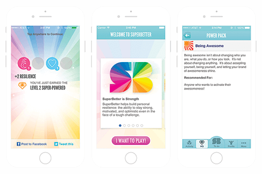
*Caption: Initial "power pack" bundles starter Power-Ups/Quests/Bad Guys so the taxonomy is concrete on day one.*

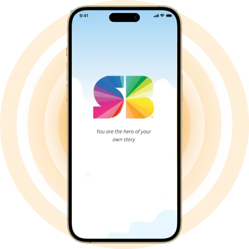
*Caption: Marketing reinforces the same "hero of your story" language used inside the product — consistent narrative skin.*

---

## Four-track resilience dashboard

The home dashboard is organized around a single composite **Resilience Score** plus four sub-tracks (mental, emotional, social, physical) and a celebratory "Epic Win" goal at the top. Progress is always expressed in gameful units (points, +deltas) rather than streaks or percentages.

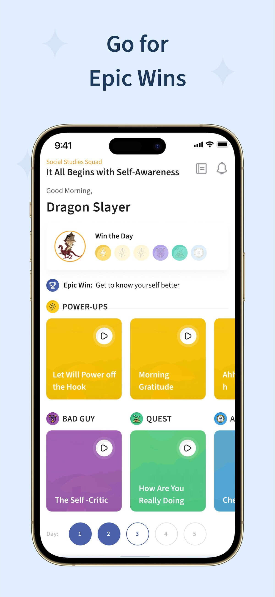
*Caption: Dashboard centers an "Epic Win" goal above the four resilience tracks — aspiration framed as game objective.*

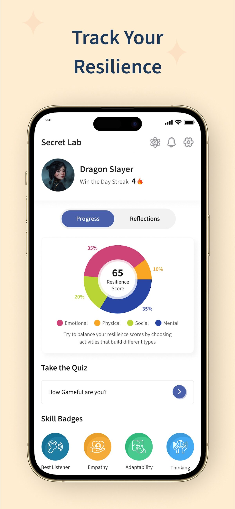
*Caption: Composite resilience score with sub-track breakdown — single hero metric backed by four legible dimensions.*

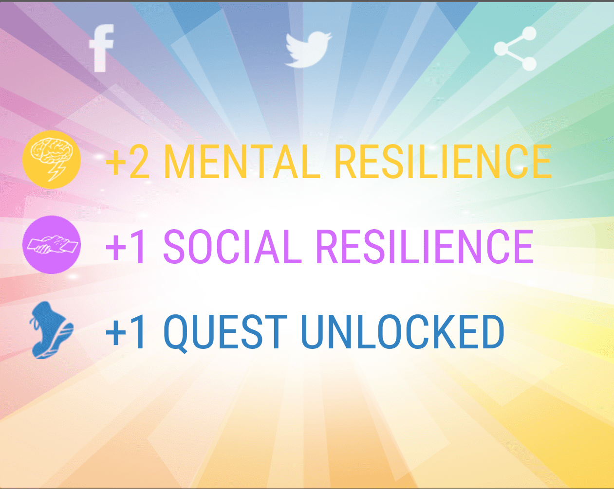
*Caption: Every action returns a "+X resilience" reward card — immediate, quantified, and visually celebratory.*

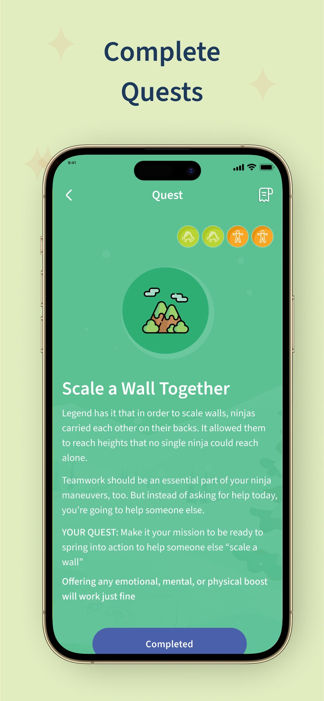
*Caption: Quests illustrated as scaling a wall — visual metaphor reinforces that goals are climbable, not abstract.*

---

## Power-Ups (the offering parallel)

Power-Ups are SuperBetter's term for tiny positive actions (deep breath, glass of water, text a friend). This is the direct analog to Tend's "offerings." They are presented as collectible cards with verbs, illustrations, and a clear point value.

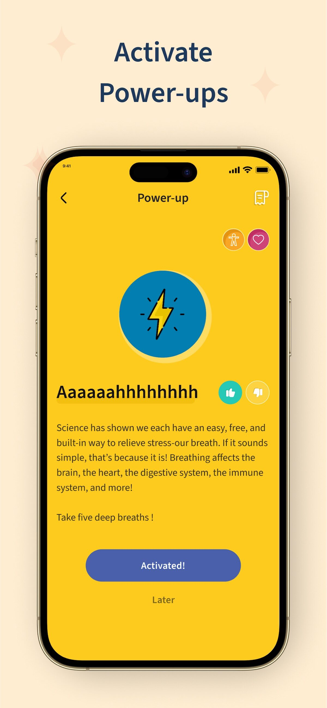
*Caption: Power-Up card for "three deep breaths" — micro-action elevated to collectible with explicit point reward.*

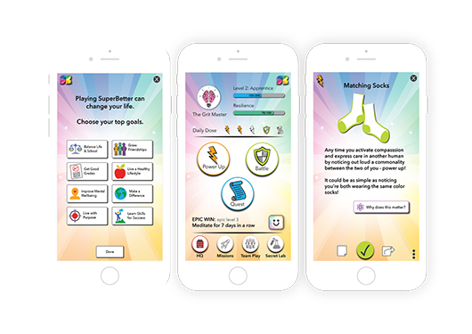
*Caption: Trio of Power-Ups surfaced on dashboard — daily prompt pattern; the offering equivalent for Tend.*

---

## Bad Guys (obstacles as antagonists)

Bad Guys externalize internal struggles (self-critic, sticky chair, sugar cravings) into nameable, defeatable characters. Defeating one logs a "win"; succumbing logs a "loss" — both are tracked without moralizing.

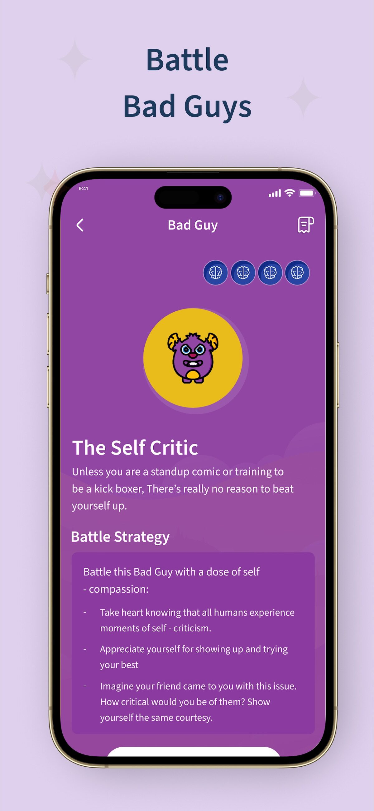
*Caption: "Self-critic" rendered as a Bad Guy with illustration — internal voice externalized and defeatable.*

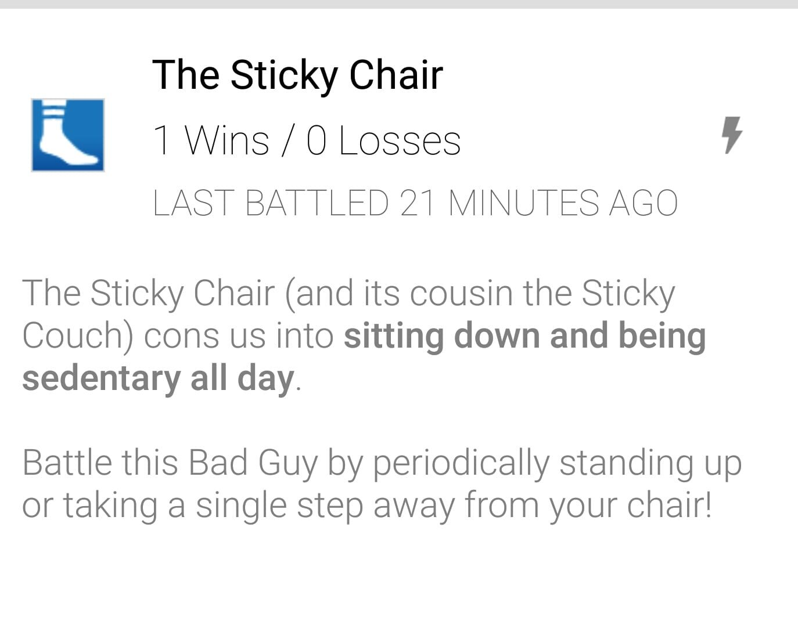
*Caption: "Sticky chair" Bad Guy tracks wins vs. losses without shame — both outcomes are data, not judgment.*

---

## Allies (social support layer)

Allies are people the user invites into their challenge. They can send check-ins, suggest Power-Ups, or witness wins. The pattern is lightweight async support, not a social feed.

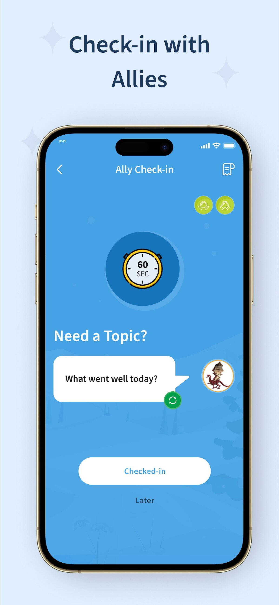
*Caption: Ally check-in prompt — async, low-pressure social support without a public feed or follower mechanics.*

*Caption: Group/classroom imagery frames Allies as real-world cohort — not anonymous online community.*

---

## Quests (the larger arc)

Quests are multi-step goals that bundle Power-Ups and Bad Guys toward an Epic Win. They give the day-to-day actions narrative shape over weeks.

*Caption: Quest illustration — multi-step climb toward Epic Win, giving daily Power-Ups a narrative trajectory.*

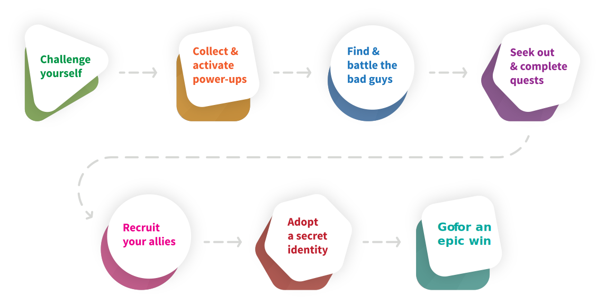
*Caption: Method diagram shows how Quests/Power-Ups/Bad Guys/Allies interlock — the system's conceptual map.*

---

## Power-Pack marketplace & curated bundles

Rather than a paid marketplace, SuperBetter ships curated **Power-Packs** — themed bundles (anxiety, post-concussion, weight loss, grief) authored by clinicians or Jane herself. Each pack pre-loads Quests, Power-Ups, Bad Guys, and Allies relevant to that challenge.

*Caption: Power-Packs are themed starter bundles authored by experts — pre-curated vocabulary for specific challenges.*

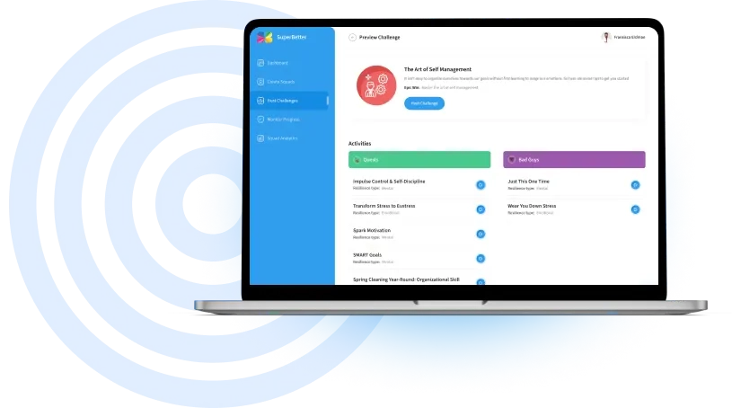
*Caption: Host dashboard lets institutions/clinicians deploy custom Power-Packs to cohorts — B2B distribution layer.*

---

## Group play & institutional deployment

SuperBetter scales beyond solo via classroom and clinical deployments. Marketing leans heavily on group-play imagery — kids, classrooms, cohorts — signaling that the gameful frame works socially, not just individually.

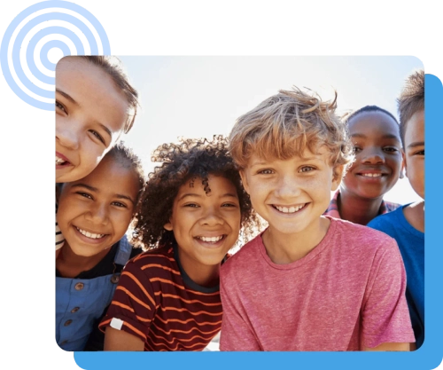
*Caption: Kid-friendly marketing — the gameful vocabulary is accessible across ages, lowering stigma around mental health.*

*Caption: Classroom deployment imagery — cohort play normalizes resilience practice as collective, not clinical.*

---

## Achievements & resilience rewards

Achievements are framed as **resilience points** rather than badges. The reward card pattern (+points, animation, "you just got stronger") fires after every logged action, no matter how small.

*Caption: Reward card returns +points across the four tracks — every tap returns visible, quantified strength gain.*

*Caption: Epic Win headline at top of dashboard — the ultimate achievement is user-authored, not platform-assigned.*

---

## Visual identity — superhero / shield / rainbow

The brand mark is a rainbow shield/star "SB" — overtly superhero-coded. Typography is bold, optimistic, and slightly comic-adjacent. Color is unapologetically saturated rainbow gradient, which signals "this is a game, not a clinical app" the instant you see it.

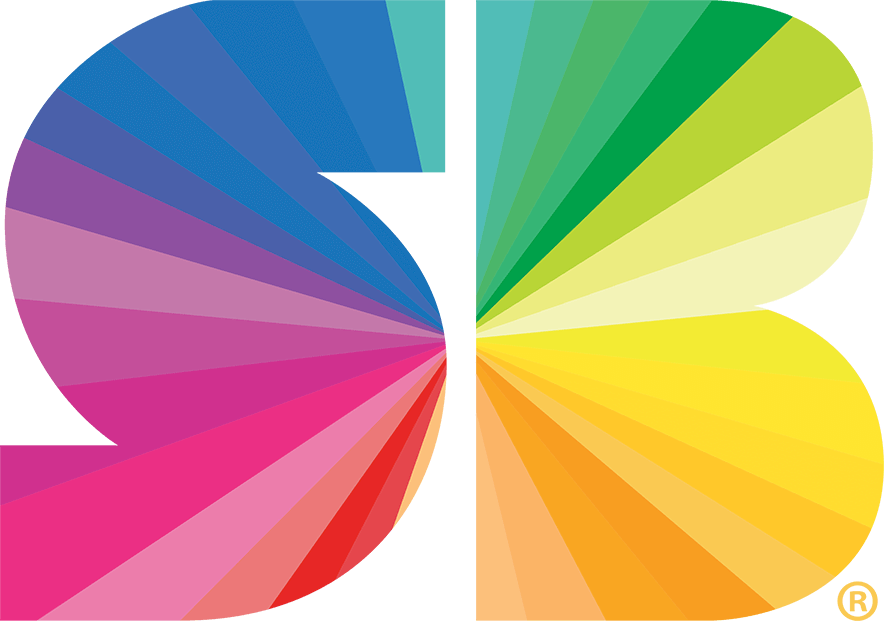
*Caption: Rainbow shield/star "SB" mark — overtly superhero-coded, immediately legible as gameful not clinical.*

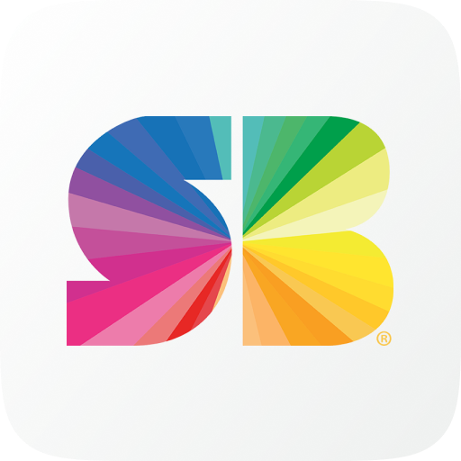
*Caption: App icon doubles down on shield mark — distinctive on home screen, anti-minimalist by design.*

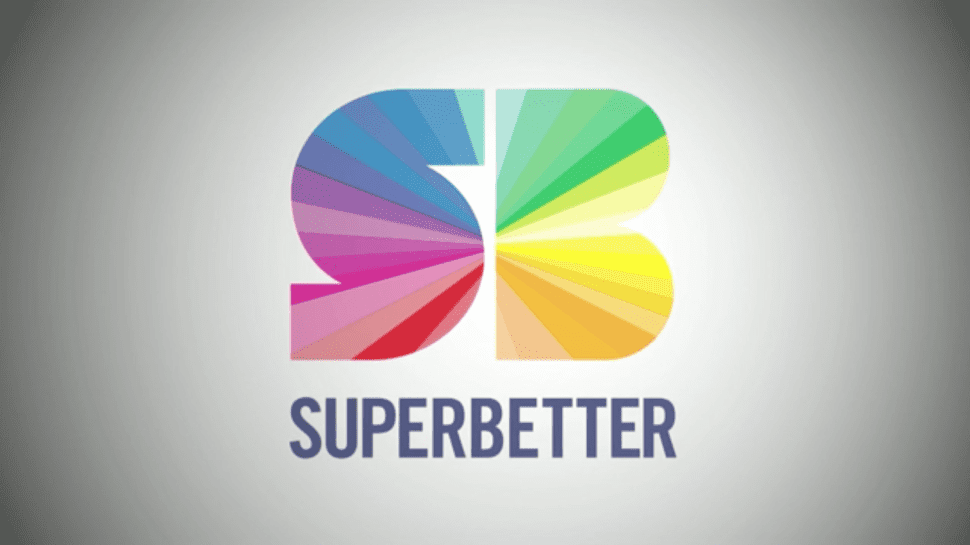
*Caption: Rainbow gradient wordmark — color carries the optimism; restraint would dilute the gameful promise.*

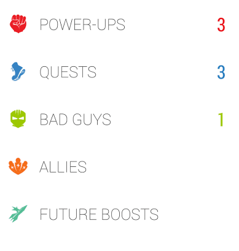
*Caption: Four custom nav icons make the taxonomy spatial — every screen reinforces the four-noun vocabulary.*

---

## Design language & takeaways for Tend

- **The metaphor must be load-bearing, not decorative.** SuperBetter's Bad Guys/Allies/Power-Ups/Quests aren't reskins of "obstacles/friends/habits/goals" — they're the only words used. Tend should similarly commit: deities, offerings, omens, rites — never "habit" or "streak" in user-facing copy.
- **Four-track composite scoring beats single streaks.** A hero metric (Resilience / Devotion) backed by 3–4 sub-dimensions gives users a richer self-model than a single fragile streak. Consider mapping Tend's deity domains to sub-tracks.
- **Reward cards on every action, immediately.** Every logged Power-Up returns a "+X resilience" card. Tend's offerings should fire a comparable per-action affirmation card with deity-specific copy and visual flourish.
- **Externalize struggle into nameable antagonists.** The "Bad Guy" pattern is therapeutically potent — it separates user identity from the obstacle. Tend could let users name personal "shadows" or "blights" that offerings ward against.
- **Curated expert bundles > open marketplace.** Power-Packs ship pre-authored by clinicians for specific challenges. Tend should ship pre-built deity paths/rites authored by occult practitioners rather than a generic template store.
- **Commit to a distinctive visual register.** SuperBetter's rainbow superhero identity is loud and unmistakable. Tend's witchy/occult aesthetic should be equally committed — restraint and minimalism would undercut the imaginative contract the app is asking users to enter.
