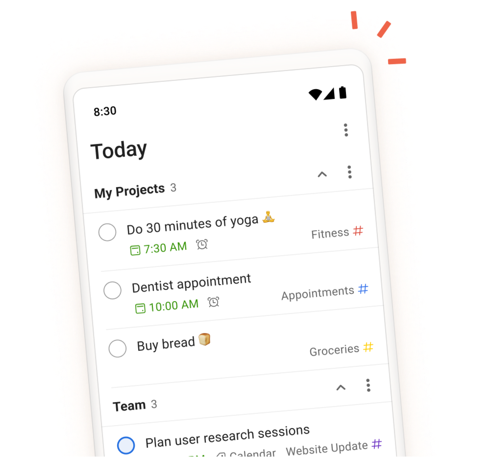
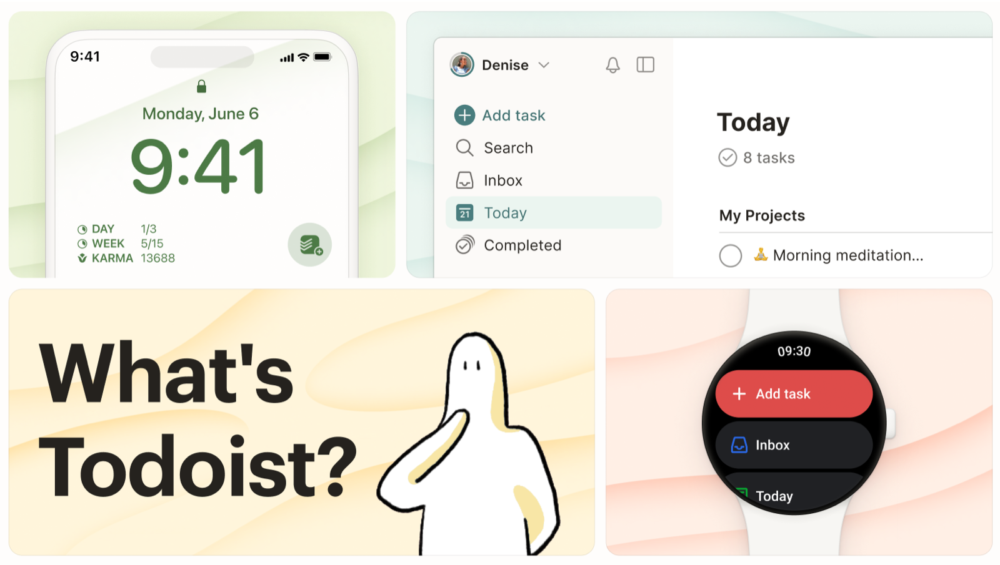
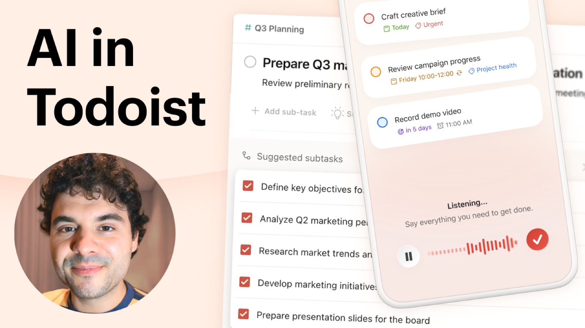
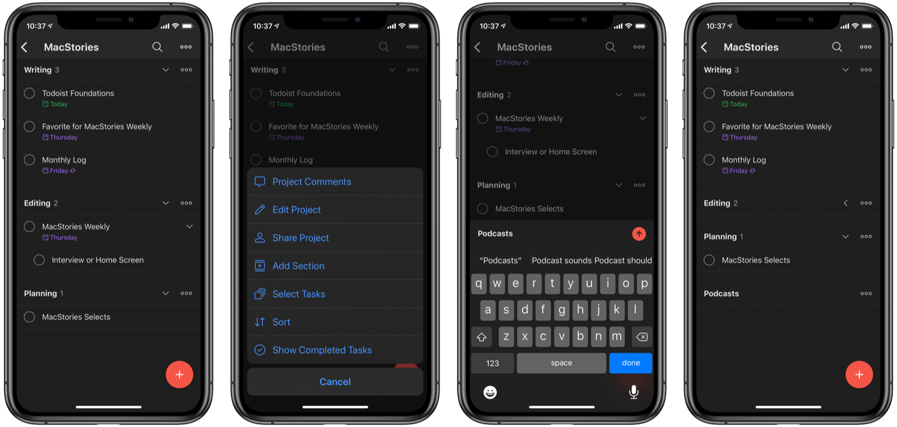
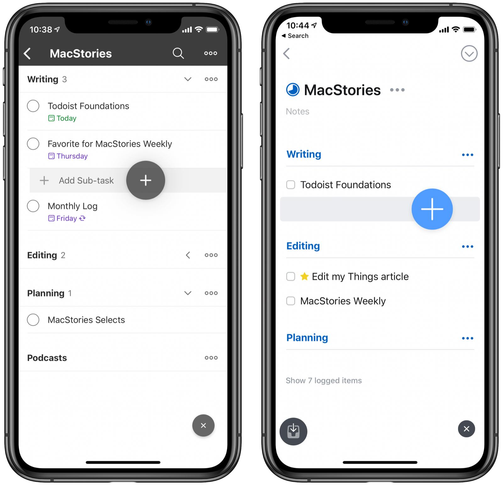
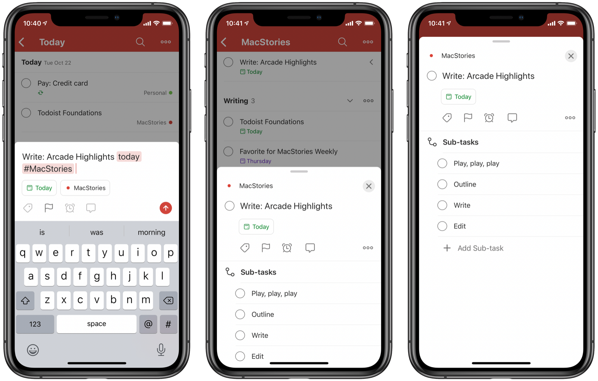
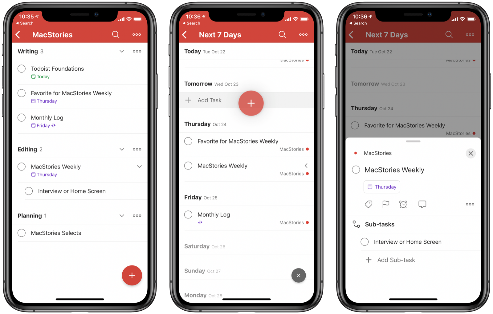
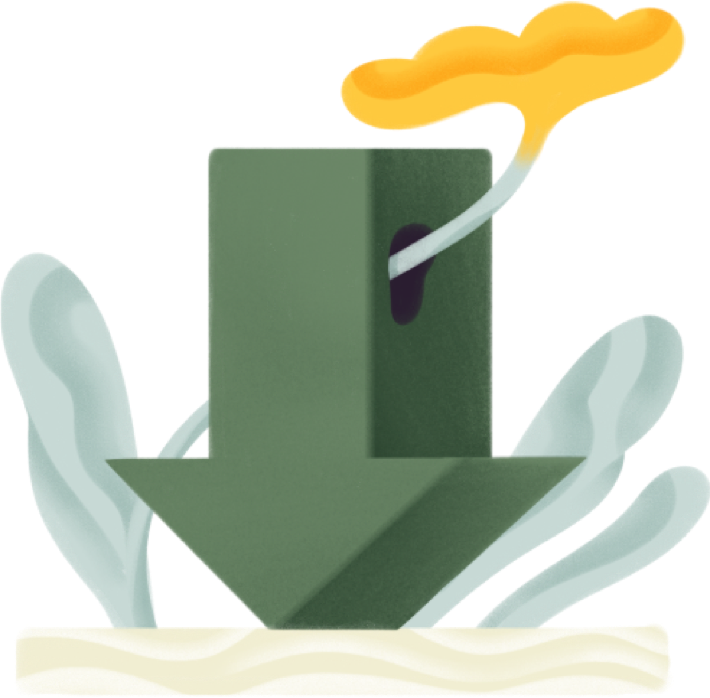
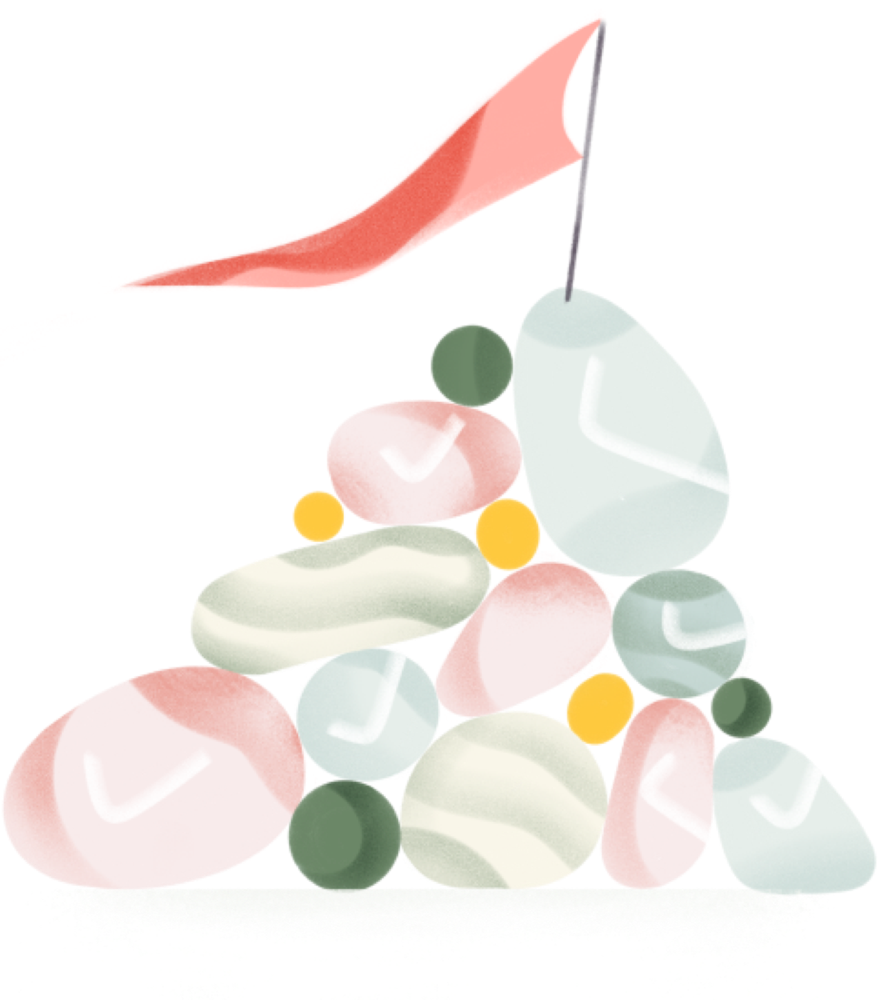
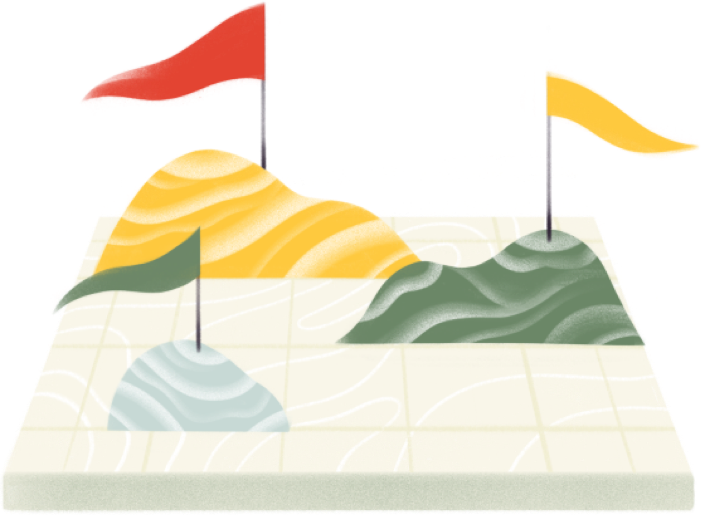

# Todoist — Visual Design Research

## Overview

Todoist is a cross-platform task manager trusted by 40+ million people, distinguished by its natural-language input, a gamified Karma productivity score, and a design language that balances density with calm. For Tend, it is the clearest reference for how to make a feature-rich daily-use app feel effortless rather than overwhelming — a critical challenge when Tend's "offering" metaphor and deity system could easily tip into UI clutter. Todoist proves that strong information hierarchy, restrained color use, and tight typography can carry heavy functional weight without sacrificing personality.

---

## Hero UI & Marketing Presentation

---

## Today View & Upcoming — The Daily Driver

---

## Task Detail & Add Flow

---

## Labels, Priorities & Filters

---

## Reminders & Calendar Integration

---

## Karma System

---

## Themes, Dark Mode & Visual Customization

---

## Templates & Onboarding

---

## Widgets & Mobile Platform Presence

---

## Stat Boxes & Social Proof Surface

---

## Design Language & Takeaways for Tend

- **Hierarchy over decoration** — Todoist uses exactly two accent colors (red for priority, blue for links) on an otherwise near-neutral palette. Tend should resist using its full ritual color spectrum on every screen; reserve deep purples and gold for moments of completion or deity reveal.

- **Density is earned by consistency** — Todoist packs projects, labels, priorities, dates, and assignees into a single task row without chaos because the type scale never wavers. Tend's "offering" cards should adopt a similarly strict type ramp: one display font for ritual names, one body font for everything else.

- **The quick-add moment is sacred** — Natural-language input with inline parsing feedback is Todoist's most memorable micro-interaction. Tend should make its equivalent — the act of "making an offering" — feel equally instantaneous and magical: one tap, speak or type the ritual, watch the deity accept it.

- **Gamification must be opt-in visible** — Karma lives in a dedicated section, not scattered in the daily list. Tend's patron deity favor system should follow this: aggregate scores and streak effects belong in a "shrine" view, not cluttering every habit row.

- **Themes as identity, not afterthought** — Todoist ships 20+ themes including deep dark modes. Tend's aesthetic depends on this: provide at minimum a "shadow" (dark) and "candlelight" (warm dim) variant from launch, not as a v2 feature.

- **Empty states do narrative work** — Todoist's empty Today view shows a simple illustration and affirming copy. Tend's empty state is a high-value ritual moment — it should show a deity illustration with contextual flavor text, not a generic "nothing here" placeholder.
