# Zombies, Run! — Visual Design Research

## Overview

Zombies, Run! (Six to Start) is the deepest narrative-as-habit-engine in the market: 500+ missions across 13+ seasons cast the runner as "Runner 5," a courier for post-apocalyptic Abel Township. Each run plays a chapter of audio drama interleaved with the user's own music, and the runner collects supplies (medkits, sports bras, batteries) that feed a persistent isometric base-building meta-loop. The "supplies → township" mechanic is functionally identical to Tend's "offerings → deity" loop: a daily ritual act produces narrative + tangible accumulation in a world you are quietly rebuilding.

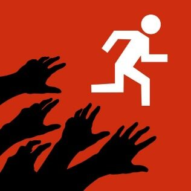
*Logo and brand mark — pulpy horror typography sets tone before launch.*

---

## Onboarding & Runner 5 setup

App Store screens act as the de facto onboarding pitch: identity ("you are Runner 5"), threat ("zombies are chasing you"), and reward ("rebuild your town"). The hook is role assignment, not feature tour.

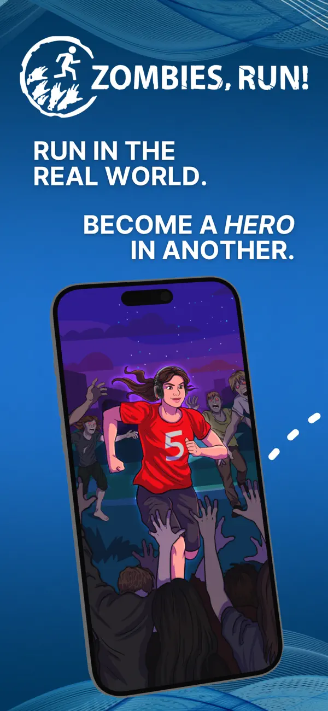
*Hero pitch frames the user as protagonist before any UI is seen.*

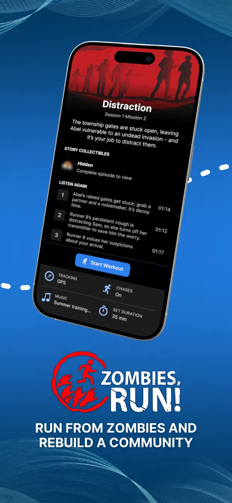
*Story-forward marketing — characters and stakes precede mechanics.*

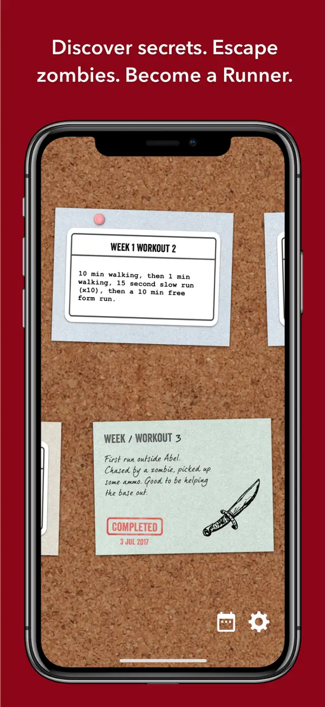
*Companion 5K training app reuses the same narrative onboarding pattern.*

---

## Mission selection

Missions are presented as a vertical chapter list with episode numbers, season banners, and cover art — closer to a podcast app than a fitness app. Progress is linear; locked future missions create pull.

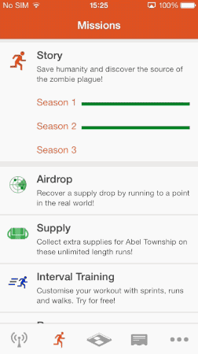
*Mission list reads like a prestige TV season — episodic, illustrated, sequential.*

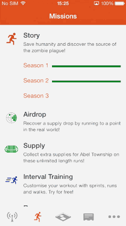
*Mission detail surfaces synopsis, duration, and required equipment loadout.*

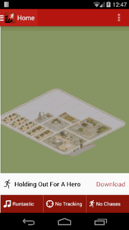
*Android parity — same chapter metaphor, scrollable season archive.*

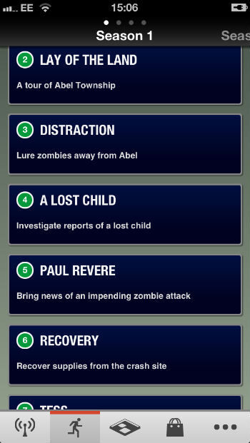
*Earlier version already committed to cover-art-per-mission visual grammar.*

---

## Active run UI (audio-primary)

During a run the screen is intentionally sparse: large distance/time/pace numerals on a dark field, with a now-playing strip for the current audio segment. The phone lives in a pocket — UI is glanceable, not interactive.

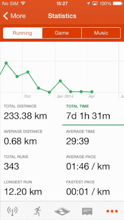
*Stats screen — three big metrics, dark background, audio waveform secondary.*

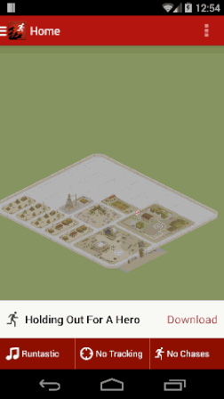
*Android stats — same hierarchy; nothing competes with the audio drama.*

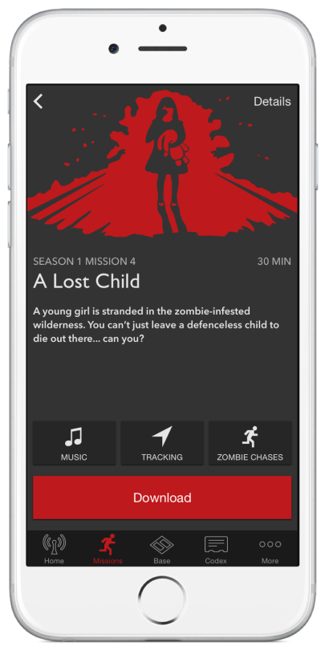
*2020s redesign keeps minimalism but warms the palette toward amber.*

---

## Supply collection mid-run

Supplies are auto-collected at scripted intervals — a small toast ("You found a medkit") punctuates the audio. No tapping required; the reward is narrative-timed, not interaction-timed.

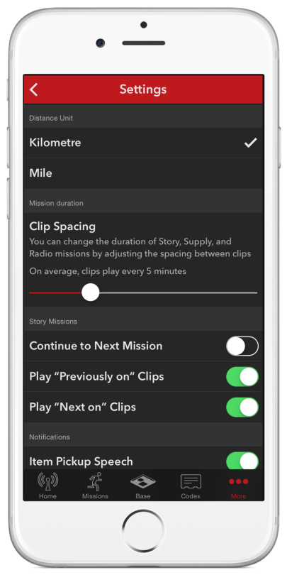
*Supply pickup card — illustrated item, minimal chrome, dismisses automatically.*

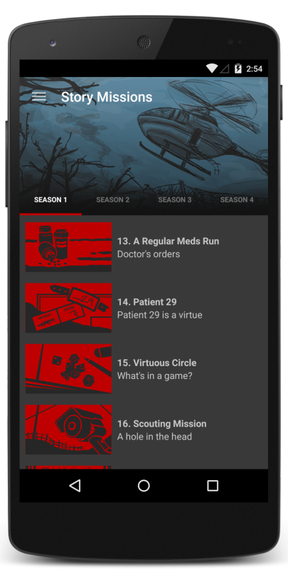
*Run continues uninterrupted; collection is a passive narrative beat.*

---

## Zombie chase (interval trigger)

The signature mechanic: scripted moans + a "Zombies, 100m" alert force a speed burst. This is the app's interval-training engine disguised as story. Visual treatment goes red/urgent only for the duration of the chase.

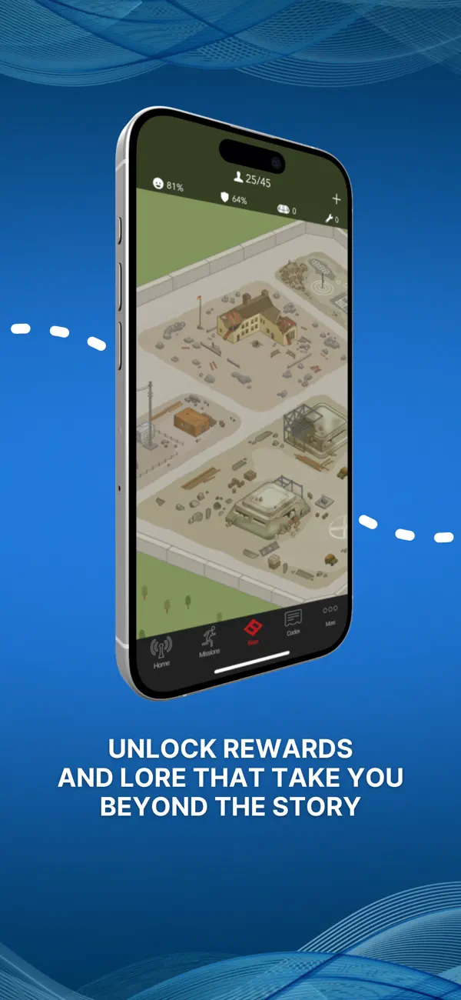
*Chase alert — red warning, distance countdown, audio escalation cue.*

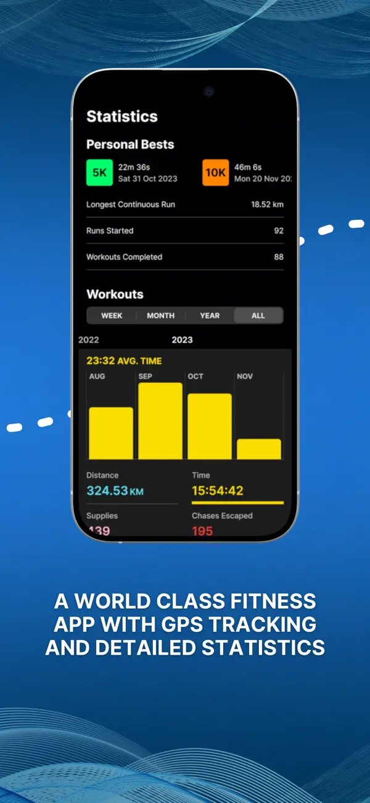
*Chase resolution screen — dropped supplies shown as the cost of failure.*

---

## Run summary

Post-run debrief consolidates distance, pace, supplies gathered, and story progress (chapter completed, next chapter teased). The summary is both fitness log and "previously on…" recap.

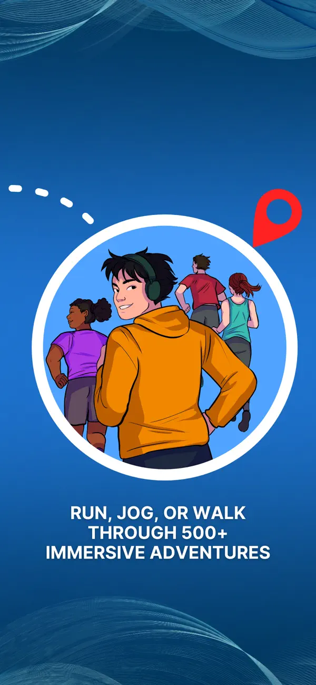
*Summary card pairs fitness metrics with narrative progression equally weighted.*

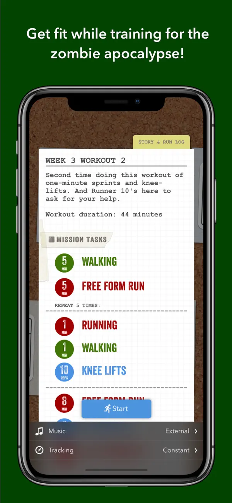
*5K variant emphasizes program progress over loot — same template, retuned.*

---

## Abel Township base (isometric)

The meta-game: an isometric pixel/illustrated township that grows from a few tents to a fortified settlement. This is the persistent home screen of the off-run experience — the "altar" equivalent.

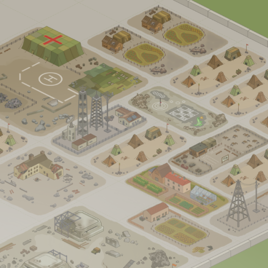
*Isometric township — soft palette, hand-drawn buildings, visible accumulation.*

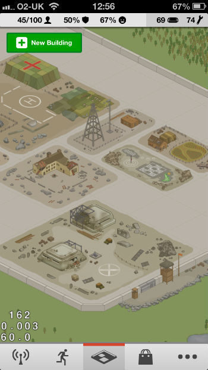
*Earlier base — establishes the "your town grows with your habit" metaphor.*

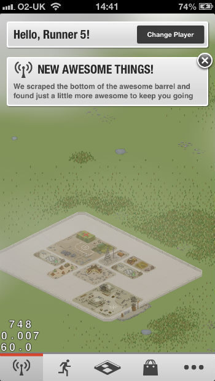
*Home screen IS the base — no separate dashboard competes for attention.*

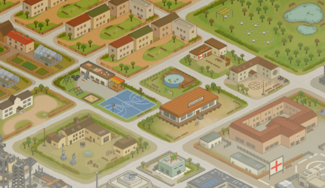
*New seasons ship new buildings — narrative content drives meta-game expansion.*

---

## Building construction & upgrades

Tapping a plot opens a building card: cost in specific supply types, time-to-build, and a clear before/after illustration. Upgrades are tiered with visible visual evolution.

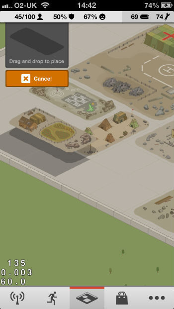
*Placement mode — grid overlay, ghost preview, soft confirmation.*

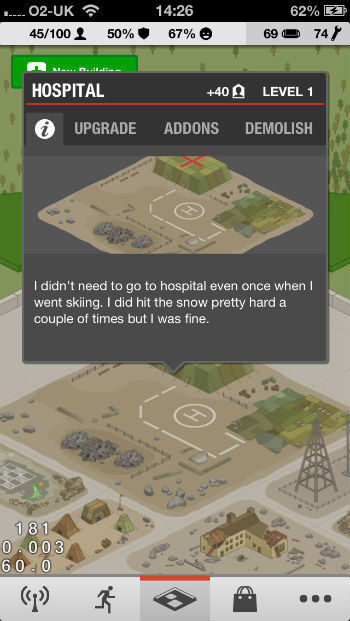
*Detail card — illustrated portrait, supply costs as icon chips.*

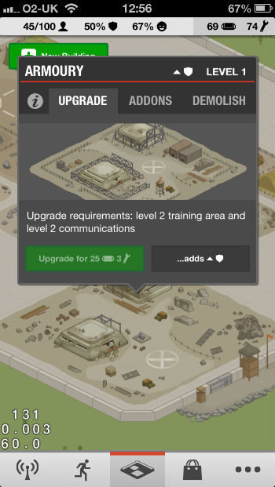
*Upgrade panel — current vs next tier shown side-by-side with delta.*

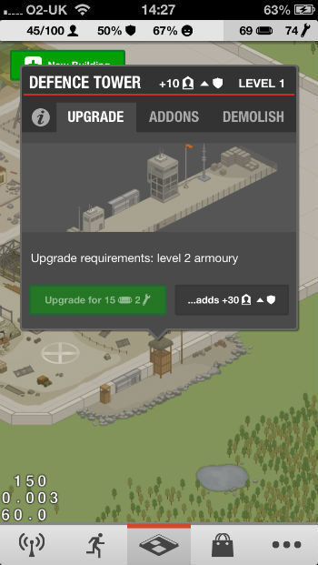
*Multiple upgrade paths per building — choice gives meta-game depth.*

---

## Individual building types

Each building has its own illustrated identity — armoury, farm, hospital, comms, water — reinforcing that the township is a real place with functions, not a progress bar.

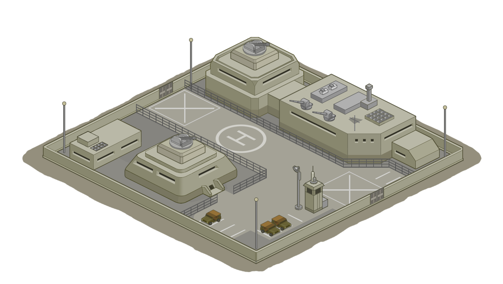
*Armoury — distinct silhouette, weathered palette, narrative function clear.*

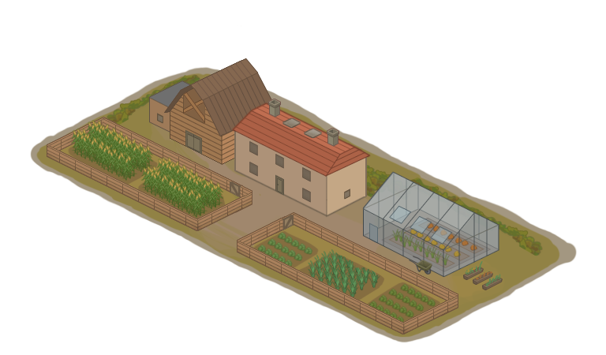
*Farm — green accents differentiate at a glance from other structures.*

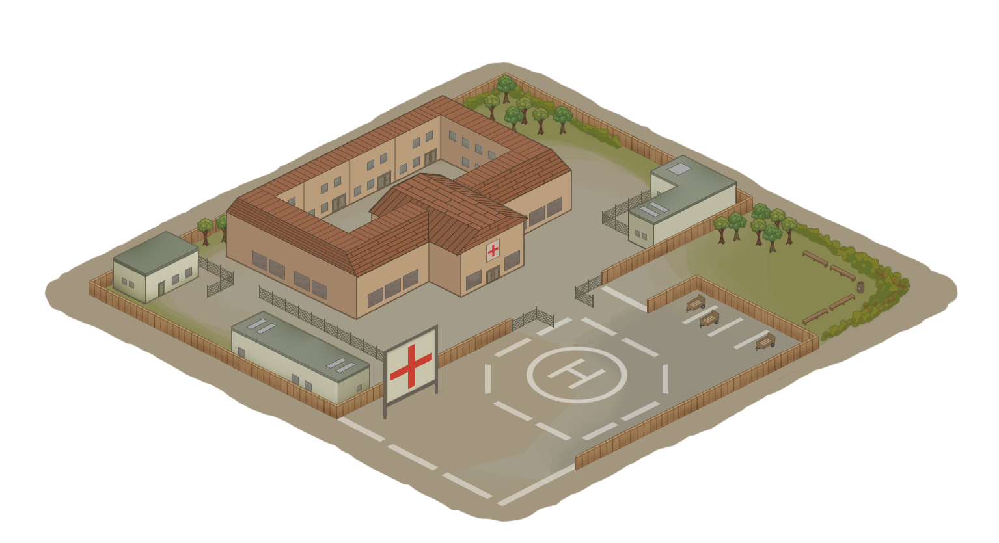
*Hospital — red cross signal reads instantly even at thumbnail size.*

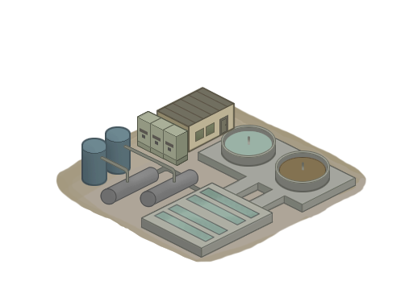
*Water — blue accent; buildings function as a color-coded taxonomy.*

---

## Inventory of supplies & new content

Inventory is illustrated tiles, not a spreadsheet — every supply has personality. New buildings/missions are merchandised like episode drops.

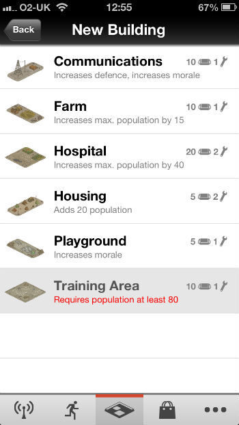
*New building drop — treated as a story event, not a patch note.*

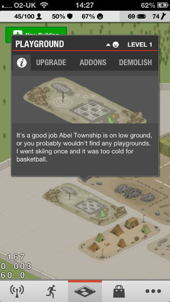
*Building info — narrative blurb sits above stats; lore before numbers.*

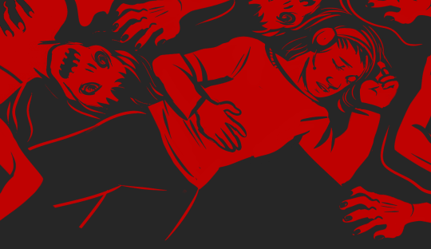
*Mission promo art — cinematic poster treatment markets each chapter.*

---

## Story / character / lore

Beyond runs, the app houses character profiles, season recaps, and even real-world exhibit tie-ins (British Library). The IP is treated as a transmedia property.

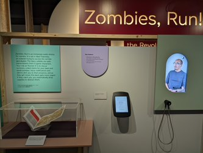
*Real-world exhibit — the fiction is taken seriously enough to leave the app.*

---

## Airdrop mode (paused / free run)

Airdrop lets users run without a scripted mission and still collect supplies — a "free practice" mode that keeps the reward loop alive on rest/light days.

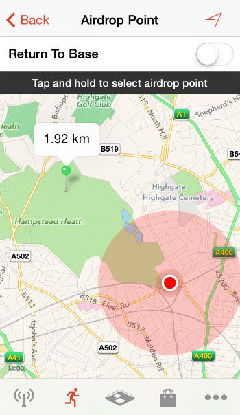
*Airdrop — no story, but supplies still drop at intervals. Loop preserved.*

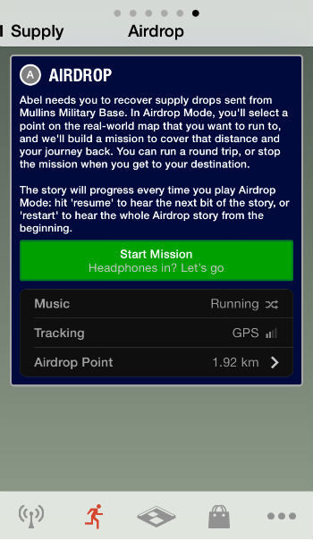
*Quieter UI, same metric hierarchy — graceful low-engagement fallback.*

---

## ZRX hub (newer unified app)

ZRX consolidates ZR and the 5K trainer under one shell with a card-based home, training plans, and an armoury equivalent. Modernized but retains the gritty palette.

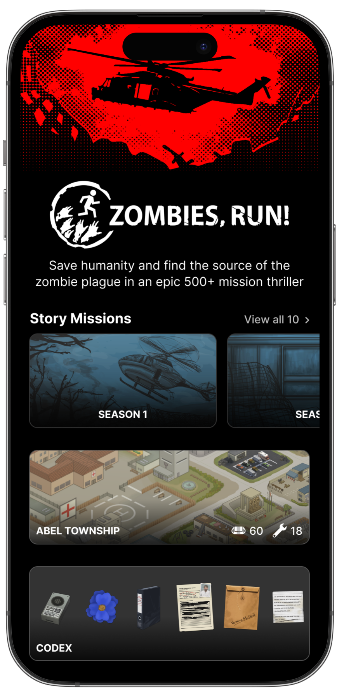
*ZRX home — modern card stack, but mission art still leads the page.*

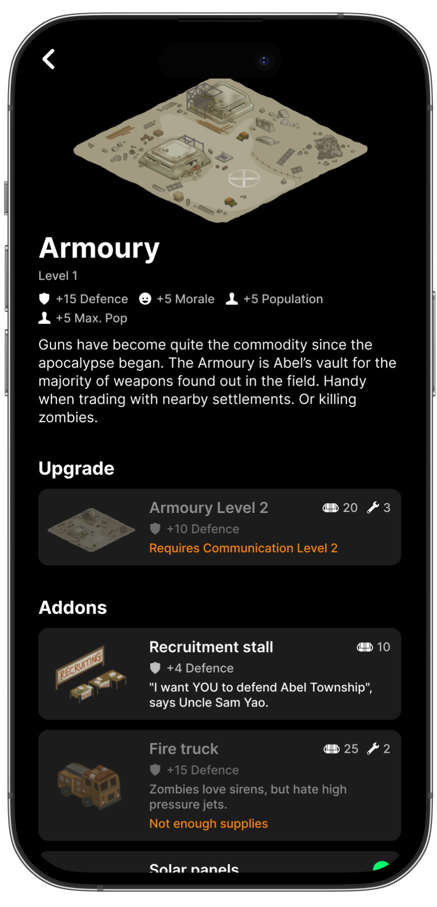
*Armoury detail — equipment as collectible loadout, illustrated portraits.*

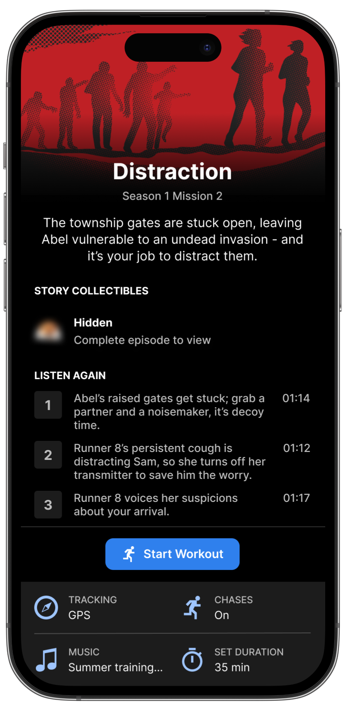
*Single mission card — cinematic key art frames the chapter.*

---

## Settings & 5K training variants

The 5K trainer reuses every pattern — same audio-led structure, same summary template — proving the engine generalizes beyond the flagship fiction.

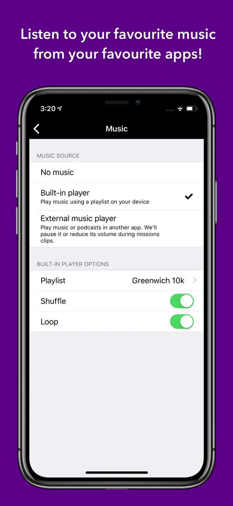
*5K plan — narrative coach replaces zombies, mechanics unchanged.*

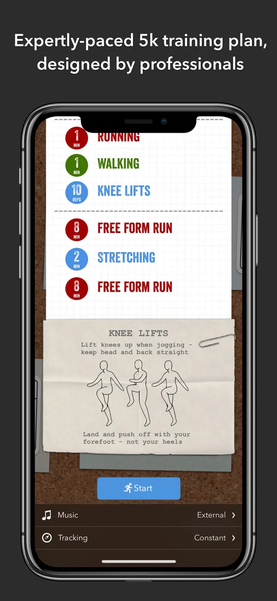
*Summary screen — proves the template scales to non-horror narrative.*

---

## Design tone: post-apocalyptic gritty

The visual language: charcoal/black backgrounds, blood-red accents, weathered serif/slab display type, hand-illustrated isometric township, photographic character portraits with desaturation. It is unmistakably horror-adjacent without being lurid — restrained enough to wear in public, distinctive enough to be a lifestyle marker.

---

## Design language & takeaways for Tend

- **Narrative is the habit-loop's reward, not its garnish.** ZR plays a chapter only when you run — the story literally does not advance without the behavior. Tend's deity dialogue/lore should be gated the same way: offerings unlock the next beat.
- **Audio-primary UIs need almost no UI.** During a run, three big numerals + a now-playing strip is enough. For Tend's ritual/meditation moments, resist filling the screen — let voice/ambient carry, keep visuals glanceable.
- **The base/township IS the home screen.** Accumulation is visible the moment the app opens; there is no separate "progress" tab. Tend's altar should be the home view — every habit completed should visibly add to it.
- **Each unit of accumulation deserves its own illustration.** Buildings, supplies, equipment all have distinct art. Tend's offerings, altar items, and deity favor states should be illustrated, not iconified — accumulation is only motivating if it's beautiful.
- **Scripted interval triggers (the "chase") create stakes without gamification chrome.** A red alert + audio cue does what XP bars try to do. Tend can use scripted ritual "tests" or seasonal events as narrative-driven intensity spikes.
- **Ship narrative as seasons, not as content drops.** ZR's 13+ seasons give long-term users something to anticipate without new mechanics. Tend's deities/pantheons can release as seasonal arcs — same engine, refreshed lore.
